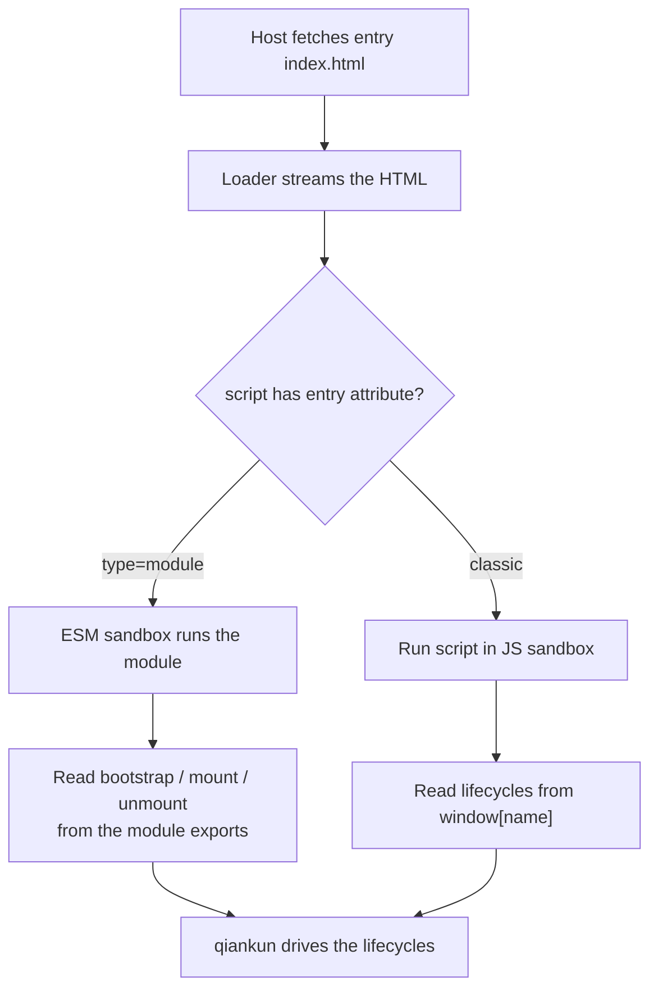

# Step 1 — Build the micro-app

A qiankun micro-app is an ordinary web app that also exports three lifecycle functions — `bootstrap`, `mount`, and `unmount` — and marks its entry script so the loader can find them. In this step you turn a fresh Vite app into a micro-app that still runs on its own, then verify it standalone before wiring it into a host in [Step 2](/tutorial/build-the-main-app).

We use Vite with React here. Vue is identical apart from the framework calls; the differences are called out inline. For a Webpack micro-app, see [Make a Webpack app qiankun-ready](/cookbook/prepare-a-webpack-app).

## Scaffold a Vite app

Create a standard Vite app and install the qiankun bundler plugin as a dev dependency.

::: code-group

```bash [React]
npm create vite@latest react-app -- --template react-ts
cd react-app
npm install
npm install -D @qiankunjs/bundler-plugin
```

```bash [Vue]
npm create vite@latest vue-app -- --template vue-ts
cd vue-app
npm install
npm install -D @qiankunjs/bundler-plugin
```

:::

::: tip Prefer a scaffolder
`npm create qiankun` generates a ready-to-run React or Vue micro-app with all of the wiring below already in place. See [create-qiankun](/ecosystem/create-qiankun).
:::

## Configure the Vite plugin

Add the qiankun Vite plugin next to your framework plugin. It lives at the `/vite` subpath and is called with no arguments.

::: code-group

```ts [React — vite.config.ts]
import { qiankun } from '@qiankunjs/bundler-plugin/vite';
import react from '@vitejs/plugin-react';
import { defineConfig } from 'vite';

export default defineConfig({
  plugins: [react(), qiankun()],
  server: { port: 7100, strictPort: true },
});
```

```ts [Vue — vite.config.ts]
import { qiankun } from '@qiankunjs/bundler-plugin/vite';
import vue from '@vitejs/plugin-vue';
import { defineConfig } from 'vite';

export default defineConfig({
  plugins: [vue(), qiankun()],
  server: { port: 7101, strictPort: true },
});
```

:::

The `qiankun()` plugin does two things, and nothing else:

- **CORS.** It sets `cors: true` and `Access-Control-Allow-Origin: *` on both the dev `server` and `preview` server, so the host can fetch this app's entry HTML and its module graph cross-origin.
- **Entry marking.** On `build`, it adds the `entry` attribute to the entry module script in the emitted `index.html` (see below). During dev serve it does nothing — the ESM sandbox resolves the entry by its lifecycle exports, so no marker is needed.

`server.port` fixes the port the host will point its `entry` at; `strictPort: true` makes Vite fail fast instead of silently picking another port if that one is taken.

::: warning Give each app a fixed, unique port
The host registers a micro-app by the URL of its dev server (for example `//localhost:7100`). If the port drifts, the host loads the wrong app or nothing at all. Always pin it with `strictPort: true`.
:::

The Vite plugin takes no options. For the Webpack equivalent (`QiankunWebpackPlugin`, whose one option is `packageName`) see [@qiankunjs/bundler-plugin](/ecosystem/bundler-plugin).

## Write the lifecycle entry

Replace the app's entry module so it exports the three lifecycles and keeps a standalone branch. The key move is factoring rendering into a `render(props)` function that both qiankun and standalone mode call.

::: code-group

```tsx [React — src/main.tsx]
import React from 'react';
import ReactDOM from 'react-dom/client';
import App from './App';

declare global {
  interface Window {
    __POWERED_BY_QIANKUN__?: boolean;
    [key: string]: unknown;
  }
}

let root: ReactDOM.Root | undefined;

function render(props: { container?: Element } = {}) {
  const container = props.container?.querySelector('#root') ?? document.getElementById('root');
  if (!container) return;

  root = ReactDOM.createRoot(container);
  root.render(
    <React.StrictMode>
      <App />
    </React.StrictMode>,
  );
}

export async function bootstrap() {
  console.log('[react] bootstrap');
}

export async function mount(props: { container?: Element }) {
  render(props);
}

export async function unmount(_props: { container?: Element }) {
  root?.unmount();
  root = undefined;
}

if (window.__POWERED_BY_QIANKUN__) {
  // classic-mode fallback: expose the lifecycles on window under the registered app name
  window['react'] = { bootstrap, mount, unmount };
} else {
  render();
}
```

```ts [Vue — src/main.ts]
import { createApp } from 'vue';
import App from './App.vue';

declare global {
  interface Window {
    __POWERED_BY_QIANKUN__?: boolean;
    [key: string]: unknown;
  }
}

let app: ReturnType<typeof createApp> | undefined;

function render(props: { container?: Element } = {}) {
  const container = props.container?.querySelector('#app') ?? document.getElementById('app');
  if (!container) return;

  app = createApp(App);
  app.mount(container);
}

export async function bootstrap() {
  console.log('[vue] bootstrap');
}

export async function mount(props: { container?: Element }) {
  render(props);
}

export async function unmount(_props: { container?: Element }) {
  app?.unmount();
  app = undefined;
}

if (window.__POWERED_BY_QIANKUN__) {
  // classic-mode fallback: expose the lifecycles on window under the registered app name
  window['vue'] = { bootstrap, mount, unmount };
} else {
  render();
}
```

:::

### What each part does

- **`bootstrap`** runs once, the first time the app is loaded. Do one-time setup here; keep it cheap.
- **`mount(props)`** runs on every activation. It renders the app into the DOM node qiankun provides. qiankun injects `container` (an `HTMLElement`) into `props` alongside single-spa's standard props, so `mount` receives `{ ...customProps, container }`.
- **`unmount(props)`** runs on every deactivation. It must fully tear the app down — `root.unmount()` for React, `app.unmount()` for Vue — and drop its references so the next mount starts clean. Leaked mounts break remounting and running [multiple instances](/cookbook/run-multiple-instances).

All three must be `async` (return a `Promise`). An optional `update` lifecycle is also supported but not needed here.

### Locating the mount node

```ts
const container = props.container?.querySelector('#root') ?? document.getElementById('root');
```

This single line works in both worlds. When hosted, `props.container` is the element qiankun mounted the app into, and the app renders into the `#root` inside it. When standalone, `props.container` is absent, so it falls back to the page's own `#root`. Vue uses `#app`; use whatever id your `index.html` declares.

::: danger props.container is provided by qiankun — do not hardcode a global selector
Under qiankun your app's markup lives inside the host's page, not at the document root, and several instances of the same app can be on the page at once. Always render into `props.container`, and only fall back to a global `document.getElementById(...)` for the standalone case. Reaching straight for `document.getElementById('root')` when hosted can select the host's node or the wrong instance.
:::

### Standalone vs hosted: the two-branch pattern

The tail of the entry decides how the app starts:

```ts
if (window.__POWERED_BY_QIANKUN__) {
  window['react'] = { bootstrap, mount, unmount };
} else {
  render();
}
```

`window.__POWERED_BY_QIANKUN__` is a flag qiankun sets on the sandboxed `window` before your code runs. When it is absent the app is running on its own, so we render immediately. When it is present qiankun is in control and will call the lifecycles itself — we must not call `render()` here.

Why the `window['react'] = { ... }` assignment, when we already `export` the lifecycles?

- Under the **ESM sandbox** (the default path for Vite apps, dev and production), your native ESM `export`s of `bootstrap`/`mount`/`unmount` **are** the lifecycles qiankun picks up. This is the primary mechanism.
- The `window['<name>']` assignment is a **classic-mode fallback**. If this app is ever loaded down the classic (non-module) path, qiankun reads the lifecycles from a global. The global's key must match the `name` you register the app under in the host (here, `react`).

The two mechanisms map onto qiankun's two execution paths — see [the JS sandbox](/concepts/js-sandbox) and [the ESM sandbox](/concepts/esm-sandbox) for the full picture. Keeping both makes the app portable across either path.

::: info Vue esm-bundler flags
Vue apps built with Vite 8 should also define `__VUE_OPTIONS_API__` and friends in `vite.config.ts`. That is standard Vue esm-bundler setup, not a qiankun requirement; see the [Vite recipe](/cookbook/prepare-a-vite-app).
:::

## Mark the entry in index.html

The loader picks the entry script by the `entry` attribute. Your `index.html` needs exactly one module script, marked `entry`:

```html [index.html]
<!doctype html>
<html lang="en">
  <head>
    <meta charset="UTF-8" />
    <meta name="viewport" content="width=device-width, initial-scale=1.0" />
    <title>React micro app · qiankun</title>
    <style>
      /* standalone-only page background; inside qiankun the host owns the page */
      body {
        margin: 0;
        background: #f7f8fa;
      }
    </style>
  </head>
  <body>
    <div id="root"></div>
    <script type="module" src="/src/main.tsx" entry></script>
  </body>
</html>
```

- **`type="module"`** selects the ESM path (the ESM sandbox). A classic entry omits it.
- **`entry`** is the contract the loader keys on. During dev serve, Vite strips this unknown attribute and the plugin does not re-add it — that is fine, because the ESM engine finds the entry by its lifecycle exports. On `build`, the plugin writes the `entry` attribute back into the emitted `index.html`.
- The inline `<style>` sets a page background **for standalone only**. Inside qiankun the host owns the page chrome, so keep app-wide `body`/`html` rules out of your component styles.

::: warning Exactly one entry script
An HTML entry may contain at most one script with the `entry` attribute. A second one makes the loader throw a `QiankunError`. Only external scripts (with `src`) can be the entry; other scripts on the page load normally.
:::



Under Webpack, you do not hand-write the entry script tag — `html-webpack-plugin` injects it and `QiankunWebpackPlugin` adds the `entry` attribute. See [the bundler-plugin reference](/ecosystem/bundler-plugin).

## Run it standalone

Before involving a host, confirm the app still works entirely on its own.

```bash
npm run dev
```

Open the app at its port (`http://localhost:7100` for the React example). Because `window.__POWERED_BY_QIANKUN__` is undefined here, the `else` branch calls `render()` and you should see the app exactly as a normal Vite app — routing, hot reload, and all. If it does not render standalone, fix that first; the hosted path builds on the same `render(props)`.

With the micro-app building, rendering standalone, and exporting its lifecycles, continue to [Step 2 — Build the main app](/tutorial/build-the-main-app) to register and host it.
