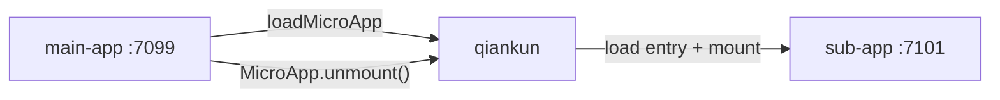

# Tutorial: build a main app and a micro-app

This tutorial builds a small qiankun setup by hand. You will create two independent React applications and use `loadMicroApp` to mount one inside the other. No qiankun scaffolder is involved, so the application contract remains visible without introducing route orchestration or runtime internals.

For the shortest path to a working project, follow [Getting started](/guide/getting-started) instead.

## What you will build

- **main-app** runs at `http://localhost:7099`. It owns an `HTMLElement` container and decides when the micro-app exists.
- **sub-app** runs at `http://localhost:7101`. It exports qiankun lifecycle functions and also works on its own.



The projects have separate dependencies, development servers, and builds. The only runtime connection is the sub-app's HTML entry URL.

## Prerequisites

- Node.js `>=20.19` and npm.
- A modern Chromium-based browser or Safari.
- Two free ports: `7099` and `7101`.

## Project layout

```text
qiankun-tutorial/
├── main-app/       # React host, port 7099
└── sub-app/        # React micro-app, port 7101
```

Create both projects from the same `qiankun-tutorial` directory. They do not need to be in a monorepo.

## The three steps

| Step | Outcome |
| --- | --- |
| [1. Build the micro-app](/tutorial/build-the-micro-app) | Configure its Vite server and export `bootstrap`, `mount`, and `unmount`. |
| [2. Build the main app](/tutorial/build-the-main-app) | Load the micro-app into an `HTMLElement` and retain its `MicroApp` handle. |
| [3. Run and verify](/tutorial/run-and-verify) | Exercise mounting, unmounting, and standalone development. |

## The contract to keep in mind

The main app supplies:

- an application `name`;
- an `entry` string that points to the micro-app's HTML;
- a `container` that is an existing `HTMLElement`.

The micro-app supplies `bootstrap`, `mount`, and `unmount`. qiankun connects the two sides and returns a handle to the main app. The main app must call that handle's `unmount()` method when the instance is no longer needed.

Start with [Step 1 — Build the micro-app](/tutorial/build-the-micro-app).
