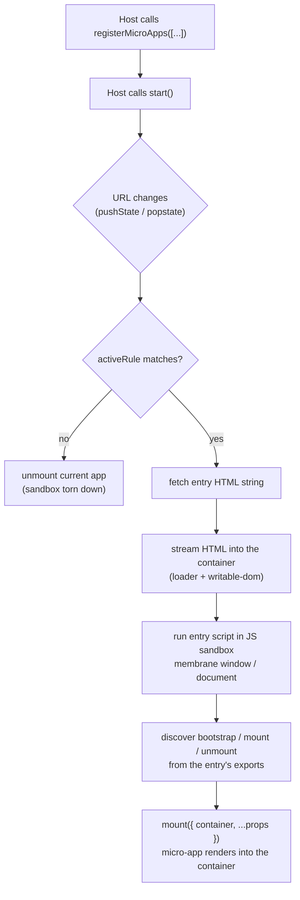

# Tutorial: build a main app and a micro-app

This tutorial walks you through building a qiankun v3 setup by hand: a **host app** that mounts a **micro-app** when the URL matches a route. You will wire every part yourself — no scaffolder — so that each moving piece is understood before you reach for automation.

If you just want a project generated for you, use [create-qiankun](/ecosystem/create-qiankun) instead. Come back here when you want to know what that scaffold actually produces and why.

## What you will build

Two independent [Vite](https://vitejs.dev) projects:

- A **main app** (the host) on port `7099`. It renders a shell — a sidebar plus a single container element — and registers one micro-app against a route.
- A **micro-app** (React or Vue, your choice) on port `7100`. It exports qiankun lifecycle functions and is built with `@qiankunjs/bundler-plugin` so its HTML entry is marked correctly.

When you navigate the host to `/sub`, qiankun fetches the micro-app's `index.html`, streams it into the host's container, runs its entry script inside a JS sandbox, and calls the micro-app's `mount`. Navigate away and qiankun calls `unmount` and tears the sandbox down. The micro-app also runs standalone at `http://localhost:7100` on its own.

### End state

```
main (host)          http://localhost:7099
 ├── sidebar          nav link → history.pushState('/sub')
 └── #subapp-stage    ← qiankun mounts the micro-app here

sub  (micro-app)     http://localhost:7100
 └── #root            ← the micro-app renders its own tree here
```

## Architecture

Here is the flow you are about to assemble. The host registers apps once; from then on every route change is matched against each app's `activeRule`, and the matched app is streamed in and mounted into the shared container.



Two points up front, because everything below follows from them:

- The host passes qiankun a **string entry** (an HTML URL) and an **HTMLElement container**. qiankun does the fetching and streaming; you never hand it a pre-fetched template or a component.
- The micro-app's HTML must contain exactly **one entry script** — the script whose exports are the lifecycles. The bundler plugin marks it for you. Including a second entry script makes the loader throw.

For the concepts behind each arrow — streaming, the sandbox, style isolation — see [Architecture overview](/concepts/architecture). You do not need them to finish this tutorial.

## Prerequisites

- Node `>= 20.19` and a package manager (this tutorial uses `pnpm`, but `npm`/`yarn` work for your own projects).
- Familiarity with a frontend framework. The micro-app examples use React and Vue; pick one.
- Two free ports: `7099` for the host and `7100` for the micro-app.

::: info Versions
This tutorial targets qiankun `3.0.0-rc.21` and `@qiankunjs/bundler-plugin`. The v3 API differs substantially from qiankun 2.x — if you are porting an existing setup, read [Migrate from qiankun 2.x](/cookbook/migrate-from-2x) alongside this.
:::

## Project layout

You will create two sibling directories, each its own Vite project with its own `package.json` and dev server:

```
qiankun-tutorial/
├── main/            # the host — port 7099
│   ├── index.html
│   ├── vite.config.ts
│   └── src/
│       ├── main.tsx        # renders the shell, registers + starts qiankun
│       └── App.tsx         # sidebar + the #subapp-stage container
└── sub/             # the micro-app — port 7100
    ├── index.html          # one entry script, marked by the plugin
    ├── vite.config.ts      # uses @qiankunjs/bundler-plugin/vite
    └── src/
        └── main.tsx        # exports bootstrap / mount / unmount
```

The two projects never share code or a build. They communicate only over HTTP: the host fetches the micro-app's entry URL cross-origin, which is why the micro-app's dev server must serve permissive CORS headers (the bundler plugin sets this up for you on the Vite side).

## Roadmap

The tutorial is three steps. Do them in order — the host has nothing to mount until the micro-app is running, and you cannot verify the wiring until both are up.

| Step | You build | Key APIs |
| --- | --- | --- |
| [Step 1 — Build the micro-app](/tutorial/build-the-micro-app) | The sub-app: `bootstrap`/`mount`/`unmount` exports, an `index.html` with one entry script, and the Vite bundler plugin. | `@qiankunjs/bundler-plugin/vite`, `__POWERED_BY_QIANKUN__` |
| [Step 2 — Build the main app](/tutorial/build-the-main-app) | The host: a persistent container element, `registerMicroApps` with an `activeRule`, and `start`. | [`registerMicroApps`](/api/register-micro-apps), [`start`](/api/start) |
| [Step 3 — Connect, run, and verify](/tutorial/run-and-verify) | Run both dev servers, navigate by route, and confirm mount/unmount in the browser. | Routing via `history.pushState`, `single-spa:routing-event` |

### Step 1 — set up the micro-app

A micro-app is an ordinary app that additionally exports three async lifecycle functions and can render into a container qiankun hands it. You will:

- Export `bootstrap`, `mount`, and `unmount` from the entry module, rendering into `props.container` when hosted and falling back to the standalone DOM otherwise.
- Add `@qiankunjs/bundler-plugin/vite`, which configures CORS and marks the single entry `<script>` so the loader can find the lifecycles.
- Keep the app runnable on its own at `http://localhost:7100`.

### Step 2 — set up the main app

The host owns the page and decides which micro-app is visible. You will:

- Render a stable container element (an `HTMLElement`) that stays mounted for the lifetime of the host — qiankun captures the reference at registration time.
- Call [`registerMicroApps`](/api/register-micro-apps) with the micro-app's `name`, string `entry` (`//localhost:7100`), the `container` element, and an `activeRule` route.
- Call [`start`](/api/start) once to activate route matching.

### Step 3 — wire together and run

With both projects in place you will start the two dev servers, click a nav link that pushes `/sub` onto the history, and watch qiankun stream the micro-app in. You will confirm that navigating away unmounts it and that the sandbox flags (`__POWERED_BY_QIANKUN__`) are set only when hosted.

## A note on the two invariants

Two rules from the v3 contract will come up repeatedly. Internalize them now and the steps will feel obvious:

::: warning String entry, HTMLElement container
In v3, `entry` is always a **string URL** to the micro-app's HTML (for example `//localhost:7100`), and `container` is an **`HTMLElement` instance** (or a selector string qiankun resolves). The 2.x config-object entry form and the "pass a template" form are gone. See [AppConfiguration](/api/configuration) and the [types reference](/api/types).
:::

::: danger Exactly one entry script
The micro-app's HTML entry must contain exactly **one** script marked with the `entry` attribute — that script's exports are the lifecycles qiankun mounts. The bundler plugin adds this attribute for you. If two scripts carry `entry`, the loader throws a `QiankunError`. Never mark more than one.
:::

Ready. Start with [Step 1 — Build the micro-app](/tutorial/build-the-micro-app).
