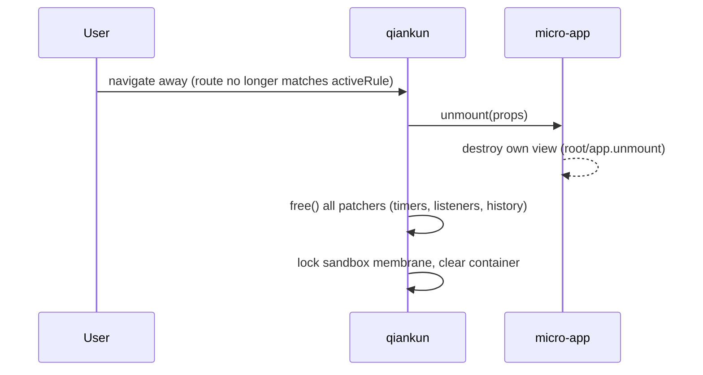

# Step 3 — Connect, run, and verify

You built a micro-app in [Step 1](/tutorial/build-the-micro-app) and registered it from the main app in [Step 2](/tutorial/build-the-main-app). This final step starts both servers, watches the micro-app stream into the container, and verifies that isolation and cleanup actually work. It closes with the failures you are most likely to hit on the first run and where to go next.

## Start both dev servers

The main app and each micro-app run as independent dev servers. Start them in separate terminals (or run the monorepo helper that starts everything in parallel).

::: code-group

```bash [main app]
# in the main app directory
npm run dev
# host on http://localhost:7099
```

```bash [micro-app (Vite)]
# in the micro-app directory
npm run dev
# sub-app on http://localhost:7100
```

```bash [monorepo (this repo)]
# builds packages first, then runs every example in parallel
pnpm start:example
# open http://localhost:7099
```

:::

Open the host at `http://localhost:7099` and navigate to the route you registered with `activeRule` (for example `/react`). qiankun matches the current `window.location.pathname` against `activeRule`, fetches the micro-app's HTML entry, and streams it into the container.

Because the loader commits HTML to the live DOM incrementally as bytes arrive — rather than buffering the whole document — you can watch the micro-app's markup appear progressively in the Elements panel while its scripts are still downloading. See [HTML-entry streaming loading](/concepts/html-entry-loading) for how the pipeline works.

## Serve micro-apps with permissive CORS

qiankun fetches each micro-app's entry HTML and assets from the main app's origin using a decorated `window.fetch`. Since the sub-app runs on a different port, every request is cross-origin, so the sub-app's dev server must send an `Access-Control-Allow-Origin` header. Without it the browser blocks the fetch and the micro-app never loads.

How you supply that header depends on the bundler:

::: code-group

```ts [Vite — vite.config.ts]
import { defineConfig } from 'vite';
import { qiankun } from '@qiankunjs/bundler-plugin/vite';

export default defineConfig({
  // qiankun() handles dev/preview CORS headers and marks the entry script
  plugins: [qiankun()],
  server: { port: 7100, strictPort: true },
});
```

```js [Webpack — webpack.config.js]
const { QiankunWebpackPlugin } = require('@qiankunjs/bundler-plugin');

module.exports = {
  // ...
  plugins: [new QiankunWebpackPlugin()],
  devServer: {
    port: 7102,
    headers: { 'Access-Control-Allow-Origin': '*' },
    allowedHosts: 'all',
  },
};
```

```bash [Static HTML — http-server]
# --cors adds Access-Control-Allow-Origin: *
http-server . --cors -c-1 -p 7104
```

:::

The Vite `qiankun()` plugin sets the dev/preview CORS headers for you. Webpack and plain static servers need the header set by hand, as shown above. See [@qiankunjs/bundler-plugin](/ecosystem/bundler-plugin), [Make a Vite app qiankun-ready](/cookbook/prepare-a-vite-app), and [Make a Webpack app qiankun-ready](/cookbook/prepare-a-webpack-app) for the full setup.

::: warning Third-party assets need CORS too
Anything the entry loads — vendor scripts, external stylesheets — is fetched the same cross-origin way. Public CDNs that omit `Access-Control-Allow-Origin` will break the load. Vendor those assets locally or serve them from a CORS-enabled origin.
:::

## Verify isolation on the container

When qiankun initializes a micro-app it empties the mount element and stamps several `data-*` attributes onto it. Inspecting them is the quickest way to confirm the app mounted with the isolation you expect. In the browser's Elements panel, select your container element and read its attributes:

```html
<div
  id="subapp-container"
  data-name="react"
  data-version="3.0.0-rc.21"
  data-sandbox-cfg="true"
>
  <!-- the micro-app's streamed DOM lives here -->
</div>
```

| Attribute | Meaning |
| --- | --- |
| `data-name` | The registered `name` of the app mounted here. Also the `@scope` root selector `[data-name="<name>"]` used by style isolation. |
| `data-version` | The qiankun runtime version that mounted the app. |
| `data-sandbox-cfg` | The serialized sandbox configuration. Present and not `"false"` means the JS sandbox is active. |

Two more attributes appear only in multi-instance scenarios: `data-mount-times` (once an app has mounted more than once) and `data-instance-id` (when the same app is loaded into more than one container at once). You can read the same values in code via `el.dataset.name`, `el.dataset.version`, and `el.dataset.sandboxCfg`.

To confirm the JS sandbox is genuinely isolating globals, run this in the host page's console while the micro-app is mounted:

```js
// A global the sub-app assigned to *its* window is invisible on the host window,
// because the sandbox membrane redirects writes to the app's own local target.
window.__SOME_SUBAPP_GLOBAL__; // → undefined on the host
```

Reads still fall through to the real host `window`, so the app sees real browser APIs it never touched — but its writes stay contained. The membrane also injects `window.__POWERED_BY_QIANKUN__ = true` inside the sandbox so a sub-app can detect it is running under qiankun. Read [The JS sandbox](/concepts/js-sandbox) for the full model.

## Confirm a clean unmount on route change

Navigate away from the micro-app's route (to another app's route, or back to a host-only page). qiankun matches the new path, unmounts the app, and tears down everything it set up. A correct unmount:

- calls the sub-app's `unmount(props)` lifecycle so it can destroy its own view (`root.unmount()`, `app.unmount()`, etc.);
- runs every patcher's `free()`, which clears intervals registered through the sandbox, removes window event listeners, and reverts `history` patches;
- empties the container's DOM.



To spot a leak, check that timers and listeners the app created no longer fire after you leave the route. For example, an interval the app started should stop logging, and its `window` event handlers should no longer run. If they persist, the app most likely registered a side effect outside the sandbox-patched APIs, or its `unmount` lifecycle did not clean up its own view.

::: tip Always unmount
Patchers only revert their side effects through the `free()` returned on unmount. If you use `loadMicroApp` imperatively, keep the returned handle and call `unmount()` yourself. Skipping unmount leaks timers and listeners and breaks both remounting and running [multiple instances](/cookbook/run-multiple-instances).
:::

## Common first-run failures

| Symptom | Likely cause | Fix |
| --- | --- | --- |
| Entry request blocked by CORS in the console; container stays empty | Sub-app server does not send `Access-Control-Allow-Origin` | Use `qiankun()` for Vite, set `headers` + `allowedHosts` for Webpack, or `--cors` for a static server (see above). |
| `QiankunError: You should not include more than 1 entry scripts in a single HTML entry` | Two scripts in the entry HTML carry the `entry` attribute | Mark exactly one script with `entry`. The bundler plugins mark it for you — don't also add it by hand. |
| `QiankunError: You need to export lifecycle functions in <name> entry ...` | The app's exported lifecycles can't be found, usually a name/global mismatch | The registered `name` must match the global the sub-app exposes. A Webpack app whose `output.library.name` is `webpack-app` must be registered as `name: 'webpack-app'`. Export `bootstrap`/`mount`/`unmount` as ESM exports (or a `default` object), or assign `window[name] = { bootstrap, mount, unmount }`. |
| App never mounts, or qiankun holds a stale element | The container element was not in the DOM at registration, or it was replaced/re-keyed later | Register only after the container exists (for example inside a mount effect), and keep that exact element mounted for the app's lifetime — qiankun captures the element reference at registration time. |
| Micro-app's styles bleed into the host (or vice versa) | Style isolation is off (the default) | Opt in with `configuration: { styleIsolation: true }`, then see [Enable CSS style isolation](/cookbook/enable-style-isolation). |

::: info Firefox and ESM-sandbox apps
The ESM-sandbox execution path relies on dynamically injected import maps, which Firefox does not support. ESM-sandbox micro-apps are expected to fail on Firefox; use a Chromium-based browser to develop and verify them. Classic (UMD/global) apps are unaffected. See [The ESM sandbox](/concepts/esm-sandbox).
:::

## Where to go next

Your two apps are connected, streaming, isolated, and cleaning up on unmount. From here:

- Contain a micro-app's CSS to its own subtree — [Enable CSS style isolation](/cookbook/enable-style-isolation).
- Render loading and error states declaratively with the `<MicroApp>` component — [React](/ecosystem/react) or [Vue](/ecosystem/vue).
- Handle load and runtime failures centrally — [Handle load and runtime errors](/cookbook/handle-errors).
- Speed up first paint and reduce loading jank — [Optimize loading and preloading](/cookbook/optimize-loading).
- Look up every option and default — the [API reference](/api/index), starting with [registerMicroApps](/api/register-micro-apps), [start](/api/start), and [AppConfiguration](/api/configuration).
