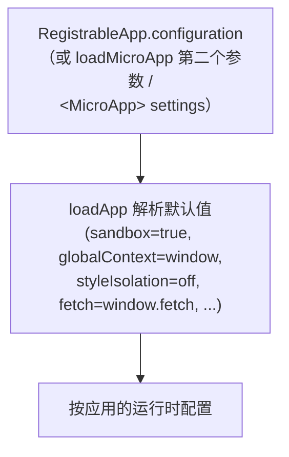

# AppConfiguration

`AppConfiguration` 是 qiankun v3 中的单应用配置对象。它控制 JS 沙箱、沙箱代理的全局上下文、运行时 CSS 样式隔离，以及底层的 loader 钩子（`fetch`、`streamTransformer`、`nodeTransformer`）。

v3 中不再有 `FrameworkConfiguration` 类型。配置是**按微应用**设置的，可以通过 [`registerMicroApps`](/zh-CN/api/register-micro-apps)（每个应用上的 `configuration` 字段）设置，也可以作为 [`loadMicroApp`](/zh-CN/api/load-micro-app) 的第二个参数传入。`<MicroApp>` 组件则通过其 `settings` prop 暴露该配置。

## 类型

```ts
import type { LoaderOpts } from '@qiankunjs/loader';

export type AppConfiguration = Partial<
  Pick<LoaderOpts, 'fetch' | 'streamTransformer' | 'nodeTransformer'>
> & {
  sandbox?: boolean;
  globalContext?: WindowProxy;
  styleIsolation?: boolean;
};
```

每个字段都是可选的。下表列出了各字段，以及字段省略时 `loadApp` 所解析出的默认值。

| 字段 | 类型 | 默认值 | 说明 |
| --- | --- | --- | --- |
| `sandbox` | `boolean` | `true` | 启用 Proxy-membrane JS 沙箱（对于 `<script type="module">`，还会启用 ESM 沙箱引擎）。设为 `false` 可让微应用直接运行在真实的全局对象上。 |
| `globalContext` | `WindowProxy` | `window` | 沙箱 membrane 所代理的基础全局对象。很少需要修改。 |
| `styleIsolation` | `boolean` | `false` | 启用运行时 CSS 隔离。将微应用的样式包裹在一个作用于应用容器的 CSS `@scope` 块中。需显式开启。 |
| `fetch` | `typeof window.fetch` | `window.fetch` | 用于加载入口 HTML 及每个资源的 `fetch` 实现。qiankun 会用 cache/retry/throw 装饰器对其进行包装（见下文）。 |
| `streamTransformer` | `() => TransformStream<string, string>` | `undefined` | 可选的 transform，会被插入到 HTML 入口的流式管线中。以字符串流的形式接收解码后的 HTML。 |
| `nodeTransformer` | `<T extends Node>(node: T, opts) => T` | 内部的 `transpileAssets` transformer | 在每个 script/link/style 节点流入容器时对其进行改写。仅在需要自定义资源改写时才覆盖它。 |

## 字段详解

### sandbox

默认为 `true`。启用时，`loadApp` 会调用 `createSandboxContainer`，为微应用构建一个 Proxy-membrane 的 `window`/`document` 视图；当入口包含 `<script type="module">` 时，还会接入 ESM 沙箱引擎。每个微应用都拥有各自独立的全局对象；应用内部对 `window` 的写入会被 membrane 拦截，永远不会触及宿主 realm。

设置 `sandbox: false` 可让微应用运行在真实的全局上下文中——这对于无法容忍代理全局对象的遗留应用很有用，但代价是失去隔离性。

```ts
configuration: { sandbox: false }
```

在 v3 中，`sandbox` 是一个普通布尔值。关于旧的对象形式，参见 [v3 中已移除](#gone-in-v3) 说明。

关于 membrane 的工作原理，参见 [JS 沙箱](/zh-CN/concepts/js-sandbox) 和 [ESM 沙箱](/zh-CN/concepts/esm-sandbox)。

### globalContext

默认为 `window`。这是沙箱 membrane 所代理的基础全局对象。在普通的单窗口场景下你无需设置它；它是为那些基础 realm 并非顶层 `window` 的高级托管场景而存在的。

### styleIsolation

默认为 `false`（关闭）。设为 `true` 时，qiankun 会在运行时使用原生 CSS [`@scope`](https://developer.mozilla.org/en-US/docs/Web/CSS/@scope) at-rule 对微应用的 CSS 进行作用域限定。`loadApp` 内部会推导出：

```ts
const styleIsolationOpts = { appName, scopeRoot: `[data-name="${appName}"]` };
```

来自应用内联 `<style>` 和外部 `<link rel="stylesheet">` 的每一条规则，都会被包裹进 `@scope ([data-name="<appName>"]) { ... }`，其中 `data-name` 是 qiankun 设置在应用容器上的属性。外部样式表会被重新拉取并以 blob-`<link>` 的形式重新提供，以便其内容也能被限定作用域。`@keyframes` 会按应用重命名；`@font-face` 和 `@namespace` 则有意保持为全局。

作用域选择器是内部推导出来的，无法自定义。

::: warning 浏览器支持与 CORS
样式隔离依赖原生 CSS `@scope`，这是一项较新的浏览器特性——qiankun 中没有 polyfill。不支持 `@scope` 的浏览器不会对样式进行作用域限定。此外，外部样式表必须可通过 CORS 拉取：一旦 fetch 或 transpile 失败，该样式表会被丢弃（绝不会以未限定作用域的方式加载），以保持隔离性。
:::

关于该机制参见 [样式隔离](/zh-CN/concepts/style-isolation)，操作演示参见 [启用 CSS 样式隔离](/zh-CN/cookbook/enable-style-isolation)。

### fetch

默认为 `window.fetch`。无论你传入什么，在使用前都会被包装：

```ts
const enhancedFetch = makeFetchCacheable(makeFetchRetryable(makeFetchThrowable(fetch)));
```

- `makeFetchThrowable` —— 将非 `ok` 的 HTTP 响应转为抛出的错误。
- `makeFetchRetryable` —— 对临时性网络失败进行重试。
- `makeFetchCacheable` —— 对响应进行去重与缓存，使流式 loader 的自动资源预加载不会重复拉取。

传入自定义 `fetch` 可用于注入凭证、请求头或代理。无论你传入什么，上述包装始终会叠加在其之上。

### streamTransformer

默认为 `undefined`。提供时，它的 `TransformStream<string, string>` 会在字节解码之后、qiankun 自身的标签改写之前，被拼接进 HTML 入口的流式管线中。可用它来实时改写入口 HTML（例如注入或剔除标记）。大多数应用永远不需要它。

关于该管线参见 [HTML Entry 流式加载](/zh-CN/concepts/html-entry-loading)。

### nodeTransformer

默认为一个基于 `transpileAssets` 构建的内部 transformer，它会改写每个 `<script>`、`<link>` 和 `<style>` 节点——将全局访问路由经过沙箱 membrane、解析 module specifier，并（在开启 `styleIsolation` 时）对样式进行作用域限定。仅在你需要自定义单个资源节点如何在流入容器时被转换时，才覆盖它。替换它意味着退出 qiankun 的默认资源改写，因此请谨慎操作。

## 在哪里传入配置

`AppConfiguration` 可在三处被接受，均为按应用维度。

::: code-group

```ts [registerMicroApps]
import { registerMicroApps, start } from 'qiankun';

registerMicroApps([
  {
    name: 'react-app',
    entry: '//localhost:7100',
    container: document.getElementById('subapp-container')!,
    activeRule: '/react',
    configuration: {
      sandbox: true,
      styleIsolation: true,
    },
  },
]);

start();
```

```ts [loadMicroApp]
import { loadMicroApp } from 'qiankun';

const microApp = loadMicroApp(
  {
    name: 'react-app',
    entry: '//localhost:7100',
    container: document.getElementById('subapp-container')!,
  },
  // 第二个参数即 AppConfiguration
  {
    sandbox: true,
    styleIsolation: true,
  },
);
```

```tsx [MicroApp (React)]
import { MicroApp } from '@qiankunjs/react';

export default function App() {
  return (
    <MicroApp
      name="react-app"
      entry="//localhost:7100"
      settings={{ sandbox: true, styleIsolation: true }}
    />
  );
}
```

:::

`container` 是一个 `HTMLElement`，而非选择器字符串。请传入真实的元素（例如 `document.getElementById(...)` 或框架的 ref）。`<MicroApp>` 组件在内部自行管理其容器，所以你只需提供 `settings`。

## 优先级

在 v3 中，按应用的 `configuration` 实际上就是该应用的全部配置。不存在通过 `start()` 合并进来的框架级配置。



在内部，`registerMicroApps` 会在调用 `loadApp` 前合并 `{ ...frameworkConfiguration, ...configuration }`。但 `frameworkConfiguration` 是一个模块级的空对象，在 v3 中从不会被填充——`start()` 不会向其中注入配置。所以实际上只有按应用的 `configuration` 起作用。请在注册应用的地方，或在调用 `loadMicroApp` 的地方，为每个应用配置。

## v3 中已移除 {#gone-in-v3}

::: danger 这些 2.x 选项在 v3 中不存在
- **没有 `sandbox: { ... }` 对象。** `sandbox` 是一个普通布尔值。不存在 `strictStyleIsolation`、`experimentalStyleIsolation`，也没有 Shadow DOM。样式隔离是独立的布尔值 `styleIsolation`，用 CSS `@scope` 实现。
- **除 `styleIsolation` 外没有其他样式隔离选项。** 2.x 的 `sandbox.strictStyleIsolation` / `sandbox.experimentalStyleIsolation` 开关已移除。
- **`start()` 上没有框架级配置。** [`start`](/zh-CN/api/start) 只接受 single-spa 的 `{ urlRerouteOnly }`。2.x 的 `prefetch`、`sandbox`、`singular`、`fetch`、`getPublicPath`、`getTemplate` 和 `excludeAssetFilter` 选项均已移除。
- **`AppConfiguration` 中没有 `prefetch` 或 `singular`。** 流式 loader 会自动预加载资源；[`prefetchApps`](/zh-CN/api/prefetch-apps) 已废弃。`singular` 不再存在。
- **没有内置的全局状态存储。** `initGlobalState`、`onGlobalStateChange` 和 `setGlobalState` 不属于 v3。参见 [在应用间共享状态与通信](/zh-CN/cookbook/communicate-between-apps)。
:::

正在从 qiankun 2.x 迁移？参见 [从 qiankun 2.x 迁移](/zh-CN/cookbook/migrate-from-2x)。

## 相关

- [registerMicroApps](/zh-CN/api/register-micro-apps) —— 为路由驱动的应用设置按应用 `configuration` 的地方。
- [loadMicroApp](/zh-CN/api/load-micro-app) —— 以 `AppConfiguration` 作为第二个参数的手动 loader。
- [start](/zh-CN/api/start) —— 框架启动；注意它只接受 `{ urlRerouteOnly }`。
- [类型参考](/zh-CN/api/types) —— 完整的类型面，包括 `RegistrableApp` 和 `LoadableApp`。
- [样式隔离](/zh-CN/concepts/style-isolation) 和 [JS 沙箱](/zh-CN/concepts/js-sandbox) —— `styleIsolation` 与 `sandbox` 背后的概念。
