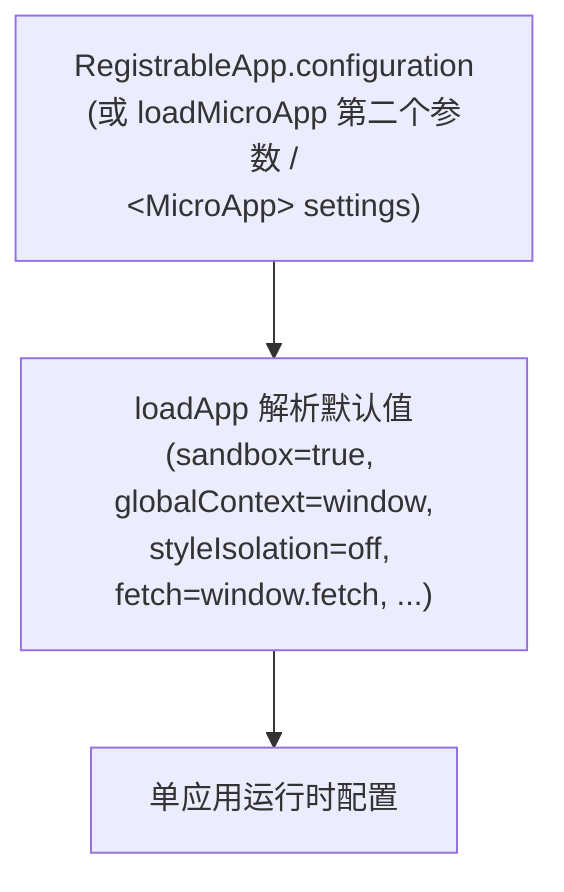

# AppConfiguration

`AppConfiguration` 是 qiankun v3 里针对单个微应用的配置对象。它管着这么几件事：JS 沙箱、沙箱代理的全局上下文、运行时的 CSS 样式隔离，以及几个底层的加载器钩子(`fetch`、`streamTransformer`、`nodeTransformer`)。

v3 里没有 `FrameworkConfiguration` 这个类型了。配置都是**按微应用**给的，要么写在 [`registerMicroApps`](/zh-CN/api/register-micro-apps) 里(每个应用的 `configuration` 字段)，要么作为 [`loadMicroApp`](/zh-CN/api/load-micro-app) 的第二个参数传进去。`<MicroApp>` 组件则通过 `settings` prop 暴露它。

## 类型

```ts
import type { LoaderOpts } from '@qiankunjs/loader';

export type AppConfiguration = Partial<
  Pick<LoaderOpts, 'fetch' | 'streamTransformer' | 'nodeTransformer'>
> & {
  sandbox?: boolean;
  globalContext?: WindowProxy;
  styleIsolation?: boolean;
};
```

每个字段都是可选的。下表列出各字段，以及字段省略时 `loadApp` 会兜底成的默认值。

| 字段 | 类型 | 默认值 | 说明 |
| --- | --- | --- | --- |
| `sandbox` | `boolean` | `true` | 开启基于 `Proxy` 隔离膜的 JS 沙箱(对 `<script type="module">` 还会启用 ESM 沙箱引擎)。设成 `false` 就让微应用直接跑在真实全局上。 |
| `globalContext` | `WindowProxy` | `window` | 沙箱隔离膜代理的那个基础全局对象。基本不用改。 |
| `styleIsolation` | `boolean` | `false` | 开启运行时 CSS 隔离，把微应用的样式包进一个作用域限定在应用容器上的 CSS `@scope` 块里。默认关，按需开。 |
| `fetch` | `typeof window.fetch` | `window.fetch` | 用来加载入口 HTML 和每个资源的 `fetch` 实现。qiankun 会给它套上一层缓存 / 重试 / 抛错装饰器(见下文)。 |
| `streamTransformer` | `() => TransformStream<string, string>` | `undefined` | 可选，插进 HTML 入口流式管线里的一个 transform，拿到的是解码后的 HTML 字符串流。 |
| `nodeTransformer` | `<T extends Node>(node: T, opts) => T` | 内置的 `transpileAssets` transformer | 在每个 script / link / style 节点流进容器时改写它。除非要自定义资源改写，否则别动。 |

## 逐个字段细说

### sandbox

默认 `true`。开启时，`loadApp` 会调用 `createSandboxContainer`，给微应用建一份基于 `Proxy` 隔离膜的 `window`/`document` 视图；当入口带 `<script type="module">` 时，还会把 ESM 沙箱引擎接上。每个微应用拿到自己那份隔离的全局，应用内部往 `window` 上写的东西会被隔离膜拦下，永远到不了宿主 realm。

设成 `sandbox: false`，微应用就直接跑在真实全局上下文里——对那些没法忍受被代理过的全局的老应用有用，代价是丢掉隔离。

```ts
configuration: { sandbox: false }
```

v3 里 `sandbox` 就是个普通布尔值。老的对象写法见下面 [v3 中已移除](#gone-in-v3) 一节。

隔离膜的原理见 [JS 沙箱](/zh-CN/concepts/js-sandbox) 和 [ESM 沙箱](/zh-CN/concepts/esm-sandbox)。

### globalContext

默认 `window`。这是沙箱隔离膜代理的基础全局。普通的单窗口场景下你根本不用设它；它是留给那种基础 realm 不是顶层 `window` 的高级托管场景的。

### styleIsolation

默认 `false`(关)。设成 `true` 后，qiankun 会在运行时用原生 CSS [`@scope`](https://developer.mozilla.org/en-US/docs/Web/CSS/@scope) at-rule 给微应用的 CSS 加作用域。内部 `loadApp` 会推导出：

```ts
const styleIsolationOpts = { appName, scopeRoot: `[data-name="${appName}"]` };
```

微应用内联 `<style>` 和外部 `<link rel="stylesheet">` 里的每条规则，都会被包进 `@scope ([data-name="<appName>"]) { ... }`，其中 `data-name` 是 qiankun 打在应用容器上的属性。外部样式表会被重新 fetch、再以 blob-`<link>` 的形式重新提供，好让它们的内容也能被限定作用域。`@keyframes` 会按应用重命名；`@font-face` 和 `@namespace` 则有意保持全局。

作用域选择器是内部推导出来的，不能自定义。

::: warning 浏览器支持与 CORS
样式隔离依赖原生 CSS `@scope`，这是个比较新的浏览器特性——qiankun 里没有 polyfill。不支持 `@scope` 的浏览器不会给样式加作用域。另外，外部样式表必须能通过 CORS 拉到：一旦 fetch 或转译失败，这张样式表会被直接丢掉(而不是不加作用域地照样加载)，以此保住隔离。
:::

机制细节见 [样式隔离](/zh-CN/concepts/style-isolation)，上手步骤见 [开启 CSS 样式隔离](/zh-CN/cookbook/enable-style-isolation)。

### fetch

默认 `window.fetch`。不管你传进来的是什么，用之前都会被包一层：

```ts
const enhancedFetch = makeFetchCacheable(makeFetchRetryable(makeFetchThrowable(fetch)));
```

- `makeFetchThrowable`——把非 `ok` 的 HTTP 响应变成抛出的错误。
- `makeFetchRetryable`——对临时性的网络失败做重试。
- `makeFetchCacheable`——对响应去重并缓存，这样流式加载器自动预加载资源时不会重复拉。

传自定义 `fetch` 是为了注入凭证、请求头或走代理。不管你传什么，外面这层包装总会加上去。

### streamTransformer

默认 `undefined`。传了的话，它的 `TransformStream<string, string>` 会被接进 HTML 入口的流式管线里，位置在字节解码之后、qiankun 自己改写标签之前。用它可以在流的过程中改写入口 HTML(比如注入或删掉一些标记)。大多数应用都用不上。

管线细节见 [HTML Entry 流式加载](/zh-CN/concepts/html-entry-loading)。

### nodeTransformer

默认是一个建立在 `transpileAssets` 之上的内置 transformer，它会改写每个 `<script>`、`<link>`、`<style>` 节点——把全局访问路由到沙箱隔离膜、解析 module specifier，以及(在开启 `styleIsolation` 时)给样式加作用域。除非你要自定义单个资源节点在流进容器时怎么被转换，否则别覆盖它。替换掉它就等于放弃 qiankun 默认的资源改写，动手前想清楚。

## 在哪里传入配置

`AppConfiguration` 有三个地方能接收，全都是按微应用来的。

::: code-group

```ts [registerMicroApps]
import { registerMicroApps, start } from 'qiankun';

registerMicroApps([
  {
    name: 'react-app',
    entry: '//localhost:7100',
    container: document.getElementById('subapp-container')!,
    activeRule: '/react',
    configuration: {
      sandbox: true,
      styleIsolation: true,
    },
  },
]);

start();
```

```ts [loadMicroApp]
import { loadMicroApp } from 'qiankun';

const microApp = loadMicroApp(
  {
    name: 'react-app',
    entry: '//localhost:7100',
    container: document.getElementById('subapp-container')!,
  },
  // 第二个参数即 AppConfiguration
  {
    sandbox: true,
    styleIsolation: true,
  },
);
```

```tsx [MicroApp (React)]
import { MicroApp } from '@qiankunjs/react';

export default function App() {
  return (
    <MicroApp
      name="react-app"
      entry="//localhost:7100"
      settings={{ sandbox: true, styleIsolation: true }}
    />
  );
}
```

:::

`container` 是一个 `HTMLElement`，不是选择器字符串。传一个真实的元素进去(比如 `document.getElementById(...)` 或者框架的 ref)。`<MicroApp>` 组件内部自己管容器，所以你只需要给 `settings`。

## 优先级

v3 里，单个应用的 `configuration` 实际上就是这个应用的全部配置。没有什么框架级配置会通过 `start()` 合并进来。



内部实现上，`registerMicroApps` 会在调用 `loadApp` 前先合并 `{ ...frameworkConfiguration, ...configuration }`。但 `frameworkConfiguration` 是个模块级的空对象，v3 里从来不会被填充——`start()` 不往里塞任何配置。所以实际上只有单应用的 `configuration` 起作用。在注册应用的地方、或者调用 `loadMicroApp` 的地方，给每个应用配好就行。

## v3 中已移除 {#gone-in-v3}

::: danger 这些 2.x 选项在 v3 里不存在
- **没有 `sandbox: { ... }` 对象写法。** `sandbox` 就是个普通布尔值。没有 `strictStyleIsolation`，没有 `experimentalStyleIsolation`，也没有 Shadow DOM。样式隔离是另一个独立的布尔值 `styleIsolation`，用 CSS `@scope` 实现。
- **除了 `styleIsolation` 之外没有别的样式隔离选项。** 2.x 的 `sandbox.strictStyleIsolation` / `sandbox.experimentalStyleIsolation` 这些开关都没了。
- **`start()` 上没有框架级配置。** [`start`](/zh-CN/api/start) 只接收 single-spa 的 `{ urlRerouteOnly }`。2.x 的 `prefetch`、`sandbox`、`singular`、`fetch`、`getPublicPath`、`getTemplate`、`excludeAssetFilter` 这些选项都移除了。
- **`AppConfiguration` 里没有 `prefetch` 或 `singular`。** 流式加载器会自动预加载资源；[`prefetchApps`](/zh-CN/api/prefetch-apps) 已废弃。`singular` 不再存在。
- **没有内置的全局状态存储。** `initGlobalState`、`onGlobalStateChange`、`setGlobalState` 都不是 v3 的一部分。见 [在应用间共享状态与通信](/zh-CN/cookbook/communicate-between-apps)。
:::

正在从 qiankun 2.x 迁移？见 [从 qiankun 2.x 迁移](/zh-CN/cookbook/migrate-from-2x)。

## 相关

- [registerMicroApps](/zh-CN/api/register-micro-apps)——路由驱动的应用在这里设置单应用的 `configuration`。
- [loadMicroApp](/zh-CN/api/load-micro-app)——把 `AppConfiguration` 作为第二个参数的手动加载器。
- [start](/zh-CN/api/start)——框架启动；注意它只接收 `{ urlRerouteOnly }`。
- [类型参考](/zh-CN/api/types)——完整的类型面，含 `RegistrableApp` 和 `LoadableApp`。
- [样式隔离](/zh-CN/concepts/style-isolation) 和 [JS 沙箱](/zh-CN/concepts/js-sandbox)——`styleIsolation` 与 `sandbox` 背后的概念。
