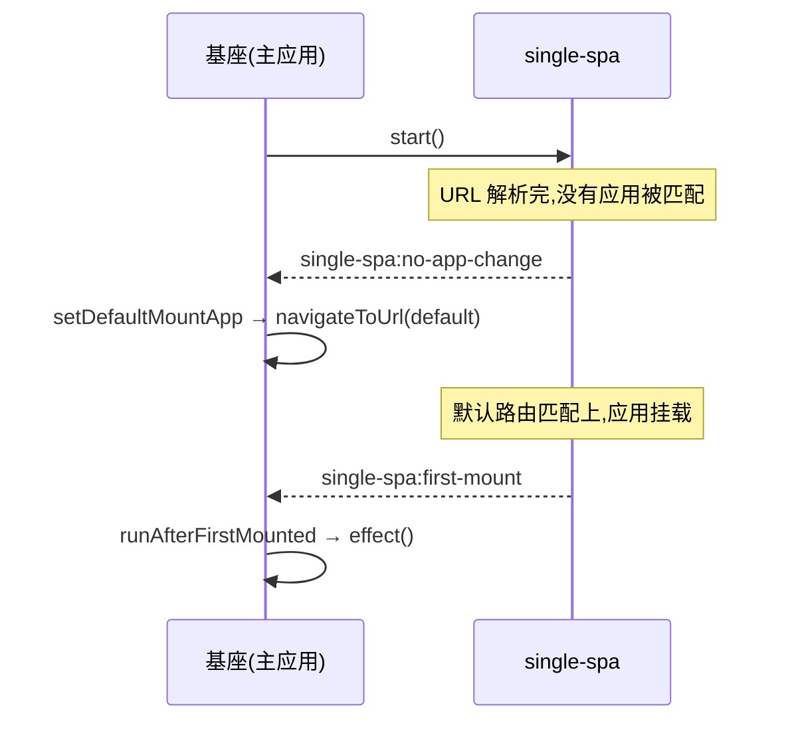

# setDefaultMountApp / runAfterFirstMounted

两个基于 single-spa 生命周期事件的小工具函数。`setDefaultMountApp` 在没有任何微应用挂载时，把路由导向一个默认地址；`runAfterFirstMounted` 则在第一个微应用挂载完成时跑一次回调。两者都是一次性的：内部的监听器触发一次之后就自己解绑。

从 `qiankun` 里引入：

```ts
import { setDefaultMountApp, runAfterFirstMounted } from 'qiankun';
```

## setDefaultMountApp

```ts
function setDefaultMountApp(defaultAppLink: string): void
```

当 single-spa 第一次报告"URL 变了，但没有任何应用被匹配"时，导航到 `defaultAppLink`。这是给基座挑一个落地页的办法，免得应用一进来就停在空白页上。

| 参数 | 类型 | 说明 |
| --- | --- | --- |
| `defaultAppLink` | `string` | 要导航到的路由，比如 `/home`。会传给 single-spa 的 `navigateToUrl`。 |

它的工作方式：监听 `single-spa:no-app-change` 事件，一旦发现 `getMountedApps()` 返回的是空列表，就调用 `navigateToUrl(defaultAppLink)`。监听器在第一次触发后自我移除，所以这次重定向至多发生一次。如果当前 URL 已经匹配到某个挂载中的应用，那就什么都不做。

因为它依赖路由匹配，`defaultAppLink` 必须能命中一个已注册、且 `activeRule` 覆盖该路径的应用。要是命不中，single-spa 会再次报告没有应用变化——可这时监听器早解绑了，不会再有后续的导航。

::: tip 设计上就是一次性的
`setDefaultMountApp` 只是推一把初始导航，它不是常驻的兜底，也不是对所有未匹配路由的通用重定向。真要做持久的 404 兜底，请专门注册一个应用，或者在基座自己的路由里处理。
:::

### 示例：落到一个默认路由

在注册完应用之后调用它，`start()` 之前之后都行。

```ts
import { registerMicroApps, setDefaultMountApp, start } from 'qiankun';

registerMicroApps([
  {
    name: 'dashboard',
    entry: 'http://localhost:7101',
    container: document.getElementById('subapp')!,
    activeRule: '/dashboard',
  },
  {
    name: 'orders',
    entry: 'http://localhost:7102',
    container: document.getElementById('subapp')!,
    activeRule: '/orders',
  },
]);

// If the app boots on "/" with nothing matched, redirect to /dashboard.
setDefaultMountApp('/dashboard');

start();
```

## runAfterFirstMounted

```ts
function runAfterFirstMounted(effect: () => void): void
```

在任意一个微应用第一次挂载完成时，跑一次 `effect`。适合用来显示基座 UI、隐藏全局 loading，或者在第一个应用上屏后打一次埋点。

| 参数 | 类型 | 说明 |
| --- | --- | --- |
| `effect` | `() => void` | 在第一次 `single-spa:first-mount` 事件时被调用的回调。 |

它的工作方式：订阅 single-spa 的 `single-spa:first-mount` 事件，调用 `effect`，然后移除自己的监听器，所以 `effect` 至多跑一次。在开发构建里，它还会收尾一个 `console.time` 计时(`[qiankun] first app mounted`)，让你在控制台看到首个应用的挂载耗时。这条计时日志只在开发环境有，生产环境不受影响。

### 示例：首次挂载后隐藏全局 loader

```ts
import { registerMicroApps, runAfterFirstMounted, start } from 'qiankun';

registerMicroApps([
  {
    name: 'dashboard',
    entry: 'http://localhost:7101',
    container: document.getElementById('subapp')!,
    activeRule: '/dashboard',
  },
]);

runAfterFirstMounted(() => {
  document.getElementById('global-loading')?.remove();
});

start();
```

## 事件流

这两个函数都只是对 single-spa 在 rerouting 过程中往 `window` 上派发的事件做了层薄封装。



## 给 qiankun 2.x 用户的说明

::: info 这两个函数在 v3 里仍然保留
不像某些 2.x 时代的 API,`setDefaultMountApp` 和 `runAfterFirstMounted` 依旧是 v3 公开 API 的一部分(`packages/qiankun/src/apis/effects.ts`)，签名没变，也仍然是一次性的。
:::

::: warning v3 不再内置全局状态管理
2.x 里配套的 `initGlobalState`(以及 `onGlobalStateChange` / `setGlobalState` / `MicroAppStateActions`)在 qiankun 3.0 里已经没有了，不再提供内置的跨应用状态存储。推荐的替代方案见[应用间共享状态与通信](/zh-CN/cookbook/communicate-between-apps)。
:::

## 相关

- [registerMicroApps](/zh-CN/api/register-micro-apps) —— 注册这些副作用所响应的微应用
- [start](/zh-CN/api/start) —— 启动 single-spa 的 rerouting，事件才会派发
- [应用间共享状态与通信](/zh-CN/cookbook/communicate-between-apps) —— 2.x 全局状态在 v3 里的替代做法
- [微应用生命周期与 props](/zh-CN/concepts/lifecycle-and-props) —— 挂载在整个生命周期里的位置
