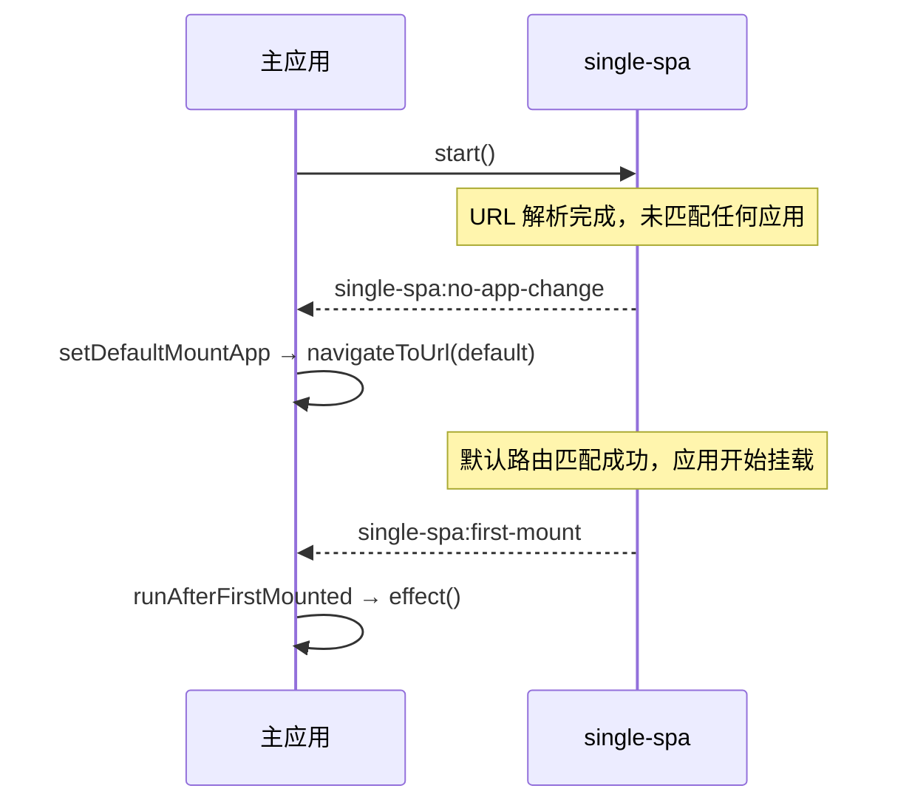

# setDefaultMountApp / runAfterFirstMounted

这两个函数基于 single-spa 生命周期事件实现。`setDefaultMountApp` 在没有微应用挂载时将路由导航至默认地址；`runAfterFirstMounted` 在首个微应用挂载完成后执行一次回调。两者均为一次性操作，内部监听器触发后会自动移除。

从 `qiankun` 导入：

```ts
import { setDefaultMountApp, runAfterFirstMounted } from 'qiankun';
```

## setDefaultMountApp

```ts
function setDefaultMountApp(defaultAppLink: string): void
```

当 single-spa 首次报告 URL 已变化但没有匹配任何应用时，导航至 `defaultAppLink`。该函数可用于为主应用指定默认页面，避免初始路由未匹配应用时显示空白内容。

| 参数 | 类型 | 说明 |
| --- | --- | --- |
| `defaultAppLink` | `string` | 目标路由，例如 `/home`。该值将传递给 single-spa 的 `navigateToUrl`。 |

该函数监听 `single-spa:no-app-change` 事件。当 `getMountedApps()` 返回空列表时，调用 `navigateToUrl(defaultAppLink)`。监听器首次触发后会自动移除，因此重定向最多执行一次。当前 URL 已匹配已挂载应用时，不会执行重定向。

由于该函数依赖路由匹配，`defaultAppLink` 必须匹配一个已注册且 `activeRule` 覆盖该路径的应用。如果目标路由仍未匹配应用，single-spa 会再次报告没有应用变化，但监听器已经移除，不会继续导航。

::: tip 仅处理一次初始导航
`setDefaultMountApp` 只处理一次初始导航，不提供持续生效的未匹配路由重定向。需要长期处理 404 路由时，应注册专用应用，或由主应用的路由系统处理。
:::

### 示例：导航至默认路由

应在应用注册完成后调用。该函数可以在 `start()` 之前或之后调用。

```ts
import { registerMicroApps, setDefaultMountApp, start } from 'qiankun';

registerMicroApps([
  {
    name: 'dashboard',
    entry: 'http://localhost:7101',
    container: document.getElementById('subapp')!,
    activeRule: '/dashboard',
  },
  {
    name: 'orders',
    entry: 'http://localhost:7102',
    container: document.getElementById('subapp')!,
    activeRule: '/orders',
  },
]);

// 应用从 "/" 启动且未匹配路由时，重定向至 /dashboard。
setDefaultMountApp('/dashboard');

start();
```

## runAfterFirstMounted

```ts
function runAfterFirstMounted(effect: () => void): void
```

在任意微应用首次挂载完成时执行一次 `effect`。适用于显示主应用界面、隐藏全局加载状态，或记录首个应用挂载完成事件。

| 参数 | 类型 | 说明 |
| --- | --- | --- |
| `effect` | `() => void` | 在首次触发 `single-spa:first-mount` 事件时执行的回调。 |

该函数订阅 single-spa 的 `single-spa:first-mount` 事件。事件触发后调用 `effect` 并移除监听器，因此 `effect` 最多执行一次。在开发构建中，函数还会结束标识为 `[qiankun] first app mounted` 的 `console.time` 计时，以便在控制台查看首个应用的挂载耗时。该计时日志仅在开发环境中输出，不影响生产环境。

### 示例：首次挂载后隐藏全局加载界面

```ts
import { registerMicroApps, runAfterFirstMounted, start } from 'qiankun';

registerMicroApps([
  {
    name: 'dashboard',
    entry: 'http://localhost:7101',
    container: document.getElementById('subapp')!,
    activeRule: '/dashboard',
  },
]);

runAfterFirstMounted(() => {
  document.getElementById('global-loading')?.remove();
});

start();
```

## 事件流

这两个函数对 single-spa 在重新路由过程中向 `window` 派发的事件进行了简单封装。



## 从 v2 迁移

这两个函数在 v3 中仍为公共 API，并且均只执行一次。有关已移除的全局状态 API 和其他不兼容变更，请参阅[从 qiankun 2.x 迁移](/zh-CN/cookbook/migrate-from-2x)。

## 相关内容

- [registerMicroApps](/zh-CN/api/register-micro-apps)——注册路由驱动的微应用。
- [start](/zh-CN/api/start)——启动 single-spa 的路由处理并派发生命周期事件。
- [应用间共享状态与通信](/zh-CN/cookbook/communicate-between-apps)——v3 中替代 2.x 全局状态 API 的方案。
- [微应用生命周期与 props](/zh-CN/concepts/lifecycle-and-props)——微应用挂载阶段在完整生命周期中的位置。
