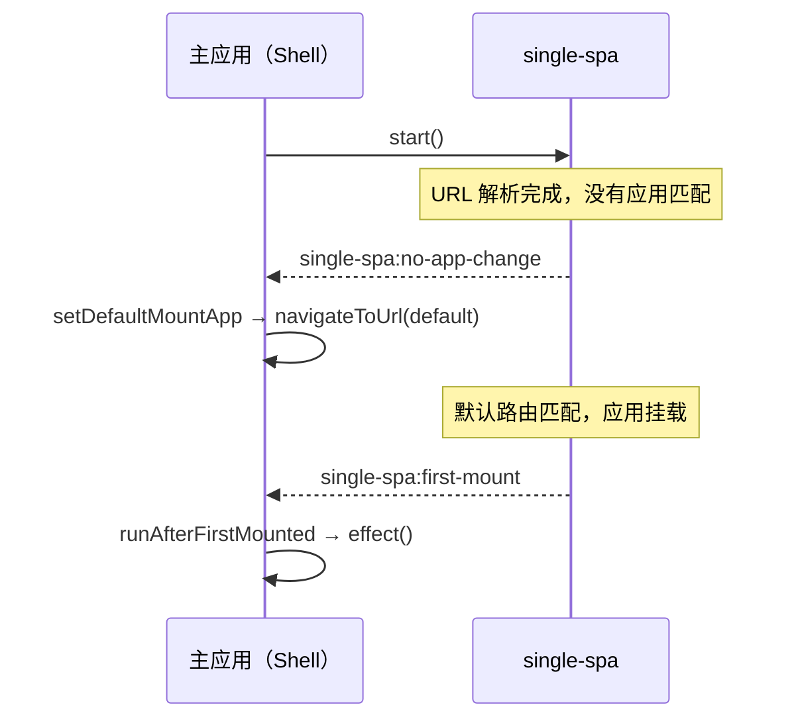

# setDefaultMountApp / runAfterFirstMounted

两个构建在 single-spa 生命周期事件之上的小型副作用辅助函数。`setDefaultMountApp` 会在没有任何应用被挂载时重定向到默认路由，`runAfterFirstMounted` 则会在第一个微应用挂载完成后执行一次回调。两者都是一次性的：它们的内部监听器会在首次触发后自行移除。

从 `qiankun` 引入它们：

```ts
import { setDefaultMountApp, runAfterFirstMounted } from 'qiankun';
```

## setDefaultMountApp

```ts
function setDefaultMountApp(defaultAppLink: string): void
```

当 single-spa 首次报告某次 URL 变化没有解析到任何已挂载的应用时，导航到 `defaultAppLink`。你可以借此选定一个落地路由，使主应用不会停留在一个空白页面上。

| 参数 | 类型 | 说明 |
| --- | --- | --- |
| `defaultAppLink` | `string` | 要导航到的路由，例如 `/home`。会被传递给 single-spa 的 `navigateToUrl`。 |

工作原理：在 `single-spa:no-app-change` 事件触发时，如果 `getMountedApps()` 返回一个空列表，就调用 `navigateToUrl(defaultAppLink)`。监听器会在首次触发后移除自身，因此该重定向至多只发生一次。如果当前 URL 已经有一个匹配的应用被挂载，则不会有任何动作。

由于它依赖路由匹配，`defaultAppLink` 必须能解析到一个已注册且 `activeRule` 覆盖该路径的应用。如果不能，single-spa 会再次报告没有应用变化，而由于监听器已经解绑，将不会再发生进一步的导航。

::: tip 设计上即为一次性
`setDefaultMountApp` 只是推动一次初始导航。它不是一个永久的兜底方案，也不是对所有未匹配路由的统一重定向。若需要一个持久的 404 式兜底，请注册一个专门的应用，或在你主应用自己的路由中处理。
:::

### 示例：落地到默认路由

在注册应用之后调用它，可以放在 `start()` 之前或之后。

```ts
import { registerMicroApps, setDefaultMountApp, start } from 'qiankun';

registerMicroApps([
  {
    name: 'dashboard',
    entry: 'http://localhost:7101',
    container: document.getElementById('subapp')!,
    activeRule: '/dashboard',
  },
  {
    name: 'orders',
    entry: 'http://localhost:7102',
    container: document.getElementById('subapp')!,
    activeRule: '/orders',
  },
]);

// 如果应用在 "/" 上启动且没有匹配任何应用，则重定向到 /dashboard。
setDefaultMountApp('/dashboard');

start();
```

## runAfterFirstMounted

```ts
function runAfterFirstMounted(effect: () => void): void
```

在任意微应用首次完成挂载时，执行一次 `effect`。可用于展示主应用 UI、隐藏全局加载指示器，或在第一个应用出现在屏幕上后触发一次性的埋点事件。

| 参数 | 类型 | 说明 |
| --- | --- | --- |
| `effect` | `() => void` | 在第一次 `single-spa:first-mount` 事件时被调用的回调。 |

工作原理：它订阅 single-spa 的 `single-spa:first-mount` 事件，调用 `effect`，然后移除自身的监听器，从而使 `effect` 至多执行一次。在开发构建中，它还会关闭一个 `console.time` 计时（`[qiankun] first app mounted`），在控制台中给出首次挂载的耗时。该计时日志仅在开发环境生效，在生产环境中不产生任何影响。

### 示例：首次挂载后隐藏全局 loader

```ts
import { registerMicroApps, runAfterFirstMounted, start } from 'qiankun';

registerMicroApps([
  {
    name: 'dashboard',
    entry: 'http://localhost:7101',
    container: document.getElementById('subapp')!,
    activeRule: '/dashboard',
  },
]);

runAfterFirstMounted(() => {
  document.getElementById('global-loading')?.remove();
});

start();
```

## 事件流

两个辅助函数都只是对 single-spa 在重路由（rerouting）期间在 `window` 上派发的事件的轻量封装。



## 给 qiankun 2.x 用户的说明

::: info 两个辅助函数在 v3 中依然存在
与部分 2.x 时代的 API 不同，`setDefaultMountApp` 和 `runAfterFirstMounted` 仍是 v3 公开接口的一部分（`packages/qiankun/src/apis/effects.ts`），签名保持不变。两者都是一次性的。
:::

::: warning v3 不再内置全局状态存储
2.x 中的 `initGlobalState` 及其配套（`onGlobalStateChange` / `setGlobalState` / `MicroAppStateActions`）在 qiankun 3.0 中已不存在。这里没有内置的跨应用状态存储。推荐的模式请参见 [在应用之间共享状态与通信](/zh-CN/cookbook/communicate-between-apps)。
:::

## 相关

- [registerMicroApps](/zh-CN/api/register-micro-apps) — 注册这些副作用所响应的应用
- [start](/zh-CN/api/start) — 启动 single-spa 重路由，从而触发这些事件
- [在应用之间共享状态与通信](/zh-CN/cookbook/communicate-between-apps) — 2.x 全局状态在 v3 中的替代方案
- [微应用生命周期与 props](/zh-CN/concepts/lifecycle-and-props) — 挂载如何融入更广的生命周期
