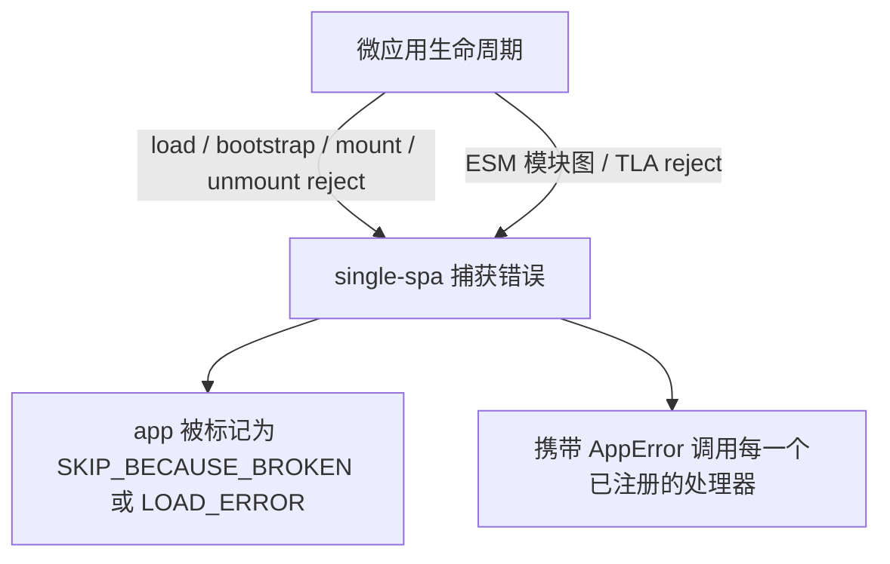

# addErrorHandler / removeErrorHandler

注册和注销全局错误处理器，当任意微应用在 load、bootstrap、mount 或 unmount 失败时触发。这两个函数都是从 [single-spa](https://single-spa.js.org/docs/api#adderrorhandler) 原样再导出的，因此其行为与 single-spa 的错误处理流程完全一致。

```ts
import { addErrorHandler, removeErrorHandler } from 'qiankun';
```

## 函数签名

```ts
function addErrorHandler(handler: (err: AppError) => void): void;
function removeErrorHandler(handler: (err: AppError) => void): void;
```

`AppError` 是 single-spa 的错误结构 —— 一个标准的 `Error`，附带了失败的 app 或 parcel 的名称：

```ts
type AppError = Error & {
  appOrParcelName: string;
};
```

`removeErrorHandler` 按引用注销处理器，因此你必须传入与注册时相同的函数对象。

::: info 纯再导出
qiankun 不会包裹或转换这些函数。`packages/qiankun/src/apis/errorHandler.ts` 就是字面上的 `export { addErrorHandler, removeErrorHandler } from 'single-spa';`。你通过 qiankun 添加的处理器，和直接从 single-spa 导入添加的处理器，共享同一个注册表。
:::

## 哪些错误会在这里浮现

通过 `addErrorHandler` 注册的处理器，会接收到所有经由 [`registerMicroApps`](/zh-CN/api/register-micro-apps) 注册、或经由 [`loadMicroApp`](/zh-CN/api/load-micro-app) 命令式加载的 app 抛出的错误，覆盖每一个生命周期阶段：

- **Load** —— HTML Entry 无法被 fetch（网络失败、非 2xx 状态码）、响应体为空，或者无法从 entry 的 exports 中发现有效的生命周期对象。
- **Bootstrap / mount / unmount** —— 微应用自身的 `bootstrap`、`mount` 或 `unmount` 函数 reject。
- **ESM 模块图失败** —— 对于由 [ESM 沙箱](/zh-CN/concepts/esm-sandbox) 处理的 `<script type="module">` entry，某个 fetch 或求值失败的模块，以及模块图中的顶层 `await`（TLA）reject，都会被接入到 entry 的 deferred，从而在这里浮现，而不会作为 unhandled rejection 悄然消失。

当微应用在生命周期切换过程中抛出错误时，single-spa 会将该 app 置为 broken 状态 —— 生命周期失败对应 `SKIP_BECAUSE_BROKEN`，load 失败对应 `LOAD_ERROR` —— 并携带 `AppError` 调用每一个已注册的错误处理器。broken 的 app 会停止参与路由驱动的变更；`LOAD_ERROR` 的 app 会在下一次路由变化时重试。



## 示例

在主应用 bootstrap 早期注册一次处理器，在调用 [`start`](/zh-CN/api/start) 之前或之后均可：

```ts
import { addErrorHandler, registerMicroApps, start } from 'qiankun';

addErrorHandler((err) => {
  // err is a standard Error; err.appOrParcelName tells you which app failed
  console.error(`[qiankun] "${err.appOrParcelName}" failed:`, err.message);

  // report to your monitoring service
  reportToSentry(err, { app: err.appOrParcelName });
});

registerMicroApps([
  { name: 'app1', entry: '//localhost:7100', container: document.querySelector('#subapp')!, activeRule: '/app1' },
]);

start();
```

要销毁一个处理器（例如在热更新边界或测试中），保留其引用并将其传给 `removeErrorHandler`：

```ts
const handler = (err: AppError) => console.error(err);

addErrorHandler(handler);
// later
removeErrorHandler(handler);
```

::: warning 处理器不得抛出错误
从处理器内部抛出的错误会重新传回 single-spa 的错误处理路径。请让处理器保持防御性 —— 记录日志、上报、然后返回。
:::

## 全局处理器 vs `<MicroApp>` 错误边界

`addErrorHandler` 是一个 **全局的、框架层面** 的钩子：一个处理器观测所有已注册 app 的失败，并接收到带有 `appOrParcelName` 标记的 `AppError`。它不会渲染任何内容 —— 它用于日志记录、监控和遥测。

[`<MicroApp>` React](/zh-CN/ecosystem/react) 和 [Vue](/zh-CN/ecosystem/vue) 组件则提供了一个 **组件层面** 的错误边界。由于 `<MicroApp>` 为单个实例包裹了 [`loadMicroApp`](/zh-CN/api/load-micro-app)，它可以捕获该实例的 load/bootstrap/mount reject，并就地渲染兜底 UI：

- 通过 `autoCaptureError` 启用默认错误视图，或传入自定义的 `errorBoundary` render prop（React）/ `#error-boundary` slot（Vue）。
- 如果你 **没有** 启用它，组件会重新抛出错误 —— 在 React 中会到达最近的 React 错误边界，在 Vue 中会通过 `errorCaptured` / 全局处理器浮现。

这两种机制是互补的。使用全局的 `addErrorHandler` 做跨所有 app 的集中式上报，使用 `<MicroApp>` 错误边界做每个实例的兜底 UI。单次失败可以同时到达两者：single-spa 通知你的全局处理器，同时组件将 reject 的 `mountPromise`/`loadPromise` 浮现给它自己的错误边界。

| 关注点 | `addErrorHandler` | `<MicroApp>` 错误边界 |
| --- | --- | --- |
| 作用范围 | 全局 —— 所有已注册/已加载的 app | 单个 `<MicroApp>` 实例 |
| 用途 | 日志记录、监控、遥测 | 就地渲染兜底 UI |
| 输入 | `AppError`（`Error & { appOrParcelName }`） | reject 的生命周期 `Error` |
| 启用方式 | 注册后始终生效 | `autoCaptureError` / 自定义 `errorBoundary` |

## 另请参阅

- [处理加载与运行时错误](/zh-CN/cookbook/handle-errors) —— 关于重试、兜底 UI 和上报的端到端方案。
- [`<MicroApp>` for React](/zh-CN/ecosystem/react) 和 [`<MicroApp>` for Vue](/zh-CN/ecosystem/vue) —— 组件层面的错误边界。
- [微应用生命周期与 props](/zh-CN/concepts/lifecycle-and-props) —— 可能失败的各个阶段。
- [ESM 沙箱](/zh-CN/concepts/esm-sandbox) —— 模块图与 TLA reject 如何被路由到这里。
