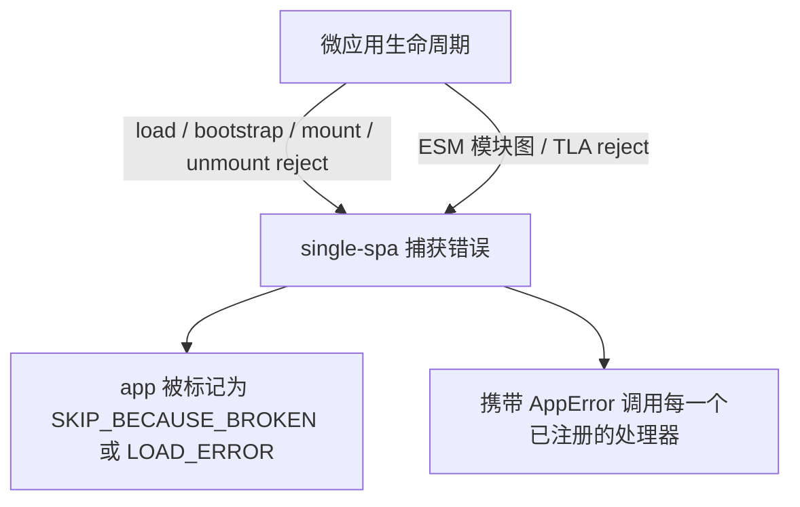

# addErrorHandler / removeErrorHandler

注册和注销全局错误处理器，任何微应用在加载、bootstrap、mount、unmount 阶段出错时都会触发。这两个函数是从 [single-spa](https://single-spa.js.org/docs/api#adderrorhandler) 原样再导出的，所以行为和 single-spa 的错误处理链完全一致。

```ts
import { addErrorHandler, removeErrorHandler } from 'qiankun';
```

## 函数签名

```ts
function addErrorHandler(handler: (err: AppError) => void): void;
function removeErrorHandler(handler: (err: AppError) => void): void;
```

`AppError` 就是 single-spa 的错误结构——一个标准 `Error`，额外带上了出错的 app 或 parcel 的名字：

```ts
type AppError = Error & {
  appOrParcelName: string;
};
```

`removeErrorHandler` 按引用注销，所以传进去的必须是当初注册的那个函数对象。

::: info 纯再导出
qiankun 没有对这两个函数做任何包装或改写。`packages/qiankun/src/apis/errorHandler.ts` 里就一行 `export { addErrorHandler, removeErrorHandler } from 'single-spa';`。你通过 qiankun 添加的处理器，和你直接从 single-spa 导入添加的处理器，用的是同一份注册表。
:::

## 哪些错误会走到这里

用 `addErrorHandler` 注册的处理器，能收到任何微应用抛出的错误——不管这个应用是通过 [`registerMicroApps`](/zh-CN/api/register-micro-apps) 注册的，还是通过 [`loadMicroApp`](/zh-CN/api/load-micro-app) 命令式加载的，每一个生命周期阶段都覆盖：

- **加载(Load)** —— HTML Entry 抓不回来(网络失败、非 2xx 状态码)、响应体是空的，或者从 entry 的 exports 里找不到有效的生命周期对象。
- **Bootstrap / mount / unmount** —— 微应用自己的 `bootstrap`、`mount`、`unmount` 函数 reject 了。
- **ESM 模块图失败** —— 对于交给 [ESM 沙箱](/zh-CN/concepts/esm-sandbox) 处理的 `<script type="module">` entry，某个 fetch 或求值失败的模块，以及模块图里顶层 `await`(TLA)的 reject，都会被接到 entry 的 deferred 上，从这里冒出来，而不是变成一个没人管的 unhandled rejection 悄悄丢掉。

微应用在生命周期切换过程中抛错，single-spa 会把它置成 broken 状态——生命周期失败对应 `SKIP_BECAUSE_BROKEN`，加载失败对应 `LOAD_ERROR`——然后带着 `AppError` 挨个调用注册过的错误处理器。broken 的 app 不再参与路由驱动的切换；`LOAD_ERROR` 的 app 会在下一次路由变化时重试。



## 示例

在主应用启动流程的早期注册一次处理器，放在调用 [`start`](/zh-CN/api/start) 之前或之后都行：

```ts
import { addErrorHandler, registerMicroApps, start } from 'qiankun';

addErrorHandler((err) => {
  // err is a standard Error; err.appOrParcelName tells you which app failed
  console.error(`[qiankun] "${err.appOrParcelName}" failed:`, err.message);

  // report to your monitoring service
  reportToSentry(err, { app: err.appOrParcelName });
});

registerMicroApps([
  { name: 'app1', entry: '//localhost:7100', container: document.querySelector('#subapp')!, activeRule: '/app1' },
]);

start();
```

要把某个处理器拆掉(比如在热更新边界或测试里)，先留着它的引用，再传给 `removeErrorHandler`:

```ts
const handler = (err: AppError) => console.error(err);

addErrorHandler(handler);
// later
removeErrorHandler(handler);
```

::: warning 处理器里别再抛错
处理器内部抛出的错误会重新回到 single-spa 的错误处理路径里。让处理器保持防御性——记日志、上报、然后返回就好，别在里面再抛。
:::

## 全局处理器 vs `<MicroApp>` 错误边界

`addErrorHandler` 是一个**框架层面的全局**钩子：一个处理器盯着所有已注册 app 的失败，拿到的是一个带 `appOrParcelName` 标记的 `AppError`。它不渲染任何东西——用途是记日志、监控、埋点上报。

[`<MicroApp>` 的 React 版](/zh-CN/ecosystem/react)和 [Vue 版](/zh-CN/ecosystem/vue)提供的则是**组件层面**的错误边界。因为 `<MicroApp>` 就是对单个实例的 [`loadMicroApp`](/zh-CN/api/load-micro-app) 做了一层封装，它能捕获这个实例的 load/bootstrap/mount reject，并就地渲染兜底 UI:

- 用 `autoCaptureError` 启用默认的错误视图，或者传一个自定义的 `errorBoundary` render prop(React)/ `#error-boundary` slot(Vue)。
- 如果你**不**启用，组件会把错误重新抛出——在 React 里它会冒到最近的 React 错误边界，在 Vue 里则通过 `errorCaptured` / 全局处理器浮现出来。

这两套机制是互补的。跨所有 app 的集中式上报用全局 `addErrorHandler`，单个实例的兜底 UI 用 `<MicroApp>` 错误边界。同一次失败可以同时到达两边：single-spa 通知你的全局处理器，组件也把被 reject 的 `mountPromise`/`loadPromise` 交给它自己的错误边界。

| 关注点 | `addErrorHandler` | `<MicroApp>` 错误边界 |
| --- | --- | --- |
| 作用范围 | 全局——所有已注册 / 已加载的 app | 单个 `<MicroApp>` 实例 |
| 用途 | 记日志、监控、埋点上报 | 就地渲染兜底 UI |
| 输入 | `AppError`(`Error & { appOrParcelName }`) | 被 reject 的生命周期 `Error` |
| 启用方式 | 注册后始终生效 | `autoCaptureError` / 自定义 `errorBoundary` |

## 另请参阅

- [处理加载与运行时错误](/zh-CN/cookbook/handle-errors) —— 重试、兜底 UI、上报的端到端方案。
- [`<MicroApp>` for React](/zh-CN/ecosystem/react) 和 [`<MicroApp>` for Vue](/zh-CN/ecosystem/vue) —— 组件层面的错误边界。
- [微应用生命周期与 props](/zh-CN/concepts/lifecycle-and-props) —— 可能失败的各个阶段。
- [ESM 沙箱](/zh-CN/concepts/esm-sandbox) —— 模块图与 TLA 的 reject 是怎么被路由到这里的。
