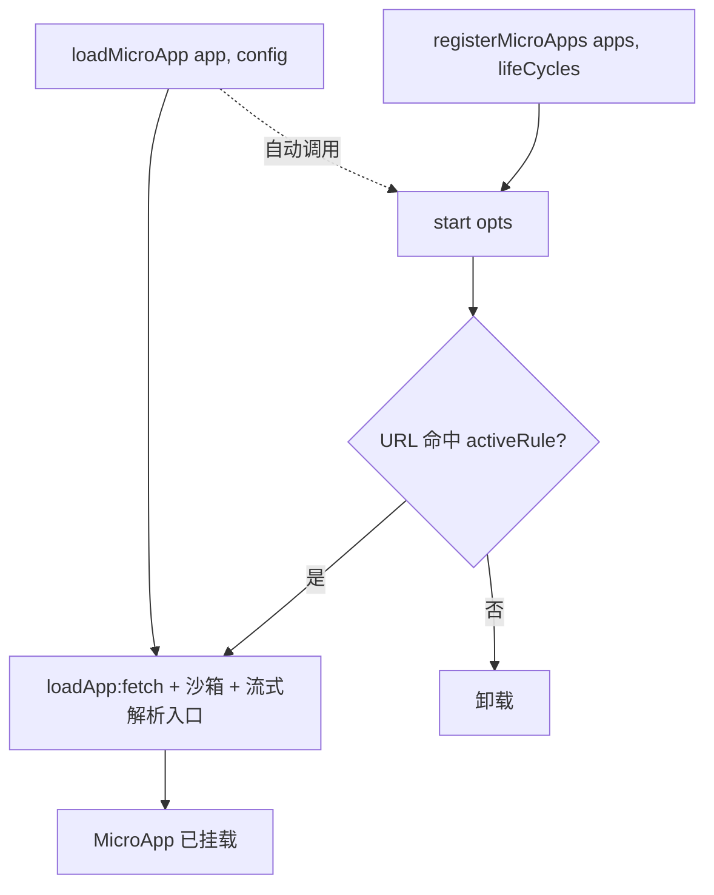

# API 总览

`qiankun` 包对外导出的全部东西，按用途分了组。每个符号都单独有一页参考文档，完整的签名、选项和示例都在那里。

```ts
import {
  registerMicroApps,
  start,
  loadMicroApp,
  setDefaultMountApp,
  runAfterFirstMounted,
  addErrorHandler,
  removeErrorHandler,
  isRuntimeCompatible,
  prefetchApps,
} from 'qiankun';
```

当前版本：`3.0.0-rc.21`。

## 导出一览

| 导出 | 类型 | 用途 |
| --- | --- | --- |
| [`registerMicroApps`](/zh-CN/api/register-micro-apps) | 函数 | 注册路由驱动的微应用；`activeRule` 命中时，single-spa 负责激活对应的那个。 |
| [`start`](/zh-CN/api/start) | 函数 | 启动框架。只接收 single-spa 的 `StartOpts`。 |
| [`loadMicroApp`](/zh-CN/api/load-micro-app) | 函数 | 手动地立即挂载一个微应用，并拿到一个控制它的句柄。 |
| [`setDefaultMountApp`](/zh-CN/api/effects) | 函数 | 当前没有任何应用挂载时，跳转到一个默认微应用。 |
| [`runAfterFirstMounted`](/zh-CN/api/effects) | 函数 | 首个微应用挂载后，执行一次回调。 |
| [`addErrorHandler`](/zh-CN/api/error-handling) | 函数 | 注册全局错误处理器(从 single-spa 重新导出)。 |
| [`removeErrorHandler`](/zh-CN/api/error-handling) | 函数 | 移除之前注册的错误处理器(从 single-spa 重新导出)。 |
| [`isRuntimeCompatible`](/zh-CN/api/is-runtime-compatible) | 函数 | 探测当前浏览器是否支持 v3 运行时。 |
| [`prefetchApps`](/zh-CN/api/prefetch-apps) | 函数 | 已废弃。为一批应用预热 HTTP 缓存。 |

## 签名

```ts
function registerMicroApps<T extends ObjectType>(
  apps: Array<RegistrableApp<T>>,
  lifeCycles?: LifeCycles<T>,
): void;

function start(opts?: StartOpts): void; // StartOpts = { urlRerouteOnly?: boolean }

function loadMicroApp<T extends ObjectType>(
  app: LoadableApp<T>,
  configuration?: AppConfiguration,
  lifeCycles?: LifeCycles<T>,
): MicroApp;

function setDefaultMountApp(defaultAppLink: string): void;
function runAfterFirstMounted(effect: () => void): void;

function addErrorHandler(handler: (err: AppError) => void): void;
function removeErrorHandler(handler: (err: AppError) => void): void;

function isRuntimeCompatible(): boolean;

function prefetchApps(
  apps: AppMetadata[],
  fetch?: typeof window.fetch,
): void; // @deprecated in 3.0
```

## 注册式

声明式、路由驱动的入口。一次性把微应用列表注册好，再调 `start()`；之后就交给 single-spa——URL 命中某个应用的 `activeRule` 就挂载它，不再命中就卸载。

- [`registerMicroApps(apps, lifeCycles?)`](/zh-CN/api/register-micro-apps) —— 注册应用。应用按 `name` 去重，单个应用的配置写在各自的 `configuration` 字段里。
- [`start(opts?)`](/zh-CN/api/start) —— 启动框架，开始路由。v3 里 `start` 只接收 single-spa 的 `StartOpts`(见下面的 [v3 里没有了](#not-in-v3))。它顺带会预热 ESM-sandbox 的 lexer。

## 命令式加载

给那些不跟路由绑定的微应用用——挂件、弹窗，或者你想什么时候挂就挂、想卸就卸的应用。

- [`loadMicroApp(app, configuration?, lifeCycles?)`](/zh-CN/api/load-micro-app) —— 立即挂载，返回一个 [`MicroApp`](/zh-CN/api/types) 句柄(本质是一个 single-spa parcel)，上面有 `mount`、`unmount`、`update`、`getStatus`，以及各生命周期的 promise。如果这时 `start()` 还没跑过，`loadMicroApp` 会替你调一次。

## 生命周期副作用

挂在 single-spa 路由事件上的一次性小工具。

- [`setDefaultMountApp(defaultAppLink)`](/zh-CN/api/effects) —— 当前没有应用挂载时，跳转到 `defaultAppLink`。监听器触发一次后自动移除。
- [`runAfterFirstMounted(effect)`](/zh-CN/api/effects) —— 任意微应用第一次挂载时，把 `effect` 跑一次。

## 错误处理

这两个是原样从 single-spa 重新导出的，行为跟 single-spa 的 API 完全一致。

- [`addErrorHandler(handler)`](/zh-CN/api/error-handling) —— 接收所有应用的加载错误和运行时错误。
- [`removeErrorHandler(handler)`](/zh-CN/api/error-handling) —— 摘掉一个处理器。

常见写法见[错误处理实战](/zh-CN/cookbook/handle-errors)。

## 能力探测

- [`isRuntimeCompatible()`](/zh-CN/api/is-runtime-compatible) —— 浏览器同时提供 `Proxy`、`TransformStream` 和 `URL.createObjectURL` 这三样(v3 运行时依赖的三个特性)时返回 `true`。可以拿它做个闸门，老浏览器就走降级方案，不启用 qiankun。

## 已废弃

- [`prefetchApps(apps, fetch?)`](/zh-CN/api/prefetch-apps) —— 在浏览器空闲时，把每个入口的 HTML 及其脚本、样式抓一遍，预热 HTTP 缓存。

::: warning 3.0 已废弃
`prefetchApps` 已废弃。流式 HTML-entry 加载器在解析每个入口时就会自动预加载资源，手动预取基本用不上了。见[优化加载与预加载](/zh-CN/cookbook/optimize-loading)。`PrefetchStrategy` 类型为了向后兼容仍然导出，但 v3 已经没有任何 API 会用到它。
:::

## 类型

完整的类型面在[类型参考](/zh-CN/api/types)页里。主要这几个：

| 类型 | 参考 |
| --- | --- |
| `AppConfiguration` | [配置项](/zh-CN/api/configuration) |
| `LifeCycles` / `LifeCycleFn` | [生命周期钩子](/zh-CN/api/lifecycles) |
| `RegistrableApp` | [registerMicroApps](/zh-CN/api/register-micro-apps) · [类型](/zh-CN/api/types) |
| `LoadableApp` | [loadMicroApp](/zh-CN/api/load-micro-app) · [类型](/zh-CN/api/types) |
| `MicroApp`(single-spa 的 `Parcel`) | [类型](/zh-CN/api/types) |
| `AppMetadata`、`HTMLEntry`、`ObjectType`、`MicroAppLifeCycles`、`PrefetchStrategy` | [类型](/zh-CN/api/types) |

::: info 被导出的内部状态
`start` 和 `registerMicroApps` 在同一个模块里，那个模块还导出了两个内部状态——`started`(一个布尔标志)和 `microApps`(存活着的注册表数组)。这俩是实现细节，不是受支持的 API，别依赖它们。

`version` 常量在包的源码里是有的，但**没有**从入口 barrel 重新导出，所以 `import { version } from 'qiankun'` 拿不到东西。
:::

## v3 里没有了 {#not-in-v3}

qiankun 3.0 是一次运行时重写，2.x 的若干 API 和选项被删掉了。下面这些在 v3 里已经不存在——引用它们的代码要么编译不过，要么静默地什么都不做。

::: danger v3 已移除
**没有内置的全局状态库了。**`initGlobalState`、`onGlobalStateChange`、`setGlobalState` 以及 `MicroAppStateActions` 类型都没了。改成通过 `props` 把你自己的方法传给微应用。见[在应用间共享状态与通信](/zh-CN/cookbook/communicate-between-apps)。

**没有 `FrameworkConfiguration` 类型了。**单个应用的配置类型是 [`AppConfiguration`](/zh-CN/api/configuration)，它的字段只有 `fetch`、`streamTransformer`、`nodeTransformer`、`sandbox`(默认 `true`)、`globalContext`(默认 `window`)和 `styleIsolation`(默认 `false`)。没有 `singular`、`prefetch`、`getPublicPath`、`getTemplate`、`excludeAssetFilter` 这些了。

**`start()` 只接收 single-spa 的 `StartOpts`**——`{ urlRerouteOnly?: boolean }`。2.x qiankun `start` 的那些选项(`prefetch`、`sandbox`、`singular`、`fetch`、`getPublicPath`、`getTemplate`、`excludeAssetFilter`)都被移除了。沙箱和加载相关的配置，改成按应用走 [`AppConfiguration`](/zh-CN/api/configuration)。

**样式隔离就是一个布尔值。**`sandbox: { strictStyleIsolation }`、`sandbox: { experimentalStyleIsolation }` 以及 Shadow DOM 隔离都没了。v3 用一个布尔值 `styleIsolation`，底层是 CSS `@scope` 实现的。见[样式隔离](/zh-CN/concepts/style-isolation)。

**`entry` 是一个 URL 字符串**(`HTMLEntry = string`)——2.x 那种 `{ scripts, styles }` 对象写法没了。**`container` 是一个 `HTMLElement`**(或者一个会被解析成元素的选择器字符串)，不再是存在配置里的一个裸选择器。
:::

## 各部分怎么串起来



## 相关

- [快速上手](/zh-CN/guide/getting-started)
- [架构概览](/zh-CN/concepts/architecture)
- [微应用的生命周期与 props](/zh-CN/concepts/lifecycle-and-props)
- [从 qiankun 2.x 迁移](/zh-CN/cookbook/migrate-from-2x)
