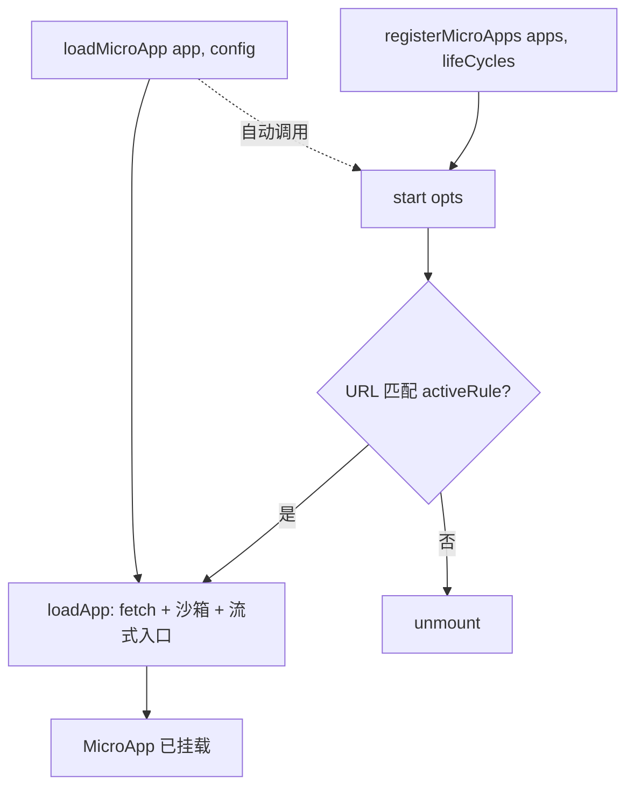

# API 参考总览

`qiankun` 包导出的全部内容，按职责分组。每个符号都链接到各自的参考页面，可查看完整的签名、选项和示例。

```ts
import {
  registerMicroApps,
  start,
  loadMicroApp,
  setDefaultMountApp,
  runAfterFirstMounted,
  addErrorHandler,
  removeErrorHandler,
  isRuntimeCompatible,
  prefetchApps,
} from 'qiankun';
```

当前版本：`3.0.0-rc.21`。

## 公开导出速览

| 导出 | 类型 | 用途 |
| --- | --- | --- |
| [`registerMicroApps`](/zh-CN/api/register-micro-apps) | 函数 | 注册路由驱动的微应用；当 URL 匹配某个微应用的 `activeRule` 时，single-spa 会激活它。 |
| [`start`](/zh-CN/api/start) | 函数 | 启动框架。仅接收 single-spa 的 `StartOpts`。 |
| [`loadMicroApp`](/zh-CN/api/load-micro-app) | 函数 | 立即以命令式挂载一个微应用，并返回可控制它的句柄。 |
| [`setDefaultMountApp`](/zh-CN/api/effects) | 函数 | 当没有微应用挂载时，导航到一个默认微应用。 |
| [`runAfterFirstMounted`](/zh-CN/api/effects) | 函数 | 在第一个微应用挂载之后执行一次回调。 |
| [`addErrorHandler`](/zh-CN/api/error-handling) | 函数 | 注册全局错误处理器（从 single-spa 重新导出）。 |
| [`removeErrorHandler`](/zh-CN/api/error-handling) | 函数 | 移除先前注册的错误处理器（从 single-spa 重新导出）。 |
| [`isRuntimeCompatible`](/zh-CN/api/is-runtime-compatible) | 函数 | 探测当前浏览器是否支持 v3 运行时。 |
| [`prefetchApps`](/zh-CN/api/prefetch-apps) | 函数 | 已废弃。为一组应用预热 HTTP 缓存。 |

## 签名

```ts
function registerMicroApps<T extends ObjectType>(
  apps: Array<RegistrableApp<T>>,
  lifeCycles?: LifeCycles<T>,
): void;

function start(opts?: StartOpts): void; // StartOpts = { urlRerouteOnly?: boolean }

function loadMicroApp<T extends ObjectType>(
  app: LoadableApp<T>,
  configuration?: AppConfiguration,
  lifeCycles?: LifeCycles<T>,
): MicroApp;

function setDefaultMountApp(defaultAppLink: string): void;
function runAfterFirstMounted(effect: () => void): void;

function addErrorHandler(handler: (err: AppError) => void): void;
function removeErrorHandler(handler: (err: AppError) => void): void;

function isRuntimeCompatible(): boolean;

function prefetchApps(
  apps: AppMetadata[],
  fetch?: typeof window.fetch,
): void; // @deprecated in 3.0
```

## 注册

声明式、路由驱动的入口。你只需注册一次微应用列表，然后调用 `start()`；随着 URL 匹配或不再匹配各应用的 `activeRule`，single-spa 会挂载和卸载相应的应用。

- [`registerMicroApps(apps, lifeCycles?)`](/zh-CN/api/register-micro-apps) —— 注册应用。应用会按 `name` 去重；每个应用的配置放在各自的 `configuration` 字段中。
- [`start(opts?)`](/zh-CN/api/start) —— 启动框架并开始路由。在 v3 中，`start` 仅接收 single-spa 的 `StartOpts`（参见 [v3 中已移除](#not-in-v3) 说明）。它还会预热 ESM-sandbox 的词法分析器。

## 命令式加载

适用于不与路由绑定的微应用 —— 例如小部件、弹窗，或需要按需挂载和卸载的应用。

- [`loadMicroApp(app, configuration?, lifeCycles?)`](/zh-CN/api/load-micro-app) —— 立即挂载并返回一个 [`MicroApp`](/zh-CN/api/types) 句柄（一个 single-spa parcel），它暴露了 `mount`、`unmount`、`update`、`getStatus` 以及各生命周期的 promise。如果 `start()` 尚未运行，`loadMicroApp` 会替你调用它。

## 生命周期副作用

绑定到 single-spa 路由事件的一次性辅助函数。

- [`setDefaultMountApp(defaultAppLink)`](/zh-CN/api/effects) —— 当没有应用挂载时，导航到 `defaultAppLink`。该监听器在触发一次后会自我移除。
- [`runAfterFirstMounted(effect)`](/zh-CN/api/effects) —— 在任意微应用第一次挂载时执行一次 `effect`。

## 错误处理

原样从 single-spa 重新导出，因此其行为与 single-spa API 完全一致。

- [`addErrorHandler(handler)`](/zh-CN/api/error-handling) —— 接收所有应用的加载错误和运行时错误。
- [`removeErrorHandler(handler)`](/zh-CN/api/error-handling) —— 解绑一个处理器。

相关模式参见[错误处理实战](/zh-CN/cookbook/handle-errors)。

## 能力探测

- [`isRuntimeCompatible()`](/zh-CN/api/is-runtime-compatible) —— 当浏览器提供 `Proxy`、`TransformStream` 和 `URL.createObjectURL`（v3 运行时依赖的三项特性）时返回 `true`。可用它为旧版浏览器设置降级回退，把 qiankun 挡在门槛之后。

## 已废弃

- [`prefetchApps(apps, fetch?)`](/zh-CN/api/prefetch-apps) —— 在空闲时间抓取每个入口的 HTML 及其脚本和样式表，以预热 HTTP 缓存。

::: warning 在 3.0 中已废弃
`prefetchApps` 已废弃。流式 HTML-entry 加载器会在解析每个入口时自动预加载资源，因此很少需要手动预取。参见[优化加载与预加载](/zh-CN/cookbook/optimize-loading)。`PrefetchStrategy` 类型为了向后兼容仍然导出，但没有任何 v3 API 会消费它。
:::

## 类型

完整的类型说明记录在[类型参考](/zh-CN/api/types)页面。主要条目如下：

| 类型 | 参考 |
| --- | --- |
| `AppConfiguration` | [配置](/zh-CN/api/configuration) |
| `LifeCycles` / `LifeCycleFn` | [生命周期钩子](/zh-CN/api/lifecycles) |
| `RegistrableApp` | [registerMicroApps](/zh-CN/api/register-micro-apps) · [类型](/zh-CN/api/types) |
| `LoadableApp` | [loadMicroApp](/zh-CN/api/load-micro-app) · [类型](/zh-CN/api/types) |
| `MicroApp`（single-spa `Parcel`） | [类型](/zh-CN/api/types) |
| `AppMetadata`、`HTMLEntry`、`ObjectType`、`MicroAppLifeCycles`、`PrefetchStrategy` | [类型](/zh-CN/api/types) |

::: info 被导出的内部实现状态
`start` 和 `registerMicroApps` 位于同一个模块中，该模块还导出了两项内部状态 —— `started`（一个布尔标志）和 `microApps`（存活的注册表数组）。它们是实现细节，而非受支持的 API。请勿依赖它们。

`version` 常量存在于包源码中，但**不会**从入口 barrel 重新导出，因此 `import { version } from 'qiankun'` 是无效的。
:::

## v3 中已移除 {#not-in-v3}

qiankun 3.0 是一次运行时重写，若干 qiankun 2.x 的 API 和选项已被移除。以下内容在 v3 中不存在 —— 引用它们的代码将无法编译，或悄无声息地什么都不做。

::: danger 在 v3 中已移除
**没有内置的全局状态存储。** `initGlobalState`、`onGlobalStateChange`、`setGlobalState` 以及 `MicroAppStateActions` 类型都已移除。请改为通过 `props` 把你自己的方法传给微应用。参见[在应用间共享状态与通信](/zh-CN/cookbook/communicate-between-apps)。

**没有 `FrameworkConfiguration` 类型。** 每个应用的配置类型为 [`AppConfiguration`](/zh-CN/api/configuration)，其字段仅有 `fetch`、`streamTransformer`、`nodeTransformer`、`sandbox`（默认 `true`）、`globalContext`（默认 `window`）和 `styleIsolation`（默认 `false`）。不存在 `singular`、`prefetch`、`getPublicPath`、`getTemplate` 或 `excludeAssetFilter`。

**`start()` 仅接收 single-spa 的 `StartOpts`** —— `{ urlRerouteOnly?: boolean }`。2.x 版 qiankun `start` 的选项（`prefetch`、`sandbox`、`singular`、`fetch`、`getPublicPath`、`getTemplate`、`excludeAssetFilter`）都已移除。请改为通过 [`AppConfiguration`](/zh-CN/api/configuration) 为每个应用配置沙箱和加载行为。

**样式隔离是单个布尔值。** `sandbox: { strictStyleIsolation }`、`sandbox: { experimentalStyleIsolation }` 以及 Shadow DOM 隔离都已移除。v3 使用一个布尔值 `styleIsolation`，基于 CSS `@scope` 实现。参见[样式隔离](/zh-CN/concepts/style-isolation)。

**`entry` 是一个 URL 字符串**（`HTMLEntry = string`）—— 2.x 的 `{ scripts, styles }` 对象形式已移除。**`container` 是一个 `HTMLElement`**（或解析为其的选择器字符串），而不再是存储在配置上的裸选择器。
:::

## 各部分如何协作



## 相关

- [快速开始](/zh-CN/guide/getting-started)
- [架构总览](/zh-CN/concepts/architecture)
- [微应用生命周期与 props](/zh-CN/concepts/lifecycle-and-props)
- [从 qiankun 2.x 迁移](/zh-CN/cookbook/migrate-from-2x)
