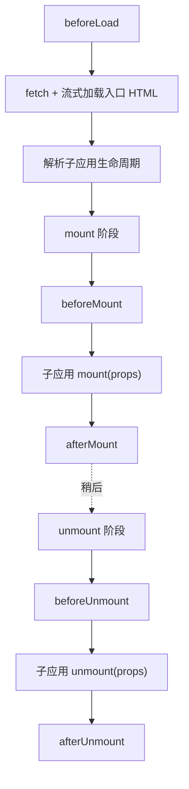

# 生命周期钩子（LifeCycles）

主应用的生命周期钩子让主应用能够观察并响应微应用在加载、mount、unmount 各个阶段的状态。你可以把它们传给 [`registerMicroApps`](/zh-CN/api/register-micro-apps)（此时它们会全局作用于每一个注册的应用），或者传给 [`loadMicroApp`](/zh-CN/api/load-micro-app)（此时它们只作用于那一个实例）。

这些钩子与子应用自身导出的 bootstrap/mount/unmount 是两回事——参见下文的 [MicroAppLifeCycles](#microapplifecycles-子应用自身的导出)。

## 类型

```ts
type ObjectType = Record<string, unknown>;

type LifeCycleFn<T extends ObjectType> = (
  app: LoadableApp<T>,
  global: WindowProxy,
) => Promise<void>;

type LifeCycles<T extends ObjectType> = {
  beforeLoad?: LifeCycleFn<T> | Array<LifeCycleFn<T>>;
  beforeMount?: LifeCycleFn<T> | Array<LifeCycleFn<T>>;
  afterMount?: LifeCycleFn<T> | Array<LifeCycleFn<T>>;
  beforeUnmount?: LifeCycleFn<T> | Array<LifeCycleFn<T>>;
  afterUnmount?: LifeCycleFn<T> | Array<LifeCycleFn<T>>;
};
```

`LoadableApp<T>` 是应用描述对象——`{ name, entry, container, props? }`。完整结构参见[类型参考](/zh-CN/api/types)。

每个钩子可以是单个函数，也可以是一个函数数组。当它是数组时，qiankun 会按顺序依次执行这些函数，并在开始下一个之前 await 前一个。

### 五个钩子

| 钩子 | 触发时机 | 典型用途 |
| --- | --- | --- |
| `beforeLoad` | 在 fetch 入口 HTML、await 子应用生命周期之前 | 显示全局 loading 指示器、记录一次加载的开始 |
| `beforeMount` | 在子应用 `mount` 运行之前（mount 阶段内部） | 准备共享上下文、向沙箱全局注入初始值 |
| `afterMount` | 在子应用 `mount` resolve 之后 | 隐藏 loading 指示器、执行 mount 后的埋点 |
| `beforeUnmount` | 在子应用 `unmount` 运行之前 | 持久化状态、拆除主应用侧的监听器 |
| `afterUnmount` | 在子应用 `unmount` resolve 之后 | 最终清理、记录一次会话的结束 |

## 第二个参数是沙箱化的 window

::: danger arg2 是被代理的全局对象，而不是子应用的导出
`global`（第二个参数）是被**沙箱代理的 `WindowProxy`**，也就是这个微应用把它当作自己 `window` 的那个对象——它既不是子应用导出的生命周期对象，也不是页面真实的 `window`。

通过 `global` 的读写都被限定在膜（membrane）之内：它们对微应用可见，但不会泄漏到宿主页面，并且会在应用 unmount 时被回滚。绝不要在钩子内部去访问真实的 `window` 或 `document.head`——那样会破坏 [JS 沙箱](/zh-CN/concepts/js-sandbox)，并可能污染其他应用。
:::

```ts
const lifeCycles = {
  beforeMount: async (app, global) => {
    // 正确做法：注入一个微应用会从自己 window 上读取的值。
    global.__APP_THEME__ = 'dark';
  },
};
```

框架自身正是使用这一机制：内置 addon 会在 `beforeLoad`/`beforeMount` 阶段把 `global.__POWERED_BY_QIANKUN__` 和 `global.__INJECTED_PUBLIC_PATH_BY_QIANKUN__` 设置到被代理的 window 上，并在 `beforeUnmount` 阶段移除它们。

## 执行时机

`beforeLoad` 在 `loadApp` 主体中运行，早于 await 入口生命周期。其余四个钩子运行在 single-spa parcel 的 mount/unmount 数组内部，与子应用自身的生命周期交错执行。



完整的 mount 顺序是：初始化/重载容器 → 激活沙箱 → `beforeMount` → 子应用 `mount({ ...props, container })` → `afterMount`。完整的 unmount 顺序是：`beforeUnmount` → 子应用 `unmount({ ...props, container })` → 停用沙箱 → `afterUnmount` → 清空容器。

::: info 内置 addon 先于你的钩子运行
对每个钩子，qiankun 会把两个内置 addon（`engineFlag` 和 `runtimePublicPath`）拼接在你提供的钩子**之前**，然后按顺序运行合并后的链。因此当你的 `beforeMount` 运行时，`__POWERED_BY_QIANKUN__` 和 `__INJECTED_PUBLIC_PATH_BY_QIANKUN__` 已经被设置到 `global` 上。你无法在这些 addon 之前运行。
:::

## 示例

传给 `registerMicroApps` 的钩子是全局的——它们会为该次调用中注册的每一个应用触发。`app` 参数告诉你当前正在处理的是哪个应用。

::: code-group

```ts [main/src/index.ts]
import { registerMicroApps, start } from 'qiankun';

registerMicroApps(
  [
    {
      name: 'react-app',
      entry: 'http://localhost:7100',
      container: document.getElementById('subapp-container')!,
      activeRule: '/react',
    },
  ],
  {
    beforeLoad: async (app) => {
      console.log('[before load]', app.name);
    },
    beforeMount: async (app, global) => {
      console.log('[before mount]', app.name);
      global.__APP_THEME__ = 'dark';
    },
    afterMount: async (app) => {
      console.log('[after mount]', app.name);
    },
    beforeUnmount: async (app) => {
      console.log('[before unmount]', app.name);
    },
    afterUnmount: async (app) => {
      console.log('[after unmount]', app.name);
    },
  },
);

start();
```

:::

传入一个数组即可让某个阶段按顺序运行多个函数：

```ts
registerMicroApps(apps, {
  beforeMount: [
    async (app) => console.log('[1]', app.name),
    async (app) => console.log('[2]', app.name),
  ],
});
```

在 [`loadMicroApp`](/zh-CN/api/load-micro-app) 中，同样的 `LifeCycles` 对象作为第三个参数，只作用于该实例：

```ts
import { loadMicroApp } from 'qiankun';

const microApp = loadMicroApp(
  {
    name: 'react-app',
    entry: 'http://localhost:7100',
    container: document.getElementById('subapp-container')!,
  },
  { sandbox: true },
  {
    afterMount: async (app) => {
      console.log('mounted', app.name);
    },
  },
);
```

## MicroAppLifeCycles——子应用自身的导出

上文的 `LifeCycles` 是**主应用**的钩子集合。它不同于 `MicroAppLifeCycles`——后者是**微应用自身**必须从其入口导出的契约，以便 single-spa 能够驱动它。

```ts
type MicroAppLifeCycles = {
  bootstrap: (props) => Promise<void>;
  mount: (props) => Promise<void>;
  unmount: (props) => Promise<void>;
  update?: (props) => Promise<void>;
};
```

qiankun 会从入口中发现这些导出：具名 ESM 导出（`export async function mount() {}`）、一个 `export default { bootstrap, mount, unmount }`，或者由 classic/UMD 入口脚本赋值的一个全局变量。`bootstrap`、`mount`、`unmount` 是必需的；`update` 是可选的，且只有当它是函数时才会被接入。

它们每一个都会收到一个 `props` 对象，其中包含 single-spa 注入的 props、你的 `customProps`（应用的 `props`），以及——最关键的——qiankun 注入的 `container: HTMLElement`。子应用必须渲染到 `props.container`，而不是硬编码的选择器。

```ts
// react-app/src/index.tsx（微应用）
export async function bootstrap() {}

export async function mount(props: { container: HTMLElement }) {
  const root = ReactDOM.createRoot(props.container.querySelector('#root')!);
  root.render(<App />);
}

export async function unmount(props: { container: HTMLElement }) {
  // 拆除应用自身的视图
}
```

::: warning 两个不同的生命周期概念
`LifeCycles`（本页）把主应用挂接到微应用的各个阶段上；它的函数接收 `(app, global)`。`MicroAppLifeCycles` 是微应用导出的内容；它的函数接收 `(props)`，其中包含 `container`。它们位于边界的相对两侧。
:::

关于 props 如何流向子应用、以及 mount/unmount 如何被编排的端到端模型，参见[微应用生命周期与 props](/zh-CN/concepts/lifecycle-and-props)。

## 相关内容

- [registerMicroApps](/zh-CN/api/register-micro-apps)——全局 `lifeCycles` 的注册入口
- [loadMicroApp](/zh-CN/api/load-micro-app)——按实例的 `lifeCycles`
- [JS 沙箱](/zh-CN/concepts/js-sandbox)——`global`（arg2）到底是什么
- [类型参考](/zh-CN/api/types)——`LoadableApp`、`MicroApp` 及相关类型
