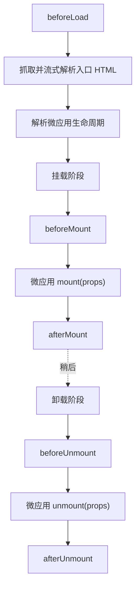

# 生命周期钩子（LifeCycles）

框架级的生命周期钩子，让主应用能观察并介入微应用加载、挂载、卸载的每一个阶段。你可以把它们传给 [`registerMicroApps`](/zh-CN/api/register-micro-apps)（这时它们会对本次注册的每个应用都生效），也可以传给 [`loadMicroApp`](/zh-CN/api/load-micro-app)（这时只对当前这一个实例生效）。

要分清楚，这里说的钩子和微应用自己导出的 bootstrap/mount/unmount 不是一回事——后者见下文的 [MicroAppLifeCycles](#microapplifecycles)。

## 类型

```ts
type ObjectType = Record<string, unknown>;

type LifeCycleFn<T extends ObjectType> = (
  app: LoadableApp<T>,
  global: WindowProxy,
) => Promise<void>;

type LifeCycles<T extends ObjectType> = {
  beforeLoad?: LifeCycleFn<T> | Array<LifeCycleFn<T>>;
  beforeMount?: LifeCycleFn<T> | Array<LifeCycleFn<T>>;
  afterMount?: LifeCycleFn<T> | Array<LifeCycleFn<T>>;
  beforeUnmount?: LifeCycleFn<T> | Array<LifeCycleFn<T>>;
  afterUnmount?: LifeCycleFn<T> | Array<LifeCycleFn<T>>;
};
```

`LoadableApp<T>` 是应用描述对象，形如 `{ name, entry, container, props? }`，完整结构见[类型参考](/zh-CN/api/types)。

每个钩子既可以是单个函数，也可以是一组函数。传数组时，qiankun 按顺序执行它们，前一个 await 完了再跑下一个。

### 五个钩子

| 钩子 | 触发时机 | 常见用途 |
| --- | --- | --- |
| `beforeLoad` | 抓取入口 HTML、await 微应用生命周期之前 | 显示全局 loading、记录一次加载的开始 |
| `beforeMount` | 微应用 `mount` 执行之前（处于挂载阶段内） | 准备共享上下文、往沙箱全局里塞初始值 |
| `afterMount` | 微应用 `mount` resolve 之后 | 关掉 loading、跑挂载后的埋点 |
| `beforeUnmount` | 微应用 `unmount` 执行之前 | 持久化状态、拆掉主应用侧的监听 |
| `afterUnmount` | 微应用 `unmount` resolve 之后 | 收尾清理、记录一次会话的结束 |

## 第二个参数是沙箱化的 window

::: danger 第二个参数是被代理的全局对象，不是微应用的导出
`global`（第二个参数）是**经沙箱代理的 `WindowProxy`**——也就是这个微应用眼里那份属于自己的 `window`，既不是微应用导出的生命周期对象，也不是页面真正的 `window`。

通过 `global` 的读写都被关在隔离膜里：微应用看得到，但不会泄漏到宿主页面，应用卸载时这些改动还会被逐一还原。别在钩子里去碰真正的 `window` 或 `document.head`——那样会绕过 [JS 沙箱](/zh-CN/concepts/js-sandbox)，还可能连累到别的应用。
:::

```ts
const lifeCycles = {
  beforeMount: async (app, global) => {
    // Correct: seed a value the micro-app reads off its own window.
    global.__APP_THEME__ = 'dark';
  },
};
```

框架自己走的就是这条路：内置 addon 会在 `beforeLoad`/`beforeMount` 阶段往被代理的 window 上设置 `global.__POWERED_BY_QIANKUN__` 和 `global.__INJECTED_PUBLIC_PATH_BY_QIANKUN__`，再在 `beforeUnmount` 时把它们移除。

## 执行时机

`beforeLoad` 跑在 `loadApp` 主体里，在 await 入口生命周期之前。其余四个钩子跑在 single-spa parcel 的 mount/unmount 数组里，和微应用自己的生命周期交错执行。



完整的挂载顺序是：初始化 / 复用容器 → 激活沙箱 → `beforeMount` → 微应用 `mount({ ...props, container })` → `afterMount`。完整的卸载顺序是：`beforeUnmount` → 微应用 `unmount({ ...props, container })` → 停用沙箱 → `afterUnmount` → 清空容器。

::: info 内置 addon 跑在你的钩子之前
对每个钩子，qiankun 都会把两个内置 addon（`engineFlag` 和 `runtimePublicPath`）拼在你自己传的钩子**前面**，再按顺序执行整条链。所以轮到你的 `beforeMount` 时，`__POWERED_BY_QIANKUN__` 和 `__INJECTED_PUBLIC_PATH_BY_QIANKUN__` 早已设好。你没办法比这些 addon 更早执行。
:::

## 示例

传给 `registerMicroApps` 的钩子是全局的——本次注册里的每个应用都会触发它们。当前在跑的是哪个应用，看 `app` 参数就知道。

::: code-group

```ts [main/src/index.ts]
import { registerMicroApps, start } from 'qiankun';

registerMicroApps(
  [
    {
      name: 'react-app',
      entry: 'http://localhost:7100',
      container: document.getElementById('subapp-container')!,
      activeRule: '/react',
    },
  ],
  {
    beforeLoad: async (app) => {
      console.log('[before load]', app.name);
    },
    beforeMount: async (app, global) => {
      console.log('[before mount]', app.name);
      global.__APP_THEME__ = 'dark';
    },
    afterMount: async (app) => {
      console.log('[after mount]', app.name);
    },
    beforeUnmount: async (app) => {
      console.log('[before unmount]', app.name);
    },
    afterUnmount: async (app) => {
      console.log('[after unmount]', app.name);
    },
  },
);

start();
```

:::

同一个阶段想跑好几个函数，传数组就行，它们会依次执行：

```ts
registerMicroApps(apps, {
  beforeMount: [
    async (app) => console.log('[1]', app.name),
    async (app) => console.log('[2]', app.name),
  ],
});
```

用 [`loadMicroApp`](/zh-CN/api/load-micro-app) 时，同样的 `LifeCycles` 对象是第三个参数，只作用于当前这个实例：

```ts
import { loadMicroApp } from 'qiankun';

const microApp = loadMicroApp(
  {
    name: 'react-app',
    entry: 'http://localhost:7100',
    container: document.getElementById('subapp-container')!,
  },
  { sandbox: true },
  {
    afterMount: async (app) => {
      console.log('mounted', app.name);
    },
  },
);
```

## MicroAppLifeCycles：微应用自己导出的生命周期 {#microapplifecycles}

上面那个 `LifeCycles` 是**主应用**这一侧的钩子集合，和 `MicroAppLifeCycles` 不是一回事。后者是**微应用自己**要从入口导出的契约，single-spa 靠它来驱动这个微应用。

```ts
type MicroAppLifeCycles = {
  bootstrap: (props) => Promise<void>;
  mount: (props) => Promise<void>;
  unmount: (props) => Promise<void>;
  update?: (props) => Promise<void>;
};
```

qiankun 会从入口里去发现这些导出：具名 ESM 导出（`export async function mount() {}`）、`export default { bootstrap, mount, unmount }`，或是 classic/UMD 入口脚本挂上去的一个全局变量。`bootstrap`、`mount`、`unmount` 三个是必需的；`update` 可选，只有当它是函数时才会被接上。

这几个函数都会收到一个 `props` 对象，里面既有 single-spa 注入的 props，也有你的 `customProps`（也就是应用的 `props`），还有一个关键的、由 qiankun 注入的 `container: HTMLElement`。微应用必须渲染进 `props.container`，别写死一个选择器。

```ts
// react-app/src/index.tsx (the micro-app)
export async function bootstrap() {}

export async function mount(props: { container: HTMLElement }) {
  const root = ReactDOM.createRoot(props.container.querySelector('#root')!);
  root.render(<App />);
}

export async function unmount(props: { container: HTMLElement }) {
  // tear down the app's own view
}
```

::: warning 两个不同的生命周期概念
`LifeCycles`（本页讲的）是把主应用挂到微应用各阶段上的钩子，函数收到的是 `(app, global)`。`MicroAppLifeCycles` 是微应用自己导出的东西，函数收到的是包含 `container` 的 `(props)`。两者分处边界的两侧。
:::

props 是怎么一路流到微应用的、mount/unmount 又是怎么编排的，端到端的模型见[微应用生命周期与 props](/zh-CN/concepts/lifecycle-and-props)。

## 相关内容

- [registerMicroApps](/zh-CN/api/register-micro-apps)——全局 `lifeCycles` 的注册入口
- [loadMicroApp](/zh-CN/api/load-micro-app)——按实例传入的 `lifeCycles`
- [JS 沙箱](/zh-CN/concepts/js-sandbox)——`global`（第二个参数）到底是什么
- [类型参考](/zh-CN/api/types)——`LoadableApp`、`MicroApp` 及相关类型
```