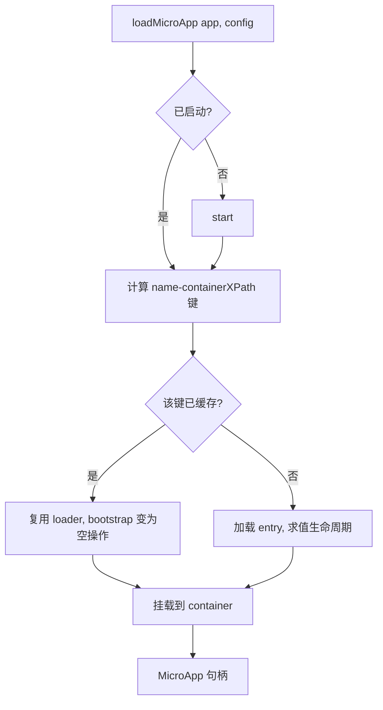

# loadMicroApp

手动把一个微应用加载并挂载到你自己指定的 DOM 元素里，和路由无关。当你想把微应用嵌到页面的某个具体位置——一个弹窗、一个标签页、一块面板——并且自己管它的生命周期时，用这个。如果是路由驱动的激活，改用 [registerMicroApps](/zh-CN/api/register-micro-apps)。

框架封装的 [React 版 `<MicroApp>`](/zh-CN/ecosystem/react) 和 [Vue 版 `<MicroApp>`](/zh-CN/ecosystem/vue)，底层用的就是这个原语。

## 函数签名

```ts
function loadMicroApp<T extends ObjectType>(
  app: LoadableApp<T>,
  configuration?: AppConfiguration,
  lifeCycles?: LifeCycles<T>,
): MicroApp;
```

`loadMicroApp` 返回一个 `MicroApp` 句柄(其实就是一个 single-spa Parcel)，你拿它来观察状态、以及卸载应用。它不会等待——加载和挂载都是异步跑的；想知道什么时候完成，就 await 句柄上对应的 promise。

## 参数

### `app: LoadableApp<T>`

描述要加载哪个微应用、挂到哪儿。

| 字段 | 类型 | 必填 | 说明 |
| --- | --- | --- | --- |
| `name` | `string` | 是 | 微应用实例的唯一标识。它和 container 一起构成缓存的键(见 [行为](#behavior))。 |
| `entry` | `string` | 是 | 微应用 HTML 入口的 URL。只能是字符串——2.x 里的对象写法(`{ scripts, styles }`)在 v3 中已经没有了。 |
| `container` | `HTMLElement` | 是 | 用来渲染的 DOM 元素。必须是真实的元素，不能是 CSS 选择器字符串。 |
| `props` | `T` | 否 | 透传给微应用生命周期函数的数据。 |

```ts
type ObjectType = Record<string, unknown>;

type LoadableApp<T extends ObjectType> = {
  name: string;
  entry: string;
  container: HTMLElement;
  props?: T;
};
```

::: warning `container` 必须是元素
在 qiankun v3 里，`container` 的类型是 `HTMLElement`，而不是 `string | HTMLElement`。传进来之前你得自己把元素拿到手(`document.getElementById(...)`、框架的 ref 之类)。传选择器字符串会是一个类型错误，运行时也跑不起来。
:::

### `configuration?: AppConfiguration`

单个应用的配置项。全部可选，下面这些默认值由 qiankun 内部解析。

| 选项 | 类型 | 默认值 | 说明 |
| --- | --- | --- | --- |
| `sandbox` | `boolean` | `true` | 开启基于 Proxy 隔离膜的 [JS 沙箱](/zh-CN/concepts/js-sandbox)和 [ESM 沙箱](/zh-CN/concepts/esm-sandbox)。只有那些必须跑在真实全局上的老应用，才设成 `false`。 |
| `globalContext` | `WindowProxy` | `window` | 沙箱隔离膜所代理的基础全局对象。 |
| `styleIsolation` | `boolean` | `false` | 按需开启运行时的 CSS `@scope` [样式隔离](/zh-CN/concepts/style-isolation)，作用域限定在 `[data-name="<name>"]`。 |
| `fetch` | `typeof window.fetch` | `window.fetch` | 加载入口和资源时用的自定义 fetch。qiankun 会给它套上缓存、重试、抛错的能力。 |
| `streamTransformer` | `() => TransformStream<string, string>` | — | 可选，接到 HTML 流上的转换流。 |
| `nodeTransformer` | `NodeTransformer` | 内部默认值 | 在每个 script/link/style 节点进入真实 DOM 之前改写它。只有高级场景才需要覆盖。 |

```ts
type AppConfiguration =
  Partial<Pick<LoaderOpts, 'fetch' | 'streamTransformer' | 'nodeTransformer'>> & {
    sandbox?: boolean;
    globalContext?: WindowProxy;
    styleIsolation?: boolean;
  };
```

完整的配置参考见 [AppConfiguration](/zh-CN/api/configuration)。

::: info 没有 `strict`/`experimentalStyleIsolation`，也没有 `sandbox` 对象
v3 把 2.x 里的 `sandbox: { strictStyleIsolation, experimentalStyleIsolation }` 和 Shadow DOM 那套模型，换成了一个普通布尔值 `sandbox`，外加一个单独的、用 CSS `@scope` 实现的布尔值 `styleIsolation`。那些对象写法都不存在了。
:::

### `lifeCycles?: LifeCycles<T>`

可选的生命周期钩子，围绕这个应用的加载、挂载、卸载前后触发。每个钩子可以是单个函数，也可以是函数数组，签名都是 `(app, global)`，其中 `global` 是沙箱化后的 window 视图。

```ts
type LifeCycleFn<T extends ObjectType> = (app: LoadableApp<T>, global: WindowProxy) => Promise<void>;

type LifeCycles<T extends ObjectType> = {
  beforeLoad?: LifeCycleFn<T> | Array<LifeCycleFn<T>>;
  beforeMount?: LifeCycleFn<T> | Array<LifeCycleFn<T>>;
  afterMount?: LifeCycleFn<T> | Array<LifeCycleFn<T>>;
  beforeUnmount?: LifeCycleFn<T> | Array<LifeCycleFn<T>>;
  afterUnmount?: LifeCycleFn<T> | Array<LifeCycleFn<T>>;
};
```

细节见 [生命周期钩子](/zh-CN/api/lifecycles)。

## 返回值

`loadMicroApp` 返回一个 `MicroApp`，也就是一个 single-spa 的 Parcel 句柄：

```ts
type MicroApp = Parcel;

type Parcel = {
  mount(): Promise<null>;
  unmount(): Promise<null>;
  update?(customProps: object): Promise<any>;
  getStatus():
    | 'NOT_LOADED'
    | 'LOADING_SOURCE_CODE'
    | 'NOT_BOOTSTRAPPED'
    | 'BOOTSTRAPPING'
    | 'NOT_MOUNTED'
    | 'MOUNTING'
    | 'MOUNTED'
    | 'UPDATING'
    | 'UNMOUNTING'
    | 'UNLOADING'
    | 'SKIP_BECAUSE_BROKEN'
    | 'LOAD_ERROR';
  loadPromise: Promise<null>;
  bootstrapPromise: Promise<null>;
  mountPromise: Promise<null>;
  unmountPromise: Promise<null>;
};
```

| 成员 | 说明 |
| --- | --- |
| `mount()` | 挂载这个 parcel。loadMicroApp 在加载时已经挂载过了，所以你很少需要直接调它。 |
| `unmount()` | 卸载应用，触发沙箱拆除和 DOM 清理。用完一定要调它。 |
| `update?(props)` | 只有当微应用导出了 `update` 生命周期时才有。把新的 props 推给正在运行的应用。 |
| `getStatus()` | 返回当前的生命周期状态，取值就是上面那个联合类型。 |
| `loadPromise` | 源码加载完成时 resolve。 |
| `bootstrapPromise` | bootstrap 完成时 resolve。 |
| `mountPromise` | 挂载完成时 resolve。await 它就能知道应用已经上屏了。 |
| `unmountPromise` | 卸载完成时 resolve。 |

::: warning 记得处理 reject
加载或挂载失败时，这些 promise 会 reject。挂个 `.catch`(或者用 `try/await` 包起来)，别让失败变成没人处理的 unhandled rejection。
:::

## 行为 {#behavior}

有几个 v3 特有的行为值得先了解。

- **自动启动框架。** 如果框架还没启动，`loadMicroApp` 会在内部帮你调 [`start()`](/zh-CN/api/start)，这样主应用的 `pushState`/`replaceState` 才能正确派发 `popstate`。手动加载时，你不需要先自己调一遍 `start()`。
- **实例键取自 container 的 XPath。** 每个实例的键是 `${name}-${containerXPath}`，这个 XPath 根据 container 元素算一次。
- **按实例键做缓存。** 如果你把同名(`name` 相同)的应用再次加载到同一个 DOM 节点，会复用缓存的 loader:源码不会重新拉，生命周期不会重新求值，重新挂载时 `bootstrap` 变成空操作。只有 mount/unmount 会再跑一遍。
- **同一 container 上串行执行。** 多个微应用共用一个 container 时，新的挂载会先等上一个实例的 `unmountPromise`，再开始挂载，所以它们永远不会重叠。
- **卸载时清理。** `unmountPromise` 触发时，实例会把自己从该 container 的注册表里移除，container 的 DOM 也会被清空。ESM realm 和 blob URL 的彻底拆除，发生在 single-spa 的 `unload` 阶段。



## 示例

先拿到 container 元素，挂载应用，不再需要时再卸载掉。

```ts
import { loadMicroApp } from 'qiankun';

const container = document.getElementById('micro-app-slot');
if (!container) throw new Error('container not found');

const microApp = loadMicroApp(
  {
    name: 'app1',
    entry: 'http://localhost:7100',
    container,
    props: { userId: 42 },
  },
  { sandbox: true },
);

// wait until it is on screen
await microApp.mountPromise;
console.log(microApp.getStatus()); // 'MOUNTED'

// later, tear it down
await microApp.unmount();
```

如果某个老应用没法跑在隔离环境下，就把沙箱关掉：

```ts
const microApp = loadMicroApp(
  { name: 'legacy-app', entry: 'http://localhost:7200', container },
  { sandbox: false },
);
```

::: tip 能用框架封装就优先用
如果你的主应用是 React 或 Vue,[`<MicroApp>`](/zh-CN/ecosystem/react) 会替你管好 container ref、挂载、props 更新和卸载——它封装的正是这套 API。只有当你需要完全手动控制、或者不在受支持的框架里时，才直接上 `loadMicroApp`。
:::

## 相关内容

- [registerMicroApps](/zh-CN/api/register-micro-apps) —— 路由驱动的激活，而非手动挂载。
- [start](/zh-CN/api/start) —— `loadMicroApp` 会自动调它，但路由驱动的应用需要你显式调用。
- [AppConfiguration](/zh-CN/api/configuration) —— 完整的配置项参考。
- [生命周期钩子](/zh-CN/api/lifecycles) —— `LifeCycles` 里的那些钩子。
- [微应用的生命周期与 props](/zh-CN/concepts/lifecycle-and-props) —— props 和生命周期是怎么送到子应用的。
- [运行多个微应用实例](/zh-CN/cookbook/run-multiple-instances) —— 在同一页面上运行多个实例的做法。
