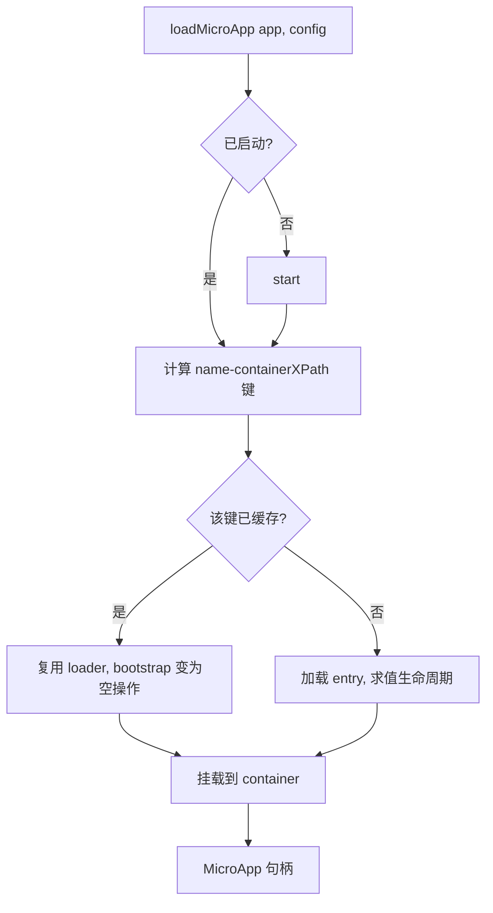

# loadMicroApp

以命令式的方式，将一个微应用加载并挂载到你自己控制的 DOM 元素中，与路由无关。当你想把微应用嵌入到页面的某个特定位置（一个对话框、一个标签页、一个面板），并自行管理其生命周期时，就使用它。对于由路由驱动的激活方式，请改用 [registerMicroApps](/zh-CN/api/register-micro-apps)。

框架封装组件 [`<MicroApp>`（React 版）](/zh-CN/ecosystem/react) 与 [`<MicroApp>`（Vue 版）](/zh-CN/ecosystem/vue) 正是构建在这一底层原语之上。

## 函数签名

```ts
function loadMicroApp<T extends ObjectType>(
  app: LoadableApp<T>,
  configuration?: AppConfiguration,
  lifeCycles?: LifeCycles<T>,
): MicroApp;
```

`loadMicroApp` 返回一个 `MicroApp` 句柄（即 single-spa 的 Parcel），你可以用它来观察状态以及卸载应用。它不会等待——加载与挂载是异步执行的；对返回句柄上的 promise 使用 await 即可观察其完成。

## 参数

### `app: LoadableApp<T>`

描述要加载哪个微应用以及将其挂载到何处。

| 字段 | 类型 | 必填 | 说明 |
| --- | --- | --- | --- |
| `name` | `string` | 是 | 微应用实例的唯一标识。它与 container 组合构成记忆化（memoization）的键（参见 [行为](#behavior)）。 |
| `entry` | `string` | 是 | 微应用 HTML 入口的 URL。始终是一个字符串——2.x 中的对象形式（`{ scripts, styles }`）在 v3 中已不存在。 |
| `container` | `HTMLElement` | 是 | 要渲染到的 DOM 元素。必须是一个真实的元素，而非 CSS 选择器字符串。 |
| `props` | `T` | 否 | 透传给微应用生命周期函数的数据。 |

```ts
type ObjectType = Record<string, unknown>;

type LoadableApp<T extends ObjectType> = {
  name: string;
  entry: string;
  container: HTMLElement;
  props?: T;
};
```

::: warning `container` 必须是一个元素
在 qiankun v3 中，`container` 的类型是 `HTMLElement`，而不是 `string | HTMLElement`。请在传入前自行解析出元素（`document.getElementById(...)`、框架的 ref 等）。传入选择器字符串会导致类型错误，并且在运行时也无法工作。
:::

### `configuration?: AppConfiguration`

单个应用的配置项。所有字段均为可选；下方的默认值会在内部解析确定。

| 选项 | 类型 | 默认值 | 说明 |
| --- | --- | --- | --- |
| `sandbox` | `boolean` | `true` | 启用 Proxy 膜（membrane）[JS 沙箱](/zh-CN/concepts/js-sandbox)与 [ESM 沙箱](/zh-CN/concepts/esm-sandbox)。仅当遗留应用必须运行在真实全局环境上时才设为 `false`。 |
| `globalContext` | `WindowProxy` | `window` | 沙箱膜所代理的基础全局对象。 |
| `styleIsolation` | `boolean` | `false` | 选择启用运行时的 CSS `@scope` [样式隔离](/zh-CN/concepts/style-isolation)，作用域限定为 `[data-name="<name>"]`。 |
| `fetch` | `typeof window.fetch` | `window.fetch` | 用于入口和资源请求的自定义 fetch。qiankun 会对其进行包装，使其具备可缓存、可重试、可抛错的能力。 |
| `streamTransformer` | `() => TransformStream<string, string>` | — | 可选的转换流，接入到 HTML 流的管道中。 |
| `nodeTransformer` | `NodeTransformer` | 内部默认值 | 在每个 script/link/style 节点进入实际 DOM 之前对其进行改写。仅在高级场景下才覆盖它。 |

```ts
type AppConfiguration =
  Partial<Pick<LoaderOpts, 'fetch' | 'streamTransformer' | 'nodeTransformer'>> & {
    sandbox?: boolean;
    globalContext?: WindowProxy;
    styleIsolation?: boolean;
  };
```

完整参考请参见 [AppConfiguration](/zh-CN/api/configuration)。

::: info 没有 `strict`/`experimentalStyleIsolation`，也没有 `sandbox` 对象
v3 用一个纯布尔值 `sandbox` 加上一个通过 CSS `@scope` 实现的独立布尔值 `styleIsolation`，取代了 2.x 中的 `sandbox: { strictStyleIsolation, experimentalStyleIsolation }` 及 Shadow DOM 模型。这些对象形式已不复存在。
:::

### `lifeCycles?: LifeCycles<T>`

可选的生命周期钩子，会围绕该应用的加载、挂载和卸载运行。每个钩子是一个函数或函数数组，且每个都接收 `(app, global)`，其中 `global` 是沙箱化后的 window 视图。

```ts
type LifeCycleFn<T extends ObjectType> = (app: LoadableApp<T>, global: WindowProxy) => Promise<void>;

type LifeCycles<T extends ObjectType> = {
  beforeLoad?: LifeCycleFn<T> | Array<LifeCycleFn<T>>;
  beforeMount?: LifeCycleFn<T> | Array<LifeCycleFn<T>>;
  afterMount?: LifeCycleFn<T> | Array<LifeCycleFn<T>>;
  beforeUnmount?: LifeCycleFn<T> | Array<LifeCycleFn<T>>;
  afterUnmount?: LifeCycleFn<T> | Array<LifeCycleFn<T>>;
};
```

详情请参见 [生命周期钩子](/zh-CN/api/lifecycles)。

## 返回值

`loadMicroApp` 返回一个 `MicroApp`，它是一个 single-spa 的 Parcel 句柄：

```ts
type MicroApp = Parcel;

type Parcel = {
  mount(): Promise<null>;
  unmount(): Promise<null>;
  update?(customProps: object): Promise<any>;
  getStatus():
    | 'NOT_LOADED'
    | 'LOADING_SOURCE_CODE'
    | 'NOT_BOOTSTRAPPED'
    | 'BOOTSTRAPPING'
    | 'NOT_MOUNTED'
    | 'MOUNTING'
    | 'MOUNTED'
    | 'UPDATING'
    | 'UNMOUNTING'
    | 'UNLOADING'
    | 'SKIP_BECAUSE_BROKEN'
    | 'LOAD_ERROR';
  loadPromise: Promise<null>;
  bootstrapPromise: Promise<null>;
  mountPromise: Promise<null>;
  unmountPromise: Promise<null>;
};
```

| 成员 | 说明 |
| --- | --- |
| `mount()` | 挂载该 parcel。loadMicroApp 在加载时已经完成挂载，因此你很少需要直接调用它。 |
| `unmount()` | 卸载应用，并触发沙箱拆除与 DOM 清理。用完后务必调用它。 |
| `update?(props)` | 仅当微应用导出了 `update` 生命周期时才存在。用于向运行中的应用推送新的 props。 |
| `getStatus()` | 返回上述联合类型中当前的生命周期状态。 |
| `loadPromise` | 在源码加载完成时 resolve。 |
| `bootstrapPromise` | 在 bootstrap 完成时 resolve。 |
| `mountPromise` | 在挂载完成时 resolve。await 它即可得知应用已呈现在屏幕上。 |
| `unmountPromise` | 在卸载完成时 resolve。 |

::: warning 处理 promise 的 rejection
如果加载或挂载失败，这些 promise 会 reject。请附加一个 `.catch`（或用 `try/await` 包裹），以免失败以未处理的 rejection 形式暴露出来。
:::

## 行为 {#behavior}

有几个 v3 特有的行为值得了解。

- **自动启动框架。** 如果框架尚未启动，`loadMicroApp` 会在内部调用 [`start()`](/zh-CN/api/start)，从而让主应用的 `pushState`/`replaceState` 能正确派发 `popstate`。对于命令式加载，你无需先手动调用 `start()`。
- **实例键源自 container 的 XPath。** 每个实例以 `${name}-${containerXPath}` 作为键，其中 XPath 是根据 container 元素一次性计算得出的。
- **按实例键记忆化。** 如果你把同名（`name` 相同）的应用再次加载到同一个 DOM 节点中，缓存的 loader 会被复用：源码不会被重新拉取，生命周期不会被重新求值，且重新挂载时 `bootstrap` 会变成空操作。只有 mount/unmount 会再次运行。
- **同一 container 上串行执行。** 当多个微应用共享一个 container 时，新的挂载会等待上一个实例的 `unmountPromise` 完成后再挂载，因此它们绝不会重叠。
- **卸载时清理。** 在 `unmountPromise` 时，实例会将自身从该 container 的注册表中移除，并清空 container 的 DOM。ESM realm 与 blob URL 的彻底拆除发生在 single-spa 的 `unload` 时。



## 示例

解析出一个 container 元素，挂载应用，然后在不再需要时卸载它。

```ts
import { loadMicroApp } from 'qiankun';

const container = document.getElementById('micro-app-slot');
if (!container) throw new Error('container not found');

const microApp = loadMicroApp(
  {
    name: 'app1',
    entry: 'http://localhost:7100',
    container,
    props: { userId: 42 },
  },
  { sandbox: true },
);

// wait until it is on screen
await microApp.mountPromise;
console.log(microApp.getStatus()); // 'MOUNTED'

// later, tear it down
await microApp.unmount();
```

对于无法运行在隔离环境下的遗留应用，禁用沙箱：

```ts
const microApp = loadMicroApp(
  { name: 'legacy-app', entry: 'http://localhost:7200', container },
  { sandbox: false },
);
```

::: tip 能用框架封装组件时优先使用它
如果你的主应用是 React 或 Vue，[`<MicroApp>`](/zh-CN/ecosystem/react) 会替你管理 container ref、挂载、props 更新和卸载——它正是对这套 API 的封装。只有当你需要完全的手动控制，或所处环境不属于受支持的框架时，才直接使用 `loadMicroApp`。
:::

## 相关内容

- [registerMicroApps](/zh-CN/api/register-micro-apps) —— 由路由驱动的激活方式，而非手动挂载。
- [start](/zh-CN/api/start) —— 会被 `loadMicroApp` 自动调用，但对于路由驱动的应用请显式调用它。
- [AppConfiguration](/zh-CN/api/configuration) —— 完整的配置项参考。
- [生命周期钩子](/zh-CN/api/lifecycles) —— `LifeCycles` 中的各个钩子。
- [微应用生命周期与 props](/zh-CN/concepts/lifecycle-and-props) —— props 与生命周期是如何传达到子应用的。
- [运行多个微应用实例](/zh-CN/cookbook/run-multiple-instances) —— 在同一页面上运行多个实例的模式。
