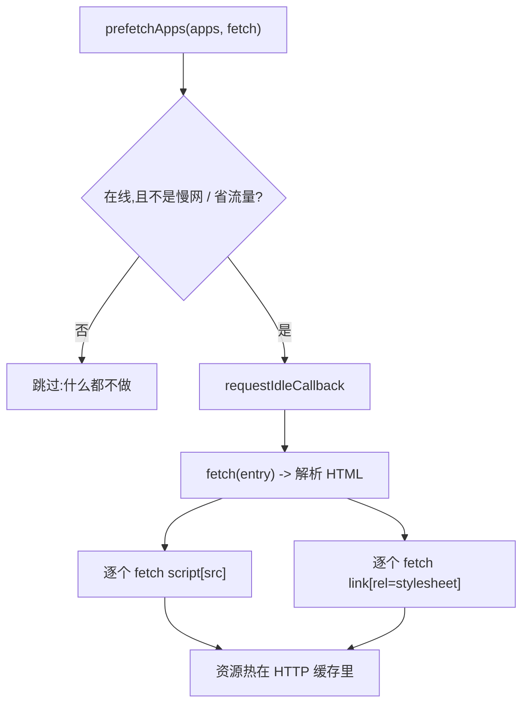

# prefetchApps(已废弃)

`prefetchApps` 会提前把一批微应用的资源塞进浏览器的 HTTP 缓存，好让它们后面加载得快一些。在 qiankun 3.0 里它已经废弃了：流式 HTML 加载器边解析入口边加载，资源本来就是顺带预取的，不再需要这一步。新代码不要再调它。

::: warning 3.0 中已废弃
`prefetchApps` 只是为了兼容旧代码才保留下来。v3 既没有单独的 `prefetch` 导出，也没有 `start()` 层面的预取策略，一切交给流式加载器自动预取——参见[优化加载与预加载](/zh-CN/cookbook/optimize-loading)。
:::

## 函数签名

```ts
function prefetchApps(
  apps: AppMetadata[],
  fetch?: typeof window.fetch,
): void
```

| 参数 | 类型 | 默认值 | 说明 |
| --- | --- | --- | --- |
| `apps` | `AppMetadata[]` | — | 要预热的微应用列表。每一项是 `{ name: string; entry: string }`，其中 `entry` 是 HTML 入口地址。 |
| `fetch` | `typeof window.fetch` | `window.fetch` | 用来请求入口和资源的自定义 fetch。需要带鉴权头或走代理时，传一个装饰过的 fetch 进来。 |

返回 `void`。预取是发出去就不管的：函数把活儿排好队就立刻返回。

`AppMetadata` 是公开 API 里通用的那个结构：

```ts
type AppMetadata = {
  name: string;
  entry: string; // HTML entry URL
};
```

## 为什么废弃

在 qiankun 2.x 里，预取是一等的策略：`start({ prefetch })` 能提前把还没激活的微应用资源下下来，让之后切过去更快。

到了 v3，这个需求在架构层面就被消化掉了：

- 加载器通过 `writable-dom` 流式解析每个 HTML 入口，`<script>`、`<link>` 节点一在流里出现就开始拉取和执行，而不是等整份文档下完。资源在加载过程中就顺带预取了。
- v3 的 `start()` 只接收 single-spa 的 `{ urlRerouteOnly }`——2.x 那些 `prefetch`、`sandbox`、`singular`、`fetch` 和模板选项都没了。框架层面没有预取策略可配。
- 也没有单独导出的 `prefetch` 函数。内部的 `prefetch()` 只是私有工具，对外公开的只有 `prefetchApps`。

所以调 `prefetchApps` 基本没什么必要。开发构建下它会打一条废弃警告：

```text
[qiankun] prefetchApps is deprecated in 3.0; streaming loader performs automatic preload.
```

## 真调了它还会做什么

一旦调用，`prefetchApps` 会遍历 `apps` 数组，给每个入口排一趟预热缓存的活儿。这些活儿都推迟到 `requestIdleCallback` 里做(不支持的浏览器用 `setTimeout` 兜底)，这样绝不会跟前台渲染抢资源。



对每个入口，它会：

1. 先把入口 HTML 抓回来热一遍缓存，再用 `DOMParser` 解析。
2. 收集所有 `script[src]` 和 `link[rel="stylesheet"]`，把每个 URL 相对入口地址解析出来，各自在自己的 `requestIdleCallback` 时间片里 fetch。fetch 报错会被吞掉。

碰上下面这些网络不合适的情况，它会按次静默跳过，什么都不做：

- `navigator.onLine` 为 `false`(离线)，或
- `navigator.connection.saveData` 打开了(省流量模式)，或
- 有效连接类型是慢速蜂窝网络(`2g`/`3g`)，而不是 `wifi`/`ethernet`。

预取只热 HTTP 缓存，不会创建沙箱、不执行脚本、也不挂载任何东西——真正的加载还是要靠后面的 `registerMicroApps`/`loadMicroApp`。

### 示例

```ts
import { prefetchApps } from 'qiankun';

// Legacy usage — prefer relying on the streaming loader instead.
prefetchApps([
  { name: 'react-app', entry: 'https://cdn.example.com/react-app/' },
  { name: 'vue-app', entry: 'https://cdn.example.com/vue-app/' },
]);
```

配一个自定义 fetch(比如给请求带上鉴权头):

```ts
prefetchApps(
  [{ name: 'react-app', entry: 'https://cdn.example.com/react-app/' }],
  (input, init) => fetch(input, { ...init, headers: { Authorization: token } }),
);
```

## PrefetchStrategy 类型

`PrefetchStrategy` 类型出于兼容还留着导出，但 v3 里没有任何公开 API 会用到它——`start()` 不再接 `prefetch` 选项。当它是遗留产物就好。

```ts
type PrefetchStrategy =
  | boolean
  | 'all'
  | string[]
  | ((apps: AppMetadata[]) => { criticalAppNames: string[]; minorAppsName: string[] });
```

## 建议

新应用别再引入 `prefetchApps`。流式加载器在加载微应用时已经顺带把它的资源预取了，再单独热一遍意义不大，还会重复请求。想调优加载性能，看[优化加载与预加载](/zh-CN/cookbook/optimize-loading)，那里讲了流式加载器自动做了哪些事，以及 v3 里还剩下哪些可调的手段。

## 相关阅读

- [start](/zh-CN/api/start) —— v3 只接收 `{ urlRerouteOnly }`，没有 `prefetch` 选项。
- [registerMicroApps](/zh-CN/api/register-micro-apps) —— 加载路由驱动微应用的常规做法。
- [HTML 入口流式加载](/zh-CN/concepts/html-entry-loading) —— 自动预取是怎么运转的。
- [优化加载与预加载](/zh-CN/cookbook/optimize-loading) —— 性能调优指引。
- [从 qiankun 2.x 迁移](/zh-CN/cookbook/migrate-from-2x) —— 替换 2.x 的预取策略。
