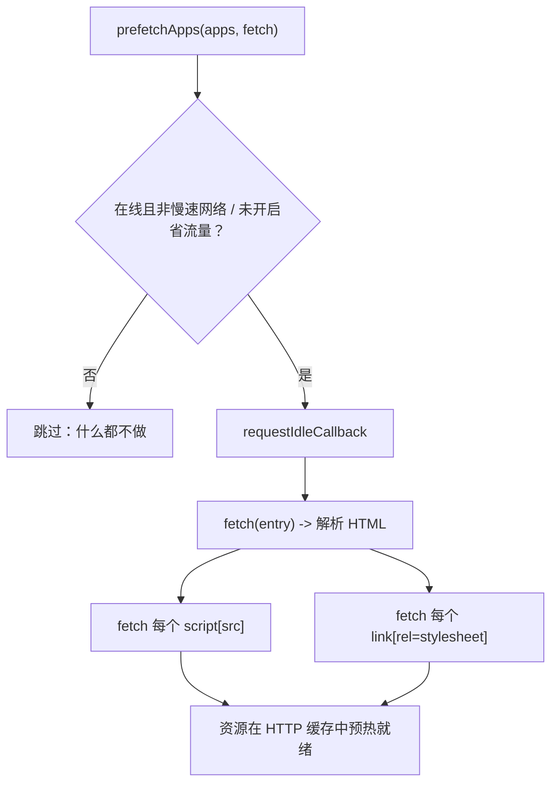

# prefetchApps（已废弃）

`prefetchApps` 会提前为一组微应用预热浏览器的 HTTP 缓存。在 qiankun 3.0 中它已被废弃，因为流式 HTML Entry 加载器在解析每个入口时已经会自动预加载资源。新代码不应再调用它。

::: warning 3.0 中已废弃
`prefetchApps` 仅为向后兼容而保留。v3 中没有独立的 `prefetch` 导出，也没有 `start()` 层面的预取策略。请转而依赖流式加载器的自动预加载 —— 参见[优化加载与预加载](/zh-CN/cookbook/optimize-loading)。
:::

## 签名

```ts
function prefetchApps(
  apps: AppMetadata[],
  fetch?: typeof window.fetch,
): void
```

| 参数 | 类型 | 默认值 | 说明 |
| --- | --- | --- | --- |
| `apps` | `AppMetadata[]` | — | 需要预热的微应用。每一项为 `{ name: string; entry: string }`，其中 `entry` 是 HTML Entry 的 URL。 |
| `fetch` | `typeof window.fetch` | `window.fetch` | 用于请求入口及其资源的自定义 fetch。如需附加鉴权头或走代理，可传入一个装饰过的 fetch。 |

返回 `void`。预取是发起即忘（fire-and-forget）的：该函数只是调度任务并立即返回。

`AppMetadata` 是整个公共 API 通用的结构：

```ts
type AppMetadata = {
  name: string;
  entry: string; // HTML entry URL
};
```

## 为什么废弃

在 qiankun 2.x 中，预取是一等公民策略：`start({ prefetch })` 可以提前下载尚未激活的微应用资源，从而加速后续导航。

v3 在架构层面消除了这一需求：

- 加载器通过 `writable-dom` 流式处理每个 HTML Entry，一旦 `<script>` 和 `<link>` 节点出现在流中就立即开始拉取并执行，而无需等待整个文档就绪。资源实际上是作为加载的副作用被预加载的。
- v3 的 `start()` 只接受 single-spa 的 `{ urlRerouteOnly }` —— 2.x 中的 `prefetch`、`sandbox`、`singular`、`fetch` 以及模板等选项都已移除。没有可供配置的框架级预取策略。
- 不存在独立导出的 `prefetch` 函数。内部的 `prefetch()` 辅助函数是私有的；只有 `prefetchApps` 是公开的。

因此，调用 `prefetchApps` 通常收益甚微。在开发构建中它会打印一条废弃警告：

```text
[qiankun] prefetchApps is deprecated in 3.0; streaming loader performs automatic preload.
```

## 如果调用它仍会做什么

被调用时，`prefetchApps` 会遍历 `apps` 数组，并为每个入口调度一次缓存预热。这些工作会推迟到 `requestIdleCallback`（对不支持它的浏览器提供 `setTimeout` 兜底）中执行，因此绝不会与前台渲染争抢资源。



对每个入口，它会：

1. 拉取入口 HTML 以预热缓存，然后用 `DOMParser` 解析它。
2. 收集所有 `script[src]` 和 `link[rel="stylesheet"]`，将每个 URL 相对入口解析，并在各自的 `requestIdleCallback` tick 中拉取。fetch 错误会被静默吞掉。

当网络不适宜时，它会——静默且逐次调用地——跳过上述全部工作：

- `navigator.onLine` 为 `false`（离线），或
- 设置了 `navigator.connection.saveData`（省流量模式），或
- 有效连接类型是慢速蜂窝类型（`2g`/`3g`），而非 `wifi`/`ethernet`。

预取只会预热 HTTP 缓存。它不会创建沙箱、执行脚本或挂载任何东西 —— 后续的 `registerMicroApps`/`loadMicroApp` 仍会执行真正的加载。

### 示例

```ts
import { prefetchApps } from 'qiankun';

// Legacy usage — prefer relying on the streaming loader instead.
prefetchApps([
  { name: 'react-app', entry: 'https://cdn.example.com/react-app/' },
  { name: 'vue-app', entry: 'https://cdn.example.com/vue-app/' },
]);
```

配合自定义 fetch（例如附加一个鉴权头）：

```ts
prefetchApps(
  [{ name: 'react-app', entry: 'https://cdn.example.com/react-app/' }],
  (input, init) => fetch(input, { ...init, headers: { Authorization: token } }),
);
```

## PrefetchStrategy 类型

`PrefetchStrategy` 类型出于向后兼容仍被导出，但 v3 中没有任何公共 API 会消费它 —— `start()` 不再接受 `prefetch` 选项。请将其视为遗留类型。

```ts
type PrefetchStrategy =
  | boolean
  | 'all'
  | string[]
  | ((apps: AppMetadata[]) => { criticalAppNames: string[]; minorAppsName: string[] });
```

## 建议

不要在新应用中引入 `prefetchApps`。流式加载器在加载微应用时已经会预加载其资源，因此显式的预热过程收益甚微，还会造成重复拉取。如果你需要调优加载性能，请参阅[优化加载与预加载](/zh-CN/cookbook/optimize-loading)手册，其中介绍了流式加载器自动完成的工作以及 v3 中仍可调节的手段。

## 参见

- [start](/zh-CN/api/start) —— v3 只接受 `{ urlRerouteOnly }`；没有 `prefetch` 选项。
- [registerMicroApps](/zh-CN/api/register-micro-apps) —— 加载路由驱动微应用的常规方式。
- [HTML Entry 流式加载](/zh-CN/concepts/html-entry-loading) —— 自动预加载的工作原理。
- [优化加载与预加载](/zh-CN/cookbook/optimize-loading) —— 性能指南。
- [从 qiankun 2.x 迁移](/zh-CN/cookbook/migrate-from-2x) —— 替换 2.x 的预取策略。
