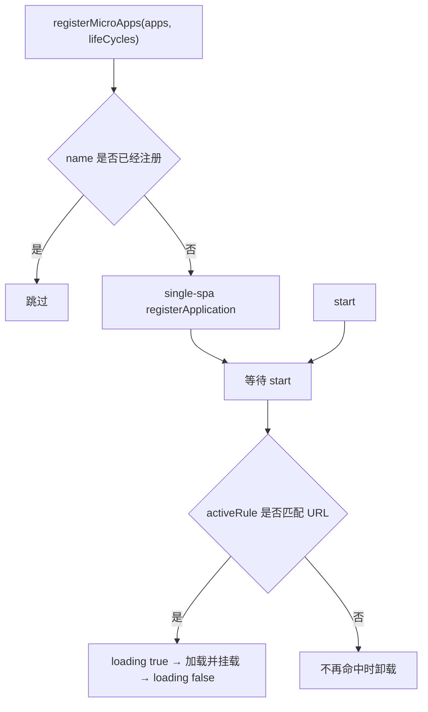

# registerMicroApps

将微应用注册到主应用，并根据路由控制其生命周期。每个应用都需要配置 `activeRule`；URL 匹配该规则时，qiankun 挂载应用，不再匹配时则卸载应用。

这是 [`loadMicroApp`](/zh-CN/api/load-micro-app) 之外的路由驱动方案。仅当应用的挂载状态完全由 URL 决定时才应使用。按需加载、组件嵌入，以及由主应用状态控制的场景，应优先使用 `loadMicroApp`。

## 函数签名

```ts
function registerMicroApps<T extends ObjectType>(
  apps: Array<RegistrableApp<T>>,
  lifeCycles?: LifeCycles<T>,
): void
```

`registerMicroApps` 仅记录应用信息并将其交由 [single-spa](https://single-spa.js.org/) 管理。调用 [start](/zh-CN/api/start) 之前不会加载应用。注册和激活需要分别执行：

```ts
import { registerMicroApps, start } from 'qiankun';

registerMicroApps(apps, lifeCycles);
start();
```

## 参数

| 参数 | 类型 | 必填 | 说明 |
| --- | --- | --- | --- |
| `apps` | `Array<RegistrableApp<T>>` | 是 | 要注册的微应用。字段见 [RegistrableApp 字段](#registrableapp-字段)。 |
| `lifeCycles` | `LifeCycles<T>` | 否 | 全局生命周期钩子，作用于本次调用注册的每一个应用。见[全局生命周期钩子](#全局生命周期钩子)。 |

## RegistrableApp 字段

```ts
type RegistrableApp<T extends ObjectType> = {
  name: string;
  entry: string;                       // HTMLEntry
  container: HTMLElement;
  activeRule: string | ActivityFn | Array<string | ActivityFn>;
  props?: T;
  loader?: (loading: boolean) => void;
  configuration?: AppConfiguration;
};
```

| 字段 | 类型 | 必填 | 说明 |
| --- | --- | --- | --- |
| `name` | `string` | 是 | 路由注册应用的稳定唯一标识。重名应用会被忽略，因此同一应用多次注册时应保持名称一致。该名称通常无需与 `packageName` 或 Webpack 全局库名称相同。见 [`name` 是稳定的唯一标识](#name-是稳定的唯一标识)。 |
| `entry` | `string` | 是 | 微应用 HTML 入口的 URL，例如 `//localhost:7100`。v3 仅支持字符串形式的 HTML 地址，不再支持 2.x 的 `{ scripts, styles }` 对象形式。 |
| `container` | `HTMLElement` | 是 | 用于挂载微应用的实际 DOM 元素，不能使用选择器字符串。可传入框架 ref 对应的节点，或 `document.getElementById(...)` 的返回值。 |
| `activeRule` | `string \| ActivityFn \| Array<string \| ActivityFn>` | 是 | 应用的激活条件，将直接传递给 single-spa 的 `activeWhen`。字符串表示路径前缀；函数 `(location) => boolean` 可自定义匹配逻辑；数组中的任意一项匹配即可激活应用。 |
| `props` | `T` | 否 | 每次调用生命周期（`bootstrap`、`mount`、`unmount`、`update`）时传给微应用的数据。 |
| `loader` | `(loading: boolean) => void` | 否 | 报告加载状态。资源开始加载或应用开始挂载时收到 `true`，挂载完成后收到 `false`。调用方应根据参数值更新当前加载状态，不应根据回调次数推断状态。 |
| `configuration` | `AppConfiguration` | 否 | 单个应用的运行时配置：`sandbox`、`styleIsolation`、`fetch` 等。见 [AppConfiguration](/zh-CN/api/configuration) 和[应用级配置](#应用级配置)。 |

::: info entry 和 container
由于 qiankun 需要跨源获取入口 HTML 及其资源，`entry` 对应的服务器必须返回允许主应用访问的 CORS 响应头。`container` 元素在应用注册后的整个生命周期内都必须保留在页面中。qiankun 会在注册时保存该元素的引用，因此主应用框架不能替换该元素，也不能因 key 变化而重建或卸载该元素。
:::

### 关于 `activeRule`

`activeRule` 对应 single-spa 的 `activeWhen`。最常见的配置方式是使用路径前缀：

```ts
registerMicroApps([
  { name: 'react', entry: '//localhost:7100', container, activeRule: '/react' },
]);
```

路径前缀无法表达匹配条件时，可使用函数或数组：

```ts
registerMicroApps([
  {
    name: 'react',
    entry: '//localhost:7100',
    container,
    // 在 /react 或任意 /shop/* 路由下激活
    activeRule: ['/react', (location) => location.pathname.startsWith('/shop/')],
  },
]);
```

## 全局生命周期钩子

第二个参数对本次调用注册的每个应用生效。每个钩子可以是函数或函数数组，签名为 `(app, global) => Promise<void>`：

```ts
registerMicroApps(apps, {
  beforeLoad:    (app) => { console.log('[lifecycle] before load', app.name); return Promise.resolve(); },
  beforeMount:   (app) => { console.log('[lifecycle] before mount', app.name); return Promise.resolve(); },
  afterMount:    (app) => { console.log('[lifecycle] after mount', app.name); return Promise.resolve(); },
  beforeUnmount: (app) => { console.log('[lifecycle] before unmount', app.name); return Promise.resolve(); },
  afterUnmount:  (app) => { console.log('[lifecycle] after unmount', app.name); return Promise.resolve(); },
});
```

第二个参数 `global` 是经过沙箱隔离的微应用 `window` 视图，即 Proxy 隔离膜，而不是真实的 `window`。这些框架级钩子不同于微应用导出的 `bootstrap`、`mount` 和 `unmount`。完整说明见[生命周期钩子](/zh-CN/api/lifecycles)和[微应用生命周期与 props](/zh-CN/concepts/lifecycle-and-props)。

## 行为

- **按 `name` 去重。** 名称已注册的应用会被忽略，因此多次调用 `registerMicroApps` 注册存在重叠的应用不会产生重复记录。
- **注册到 single-spa。** 每个新应用都会注册为 single-spa 应用，其中 `activeWhen` 对应 `activeRule`，`customProps` 对应 `props`。
- **调用 `start()` 后才会激活。** 内部加载器会等待 [start](/zh-CN/api/start) 调用完成，再加载和挂载应用。仅注册应用不会产生可见变化。
- **`loader` 报告状态，但不保证回调次数。** 加载开始时会收到 `true`，在挂载前可能再次收到 `true`，挂载完成后会收到 `false`。回调应支持重复执行。
- **`lifeCycles` 作用于整次调用。** 第二个参数中的钩子会作用于本次注册的所有应用。



## 示例

以下示例展示完整的主应用接入方式：首先获取实际的 `container` 元素，为每个应用分别设置 `configuration`，最后调用一次 `start()`。

::: code-group

```ts [main/src/register.ts]
import { registerMicroApps, start } from 'qiankun';

export function registerAll(
  container: HTMLElement,
  onLoading: (name: string, loading: boolean) => void,
): void {
  registerMicroApps([
    {
      name: 'react',
      entry: '//localhost:7100',
      container,
      activeRule: '/react',
      loader: (loading) => onLoading('react', loading),
      configuration: { sandbox: { styleIsolation: true } },
    },
    {
      name: 'vue',
      entry: '//localhost:7101',
      container,
      activeRule: '/vue',
      loader: (loading) => onLoading('vue', loading),
      configuration: { sandbox: { styleIsolation: true } },
    },
    {
      // 稳定的路由应用标识，不要求等于 output.library.name
      name: 'webpack-app',
      entry: '//localhost:7102',
      container,
      activeRule: '/webpack',
      loader: (loading) => onLoading('webpack-app', loading),
      configuration: { sandbox: true },
    },
  ]);

  start();
}
```

```tsx [main/src/App.tsx]
import { useEffect, useRef } from 'react';
import { registerAll } from './register';

export default function App() {
  const containerRef = useRef<HTMLDivElement>(null);

  useEffect(() => {
    if (containerRef.current) {
      registerAll(containerRef.current, (name, loading) => {
        console.log(`[${name}] loading: ${loading}`);
      });
    }
    // 仅注册一次；container 不能被卸载或通过 key 重建
  }, []);

  // 这些 activeRule 彼此互斥，因此可以安全共用容器。
  return <div ref={containerRef} id="subapp-stage" />;
}
```

:::

::: tip 只有互斥路由才能共用容器
只有多个路由应用的 `activeRule` 不会同时匹配时，这些应用才能共用一个容器。规则重叠时，多个应用可能并发激活，此时必须使用不同容器。所有已注册容器都应在主应用运行期间保留在 DOM 中。
:::

## 注意事项

### `name` 是稳定的唯一标识

`name` 是 qiankun 和 single-spa 识别路由注册应用的标识，用于注册去重和运行时记录。不同应用不能共用同一名称，同一应用在多次注册时也应保持名称不变。

入口脚本带有正确标记时，qiankun 会从入口执行结果中解析生命周期：ESM 应用读取模块导出，Classic 应用读取入口脚本的导出值。正常解析流程不要求 `name` 与 `packageName` 或 Webpack 的 `output.library.name` 相同。

仅当入口结果中不存在有效的生命周期对象时，qiankun 才会进入兼容分支，并尝试从该应用自身全局对象上的 `global[appName]` 读取生命周期。如需依赖该兼容逻辑，全局变量的属性名必须与 `name` 相同；不应将其作为常规命名约定。完整查找顺序见[微应用生命周期与 props](/zh-CN/concepts/lifecycle-and-props)。

### 应用级配置

v3 不支持通过 `start()` 传入框架级全局配置。`start()` 仅接收 single-spa 的 `{ urlRerouteOnly? }`。原有的全局框架选项，包括 `sandbox`、`styleIsolation` 和自定义 `fetch`，现在必须在 `RegistrableApp.configuration` 中**按应用**设置：

```ts
registerMicroApps([
  {
    name: 'react',
    entry: '//localhost:7100',
    container,
    activeRule: '/react',
    configuration: {
      sandbox: {              // 默认值为 true；启用 Proxy 隔离膜
        styleIsolation: true, // 默认值为 false；启用 CSS @scope 隔离
      },
      // fetch: customFetch,  // 可选；用于请求该应用资源的自定义 fetch
    },
  },
]);
```

每个字段和默认值见 [AppConfiguration](/zh-CN/api/configuration)。

::: warning v3 不支持 2.x 的 start 选项
`prefetch`、`sandbox: { strictStyleIsolation | experimentalStyleIsolation }`、`singular`、`getPublicPath` 和 `getTemplate` 均为 qiankun 2.x 的 `start` 选项，v3 已不再提供。样式隔离改为布尔配置 `sandbox.styleIsolation`，底层基于 CSS `@scope` 实现，不再提供 Shadow DOM 模式。资源预加载由流式加载器自动完成，也不再提供 `prefetch` 策略。见[从 qiankun 2.x 迁移](/zh-CN/cookbook/migrate-from-2x)。
:::

::: info 没有内置的全局状态库
v3 不再提供 `initGlobalState`、`onGlobalStateChange` 和 `setGlobalState`。应用间共享状态时，应通过 `props` 向各应用传递自定义方法或状态容器。见[应用间共享状态与通信](/zh-CN/cookbook/communicate-between-apps)。
:::

## 相关内容

- [start](/zh-CN/api/start)——激活已注册的应用。
- [loadMicroApp](/zh-CN/api/load-micro-app)——按需挂载和管理微应用实例。
- [AppConfiguration](/zh-CN/api/configuration)——单应用的 `sandbox`、`styleIsolation`、`fetch`。
- [生命周期钩子（LifeCycles）](/zh-CN/api/lifecycles)——全局钩子参考。
- [setDefaultMountApp / runAfterFirstMounted](/zh-CN/api/effects)——与默认路由和首次挂载相关的辅助函数。
- [类型参考](/zh-CN/api/types)——`RegistrableApp`、`LoadableApp`、`HTMLEntry`。
