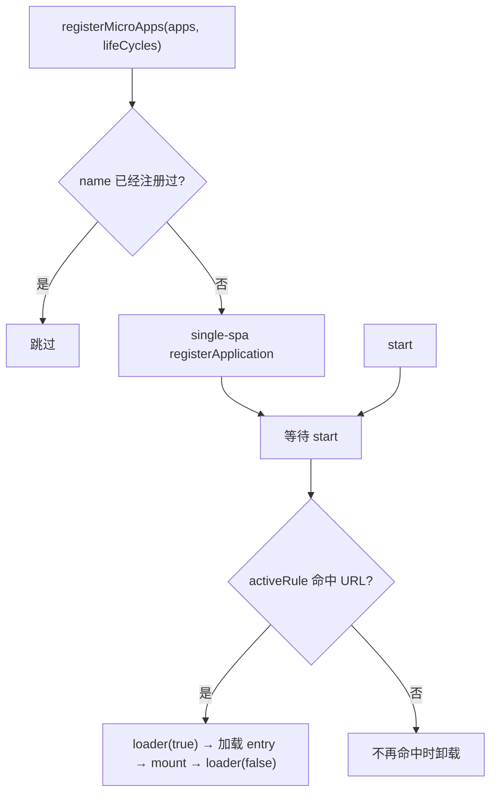

# registerMicroApps

按路由把微应用注册到主应用上。每个注册的应用都绑定一条 `activeRule`,URL 命中时 qiankun 把它挂载起来，不再命中时再卸载掉。v3 里这是接入微应用最主要的方式——如果你想手动、命令式地控制挂载，用 [loadMicroApp](/zh-CN/api/load-micro-app) 而不是它。

## 函数签名

```ts
function registerMicroApps<T extends ObjectType>(
  apps: Array<RegistrableApp<T>>,
  lifeCycles?: LifeCycles<T>,
): void
```

`registerMicroApps` 只是把这些应用记下来，交给 [single-spa](https://single-spa.js.org/) 托管。在你调用 [start](/zh-CN/api/start) 之前，什么都不会加载。注册和激活是分开的两步：

```ts
import { registerMicroApps, start } from 'qiankun';

registerMicroApps(apps, lifeCycles);
start();
```

## 参数

| 参数 | 类型 | 必填 | 说明 |
| --- | --- | --- | --- |
| `apps` | `Array<RegistrableApp<T>>` | 是 | 要注册的微应用。字段见 [RegistrableApp 字段](#registrableapp-字段)。 |
| `lifeCycles` | `LifeCycles<T>` | 否 | 全局生命周期钩子，作用于本次调用注册的每一个应用。见[全局生命周期钩子](#全局生命周期钩子)。 |

## RegistrableApp 字段

```ts
type RegistrableApp<T extends ObjectType> = {
  name: string;
  entry: string;                       // HTMLEntry
  container: HTMLElement;
  activeRule: string | ActivityFn | Array<string | ActivityFn>;
  props?: T;
  loader?: (loading: boolean) => void;
  configuration?: AppConfiguration;
};
```

| 字段 | 类型 | 必填 | 说明 |
| --- | --- | --- | --- |
| `name` | `string` | 是 | 应用的唯一名字。见 [name 必须和子应用导出的全局变量对上](#name-必须和子应用导出的全局变量对上)——它应当和子应用暴露的全局变量／library 名一致。 |
| `entry` | `string` | 是 | 微应用 HTML entry 的 URL，比如 `//localhost:7100`。v3 里 `entry` 永远是一个字符串(HTML 地址),2.x 那种 `{ scripts, styles }` 对象写法已经没了。 |
| `container` | `HTMLElement` | 是 | 微应用挂载进去的 DOM 元素——是一个真实的元素，不是选择器字符串。传一个拿到 ref 的节点，或者 `document.getElementById(...)`。 |
| `activeRule` | `string \| ActivityFn \| Array<string \| ActivityFn>` | 是 | 应用什么时候激活，会原样转发给 single-spa 的 `activeWhen`。字符串是路径前缀；函数 `(location) => boolean` 让你完全掌控；数组则是任意一项命中即激活。 |
| `props` | `T` | 否 | 每次生命周期调用(`bootstrap`／`mount`／`unmount`／`update`)时传给微应用的数据。 |
| `loader` | `(loading: boolean) => void` | 否 | 挂载前立刻以 `true` 调一次、挂载完成后以 `false` 调一次，主应用可以借此驱动一个加载指示。 |
| `configuration` | `AppConfiguration` | 否 | 单个应用的运行时配置：`sandbox`、`styleIsolation`、`fetch` 等。见 [AppConfiguration](/zh-CN/api/configuration) 和[单应用配置是唯一的配置入口](#单应用配置是唯一的配置入口)。 |

::: info entry 和 container
`entry` 必须带上宽松的 CORS 响应头，因为 qiankun 要跨域抓取这份 HTML 及其资源。`container` 元素在整个注册生命周期内必须一直挂在页面上——qiankun 在注册时就把这个元素引用记下来了，所以它不能被宿主框架替换掉、加 key 重建、或者卸载掉。
:::

### 关于 `activeRule`

`activeRule` 就是 single-spa 的 `activeWhen`。最常见的写法是一个路径前缀：

```ts
registerMicroApps([
  { name: 'react', entry: '//localhost:7100', container, activeRule: '/react' },
]);
```

前缀表达不了的场景，就上函数或者数组：

```ts
registerMicroApps([
  {
    name: 'react',
    entry: '//localhost:7100',
    container,
    // active on /react as well as any /shop/* route
    activeRule: ['/react', (location) => location.pathname.startsWith('/shop/')],
  },
]);
```

## 全局生命周期钩子

第二个参数对本次调用注册的每一个应用都生效。每个钩子是一个函数(或函数数组)`(app, global) => Promise<void>`:

```ts
registerMicroApps(apps, {
  beforeLoad:    (app) => { console.log('[lifecycle] before load', app.name); return Promise.resolve(); },
  beforeMount:   (app) => { console.log('[lifecycle] before mount', app.name); return Promise.resolve(); },
  afterMount:    (app) => { console.log('[lifecycle] after mount', app.name); return Promise.resolve(); },
  beforeUnmount: (app) => { console.log('[lifecycle] before unmount', app.name); return Promise.resolve(); },
  afterUnmount:  (app) => { console.log('[lifecycle] after unmount', app.name); return Promise.resolve(); },
});
```

第二个参数 `global` 是微应用那份被沙箱隔离的 `window` 视图(也就是 Proxy 隔离膜)，不是真实的 `window`。这些框架层的钩子，和子应用自己导出的 `bootstrap`／`mount`／`unmount` 是两回事。完整说明见[生命周期钩子](/zh-CN/api/lifecycles)和[微应用生命周期与 props](/zh-CN/concepts/lifecycle-and-props)。

## 行为

- **按 `name` 去重。** 如果某个应用的 `name` 已经注册过了，它会被跳过，所以用两次 `registerMicroApps` 注册有重叠的应用是安全的。
- **注册到 single-spa。** 每个新应用都会变成一个 single-spa application,`activeWhen` 取 `activeRule`、`customProps` 取 `props`。
- **激活要等 `start()`。** 内部加载器会一直等到你调用 [start](/zh-CN/api/start) 才去加载和挂载。光注册不会有任何可见的效果。
- **`loader` 包住挂载过程。** 传了 `loader` 时，每次激活都会在挂载前跑 `loader(true)`、挂载后跑 `loader(false)`。
- **`lifeCycles` 是全局的。** 作为第二个参数传进去的钩子，会对该次调用里的每个应用都执行；除此之外，还有内置的 addon 负责注入 `__POWERED_BY_QIANKUN__` 和 `__INJECTED_PUBLIC_PATH_BY_QIANKUN__`。



## 示例

一套完整的主应用接入：先拿到一个真实的 container 元素，给每个应用配上各自的 `configuration`，最后调一次 `start()`。

::: code-group

```ts [main/src/register.ts]
import { registerMicroApps, start } from 'qiankun';

export function registerAll(
  container: HTMLElement,
  onLoading: (name: string, loading: boolean) => void,
): void {
  registerMicroApps([
    {
      name: 'react',
      entry: '//localhost:7100',
      container,
      activeRule: '/react',
      loader: (loading) => onLoading('react', loading),
      configuration: { sandbox: true, styleIsolation: true },
    },
    {
      name: 'vue',
      entry: '//localhost:7101',
      container,
      activeRule: '/vue',
      loader: (loading) => onLoading('vue', loading),
      configuration: { sandbox: true, styleIsolation: true },
    },
    {
      // registered name matches window['webpack-app'] exposed by the sub-app
      name: 'webpack-app',
      entry: '//localhost:7102',
      container,
      activeRule: '/webpack',
      loader: (loading) => onLoading('webpack-app', loading),
      configuration: { sandbox: true },
    },
  ]);

  start();
}
```

```tsx [main/src/App.tsx]
import { useEffect, useRef } from 'react';
import { registerAll } from './register';

export default function App() {
  const containerRef = useRef<HTMLDivElement>(null);

  useEffect(() => {
    if (containerRef.current) {
      registerAll(containerRef.current, (name, loading) => {
        console.log(`[${name}] loading: ${loading}`);
      });
    }
    // register once; the container must never be unmounted or keyed
  }, []);

  // one shared container element hosts every micro-app
  return <div ref={containerRef} id="subapp-stage" />;
}
```

:::

::: tip 一个容器装多个应用
一个 container 元素就能装下所有路由驱动的应用，因为同一时刻只有一个应用是激活的。路由变化时，qiankun 会清空容器再重新填充。不管你传的是哪个元素，它都得在整个会话期间一直留在 DOM 里。
:::

## 注意事项与坑

### `name` 必须和子应用导出的全局变量对上

qiankun 是从子应用暴露的全局变量(或 library)里找到它的生命周期函数的。对经典打包(UMD／window 库)的应用来说，注册用的 `name` 必须等于子应用写到 `window` 上的那个 key——比如某个子应用设置了 `window['webpack-app'] = { bootstrap, mount, unmount }`(或者某个 Webpack 构建的 `output.library.name` 是 `webpack-app`)，就必须注册成 `name: 'webpack-app'`。名字和暴露的全局变量对不上，qiankun 就找不到生命周期，会抛出 `QiankunError`。

ESM 子应用是用原生 `export` 暴露生命周期的，所以名字在那边没那么关键，但仍然建议让 `name` 和应用本身的标识保持一致。完整的生命周期查找顺序见[微应用生命周期与 props](/zh-CN/concepts/lifecycle-and-props)。

### 单应用配置是唯一的配置入口

v3 里没有通过 `start()` 注入的框架级全局配置。`start()` 只接收 single-spa 的 `{ urlRerouteOnly? }`。过去那些作为全局框架选项存在的东西——`sandbox`、`styleIsolation`、自定义 `fetch`——现在一律**按应用**在 `RegistrableApp.configuration` 里设置：

```ts
registerMicroApps([
  {
    name: 'react',
    entry: '//localhost:7100',
    container,
    activeRule: '/react',
    configuration: {
      sandbox: true,          // default true; Proxy-membrane JS isolation
      styleIsolation: true,   // default false; CSS @scope isolation
      // fetch: customFetch,  // optional custom fetch for this app's assets
    },
  },
]);
```

每个字段和默认值见 [AppConfiguration](/zh-CN/api/configuration)。

::: warning 没有 2.x 的 start 选项
`prefetch`、`sandbox: { strictStyleIsolation | experimentalStyleIsolation }`、`singular`、`getPublicPath`、`getTemplate` 这些都是 qiankun 2.x 的 `start` 选项，v3 里它们都不存在了。样式隔离就是一个布尔值 `styleIsolation`，底层用 CSS `@scope` 实现——没有 Shadow DOM 模式。预加载由流式加载器自动完成，所以也没有 `prefetch` 策略可配。见[从 qiankun 2.x 迁移](/zh-CN/cookbook/migrate-from-2x)。
:::

::: info 没有内置的全局状态库
v3 不再自带 `initGlobalState` / `onGlobalStateChange` / `setGlobalState`。要共享状态，就把你自己的方法或者 store 通过 `props` 传给每个应用。见[跨应用共享状态与通信](/zh-CN/cookbook/communicate-between-apps)。
:::

## 参见

- [start](/zh-CN/api/start) —— 激活已注册的应用
- [loadMicroApp](/zh-CN/api/load-micro-app) —— 命令式地挂载应用，而不是按路由
- [AppConfiguration](/zh-CN/api/configuration) —— 单应用的 `sandbox`、`styleIsolation`、`fetch`
- [生命周期钩子(LifeCycles)](/zh-CN/api/lifecycles) —— 全局钩子参考
- [setDefaultMountApp / runAfterFirstMounted](/zh-CN/api/effects) —— 路由／首次挂载相关的副作用
- [类型参考](/zh-CN/api/types) —— `RegistrableApp`、`LoadableApp`、`HTMLEntry`
