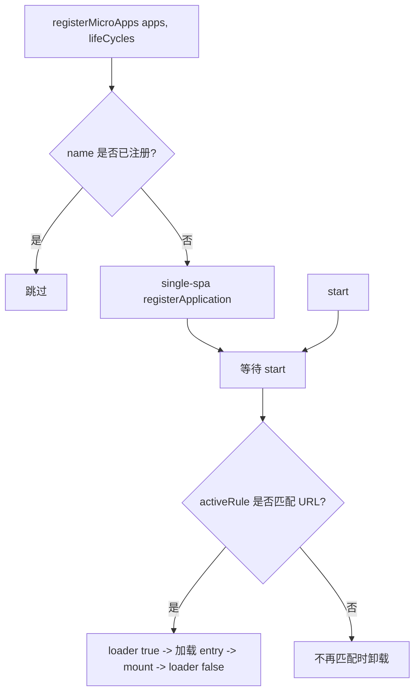

# registerMicroApps

将由路由驱动的微应用注册到主应用上。每个注册的应用都会绑定一个 `activeRule`；当 URL 匹配时 qiankun 挂载它，不再匹配时则卸载它。这是在 v3 中接入微应用的主要方式——如果需要命令式、手动控制的挂载，请改用 [loadMicroApp](/zh-CN/api/load-micro-app)。

## 函数签名

```ts
function registerMicroApps<T extends ObjectType>(
  apps: Array<RegistrableApp<T>>,
  lifeCycles?: LifeCycles<T>,
): void
```

`registerMicroApps` 只是记录这些应用并将它们交给 [single-spa](https://single-spa.js.org/)。在你调用 [start](/zh-CN/api/start) 之前不会加载任何内容。注册与激活是两个独立的步骤：

```ts
import { registerMicroApps, start } from 'qiankun';

registerMicroApps(apps, lifeCycles);
start();
```

## 参数

| 参数 | 类型 | 是否必填 | 说明 |
| --- | --- | --- | --- |
| `apps` | `Array<RegistrableApp<T>>` | 是 | 要注册的微应用。参见 [RegistrableApp 字段](#registrableapp-字段)。 |
| `lifeCycles` | `LifeCycles<T>` | 否 | 应用于本次调用中每个应用的全局生命周期钩子。参见 [全局生命周期钩子](#全局生命周期钩子)。 |

## RegistrableApp 字段

```ts
type RegistrableApp<T extends ObjectType> = {
  name: string;
  entry: string;                       // HTMLEntry
  container: HTMLElement;
  activeRule: string | ActivityFn | Array<string | ActivityFn>;
  props?: T;
  loader?: (loading: boolean) => void;
  configuration?: AppConfiguration;
};
```

| 字段 | 类型 | 是否必填 | 说明 |
| --- | --- | --- | --- |
| `name` | `string` | 是 | 应用的唯一名称。参见 [name 匹配说明](#name-必须与子应用导出的全局变量匹配)——它应当与子应用暴露的全局变量/库名一致。 |
| `entry` | `string` | 是 | 微应用 HTML entry 的 URL，例如 `//localhost:7100`。在 v3 中 `entry` 始终是一个字符串（HTML URL）——2.x 的对象形式 `{ scripts, styles }` 已不复存在。 |
| `container` | `HTMLElement` | 是 | 微应用挂载进入的 DOM 元素——是一个真实的元素，而不是选择器字符串。请传入一个带 ref 的节点或 `document.getElementById(...)`。 |
| `activeRule` | `string \| ActivityFn \| Array<string \| ActivityFn>` | 是 | 应用何时处于激活状态。会转发给 single-spa 的 `activeWhen`。字符串表示路径前缀；函数 `(location) => boolean` 提供完全的控制；数组则在任一项匹配时匹配。 |
| `props` | `T` | 否 | 在每次生命周期调用（`bootstrap`/`mount`/`unmount`/`update`）时传递给微应用的数据。 |
| `loader` | `(loading: boolean) => void` | 否 | 在应用挂载前立即以 `true` 调用，挂载完成后以 `false` 调用，以便主应用驱动一个加载指示器。 |
| `configuration` | `AppConfiguration` | 否 | 每个应用独立的运行时配置：`sandbox`、`styleIsolation`、`fetch` 等。参见 [AppConfiguration](/zh-CN/api/configuration) 以及 [每应用配置说明](#每应用-configuration-是唯一的配置注入点)。 |

::: info entry 与 container
`entry` 必须以宽松的 CORS 头提供服务，因为 qiankun 会跨域获取该 HTML 及其资源。`container` 元素必须在整个注册生命周期内保持挂载状态——qiankun 在注册时就捕获了该元素引用，因此它不能被宿主框架替换、加 key 或卸载。
:::

### `activeRule`

`activeRule` 就是 single-spa 的 `activeWhen`。最常见的形式是路径前缀：

```ts
registerMicroApps([
  { name: 'react', entry: '//localhost:7100', container, activeRule: '/react' },
]);
```

对于前缀无法表达的场景，可使用函数或数组：

```ts
registerMicroApps([
  {
    name: 'react',
    entry: '//localhost:7100',
    container,
    // active on /react as well as any /shop/* route
    activeRule: ['/react', (location) => location.pathname.startsWith('/shop/')],
  },
]);
```

## 全局生命周期钩子

第二个参数会应用于本次调用中注册的每个应用。每个钩子都是一个函数（或函数数组）`(app, global) => Promise<void>`：

```ts
registerMicroApps(apps, {
  beforeLoad:    (app) => { console.log('[lifecycle] before load', app.name); return Promise.resolve(); },
  beforeMount:   (app) => { console.log('[lifecycle] before mount', app.name); return Promise.resolve(); },
  afterMount:    (app) => { console.log('[lifecycle] after mount', app.name); return Promise.resolve(); },
  beforeUnmount: (app) => { console.log('[lifecycle] before unmount', app.name); return Promise.resolve(); },
  afterUnmount:  (app) => { console.log('[lifecycle] after unmount', app.name); return Promise.resolve(); },
});
```

第二个参数 `global` 是微应用被沙箱隔离后的 `window` 视图（即 Proxy 膜），而不是真实的 `window`。这些框架层级的钩子与子应用自身导出的 `bootstrap`/`mount`/`unmount` 函数是不同的。完整参考请参见 [生命周期钩子](/zh-CN/api/lifecycles) 与 [微应用生命周期与 props](/zh-CN/concepts/lifecycle-and-props)。

## 行为

- **按 `name` 去重。** 若某个应用的 `name` 已被注册，则会被跳过，因此用有重叠的应用两次调用 `registerMicroApps` 是安全的。
- **注册到 single-spa。** 每个新应用都会成为一个 single-spa application，其 `activeWhen: activeRule`、`customProps: props`。
- **激活等待 `start()`。** 内部加载器会一直等到你调用 [start](/zh-CN/api/start) 之后才加载并挂载任何内容。仅注册不会产生任何可见效果。
- **`loader` 包裹挂载。** 当提供了 `loader` 时，`loader(true)` 在挂载前运行、`loader(false)` 在挂载后运行，每次激活都是如此。
- **`lifeCycles` 是全局的。** 作为第二个参数传入的钩子会为该次调用中的每个应用运行，此外还会附加内置的 addon 来注入 `__POWERED_BY_QIANKUN__` 与 `__INJECTED_PUBLIC_PATH_BY_QIANKUN__`。



## 示例

一个完整的主应用配置：先获取一个真实的 container 元素，再用各自的 `configuration` 注册每个应用，最后调用一次 `start()`。

::: code-group

```ts [main/src/register.ts]
import { registerMicroApps, start } from 'qiankun';

export function registerAll(
  container: HTMLElement,
  onLoading: (name: string, loading: boolean) => void,
): void {
  registerMicroApps([
    {
      name: 'react',
      entry: '//localhost:7100',
      container,
      activeRule: '/react',
      loader: (loading) => onLoading('react', loading),
      configuration: { sandbox: true, styleIsolation: true },
    },
    {
      name: 'vue',
      entry: '//localhost:7101',
      container,
      activeRule: '/vue',
      loader: (loading) => onLoading('vue', loading),
      configuration: { sandbox: true, styleIsolation: true },
    },
    {
      // registered name matches window['webpack-app'] exposed by the sub-app
      name: 'webpack-app',
      entry: '//localhost:7102',
      container,
      activeRule: '/webpack',
      loader: (loading) => onLoading('webpack-app', loading),
      configuration: { sandbox: true },
    },
  ]);

  start();
}
```

```tsx [main/src/App.tsx]
import { useEffect, useRef } from 'react';
import { registerAll } from './register';

export default function App() {
  const containerRef = useRef<HTMLDivElement>(null);

  useEffect(() => {
    if (containerRef.current) {
      registerAll(containerRef.current, (name, loading) => {
        console.log(`[${name}] loading: ${loading}`);
      });
    }
    // register once; the container must never be unmounted or keyed
  }, []);

  // one shared container element hosts every micro-app
  return <div ref={containerRef} id="subapp-stage" />;
}
```

:::

::: tip 一个容器承载多个应用
一个 container 元素就可以承载所有由路由驱动的应用，因为同一时刻只有一个应用处于激活状态。qiankun 会随着路由变化清空并重新填充该容器。无论你传入什么，该元素都必须在整个会话期间保留在 DOM 中。
:::

## 说明与注意事项

### `name` 必须与子应用导出的全局变量匹配

qiankun 通过子应用暴露的全局变量（或库）来发现其生命周期函数。对于经典（UMD / window 库）应用，注册时的 `name` 必须等于子应用写入 `window` 的键——例如某个子应用设置了 `window['webpack-app'] = { bootstrap, mount, unmount }`（或某个 Webpack 构建的 `output.library.name` 为 `webpack-app`），就必须以 `name: 'webpack-app'` 注册。如果名称与所暴露的全局变量不匹配，qiankun 将无法找到生命周期函数并抛出 `QiankunError`。

ESM 子应用以原生 `export` 的形式暴露其生命周期，因此名称在那里没有那么关键，但仍建议让 `name` 与应用的标识保持一致。完整的生命周期发现顺序请参见 [微应用生命周期与 props](/zh-CN/concepts/lifecycle-and-props)。

### 每应用 `configuration` 是唯一的配置注入点

在 v3 中不存在通过 `start()` 注入的框架级全局配置。`start()` 只接受 single-spa 的 `{ urlRerouteOnly? }`。所有过去作为全局框架选项存在的东西——`sandbox`、`styleIsolation`、自定义 `fetch`——现在都改为**按应用**通过 `RegistrableApp.configuration` 设置：

```ts
registerMicroApps([
  {
    name: 'react',
    entry: '//localhost:7100',
    container,
    activeRule: '/react',
    configuration: {
      sandbox: true,          // default true; Proxy-membrane JS isolation
      styleIsolation: true,   // default false; CSS @scope isolation
      // fetch: customFetch,  // optional custom fetch for this app's assets
    },
  },
]);
```

每个字段及其默认值请参见 [AppConfiguration](/zh-CN/api/configuration)。

::: warning 不再有 2.x 的 start 选项
诸如 `prefetch`、`sandbox: { strictStyleIsolation | experimentalStyleIsolation }`、`singular`、`getPublicPath`、`getTemplate` 等选项都是 qiankun 2.x 的 `start` 选项。它们在 v3 中已不存在。样式隔离是一个用 CSS `@scope` 实现的布尔值 `styleIsolation`——不存在 Shadow DOM 模式。预加载由流式加载器自动完成，因此没有可配置的 `prefetch` 策略。参见 [从 qiankun 2.x 迁移](/zh-CN/cookbook/migrate-from-2x)。
:::

::: info 没有内置的全局状态存储
v3 不再提供 `initGlobalState` / `onGlobalStateChange` / `setGlobalState`。要共享状态，请通过 `props` 将你自己的方法或 store 传入每个应用。参见 [跨应用共享状态与通信](/zh-CN/cookbook/communicate-between-apps)。
:::

## 参见

- [start](/zh-CN/api/start) —— 激活已注册的应用
- [loadMicroApp](/zh-CN/api/load-micro-app) —— 以命令式而非路由方式挂载应用
- [AppConfiguration](/zh-CN/api/configuration) —— 每应用的 `sandbox`、`styleIsolation`、`fetch`
- [生命周期钩子（LifeCycles）](/zh-CN/api/lifecycles) —— 全局钩子参考
- [setDefaultMountApp / runAfterFirstMounted](/zh-CN/api/effects) —— 路由/首次挂载副作用
- [类型参考](/zh-CN/api/types) —— `RegistrableApp`、`LoadableApp`、`HTMLEntry`
