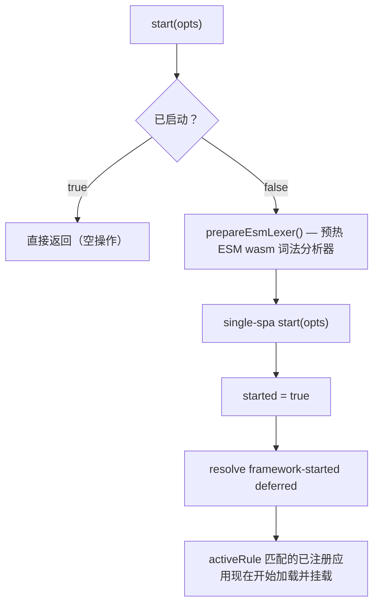

# start

启动 qiankun 运行时，并将控制权交给 single-spa 的路由。在通过 [registerMicroApps](/zh-CN/api/register-micro-apps) 注册完微应用之后，调用一次 `start()`，single-spa 便会开始将当前 URL 与每个应用的 `activeRule` 进行匹配，并挂载匹配成功的应用。

## 签名

```ts
function start(opts?: StartOpts): void
```

`StartOpts` 是 single-spa 自带的类型。在 qiankun v3 中它仅暴露一个字段：

| 选项 | 类型 | 默认值 | 说明 |
| --- | --- | --- | --- |
| `urlRerouteOnly` | `boolean` | `false` | 直接透传给 single-spa。当设为 `true` 时，single-spa 仅在 URL 实际发生变化时才重新路由，因此不会改变 URL 的 `history.pushState` / `history.replaceState` 调用不会触发重新路由。参见 [single-spa API 文档](https://single-spa.js.org/docs/api#start)。 |

```ts
import { registerMicroApps, start } from 'qiankun';

registerMicroApps([
  /* ... */
]);

start();
```

## 它做了什么

`start()` 会按顺序完成四件事，并且只在首次调用时执行：



1. 通过 `prepareEsmLexer()` 预热 ESM 沙箱的 WebAssembly 词法分析器，使首个加载的微应用无需承担一次性的实例化开销。transpiler 管线稍后会再次 await 同一个词法分析器作为兜底保障，因此这一步纯粹是一种优化。
2. 调用 single-spa 的 `start(opts)`，原封不动地转发你的 `opts`。
3. 将内部 `started` 标志置为 `true`。
4. resolve 内部的 framework-started deferred。每个通过 `registerMicroApps` 注册的应用在加载前都会阻塞于该 deferred，因此 resolve 它会释放所有匹配的应用，使其开始加载和挂载。

::: tip 幂等
`start()` 受内部 `started` 标志保护。多次调用是安全的，首次调用之后再次调用不会有任何效果。重复调用也绝不会抛出异常。
:::

## `loadMicroApp` 会为你启动框架

如果你使用 [loadMicroApp](/zh-CN/api/load-micro-app) 进行手动、命令式的挂载，则无需自己调用 `start()`。当框架尚未启动时，`loadMicroApp` 会自动调用 `start()`，以便主应用的 `pushState` / `replaceState` 导航能够通过 single-spa 正确地派发 `popstate`。

在常见的路由驱动方案中，应用通过 `registerMicroApps` 接入并基于 URL 挂载，此时你仍需显式调用 `start()`。

## v3 中移除的 2.x 选项

::: warning 相对 qiankun 2.x 的破坏性变更
在 qiankun 2.x 中，`start()` 接受一个庞大的配置对象。在 v3 中唯一被接受的字段是 single-spa 的 `urlRerouteOnly`。下列 2.x 选项**已不存在**——它们在源码中被注释掉，传入它们不会有任何效果：

`prefetch`、`sandbox`、`singular`、`fetch`、`getPublicPath`、`getTemplate`、`excludeAssetFilter`。

这些行为现在归属于：

| 2.x `start` 选项 | v3 替代方案 |
| --- | --- |
| `prefetch` | 流式 HTML Entry 加载器会自动预加载资源。参见 [优化加载与预加载](/zh-CN/cookbook/optimize-loading)。旧版 [prefetchApps](/zh-CN/api/prefetch-apps) API 已废弃。 |
| `sandbox`（布尔值或 `{ strictStyleIsolation, experimentalStyleIsolation }`） | 改为 [AppConfiguration](/zh-CN/api/configuration) 中的每应用级 `sandbox`（布尔值）与 `styleIsolation`（布尔值，基于 CSS `@scope`）。 |
| `singular` | 不再全局配置。每个容器均支持多实例——参见 [运行多个微应用实例](/zh-CN/cookbook/run-multiple-instances)。 |
| `fetch` | 改为 [AppConfiguration](/zh-CN/api/configuration) 中的每应用级 `fetch`。 |
| `getPublicPath`、`getTemplate`、`excludeAssetFilter` | 已移除。HTML Entry 加载器以及每应用级的 `nodeTransformer` / `streamTransformer` 覆盖了这些场景。 |

完整的迁移路径参见 [从 qiankun 2.x 迁移](/zh-CN/cookbook/migrate-from-2x)。
:::

## 参见

- [registerMicroApps](/zh-CN/api/register-micro-apps) —— 在调用 `start()` 之前注册路由驱动的应用。
- [loadMicroApp](/zh-CN/api/load-micro-app) —— 命令式挂载，会自动启动框架。
- [AppConfiguration](/zh-CN/api/configuration) —— 每应用级的 `sandbox`、`styleIsolation`、`fetch` 以及 transformer 选项。
- [ESM 沙箱](/zh-CN/concepts/esm-sandbox) —— 预热的 wasm 词法分析器的用途所在。
