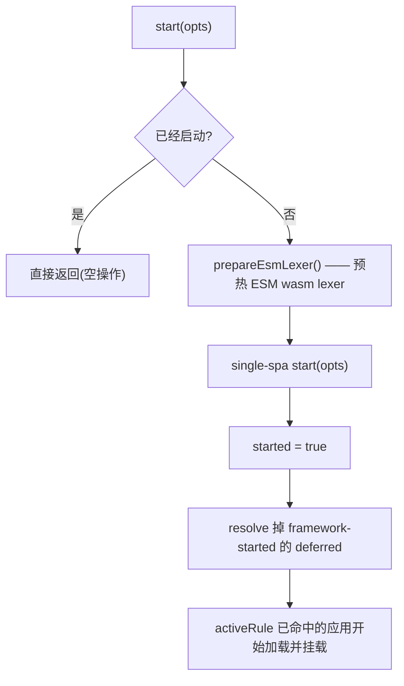

# start

启动 qiankun 运行时，把路由的控制权交给 single-spa。在用 [registerMicroApps](/zh-CN/api/register-micro-apps) 注册完微应用之后，调用一次 `start()`,single-spa 就会开始拿当前 URL 去匹配每个应用的 `activeRule`，把命中的那些挂载起来。

## 签名

```ts
function start(opts?: StartOpts): void
```

`StartOpts` 是 single-spa 自己的类型。到了 qiankun v3，它只剩下一个字段：

| 选项 | 类型 | 默认值 | 说明 |
| --- | --- | --- | --- |
| `urlRerouteOnly` | `boolean` | `false` | 原样透传给 single-spa。设为 `true` 时，single-spa 只在 URL 真的变了才重新路由，那些没改变 URL 的 `history.pushState` / `history.replaceState` 调用就不会触发重新路由。见 [single-spa API 文档](https://single-spa.js.org/docs/api#start)。 |

```ts
import { registerMicroApps, start } from 'qiankun';

registerMicroApps([
  /* ... */
]);

start();
```

## 它做了什么

`start()` 按顺序做四件事，而且只在第一次调用时做：



1. 通过 `prepareEsmLexer()` 预热 ESM 沙箱的 WebAssembly lexer，这样第一个加载的微应用就不用扛那次一次性的实例化开销。transpiler 流水线后面还会再 await 同一个 lexer 兜底，所以这一步纯粹是优化。
2. 调用 single-spa 的 `start(opts)`，把你的 `opts` 原样转发过去。
3. 把内部的 `started` 标志置为 `true`。
4. resolve 掉内部那个 framework-started 的 deferred。每个通过 `registerMicroApps` 注册的应用，在加载前都卡在这个 deferred 上，把它 resolve 掉，所有命中的应用才被放行，开始加载和挂载。

::: tip 幂等
`start()` 由内部的 `started` 标志把守。重复调用是安全的，第一次之后再怎么调都不做事，也不会抛错。
:::

## `loadMicroApp` 会替你把框架启动起来

如果你用 [loadMicroApp](/zh-CN/api/load-micro-app) 做手动、命令式的挂载，就不用自己去调 `start()`。框架还没启动时，`loadMicroApp` 会自动帮你调一次 `start()`，好让主应用的 `pushState` / `replaceState` 导航能正确地经由 single-spa 派发出 `popstate`。

在常见的路由驱动写法里——用 `registerMicroApps` 接线、按 URL 挂载——你还是得自己显式地调 `start()`。

## 2.x 里那些在 v3 被移除的选项

::: warning 来自 qiankun 2.x 的破坏性变更
在 qiankun 2.x 里，`start()` 接收一个很大的配置对象。到了 v3，唯一还认的字段就是 single-spa 的 `urlRerouteOnly`。下面这些 2.x 选项**已经不存在了**——它们在源码里被注释掉，传进去也没有任何效果：

`prefetch`、`sandbox`、`singular`、`fetch`、`getPublicPath`、`getTemplate`、`excludeAssetFilter`。

对应的行为现在都搬到了别处：

| 2.x 的 `start` 选项 | v3 里的替代 |
| --- | --- |
| `prefetch` | 流式 HTML Entry 加载器会自动预加载资源。见[优化加载与预加载](/zh-CN/cookbook/optimize-loading)。旧的 [prefetchApps](/zh-CN/api/prefetch-apps) API 已废弃。 |
| `sandbox`(布尔值，或 `{ strictStyleIsolation, experimentalStyleIsolation }`) | 改成每个应用各自配的 `sandbox`(布尔值)和 `styleIsolation`(布尔值，基于 CSS `@scope`)，见 [AppConfiguration](/zh-CN/api/configuration)。 |
| `singular` | 不再有全局配置。每个容器都支持挂多个实例——见[运行多个微应用实例](/zh-CN/cookbook/run-multiple-instances)。 |
| `fetch` | 改成每个应用各自配的 `fetch`，见 [AppConfiguration](/zh-CN/api/configuration)。 |
| `getPublicPath`、`getTemplate`、`excludeAssetFilter` | 已移除。HTML Entry 加载器，加上每个应用各自的 `nodeTransformer` / `streamTransformer`，已经把这些场景都覆盖了。 |

完整的迁移路径见[从 qiankun 2.x 迁移](/zh-CN/cookbook/migrate-from-2x)。
:::

## 参见

- [registerMicroApps](/zh-CN/api/register-micro-apps) —— 在调 `start()` 之前注册路由驱动的应用。
- [loadMicroApp](/zh-CN/api/load-micro-app) —— 命令式挂载，会自动启动框架。
- [AppConfiguration](/zh-CN/api/configuration) —— 每个应用各自的 `sandbox`、`styleIsolation`、`fetch` 和 transformer 选项。
- [ESM 沙箱](/zh-CN/concepts/esm-sandbox) —— 预热的那个 wasm lexer 到底是干什么用的。
