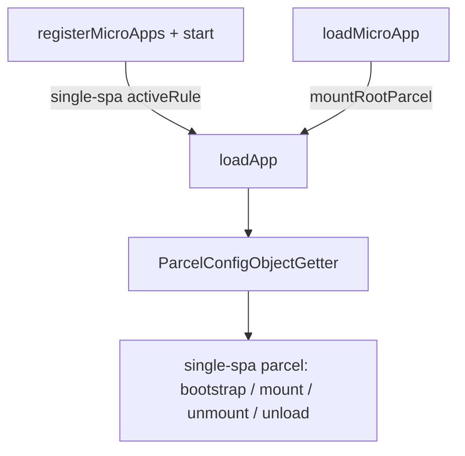
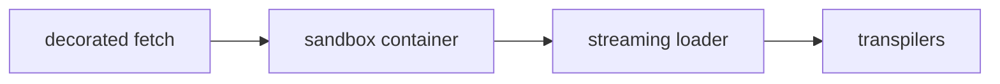
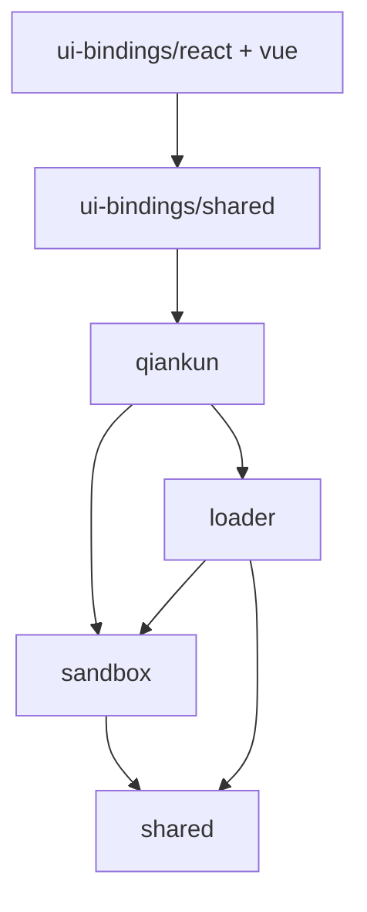

# 架构总览

本页讲解 qiankun v3 端到端加载并运行一个微应用的完整过程：编排层、单应用流水线、两条脚本执行路径，以及内部各 package 如何协作。这是背景性阅读——使用 qiankun 完全用不到这些内容，但当你调试一次加载、一次 mount 或某个沙箱副作用时，它能让公共 API 的行为变得可预期。

## 全局视角

把 HTML entry 变成一个正在运行、且已被沙箱隔离的微应用，这一切都发生在同一个编排器里：`loadApp`（`packages/qiankun/src/core/loadApp.ts`）。它只执行一次加载工作，并返回一个工厂函数，该函数会生成一份绑定到 single-spa mount/unmount 流程的 [single-spa](https://single-spa.js.org/) parcel 配置。

进入这个编排器有两条途径，二者的差异仅在于「由谁决定一个应用何时被激活」：

- **路由驱动** —— [`registerMicroApps`](/zh-CN/api/register-micro-apps) 会以 `activeRule` 为条件将每个应用注册到 single-spa，然后 [`start`](/zh-CN/api/start) 启动路由。single-spa 会随着 URL 变化激活或停用应用；你无需自己调用 mount。
- **命令式** —— [`loadMicroApp`](/zh-CN/api/load-micro-app) 会立即把一个应用挂载到你提供的容器中，并返回一个 `MicroApp` 句柄（一个 single-spa parcel），其上的 `mount` 与 `unmount` 由你手动驱动。



两条途径最终都汇聚到 `loadApp`，因此无论你以哪种方式启动应用，下文的单应用流水线都是完全相同的。

## 单应用流水线

对每个微应用，`loadApp` 会按顺序串联四个阶段。每个阶段分别由一个不同的内部 package 负责。



### 1. 装饰后的 fetch

你在 [`AppConfiguration`](/zh-CN/api/configuration) 中传入的 `fetch`（默认为 `window.fetch`）会被 `@qiankunjs/shared` 中的三个装饰器包裹：

```ts
const enhancedFetch = makeFetchCacheable(makeFetchRetryable(makeFetchThrowable(fetch)));
```

从内往外理解：`makeFetchThrowable` 会把非 2xx 响应转成抛出的错误，`makeFetchRetryable` 会对瞬时失败进行重试，而最外层的 `makeFetchCacheable` 负责去重与缓存。这个统一的 `enhancedFetch` 会在应用触碰网络的所有地方被复用——entry HTML 的抓取、沙箱、ESM 引擎，以及重新挂载时对去脚本化 HTML 的重新加载——因此每一次请求都能享受到相同的缓存与重试行为。

### 2. 沙箱容器

当 `sandbox` 为 `true`（默认值）时，`createSandboxContainer`（`packages/sandbox`）会为 `window` 与 `document` 构建一层 Proxy 膜视图。随后 `loadApp` 会让应用运行在 `sandboxInstance.globalThis`（被代理的 window）之上，而非真实的全局对象，从而使应用读写的是它自己隔离出来的一套全局变量。关于膜的工作原理，以及 patcher 如何在 unmount 时清理副作用，参见 [JS 沙箱](/zh-CN/concepts/js-sandbox)。

该容器还会构造 ESM 引擎（详见下文）——这个引擎只存在于 `if (sandbox)` 分支内，因此关闭沙箱也会一并禁用原生 ESM 执行。

### 3. 流式 loader

`loadEntry(entry, container, opts)`（`packages/loader`）会抓取 entry HTML，并将其——以真正的 `ReadableStream` 形式而非缓冲后的字符串——依次流经解码、可选的 `streamTransformer`、head 虚拟化（`<head>` → `<qiankun-head>`，以便沙箱能把它当作一个虚拟 head 来处理），最后交给 `writable-dom`，由它随着字节到达而增量地把节点提交到活动 DOM。参见 [HTML Entry 流式加载](/zh-CN/concepts/html-entry-loading)。

### 4. transpiler

在任何 script、link 或 style 节点进入活动 DOM 之前，loader 都会先让它经过一个 `nodeTransformer`。默认实现会调用 `transpileAssets`（`packages/shared/src/assets-transpilers`）对每个节点进行改写：classic 脚本会被包裹并指向一个作用域绑定到沙箱的 blob URL，module 脚本会被打上标记并路由到 ESM 引擎，而当启用 [样式隔离](/zh-CN/concepts/style-isolation) 时，style 与 link 会被改写以适配 CSS `@scope`。

## 两条执行路径

一个脚本走哪条路径，是逐节点根据其类型来决定的，同一份 HTML entry 中两者可以混用。

| | Classic | ESM |
| --- | --- | --- |
| 触发条件 | `<script entry>`（UMD/全局） | `<script type="module">` |
| 执行方式 | 源码被包裹并通过一个作用域绑定到膜的 blob URL 运行 | `EsmSandboxEngine` 抓取、经 lexer 改写并求值各模块 |
| 应用导出 | `sandbox.latestSetProp` —— entry 脚本最后赋值的那个全局变量 | entry 模块的 `export`（或 `export default { … }`） |

**Classic** 脚本沿用的是 qiankun 2.x 的 UMD/全局模型。entry 脚本的源码会被包裹，并通过一个作用域绑定到沙箱膜的 blob URL 执行；qiankun 从 `sandbox.latestSetProp`（即脚本最后设置的那个全局变量）读取应用的 lifecycle 对象。

**ESM** 脚本（`<script type="module">`）由 `EsmSandboxEngine`（`packages/shared/src/esm-sandbox`）处理。模块会经由增强后的 fetch 抓取，用一个 WASM lexer 改写，使其对全局变量的读写都路由到膜上，再通过一个动态注入的 `<script type="importmap">` 赋予合成的 specifier，并按文档顺序求值。原生 ESM loader 仍然掌管实例化与求值，因此 top-level `await`、循环依赖以及 live binding 都得以保留。正是这条路径让一个未打包的 Vite dev server 能够在沙箱下工作。参见 [ESM 沙箱](/zh-CN/concepts/esm-sandbox)。

::: info Firefox 与动态注入的 import map
ESM 路径依赖动态注入的 import map，而 Firefox 默认并不启用这项能力。Chrome/Edge 133+ 与 Safari 18.4+ 原生支持。ESM 沙箱的 e2e 测试在 Firefox 上被标注为预期失败（expected failure），而非跳过（skip）。
:::

## 内部 package 依赖图

qiankun v3 是一个 pnpm monorepo。公共入口是 `qiankun` package；其余的都是它组合起来的内部分层。这张依赖图是严格单向的：



- `qiankun` —— 门面：公共 API 加上 `loadApp` 编排。
- `loader` —— 流式 HTML Entry loader。
- `sandbox` —— 基于 Proxy 膜的 JS 隔离。
- `shared` —— transpiler、fetch 装饰器、module resolver，以及 ESM 沙箱引擎。
- `ui-bindings` —— 面向 [React](/zh-CN/ecosystem/react) 与 [Vue](/zh-CN/ecosystem/vue) 的 `<MicroApp>` 组件，构建于 `qiankun` 之上。

::: warning 这些都是内部 package
只有 `qiankun` package（以及 `@qiankunjs/react` / `@qiankunjs/vue` 绑定）属于公共 API。`loader`、`sandbox` 和 `shared` 都是实现细节——它们的导出可能在不同版本之间发生变化。请依赖有文档记录的 [API 参考](/zh-CN/api/index)，而不要依赖这些内部 package。
:::

## 端到端加载生命周期

把各阶段拼合起来，下面就是 `loadApp` 针对单个微应用、从配置到拆卸所做的一切。

1. **解析配置默认值。** `fetch = window.fetch`（随后被装饰），`sandbox = true`，`globalContext = window`，`nodeTransformer = defaultNodeTransformer`，`styleIsolation` 关闭。完整字段列表参见 [AppConfiguration](/zh-CN/api/configuration)。
2. **初始化容器。** 容器会被清空并打上一组 dataset：`data-name`、`data-version`、`data-sandbox-cfg`，以及——针对同名应用的第二个及后续实例——`data-mount-times` 与 `data-instance-id`。`instanceId` 来自一个按名字计数的计数器，正是它让同一应用的[多实例](/zh-CN/cookbook/run-multiple-instances)保持相互隔离。
3. **创建沙箱与 ESM 引擎。** 当 `sandbox` 开启时，会构建 Proxy 膜，并用应用名、实例 id、entry URL 以及增强后的 fetch 构造 `EsmSandboxEngine`。
4. **流式加载 entry。** `loadEntry` 让 HTML 流经流式流水线与 transpiler；classic 脚本与 module 脚本被分派到各自的路径。module 脚本在流式过程中被收集起来，并在流封口后按文档顺序执行。
5. **发现 lifecycle。** `getLifecyclesFromExports` 会按一条 fallback 链解析出 `{ bootstrap, mount, unmount, update }`：先是 exports 对象本身，再是其 `default`，再是 `global[latestSetProp]`（classic），最后是 `window[appName]`。若其中没有一个是有效的 lifecycle 对象，则抛出错误。`update` 是可选的。参见 [微应用 lifecycle 与 props](/zh-CN/concepts/lifecycle-and-props)。
6. **组装 addon 与用户钩子。** 两个内置 addon 会在被代理的全局对象上设置 `__POWERED_BY_QIANKUN__` 与 `__INJECTED_PUBLIC_PATH_BY_QIANKUN__`；你的 [lifecycle 钩子](/zh-CN/api/lifecycles)（`beforeLoad`、`beforeMount`、`afterMount`、`beforeUnmount`、`afterUnmount`）会被拼接在它们之后。`beforeLoad` 在 `loadApp` 主体中运行，其余则在 parcel 的 mount/unmount 数组内运行。
7. **返回 parcel。** 工厂函数会生成一个 single-spa `ParcelConfigObject`。**mount** 时依次为：（重新）初始化容器 → 挂载沙箱 → `beforeMount` → 应用的 `mount({ ...props, container })` → `afterMount`。**unmount** 时：`beforeUnmount` → 应用的 `unmount(...)` → 卸载沙箱 → `afterUnmount` → 清空容器。**unload**（仅在完整拆卸时）：ESM 引擎的 `dispose()` 会撤销其 blob URL 并释放其 realm。

::: info mount、unmount 与 unload 各不相同
`unmount` 会停用一个应用，但保持其沙箱与 ESM 模块命名空间存活，从而让重新挂载成本很低——对 ESM 应用而言，一次重新挂载只会重跑 `mount(props)`，而不会重跑 top-level 模块代码。`unload`（single-spa 的完整拆卸）才是真正处置 ESM 引擎及其 blob URL 的操作。这也是为什么现代框架应用应当在 `mount()` 内部创建其应用实例，而非在模块顶层创建。
:::

## start() 的副作用

除了启动 single-spa 路由之外，[`start`](/zh-CN/api/start) 还有一个 qiankun 专属的副作用：它会通过 `prepareEsmLexer()` 预热 ESM 引擎的 WASM lexer，这样第一个 ESM 微应用就不必在其关键路径上承担 lexer 的初始化开销。`start` 是幂等的，且只接受 single-spa 的 `{ urlRerouteOnly }`。

如果你尚未调用 `start()`，[`loadMicroApp`](/zh-CN/api/load-micro-app) 会自动帮你调用。这是有意为之：它确保主应用的 `pushState`/`replaceState` 能正确派发 `popstate`，从而即便在纯命令式的场景下也能保持路由一致。

## 下一步去哪里

- [HTML Entry 流式加载](/zh-CN/concepts/html-entry-loading) —— 流式流水线、head 虚拟化与脚本分类。
- [JS 沙箱](/zh-CN/concepts/js-sandbox) —— Proxy 膜、patcher，以及 free/rebuild 副作用协议。
- [ESM 沙箱](/zh-CN/concepts/esm-sandbox) —— 原生 `<script type="module">` 如何在无 bundler 的情况下经由膜运行。
- [样式隔离](/zh-CN/concepts/style-isolation) —— CSS `@scope` 与 blob-link 样式表改写。
- [微应用 lifecycle 与 props](/zh-CN/concepts/lifecycle-and-props) —— 微应用必须导出的 lifecycle 契约，以及它所接收的 props。
- [API 参考总览](/zh-CN/api/index) —— 完整的公共 API 面貌。
