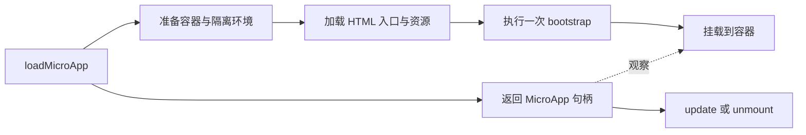

# 加载一个微应用实例

使用 qiankun 时，建议优先通过 [`loadMicroApp`](/zh-CN/api/load-micro-app) 将微应用加载到主应用管理的 DOM 节点中。每次调用都会创建一个微应用实例，并返回用于查询状态和管理实例的句柄。此方式无需预先注册路由，也无需调用 `start()`。

本页只介绍公开的运行模型。实现细节见[运行时编排原理](/zh-CN/internals/runtime-orchestration)。

## 加载第一个实例

先取得容器，再调用 `loadMicroApp`，并保存返回的句柄：

```ts
import { loadMicroApp } from 'qiankun';

const container = document.getElementById('report-slot');
if (!container) throw new Error('report-slot not found');

const reportApp = loadMicroApp({
  name: 'report-app',
  entry: 'https://reports.example.com/',
  container,
  props: { accountId: '42' },
});

await reportApp.mountPromise;

// 页面不再需要这个区域时：
await reportApp.unmount();
```

`loadMicroApp` 会立即返回句柄，加载和挂载过程则异步执行。如果后续操作要求微应用已完成挂载，应先等待 `mountPromise`。网络请求或渲染过程中发生的异常也应按常规异步错误处理。

## 运行模型

每个实例都遵循以下运行流程：



HTML 入口声明微应用所需的脚本和样式，并通过入口脚本导出生命周期函数。qiankun 负责调用这些函数，并将主应用提供的容器传入微应用。JavaScript 隔离默认开启；[样式隔离](/zh-CN/concepts/style-isolation)需要显式启用。

## 双方各自负责什么

| qiankun 负责 | 微应用负责 |
| --- | --- |
| 获取 HTML 入口及其资源 | 导出合法的生命周期函数 |
| 准备隔离的运行环境 | 仅在 `props.container` 内渲染 |
| 按顺序调用生命周期 | 销毁框架根节点并清理外部副作用 |
| 卸载时清空容器 | 确保应用可重复挂载和卸载 |

直接从页面中移除容器不能替代生命周期清理。不再使用实例时，应先调用 `unmount()` 并处理其返回的 Promise，再丢弃句柄。条件允许时，应等待卸载完成后再移除容器；如果框架的清理回调无法等待异步操作，也应给返回的 Promise 挂上 `catch`，处理卸载失败的情况。

## 选择激活方式

- **`loadMicroApp`** 是首选方式，适用于面板、标签页、弹窗、工作台、多实例，以及其他由主应用管理生命周期的场景。
- **React 和 Vue 的 `<MicroApp>` 组件**封装了 `loadMicroApp`，会随组件生命周期管理实例句柄。参见 [React](/zh-CN/ecosystem/react) 和 [Vue](/zh-CN/ecosystem/vue) 集成。
- **[`registerMicroApps`](/zh-CN/api/register-micro-apps)** 适用于由 URL 自动决定微应用激活状态的场景；使用命令式加载时无需调用此 API。

## 保证与边界

- `container` 必须是页面中有效的 `HTMLElement`，不能是选择器字符串，也不应与无关的主应用内容混用。
- 浏览器必须能访问入口及其资源；跨域部署需要正确的 [CORS 配置](/zh-CN/concepts/html-entry-loading#跨域与部署边界)。
- 隔离机制用于减少应用之间的意外干扰，不能作为运行不可信代码的安全边界。
- `unmount()` 会触发应用的清理生命周期并清空渲染内容，但微应用仍须释放 qiankun 不持有的资源，例如主应用状态仓库的订阅和 Worker。

## 继续阅读

- [微应用生命周期与 props](/zh-CN/concepts/lifecycle-and-props)——句柄所对应的应用契约。
- [HTML 入口](/zh-CN/concepts/html-entry-loading)——一个 URL 如何描述一个应用。
- [JavaScript 隔离](/zh-CN/concepts/js-sandbox)与[样式隔离](/zh-CN/concepts/style-isolation)——隔离保证与边界。
- [`loadMicroApp` API](/zh-CN/api/load-micro-app)——配置、返回值和错误处理。
