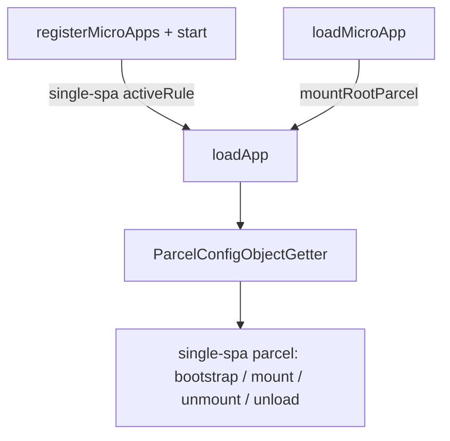
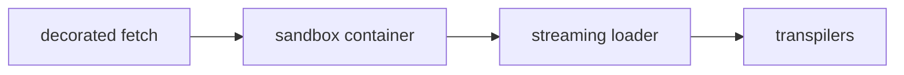
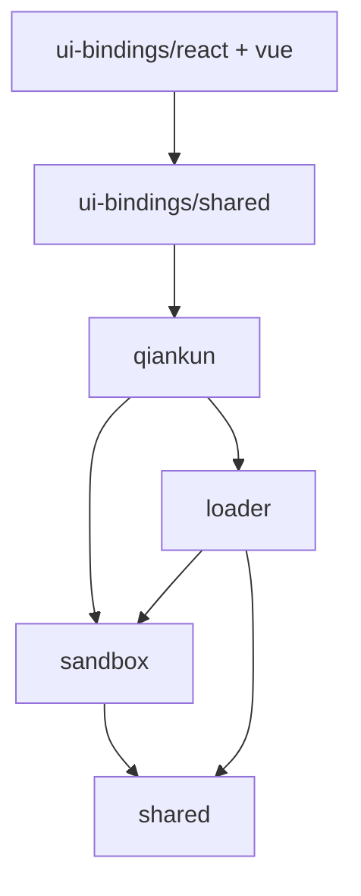

# 架构概览

这一页讲清楚 qiankun v3 从头到尾是怎么加载并运行一个微应用的：总的编排逻辑、单个应用的加载流水线、两条脚本执行路径，以及内部各个包之间怎么拼在一起。这些都属于背景知识，用 qiankun 并不需要先懂它们；但当你在调一次加载、一次挂载，或者排查某个沙箱副作用时，懂了这些，公共 API 的行为就都能对得上号。

## 大致长什么样

从一份 HTML 入口，到一个跑起来、隔离好的微应用，这中间所有的事都发生在同一个编排器里：`loadApp`(`packages/qiankun/src/core/loadApp.ts`)。它把加载工作跑一遍，然后返回一个工厂函数，这个工厂产出一份绑定到 single-spa 挂载/卸载流程的 [single-spa](https://single-spa.js.org/) parcel 配置。

进这个编排器有两条路，区别只在于：谁来决定一个应用什么时候被激活。

- **路由驱动**:[`registerMicroApps`](/zh-CN/api/register-micro-apps) 把每个应用连同一个 `activeRule` 注册进 single-spa，再由 [`start`](/zh-CN/api/start) 开始接管路由。URL 一变，single-spa 就自动激活、停用对应的应用，你自己不用去调 mount。
- **命令式**:[`loadMicroApp`](/zh-CN/api/load-micro-app) 把一个应用立刻挂载进你给的容器，并回给你一个 `MicroApp` 句柄(也就是一个 single-spa parcel)，它的 `mount` 和 `unmount` 由你手动驱动。



两条路最终都汇到 `loadApp`，所以不管你从哪条路进来，下面这套单应用流水线都是一样的。

## 单应用流水线

对每一个微应用，`loadApp` 会按顺序接好四个阶段，每个阶段分别由一个不同的内部包负责。



### 1. 装饰过的 fetch

你在 [`AppConfiguration`](/zh-CN/api/configuration) 里传进来的 `fetch`(默认是 `window.fetch`)，会被 `@qiankunjs/shared` 里的三层装饰器包起来：

```ts
const enhancedFetch = makeFetchCacheable(makeFetchRetryable(makeFetchThrowable(fetch)));
```

从里往外读：`makeFetchThrowable` 把非 2xx 的响应变成抛错，`makeFetchRetryable` 对偶发失败做重试，最外层的 `makeFetchCacheable` 负责去重和缓存。这个 `enhancedFetch` 在应用碰网络的所有地方都被复用：抓入口 HTML、沙箱、ESM 引擎，还有重新挂载时那次去掉脚本的 HTML 重载，所以每一个请求都吃到同一套缓存和重试行为。

### 2. 沙箱容器

`sandbox` 为 `true`(默认值)时，`createSandboxContainer`(`packages/sandbox`)会给 `window` 和 `document` 建一层 Proxy 隔离膜视图。之后 `loadApp` 让应用跑在 `sandboxInstance.globalThis`(被代理的 window)上，而不是真正的全局对象上，于是应用读写的都是它自己那份隔离的全局变量。隔离膜怎么工作、patcher 怎么在卸载时清副作用，见 [JS 沙箱](/zh-CN/concepts/js-sandbox)。

ESM 引擎(下面会讲)也是在这个容器里构造的。引擎只存在于 `if (sandbox)` 这个分支里，所以关掉沙箱，原生 ESM 执行也就跟着一起关了。

### 3. 流式加载器

`loadEntry(entry, container, opts)`(`packages/loader`)抓取入口 HTML，然后把它以一个真正的 `ReadableStream`(而不是一整个缓冲好的字符串)依次送过解码、一个可选的 `streamTransformer`、head 虚拟化(`<head>` → `<qiankun-head>`，好让沙箱把它当成一个虚拟的 head 来对待)，最后交给 `writable-dom`，由它在字节流一点点到达的同时，增量地把节点提交进真实 DOM。见 [HTML Entry 流式加载](/zh-CN/concepts/html-entry-loading)。

### 4. 转译器

在任何 script、link 或 style 节点进到真实 DOM 之前，加载器会先把它过一遍 `nodeTransformer`。默认实现会调 `transpileAssets`(`packages/shared/src/assets-transpilers`)，它逐个改写节点：classic 脚本被包一层、指向一个作用域绑定到沙箱的 blob URL,module 脚本被打上标记、转交给 ESM 引擎，而当[样式隔离](/zh-CN/concepts/style-isolation)开启时，style 和 link 会被改写以适配 CSS `@scope`。

## 两条执行路径

一个脚本走哪条路，是按节点逐个、根据它的类型来定的；同一份 HTML entry 里两种脚本可以混着来。

| | Classic | ESM |
| --- | --- | --- |
| 触发条件 | `<script entry>`(UMD/全局) | `<script type="module">` |
| 执行方式 | 源码被包一层，通过一个作用域绑定到隔离膜的 blob URL 运行 | `EsmSandboxEngine` 抓取模块、经 lexer 改写、再逐个求值 |
| 应用导出 | `sandbox.latestSetProp`，即 entry 脚本最后赋值的那个全局变量 | entry 模块的 `export`(或 `export default { … }`) |

**Classic** 脚本沿用的是 qiankun 2.x 那套 UMD/全局模型。entry 脚本的源码被包一层，通过一个作用域绑定到沙箱隔离膜的 blob URL 执行；qiankun 从 `sandbox.latestSetProp`(也就是脚本最后设置的那个全局变量)里读出应用的 lifecycle 对象。

**ESM** 脚本(`<script type="module">`)由 `EsmSandboxEngine`(`packages/shared/src/esm-sandbox`)处理。模块经由增强后的 fetch 抓回来，用一个 WASM lexer 改写，让它对全局变量的读写都路由到隔离膜上，再通过动态注入的一个 `<script type="importmap">` 拿到合成的 specifier，最后按文档顺序求值。实例化和求值仍然由原生 ESM loader 掌管，所以 top-level `await`、循环依赖、live binding 都被完整保留下来。正是这条路径，让一个没打包的 Vite dev server 能在沙箱下跑起来。见 [ESM 沙箱](/zh-CN/concepts/esm-sandbox)。

::: info Firefox 与动态注入的 import map
ESM 这条路依赖动态注入的 import map，而 Firefox 默认没有开启这项能力。Chrome/Edge 133+ 和 Safari 18.4+ 原生支持。ESM 沙箱的 e2e 测试在 Firefox 上被标注为预期失败(expected failure)，而不是跳过(skip)。
:::

## 内部包依赖图

qiankun v3 是一个 pnpm monorepo。对外的入口是 `qiankun` 包，其余的都是它组合起来的内部分层。这张依赖图是严格单向的：



- `qiankun`:门面，公共 API 加上 `loadApp` 编排。
- `loader`:流式 HTML Entry 加载器。
- `sandbox`:基于 Proxy 隔离膜的 JS 隔离。
- `shared`:转译器、fetch 装饰器、module resolver，以及 ESM 沙箱引擎。
- `ui-bindings`:给 [React](/zh-CN/ecosystem/react) 和 [Vue](/zh-CN/ecosystem/vue) 用的 `<MicroApp>` 组件，建在 `qiankun` 之上。

::: warning 这些都是内部包
只有 `qiankun` 包(以及 `@qiankunjs/react` / `@qiankunjs/vue` 这两个绑定)算公共 API。`loader`、`sandbox`、`shared` 都是实现细节，它们的导出在不同版本之间可能会变。要依赖就依赖有文档的 [API 参考](/zh-CN/api/index)，别去依赖这些内部包。
:::

## 端到端的加载生命周期

把上面几个阶段串起来，下面就是 `loadApp` 对单个微应用、从配置到拆卸都做了些什么。

1. **补齐配置默认值。** `fetch = window.fetch`(随后被装饰),`sandbox = true`,`globalContext = window`,`nodeTransformer = defaultNodeTransformer`,`styleIsolation` 关闭。完整的字段列表见 [AppConfiguration](/zh-CN/api/configuration)。
2. **初始化容器。** 容器被清空，并打上一组 dataset:`data-name`、`data-version`、`data-sandbox-cfg`，以及对同名应用的第二个及后续实例，还会加上 `data-mount-times` 和 `data-instance-id`。这个 `instanceId` 来自一个按名字计数的计数器，靠它把同一个应用的[多实例](/zh-CN/cookbook/run-multiple-instances)彼此隔开。
3. **创建沙箱与 ESM 引擎。** 沙箱开启时，Proxy 隔离膜被建起来，并用应用名、实例 id、entry URL 和增强后的 fetch 构造出 `EsmSandboxEngine`。
4. **流式加载 entry。** `loadEntry` 让 HTML 流经流式流水线和转译器；classic 脚本和 module 脚本各自被分派到对应的路径。module 脚本在流式过程中被收集起来，等流一封口，就按文档顺序执行。
5. **找出 lifecycle。** `getLifecyclesFromExports` 会按一条 fallback 链解析出 `{ bootstrap, mount, unmount, update }`:先是 exports 对象本身，再是它的 `default`，再是 `global[latestSetProp]`(classic)，最后是 `window[appName]`。要是没有一个是合法的 lifecycle 对象，就抛错。`update` 是可选的。见[微应用 lifecycle 与 props](/zh-CN/concepts/lifecycle-and-props)。
6. **组装 addon 和用户钩子。** 两个内置 addon 会在被代理的全局对象上设置 `__POWERED_BY_QIANKUN__` 和 `__INJECTED_PUBLIC_PATH_BY_QIANKUN__`；你自己的 [lifecycle 钩子](/zh-CN/api/lifecycles)(`beforeLoad`、`beforeMount`、`afterMount`、`beforeUnmount`、`afterUnmount`)被拼在它们后面。`beforeLoad` 在 `loadApp` 主体里跑，其余的在 parcel 的 mount/unmount 数组里跑。
7. **返回 parcel。** 工厂函数产出一个 single-spa 的 `ParcelConfigObject`。**mount** 时依次是：(重新)初始化容器 → 挂载沙箱 → `beforeMount` → 应用的 `mount({ ...props, container })` → `afterMount`。**unmount** 时：`beforeUnmount` → 应用的 `unmount(...)` → 卸载沙箱 → `afterUnmount` → 清空容器。**unload** 时(只有完整拆卸才会走到):ESM 引擎的 `dispose()` 会撤销它的 blob URL，并释放它的 realm。

::: info mount、unmount、unload 是三回事
`unmount` 只是停用一个应用，但会让它的沙箱和 ESM 模块命名空间活着，好让重新挂载很便宜：对 ESM 应用来说，重新挂载只会再跑一遍 `mount(props)`，不会再跑 top-level 的模块代码。真正把 ESM 引擎和它的 blob URL 处置掉的，是 `unload`(single-spa 那次完整拆卸)。这也是为什么用现代框架的应用应该把创建应用实例这件事放进 `mount()` 里，而不是放在模块顶层。
:::

## start() 的副作用

除了启动 single-spa 路由，[`start`](/zh-CN/api/start) 还有一个 qiankun 专属的副作用：它会通过 `prepareEsmLexer()` 预热 ESM 引擎的 WASM lexer，这样第一个 ESM 微应用就不必在自己的关键路径上再付一次 lexer 初始化的开销。`start` 是幂等的，并且只接收 single-spa 的 `{ urlRerouteOnly }`。

如果你还没调过 `start()`,[`loadMicroApp`](/zh-CN/api/load-micro-app) 会自动帮你调一次。这是有意为之：它保证主应用的 `pushState`/`replaceState` 能正确派发 `popstate`，这样哪怕是纯命令式的用法，路由也能保持一致。

## 接着看

- [HTML Entry 流式加载](/zh-CN/concepts/html-entry-loading):流式流水线、head 虚拟化，以及脚本分类。
- [JS 沙箱](/zh-CN/concepts/js-sandbox):Proxy 隔离膜、patcher，以及 free/rebuild 这套副作用协议。
- [ESM 沙箱](/zh-CN/concepts/esm-sandbox):原生 `<script type="module">` 怎么不靠 bundler 就走过隔离膜。
- [样式隔离](/zh-CN/concepts/style-isolation):CSS `@scope` 与 blob-link 样式表改写。
- [微应用 lifecycle 与 props](/zh-CN/concepts/lifecycle-and-props):微应用必须导出的 lifecycle 契约，以及它收到的 props。
- [API 参考总览](/zh-CN/api/index):完整的公共 API 面貌。
