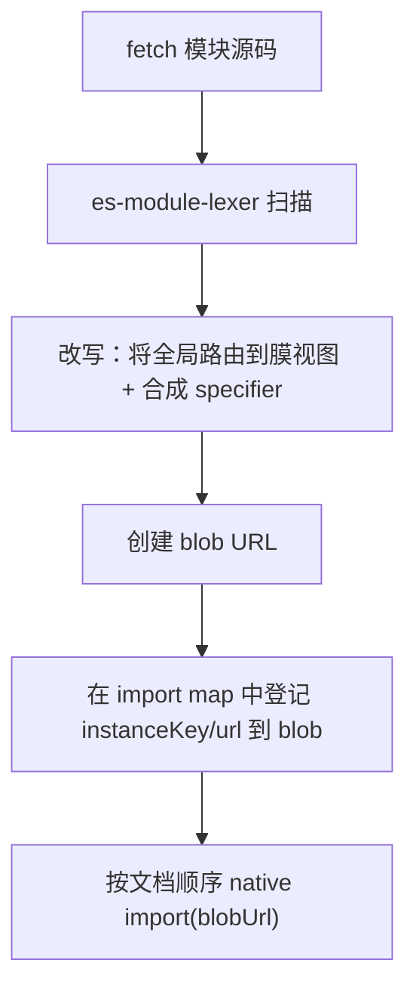

# ESM 沙箱

现代微应用交付的是原生 ES 模块。Vite dev server 为每个源文件提供一个 `<script type="module">`，用 `import`/`export` 把它们串联起来，并依赖浏览器原生的模块加载器。qiankun 的经典沙箱——它用 `with (this) { … }` 包裹源码，并从脚本最后一次赋值的全局变量读取应用导出——根本无法运行这类代码：在 ESM 强制的严格模式下 `with` 会抛出 `SyntaxError`，而生命周期函数来自 `export`，而非对 `window` 的写入。

ESM 沙箱是 qiankun v3 给出的答案。`EsmSandboxEngine` 让微应用的原生 ES 模块图穿过与 [JS 沙箱](/zh-CN/concepts/js-sandbox)相同的膜（membrane）——无需 bundler、无需 iframe、也无需构建期插件。实例化和求值仍然由原生 ESM 加载器掌控，因此顶层 `await`、循环依赖、live bindings 以及提升（hoisting）的行为都与没有 qiankun 时完全一致。

## 为什么需要一个独立的引擎

经典路径与 ESM 路径解决的是本质不同的问题：

| | 经典 | ESM |
| --- | --- | --- |
| 源码包裹 | `with (this) { … }` blob | 模块顶部的 `const/let { … } = __qk_view` 解构 |
| 全局覆盖范围 | 每个裸标识符 | 仅限每模块解构集合中的名字（基础集 = `esmDestructurableGlobals`） |
| 隐式全局写入 `foo = 1` | 写入 proxy | 严格模式 `ReferenceError`——根本到不了 set trap |
| 生命周期发现 | `sandbox.latestSetProp`（一次 `window` 写入） | 入口模块的 `export` / `export default { … }` |
| 重挂载（Remount） | 重新执行整个脚本 | 顶层只运行一次；`import(sameBlob)` 返回同一个 namespace |
| 模块标识 | 直接的 blob URL | 合成 specifier → import map → blob URL |

引擎并没有重新发明模块解析，而是复用了三个既有部件：流式 [HTML Entry 加载器](/zh-CN/concepts/html-entry-loading)、Proxy 膜，以及浏览器自身的模块加载器。它只是把自己插入到 fetch 与求值之间。

## 什么会触发它

引擎只在 `sandbox` 启用时（其默认值）才存在。它在 `loadApp` 内部按微应用实例逐个构造，与膜一同创建。当 `sandbox: false` 时，既没有 ESM 沙箱，也完全没有膜。

分发在加载器的流式管线中按 DOM 节点类型进行（`packages/shared/src/assets-transpilers/module.ts`）：

- **`<script type="module">`**（无论带 `src` 还是内联）会被路由到引擎。transpiler 移除 `src` 属性并把它暂存到 `data-src` 上，同时打上 `data-esm="true"` 标记，这样浏览器原生的加载器就永远不会去 fetch 或执行原始 URL——那会彻底绕过沙箱。
- **`<script type="importmap">`** 由 qiankun 自己解析。该元素的 `type` 被改写为 `qiankun-importmap`，因此浏览器绝不会把子应用的 map 合并进宿主文档的 import map。
- **经典 `<script>` / `text/javascript`** 继续走经典 transpiler（即 `with (this)` blob 路径）。在同一个 HTML Entry 中混用经典脚本和 ESM 脚本是被支持的。

## 技术原理

对每个模块，引擎会执行一次由 WASM lexer 驱动的运行时源码改写，然后把结果交给原生加载器：



1. **Fetch** 通过装饰后的 `fetch`（cacheable → retryable → throwable）获取模块。
2. 用 [`es-module-lexer`](https://github.com/guybedford/es-module-lexer) **扫描（Scan）** 它，这是一个 WASM lexer，在 `start()` 时通过 `prepareEsmLexer()` 预热一次。
3. **改写（Rewrite）** 源码，使得：
   - 对沙箱全局的引用在模块顶部从膜视图解构出来（`const { window, document, … } = __qk_view`）；
   - 每个静态 import specifier 被替换为形如 `` `${instanceKey}/${resolvedUrl}` `` 的合成 specifier；
   - `import.meta` 变成一个保留真实 `url` 的本地对象，`import()` 变成沙箱感知的 `__qk_dynamic_import(...)`。
4. 通过一个动态注入的、文档级的 `<script type="importmap">`，把每个合成 specifier **映射（Map）** 到一个 blob URL。
5. 按文档顺序用原生 `import(blobUrl)` **求值（Evaluate）**。

因为实例化仍然留给原生加载器，引擎从不重新实现模块语义——它只是重定向了每个模块的源码及其全局变量的来源。

### 全局是如何被改写的

改写并不会把模块包进一个 proxy 作用域。相反，它扫描源码，找出出现在基础全局集合中的标识符，并只把这些从膜视图中解构出来：

- 稳定对象（`window`、`document` 以及基础集合中的其余成员）用 `const { … } = __qk_view` 绑定。对它们的属性访问保持 live，因为该对象本身就是被代理的视图。
- 可 live 绑定的双下划线标志（`__X__`，例如 `__VUE_OPTIONS_API__`）用 `let` 绑定并被追踪，这样当沙箱之后记录到对此类全局的写入时，已经求值过的模块也能看到最新的值。

这段头部是通过 import 一个每实例的运行时模块来引导的——`import { __qk_view, __qk_resolve, __qk_dynamic_import, __qk_track } from "<instanceKey>/__runtime__"`——而不是通过读取 `globalThis` 或调用 `eval`。使用 import 绑定既避免了 temporal-dead-zone 的 `ReferenceError`，又让沙箱与 CSP 兼容：唯一新增的要求是 `script-src blob:`，绝不需要 `'unsafe-eval'`。

## 执行顺序

加载与求值被刻意地围绕 HTML 流拆分开来：

- **流式过程中**，每个模块脚本按文档顺序同步调用 `loadModuleScript(...)`。这会立刻启动异步 transpile（fetch → lexer → 改写 → 并行递归预取依赖），但推迟求值。每个任务都被排入队列。
- **流结束后**，加载器调用 `sealAndExecute()`。当存在模块脚本时它返回 `true`——这是让加载器去 await ESM 入口 namespace（而非经典的 `latestSetProp`）的信号。随后它 await 每一条排队的记录，flush 新的 import-map 条目，并按顺序对每个模块调用原生 `import(blobUrl)`。

### 选择入口 namespace

所有模块运行完毕后，引擎会选出承载生命周期函数的那个模块 namespace：

1. 如果某个模块带有显式的 `entry` 属性，则该模块的 namespace 就是入口，它的失败会 reject 整个应用。
2. 否则，第一个看起来像生命周期对象（或其 `.default` 看起来像）的已执行 namespace 胜出——对应一个执行 `export default { bootstrap, mount, unmount }` 的 Vite 入口。
3. 否则，使用**最后一个**已执行的 namespace，对应只有单个 `<script type="module">` 的 HTML。

一个抛出异常的非入口模块只会 `console.error`；它不会导致应用失败，因为一个经典应用可能顺带携带了一段无关的模块脚本。`loadApp` 随后会通过 `getLifecyclesFromExports` 重新校验选定的 namespace，它仍然可以回退到 `window[appName]`。任何模块图抛出的异常或被 reject 的顶层 `await` 都会被回传，从而抵达 single-spa 的错误处理器，而不是以 `unhandledrejection` 的形式浮现。

## Import map

引擎与两层 import map 协同工作，而它们从不混淆：

- **子应用自己的 map**（`<script type="importmap">`）被解析进一张内部表（`bareSpecifier → absolute URL`），仅用于解析子应用的裸 specifier。只有 `imports` 字段被采纳——`scopes` 会被解析、警告并在 v1 中忽略。
- **注入的运行时 map** 把 `<instanceKey>/<absoluteUrl>` 映射到浏览器实际 import 的那个 blob URL。

原生 import map 是文档级、只追加、冲突时先者胜。因此实例间的隔离完全依赖于 instance key：

```
instanceKey = `__qk_${appName}_${instanceId}_${++instanceSeq}__`
```

`instanceSeq` 是一个全局单调计数器，**绝不复用**，因此一个已退役的 key 永远不会与一个存活条目冲突。只有全新的条目会被追加；对同一 specifier 使用不同目标的真正冲突会 `console.error`（浏览器会静默地保留第一个）。

::: info 长生命周期的宿主会累积条目
由于 import-map 条目在真实文档中不可撤销，一个反复加载与卸载微应用的宿主会累积死条目——在页面的整个生命周期内造成无界的字符串增长。这是一个已记录的 v1 限制。
:::

## Realm 桥接与重声明探测

改写后的 blob 运行在真实的全局作用域中，因此一个出现在错误位置的裸 `__qk_*` 引用会触及真实全局并逃逸出膜。有两道防线守护这座桥：

- **Realm 访问器**——它返回某个模块的膜视图——被安装在 `globalThis` 上一个每副本、密码学随机的 key 下，并进一步由一个不可猜测的每实例 token 索引，该 token 只内联在该实例自己的运行时模块 blob 内部。膜还会把 `__qk_*` 名字列入黑名单作为纵深防御。任何试图 import 以 `__qk_` 为前缀的合成 specifier 的用户代码都会被 `QiankunError` 拒绝。（诸如 `(0, eval)('globalThis')` 之类的间接逃逸仍然可能，这与经典沙箱完全一致，并被明确置于范围之外。）
- **重声明探测** 处理这样一种情况：注入的 `const { window, … }` 头部会与模块自己的顶层 `const window = …` 冲突，而这是一个解析期的 `SyntaxError`。由于 import-map 条目一旦 flush 便不可撤销，引擎必须在 flush *之前*捕获它。它 import 一个探测 blob，其运行时 specifier 被替换为一个从未注册的目标：解析会暴露重声明错误，而随后的解析（resolution）保证失败，因此该模块实际上从不求值。冲突的标识符被提取出来，加入一个排除集合，然后模块被再次改写。

## Vite dev 特性

引擎的设计目标就是直接运行 Vite dev server 的原生 ESM 输出。子应用的配置方法参见[让 Vite 应用支持 qiankun](/zh-CN/cookbook/prepare-a-vite-app)。

- **`/@vite/client` 被打桩（stub）。** 该 stub 保留了 `updateStyle`/`removeStyle`（通过被代理的 `document` 路由到虚拟 head），但返回一个空操作的 hot context，并且从不打开 HMR WebSocket。
- **HMR 是被主动禁用的，而非被动降级。** 真实的 Vite client 的 HMR host 是一个 serve-time 字面量，因此它的 WebSocket *会*从沙箱内部连接并触发一次破坏性的整页 `location.reload()`。禁用它是刻意为之——开发期间请手动编辑并刷新。
- **React Fast Refresh** 要求其前导脚本（preamble）在组件模块之前运行；顺序对它能否正确初始化至关重要。

::: warning CSS-as-JS 在重挂载时可能丢失
Vite 把 CSS 作为在模块顶层注入样式的 JS 模块来提供。由于重挂载不会重新运行顶层代码（见下文），而卸载会清空虚拟 head，这类样式可能在第二次挂载时消失。这是一个在 ESM-sandbox RFC 中已跟踪的已知冲突。
:::

## 生命周期与缓存

ESM 沙箱在 mount/unmount 之间保留其模块图，这相比经典沙箱改变了一个重要假设：

- **重挂载不会重新运行顶层代码。** `import(sameBlobUrl)` 返回*同一个*模块 namespace，因此一个模块的顶层恰好执行一次——只有 `mount(props)` 会再次运行。任何每实例状态（应用实例、store、router）都必须在 `mount()` 内部创建，而非在模块作用域。每次重挂载都重新执行整个脚本的经典应用没有这个约束。
- **`dispose()` 绑定的是 single-spa 的 `unload`，而非 `unmount`。** 完整拆解——撤销引擎创建的每一个 blob URL 并注销 realm——只在 `unload` 时发生。由于 `loadMicroApp` parcel 没有 `unload` 语义，它们的引擎会一直滞留，直到调用方丢弃引用为止，这与经典沙箱缺少显式 destroy hook 的缺口相同。

```js [micro-app/src/index.js]
let app;

export async function bootstrap() {
  // Runs once. Safe for one-time setup only.
}

export async function mount(props) {
  // Runs on every (re)mount — create per-instance state here.
  app = createApp(props.container);
  app.render();
}

export async function unmount(props) {
  app.unmount();
  app = null;
}
```

完整的生命周期契约参见[微应用生命周期与 props](/zh-CN/concepts/lifecycle-and-props)。

## 限制

ESM 沙箱以一些经典沙箱行为换取了原生模块语义。请把这些告知你的子应用作者：

- **隐式全局写入会抛错。** 不带 `var`/`window.` 的 `foo = 1` 在严格的 ESM 模块中是一个 `ReferenceError`——它根本到不了膜的 set trap。依赖隐式全局被沙箱化的代码会因此失效。
- **只有基础集合中的全局被膜包裹。** 只有每个模块解构集合中的名字——`esmDestructurableGlobals` 的一个子集——会路由过膜。一次性快照无法表示的值类型或 getter 类型全局（`innerWidth`、`devicePixelRatio`、`length`、`name`、`status`、`event`……）会回退到真实全局，且无法在 unmount 时清理。
- **带类型的 import 在 v1 中是直通的。** `import x from '...' with { type: 'json' | 'css' }`、WASM 之类会被直接映射到原始 URL 并以原生方式加载，没有实例隔离，并伴随一次性的 `console.warn`。它们要求子应用服务器提供正确的 MIME 类型和 CORS。*带类型的动态* import 中的相对 specifier 会相对于 blob URL 解析——请使用绝对 URL。
- **Firefox 需要一个 flag。** 多个动态注入的 import map 需要 `dom.multiple_import_maps.enabled`，它在 Firefox 中默认关闭。Chrome/Edge 133+ 和 Safari 18.4+ 原生支持。若要在 Firefox 和更旧的浏览器上获得有保证的支持，请把 [es-module-shims](https://github.com/guybedford/es-module-shims) 作为一个受支持的基座采纳，而不是一个可选的回退。
- **没有 source map 时可观测性会退化。** 未捕获错误的 `error.stack` 指向 `blob:<host-origin>/<uuid>`；`//# sourceURL` 只改变 DevTools 的显示名称，而不改变堆栈 URL 或行号。生产环境的错误上报无法直接把 ESM 子应用的帧映射到真实文件，因此 source map 成为生产环境的必需品，而非可有可无的锦上添花。

## 另见

- [JS 沙箱](/zh-CN/concepts/js-sandbox) —— ESM 引擎复用的 Proxy 膜
- [HTML Entry 流式加载](/zh-CN/concepts/html-entry-loading) —— 分发模块脚本的管线
- [架构概览](/zh-CN/concepts/architecture) —— 各部件如何组合在一起
- [让 Vite 应用支持 qiankun](/zh-CN/cookbook/prepare-a-vite-app) —— 面向原生 ESM 的子应用配置
