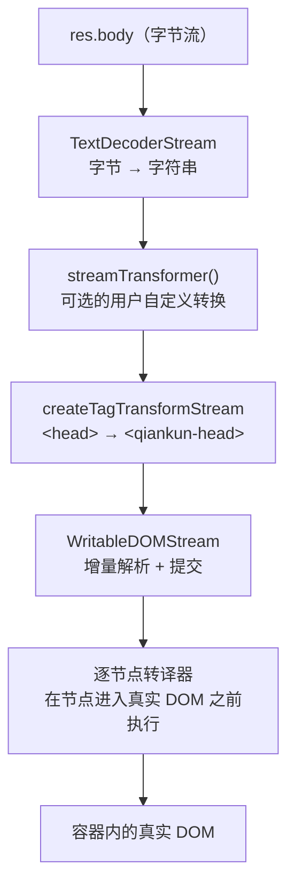

# HTML entry 流式加载

qiankun 不要求你为每个微应用维护一份脚本和样式清单。你只给它一个地址——微应用的 `index.html`，剩下的交给它：把这份 HTML 抓回来，流式解析，逐个节点转译里面的资源，再增量提交进容器。这一页讲清楚这条流水线怎么跑、入口 HTML 得满足什么约定，以及机制上有哪些已知的坑。

## HTML entry 是什么意思

qiankun 里的 `entry` 就是一个普通字符串——微应用 HTML 文档的 URL。

```ts
registerMicroApps([
  {
    name: 'app-react',
    entry: 'http://localhost:7101', // the micro-app's index.html
    container: '#subapp-container',
    activeRule: '/react',
  },
]);
```

接入的全部工作就是这一个 URL。qiankun 把这份 HTML 文档当成唯一的事实来源：文档里声明了哪些 `<script>`、`<link>`、`<style>`，微应用跑的就是这些。你不需要另外维护一份 JS/CSS bundle 列表去跟构建产物对齐——微应用重新构建、`index.html` 引用了新的带 hash 的文件名，下次加载时 qiankun 会自动跟上。

这就是所谓的 HTML-entry 模型：qiankun 消费的是浏览器本来就会消费的那份 HTML，只不过把里面的资源引到沙箱和转译器里，而不是直接塞进真实文档。整条流程由 `packages/loader/src/index.ts` 里的 `loadEntry(entry, container, opts)` 驱动。

## 为什么是流式加载

服务端本来就支持流式返回 HTML——弱网下你能看到页面一块块画出来，浏览器不等整份文档回来就开始渲染。但这份收益只落在首屏，而且依赖服务端。次屏，比如路由切换加载一个新页面，就享受不到了。

qiankun 3.0 之前，加载微应用是一条串行的路：先把整份 HTML 下载完，再用正则从大段文本里抠出 `<script>` 和 `<link>`，然后逐个处理。哪怕背后的 Web Server 支持流式响应，这套做法也用不上。

v3 把加载内核换成了**客户端流式渲染**:一边消费 HTML 响应流，一边把处理过的节点写进一个已经加载好的文档里。于是首屏和次屏都能吃到流式的好处。换来两件实在的东西。

**更快。** 边收流边提取样式表和脚本，处理完立刻插进文档树。只要流的某一帧里出现了一个外链脚本，就能立刻捕获并执行，而不必等整份 HTML 都回来了再去正则匹配一大段文本——这跟浏览器原生处理首屏是一个路子。解析也从正则换成了原生的 DOM 遍历(`writable-dom`)，又快了一截。

::: tip 一个 benchmark
渲染一份 500K 大小的 HTML，老的处理方式平均约 500ms，流式处理能降到约 300ms，快了差不多 40%。
:::

**更少的 bug。** 老方案靠手动 `eval` 来跑脚本。可脚本一旦不走浏览器原生那条路执行，绑在 `<script>` 元素上的事件就不会正常触发，沙箱只能自己补——执行成功了手动派发 `onload`，失败了手动派发 `onerror`。手动模拟和浏览器原生处理之间那点细微差异，时不时就冒出一个很难查的 bug。v3 把脚本节点直接插进 DOM、交给浏览器执行(经典脚本包成 blob URL,module 脚本走 [ESM 沙箱](/zh-CN/concepts/esm-sandbox))，这类 bug 就从源头上没了。

具体这条流水线怎么搭、每个阶段干什么，往下看。

## 流式流水线

qiankun 不会把整份 HTML 文档下载完、解析成一个字符串、再一次性插进去。它搭的是一条真正的 `ReadableStream` 链路：字节从网络上一到，HTML 就一边解析、一边提交进真实 DOM。

拿到 `res = await fetch(entry)`（这里的 `fetch` 是一个包装过的 `window.fetch`，见[下文](#装饰过的-fetch)），响应体会依次流过这几个阶段：



代码里这条链路长这样（`packages/loader/src/index.ts`）：

```ts
res.body
  .pipeThrough(new TextDecoderStream())        // bytes → string
  .pipeThrough(streamTransformer())            // optional, only if you supply one
  .pipeThrough(createTagTransformStream(...))  // <head> → <qiankun-head>
  .pipeTo(new WritableDOMStream(container, null, (clone) => { /* per-node hook */ }));
```

每个阶段各管一摊事：

| 阶段 | 职责 |
| --- | --- |
| `TextDecoderStream` | 把原始字节解码成 UTF-8 字符串流。 |
| `streamTransformer` | 可选。一个用户提供的 `() => TransformStream<string, string>`（[AppConfiguration](/zh-CN/api/configuration) 上的 `streamTransformer` 选项），在解析之前改写原始 HTML 文本——比如替换写死的 URL。 |
| `createTagTransformStream` | 字符串层面的标签改写。用于 [head 虚拟化](#head-虚拟化)。 |
| `WritableDOMStream` | `writable-dom` 的一个分叉（`packages/loader/src/writable-dom/`）。增量解析进来的 HTML，遇到同步脚本和样式表时阻塞以保证顺序，阻塞期间预加载其它资源。 |

因为写入端是一边收到 chunk 一边往容器里写，微应用的 DOM 在整份文档下载完之前就已经开始成形了——和浏览器给顶层导航的那种渐进式行为一样。

### 逐节点转译器

`WritableDOMStream` 的第三个参数是一个回调，**每个节点从游离的解析文档移进真实 DOM 之前**都会调它一次。这个时机是关键：节点还处在惰性状态时就被改写，所以在 qiankun 有机会动手之前，`<script>` 绝不会执行、`<link>` 也绝不会针对真实文档发起请求。

在这个回调里，qiankun 调用 `nodeTransformer(clone, transformerOpts)`。默认的节点转译器（`defaultNodeTransformer`）把活交给 `transpileAssets`，后者按标签名分发：

- `SCRIPT` → `transpileScript`——经典脚本被包一层、指向一个 sandbox 作用域内的 blob URL；module 脚本被打上 `data-esm="true"`，交给 [ESM 沙箱](/zh-CN/concepts/esm-sandbox)引擎。
- `LINK` → `transpileLink`——外部样式表和 preload，在开启[样式隔离](/zh-CN/concepts/style-isolation)时改写。
- `STYLE` → `transpileStyle`——只在 `styleIsolation` 打开时才转译，否则原样放行。

如果你想自己拦节点，可以通过 [AppConfiguration](/zh-CN/api/configuration) 传入自定义的 `nodeTransformer`，不过默认这套已经把 script、link、style 都覆盖了。

## Head 虚拟化

微应用的 `index.html` 有一个 `<head>`。如果 qiankun 原样把这个 `<head>` 插进去，而微应用运行时又调了 `document.head.appendChild(...)`(框架成天干这事——注入样式、预加载 chunk)，这些节点就会落进**真实的** `document.head`，在应用之间泄漏。

为了避免这一点，qiankun 在**字符串层面**、在任何 DOM 构建之前就把 head 标签改写掉。`createTagTransformStream` 被配了正好两条替换规则（`packages/loader/src/index.ts`）：

```ts
{ tag: '<head>',  alt: '<qiankun-head>' }
{ tag: '</head>', alt: '</qiankun-head>' }
```

于是微应用的 `<head>...</head>` 变成一个自定义的 `<qiankun-head>...</qiankun-head>` 元素，落在**应用容器内部**。标签名就是 `qiankun-head`（`packages/sandbox/src/consts.ts`）。

接着，沙箱的动态 append 补丁把 `<qiankun-head>` 当成这个应用的虚拟 head:子应用往 `document.head` 上 append 时，补丁会把节点重定向进 `container.querySelector('qiankun-head')`(`packages/sandbox/src/patchers/dynamicAppend/common.ts`)，而不是真实的 `document.head`。这样运行时对 head 的 append 就被限制在应用容器里，应用卸载时也会跟着一起清掉。

替换机制会缓冲流的 chunk，做一次针对首次出现的 `String.prototype.replace`。要是某个 chunk 边界正好把 `<head>` 标签切成两半，转换会把缓冲区攒住，等下一个 chunk 把它补全；一旦替换命中就 flush 并清空缓冲区。

## entry 脚本约定

HTML 里的脚本那么多，qiankun 得知道哪一个是微应用的入口——也就是那个导出[生命周期函数](/zh-CN/concepts/lifecycle-and-props)(`bootstrap`、`mount`、`unmount`)的脚本。这个脚本靠一个 `entry` 属性来标识。

```html
<script src="/app.js" entry></script>
```

qiankun 在流式解析时会强制这几条规则（`packages/loader/src/index.ts`）：

- **有且只有一个 entry 脚本。** 如果第二个外部脚本也带了 `entry` 属性，`loadEntry` 会抛错：

  > `QiankunError: You should not include more than 1 entry scripts in a single HTML entry`

- **只有外部脚本能当 entry。** 一个脚本要算"外部"，得带 `src` 或 `data-src` 属性。内联脚本(没有 `src`/`data-src`)永远当不了 entry。

背后有三个分类工具函数在管这件事：

| 工具函数 | 判定条件 |
| --- | --- |
| `isExternalScript` | `tagName === 'SCRIPT'` 且带 `src` 或 `data-src` |
| `isEntryScript` | 是外部脚本且带 `entry` 属性 |
| `isDeferScript` | 是外部脚本且带 `defer` 属性 |

实际用的时候，你基本不会手动去加 `entry` 属性。[@qiankunjs/bundler-plugin](/zh-CN/ecosystem/bundler-plugin) 会在构建时替你把正确的 entry 脚本标记好，Webpack 和 Vite 都支持。

::: tip 这个属性从哪来
Webpack 的 UMD 构建里，entry 属性落在 runtime/main bundle 上；Vite 的 ESM 构建里，它落在 `<script type="module">` 上。这两种插件都处理了——你不用去手改 `index.html`。
:::

### 经典路径 vs ESM 路径的 entry 解析

entry 脚本会走两条执行路径之一，按脚本逐个决定：

- **经典路径**（`<script src="..." entry>`，UMD/global 构建）。qiankun 给脚本绑上 `onload`/`onerror`。脚本加载完，entry 就从沙箱里解析出来——见下文[应用导出是怎么被发现的](#应用导出是怎么被发现的)。
- **ESM 路径**（`<script type="module" ... entry>`）。转译之后脚本带上 `data-esm="true"`，并被留成**惰性**状态——qiankun 不会给它设 `src` 让浏览器去执行。执行改由 `EsmSandboxEngine` 驱动，完成信号通过引擎的 `entryNamespacePromise` 传回。模块怎么被抓取、改写、求值，见 [ESM 沙箱](/zh-CN/concepts/esm-sandbox)。

module 脚本不会在流的中途执行。等 HTML 流结束，qiankun 调 `esmEngine.sealAndExecute()`，按文档顺序把所有 module 脚本跑一遍。这和浏览器把 `type="module"` 脚本推迟到文档解析完之后再执行是一个道理。

## defer 脚本，以及阻塞期间的预加载

`WritableDOMStream` 会在同步脚本和样式表上阻塞，以保住执行顺序，但它不是遇到什么都卡住。在为某个资源阻塞等待的空档，它会把流里已经见过的**其它资源预加载**起来，让网络不闲着。

标了 `defer` 的脚本(外部 + `defer` 属性)有特殊待遇：每个 defer 脚本拿到一个 `Deferred`，串进一个内部队列(`prepareDeferredQueue`)，这样它会等 entry HTML 全部结束后才 settle——同样是在对齐原生 `defer` 语义：延迟脚本在解析完成后、按顺序执行。

## 应用导出是怎么被发现的

执行一旦完成，qiankun 得从 entry 产出的东西里把微应用的生命周期对象读出来。两条路径读法不同：

- **经典路径。** entry 脚本赋值一个全局变量(UMD 构建会赋 `window.<libraryName> = { bootstrap, mount, unmount }`)。沙箱隔离膜把脚本设置的**最后一个**全局变量记成 `latestSetProp`。当经典 entry 脚本的 `load` 事件触发，`onEntryLoaded()` 用 `sandbox.globalThis[sandbox.latestSetProp]` 去 resolve 加载器的 promise。这里的顺序是有意为之的——qiankun 在调用应用自己挂的任何监听器之前就先把 `latestSetProp` 捕获下来，免得这个值被覆盖掉。
- **ESM 路径。** 生命周期对象就是**入口模块的命名空间**。引擎用模块命名空间(命名导出 `bootstrap`/`mount`/`unmount`，或者一个 `export default { ... }`）去 resolve `entryNamespacePromise`。

如果流结束了却**没找到显式的 `entry` 脚本**，qiankun 会退而求其次：

- 如果有 ESM module 脚本，就把**最后一个** module 当成 entry(这正好对上典型的 Vite `index.html`——里面只有一个 `<script type="module" src="/src/main.ts">`)。
- 否则退回经典路径的 `latestSetProp`。

解析出来的值随后交给 `getLifecyclesFromExports`，它会依次接受：对象本身、它的 `.default`、`latestSetProp` 那个全局、`window[appName]`。完整的解析顺序和导出对象该长什么样，见[微应用生命周期与 props](/zh-CN/concepts/lifecycle-and-props)。

::: warning 空响应体
如果 entry 响应没有 body,`loadEntry` 会抛 `QiankunError: The response body of entry ... is empty`。空白响应或 204 不是合法的微应用入口。
:::

### 装饰过的 fetch

entry——以及转译器重新抓取的每一个资源——都走一个装饰过的 `window.fetch`，它是这么组合出来的：

```ts
makeFetchCacheable(makeFetchRetryable(makeFetchThrowable(fetch)));
```

cacheable 在最外层(所以对同一个 URL 的重复请求会被去重)，往里是 retryable，再往里是 throwable(它把非 2xx 的响应转成抛出的错误)。你可以通过 [AppConfiguration](/zh-CN/api/configuration) 上的 `fetch` 选项替换掉底层的 `fetch`；不管你传什么进来，qiankun 都会再拿这三层装饰器把它包起来。

## 已知的坑

流式加载器是把一个很有野心的想法做成了一个务实的实现，有几处棱角值得先知道。

- **head 替换是一次很朴素的首次出现字符串替换。** `<head>` → `<qiankun-head>` 这个改写就是对首次出现做一次普通的 `String.prototype.replace`。源码里有个 `FIXME` 提到：不带 `<head>` 标签的非标准 HTML chunk 没做处理。真实打包工具吐出来的标准文档没问题；手写的或者不太寻常的 HTML，它的 head 可能虚拟化不了。
- **body 虚拟化没有实现。** 对应的 `<body>` → `<qiankun-body>` 替换在源码里有，但被注释掉了，head/body 的自动补全也是关着的。只有 head 被虚拟化，body 内容直接提交进容器。
- **`sandbox: false` 会关掉经典导出机制。** 是沙箱隔离膜在记 `latestSetProp`，而 ESM 引擎也只在沙箱开着时才存在。`sandbox: false` 之下既没有 `latestSetProp`，也没有 ESM 沙箱执行——生命周期的发现只能靠 `window[appName]` / 默认导出这两条兜底。见 [JS 沙箱](/zh-CN/concepts/js-sandbox)。

## 延伸阅读

- [架构概览](/zh-CN/concepts/architecture)——加载器在整个加载生命周期里处在哪个位置。
- [JS 沙箱](/zh-CN/concepts/js-sandbox)——捕获 `latestSetProp`、并把动态 head append 限定作用域的那层隔离膜。
- [ESM 沙箱](/zh-CN/concepts/esm-sandbox)——`type="module"` 入口是怎么被抓取、改写和执行的。
- [样式隔离](/zh-CN/concepts/style-isolation)——流式加载过程中 `<link>` 和 `<style>` 节点是怎么转译的。
- [微应用生命周期与 props](/zh-CN/concepts/lifecycle-and-props)——入口必须满足的导出约定。
- [@qiankunjs/bundler-plugin](/zh-CN/ecosystem/bundler-plugin)——在构建时替你标记 entry 脚本。
