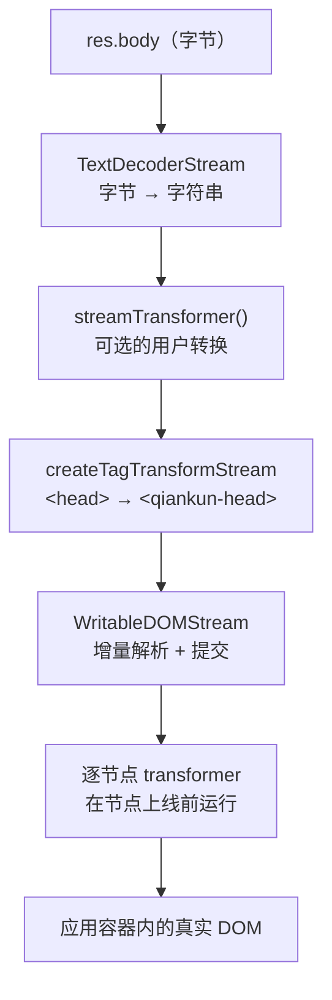

# HTML Entry 流式加载

qiankun 不要求你为每个微应用声明一份脚本和样式表的清单。你只需把它指向微应用的 `index.html` URL，qiankun 便会拉取这份 HTML、对其进行流式处理、转译其中包含的每一个资源节点，并将结果增量地提交到应用容器中。本页将解释这条流水线如何运作、entry HTML 必须满足什么样的约定，以及该机制已知的一些边界情况。

## HTML Entry 意味着什么

qiankun 中的 `entry` 就是一个普通字符串 —— 微应用 HTML 文档的 URL。

```ts
registerMicroApps([
  {
    name: 'app-react',
    entry: 'http://localhost:7101', // the micro-app's index.html
    container: '#subapp-container',
    activeRule: '/react',
  },
]);
```

这一个 URL 就是全部的接入面。qiankun 把 HTML 文档视作唯一的真相来源：文档中声明了哪些 `<script>`、`<link>` 和 `<style>` 节点，微应用就运行哪些。你无需再单独维护一份需要与构建产物保持同步的 JS/CSS bundle 列表 —— 当微应用重新构建、其 `index.html` 引用了新的带哈希文件名时，qiankun 会在下一次加载时自动识别它们。

这就是 "HTML Entry" 模型：qiankun 消费的是浏览器同样会消费的那份 HTML，只不过它把其中的资源路由到一个沙箱和一个转译器，而不是真实的文档。整个流程由 `packages/loader/src/index.ts` 中的 `loadEntry(entry, container, opts)` 驱动。

## 流式流水线

qiankun 并不会先下载整份 HTML 文档、将其解析成一个字符串、然后再插入。它构建了一条真正的 `ReadableStream` 链，使得 HTML 能够在字节从网络到达的同时被增量地解析并提交到真实 DOM。

给定 `res = await fetch(entry)`（其中 `fetch` 是一个经过装饰的 `window.fetch`，见[下文](#经过装饰的-fetch)），响应体会流经以下几个阶段：



在代码中，这条链是这样的（`packages/loader/src/index.ts`）：

```ts
res.body
  .pipeThrough(new TextDecoderStream())        // bytes → string
  .pipeThrough(streamTransformer())            // optional, only if you supply one
  .pipeThrough(createTagTransformStream(...))  // <head> → <qiankun-head>
  .pipeTo(new WritableDOMStream(container, null, (clone) => { /* per-node hook */ }));
```

每个阶段各司其职：

| 阶段 | 职责 |
| --- | --- |
| `TextDecoderStream` | 将原始字节解码为 UTF-8 字符串流。 |
| `streamTransformer` | 可选。一个用户提供的 `() => TransformStream<string, string>`（[AppConfiguration](/zh-CN/api/configuration) 上的 `streamTransformer` 选项），用于在解析前重写原始 HTML 文本 —— 例如修补硬编码的 URL。 |
| `createTagTransformStream` | 字符串级别的标签重写。用于 [head 虚拟化](#head-虚拟化)。 |
| `WritableDOMStream` | `writable-dom` 的一个分叉（`packages/loader/src/writable-dom/`）。它增量解析进入的 HTML，在同步脚本和样式表处阻塞以保持顺序，并在阻塞期间预加载其他资源。 |

因为 sink 会在数据块到达时就写入容器，微应用的 DOM 在整份文档下载完成之前就开始逐步呈现 —— 这与浏览器在顶层导航时给出的渐进式行为一致。

### 逐节点 transformer

`WritableDOMStream` 的第三个参数是一个回调，它会在**每个节点从游离的解析文档被移入真实 DOM 之前**被调用。这一时序是关键所在：节点是在仍然惰性的状态下被重写的，因此在 qiankun 有机会重写它之前，`<script>` 永远不会执行、`<link>` 永远不会对真实文档发起 fetch。

在该回调内部，qiankun 调用 `nodeTransformer(clone, transformerOpts)`。默认的节点 transformer（`defaultNodeTransformer`）委托给 `transpileAssets`，后者按标签名进行分发：

- `SCRIPT` → `transpileScript` —— classic 脚本会被包裹并指向一个沙箱作用域内的 blob URL；module 脚本则被标记为 `data-esm="true"` 并交给 [ESM 沙箱](/zh-CN/concepts/esm-sandbox)引擎。
- `LINK` → `transpileLink` —— 外部样式表和 preload，会在开启[样式隔离](/zh-CN/concepts/style-isolation)时被重写。
- `STYLE` → `transpileStyle` —— 仅在 `styleIsolation` 开启时才转译；否则原样放行。

如果你需要自行拦截节点，可以通过 [AppConfiguration](/zh-CN/api/configuration) 提供你自己的 `nodeTransformer`，不过默认实现已经覆盖了 scripts、links 和 styles。

## Head 虚拟化

微应用的 `index.html` 有一个 `<head>`。如果 qiankun 原样插入该 `<head>`，而微应用之后在运行时执行了 `document.head.appendChild(...)`（框架无时无刻不在这么做 —— 注入样式、预加载 chunk），这些节点就会落进**真实的** `document.head`，并在应用之间泄漏。

为防止这种情况，qiankun 会在**字符串级别**、在任何 DOM 被构建之前重写 head 标签。`createTagTransformStream` 被配置为恰好两条替换规则（`packages/loader/src/index.ts`）：

```ts
{ tag: '<head>',  alt: '<qiankun-head>' }
{ tag: '</head>', alt: '</qiankun-head>' }
```

于是微应用的 `<head>...</head>` 就变成了一个自定义的 `<qiankun-head>...</qiankun-head>` 元素，存活于**应用容器内部**。标签名为 `qiankun-head`（`packages/sandbox/src/consts.ts`）。

沙箱的 dynamic-append 补丁随后将 `<qiankun-head>` 当作应用的虚拟 head：当子应用向 `document.head` 追加节点时，补丁会把该节点重定向到 `container.querySelector('qiankun-head')`（`packages/sandbox/src/patchers/dynamicAppend/common.ts`）而不是真实的 `document.head`。因此，运行时的 head 追加会始终被限定在应用容器内，并在应用 unmount 时被清理。

替换机制会缓冲流数据块，并执行单次的首次匹配 `String.prototype.replace`。如果某个数据块边界把 `<head>` 标签切开了，转换会持有缓冲区直到下一个数据块补全它；一旦替换完成便会刷新并清空缓冲区。

## entry 脚本约定

在 HTML 中的所有脚本里，qiankun 需要知道哪一个才是微应用的 entry —— 即那个其导出提供了[生命周期函数](/zh-CN/concepts/lifecycle-and-props)（`bootstrap`、`mount`、`unmount`）的脚本。该脚本通过一个 `entry` 属性来标识。

```html
<script src="/app.js" entry></script>
```

qiankun 在流式处理时强制执行的规则如下（`packages/loader/src/index.ts`）：

- **有且仅有一个 entry 脚本。** 如果第二个外部脚本也带有 `entry` 属性，`loadEntry` 会抛出：

  > `QiankunError: You should not include more than 1 entry scripts in a single HTML entry`

- **只有外部脚本才能作为 entry。** 一个脚本被视为外部脚本的前提是它带有 `src` 或 `data-src` 属性。内联脚本（没有 `src`/`data-src`）永远不能作为 entry。

有三个分类辅助函数驱动这一逻辑：

| 辅助函数 | 条件 |
| --- | --- |
| `isExternalScript` | `tagName === 'SCRIPT'` 且带有 `src` 或 `data-src` |
| `isEntryScript` | 外部脚本且带有 `entry` 属性 |
| `isDeferScript` | 外部脚本且带有 `defer` 属性 |

在实践中你很少需要手动添加 `entry` 属性。[@qiankunjs/bundler-plugin](/zh-CN/ecosystem/bundler-plugin) 会在构建期为你标记正确的 entry 脚本，对 Webpack 和 Vite 都适用。

::: tip 这个属性从何而来
对于 Webpack UMD 构建，entry 属性会落在 runtime/main bundle 上。对于 Vite ESM 构建，它会落在 `<script type="module">` 上。插件对两者都做了处理 —— 你无需手动编辑 `index.html`。
:::

### Classic 与 ESM 的 entry 解析

entry 脚本可以沿着两条执行路径之一被解析，具体按脚本选择：

- **Classic**（`<script src="..." entry>`，一个 UMD/全局构建）。qiankun 会为脚本绑定 `onload`/`onerror`。当它加载完成时，entry 会从沙箱中解析出来 —— 见下文[应用导出如何被发现](#应用导出如何被发现)。
- **ESM**（`<script type="module" ... entry>`）。经过转译后，脚本会带上 `data-esm="true"` 并保持**惰性** —— qiankun 不会设置它的 `src` 来让浏览器执行它。执行改由 `EsmSandboxEngine` 驱动，完成信号则通过引擎的 `entryNamespacePromise` 传达。关于模块如何被拉取、重写和求值，见 [ESM 沙箱](/zh-CN/concepts/esm-sandbox)。

module 脚本不会在流的中途执行。当 HTML 流结束后，qiankun 调用 `esmEngine.sealAndExecute()`，它会按文档顺序运行所有 module 脚本。这与浏览器把 `type="module"` 脚本推迟到文档解析完成之后再执行的方式一致。

## defer 脚本与阻塞期间的预加载

`WritableDOMStream` 会在同步脚本和样式表处阻塞以保持执行顺序，但它并不会在所有东西上都停滞。当它因等待某个资源而阻塞时，它会**预加载**流中已经出现过的**其他资源**，从而让网络保持繁忙。

被标记为 `defer` 的脚本（外部脚本 + `defer` 属性）会被特殊处理：每个 defer 脚本都会被赋予一个 `Deferred` 并通过一个内部队列（`prepareDeferredQueue`）串联起来，因此它会等到 entry HTML 完成之后才 settle —— 这同样映射了原生 `defer` 语义，即被延迟的脚本在解析完成后按顺序运行。

## 应用导出如何被发现

一旦执行完成，qiankun 就必须从 entry 所产出的任何东西中读出微应用的生命周期对象。这一步因路径而异：

- **Classic 路径。** entry 脚本赋值一个全局变量（一个 UMD 构建会赋值 `window.<libraryName> = { bootstrap, mount, unmount }`）。沙箱膜会将脚本设置的**最后一个**全局变量记录为 `latestSetProp`。当 classic entry 脚本的 `load` 触发时，`onEntryLoaded()` 会用 `sandbox.globalThis[sandbox.latestSetProp]` 来解析 loader 的 promise。这里的时序是刻意为之的 —— qiankun 会在调用应用自身附加的任何监听器之前就捕获 `latestSetProp`，这样该值就不会被覆盖。
- **ESM 路径。** 生命周期对象就是 **entry 模块的命名空间**。引擎用模块命名空间（命名导出 `bootstrap`/`mount`/`unmount`，或一个 `export default { ... }`）来解析 `entryNamespacePromise`。

如果流结束时**没有找到显式的 `entry` 脚本**，qiankun 会回退：

- 如果存在 ESM module 脚本，则**最后一个** module 会被当作 entry（这与典型的 Vite `index.html` 相符，后者有一个单独的 `<script type="module" src="/src/main.ts">`）。
- 否则回退到 classic 的 `latestSetProp`。

解析出的值随后会被交给 `getLifecyclesFromExports`，它会按此顺序依次接受：对象本身、它的 `.default`、`latestSetProp` 全局变量，或 `window[appName]`。完整的解析顺序以及所需的导出形态，见[微应用生命周期与 props](/zh-CN/concepts/lifecycle-and-props)。

::: warning 空响应体
如果 entry 响应没有响应体，`loadEntry` 会抛出 `QiankunError: The response body of entry ... is empty`。一个空白响应或 204 响应不是有效的微应用 entry。
:::

### 经过装饰的 fetch

entry —— 以及转译器重新拉取的每一个资源 —— 都会经过一个装饰过的 `window.fetch`，其组合方式为：

```ts
makeFetchCacheable(makeFetchRetryable(makeFetchThrowable(fetch)));
```

Cacheable 在最外层（因此对同一 URL 的重复请求会被去重），然后是 retryable，再然后是 throwable（它会把非 2xx 响应转化为抛出的错误）。你可以通过 [AppConfiguration](/zh-CN/api/configuration) 上的 `fetch` 选项替换基础 `fetch`；qiankun 仍会用这三个装饰器包裹你传入的任何 fetch。

## 已知边界

这个流式 loader 是一个宏大想法的务实实现；有几个尖锐的角落值得了解。

- **Head 替换是一个朴素的首次匹配字符串替换。** `<head>` → `<qiankun-head>` 的重写是对首次出现处的一次普通 `String.prototype.replace`。源码中的一处 `FIXME` 指出，缺少 `<head>` 标签的非标准 HTML 数据块不会被处理。真实 bundler 输出的标准文档没有问题；手工编写或不寻常的 HTML 可能无法虚拟化其 head。
- **Body 虚拟化尚未实现。** 对应的 `<body>` → `<qiankun-body>` 替换在源码中存在，但被注释掉了，head/body 自动补全也被禁用了。只有 head 被虚拟化；body 内容会被直接提交进容器。
- **`sandbox: false` 会禁用 classic 导出机制。** 沙箱膜正是记录 `latestSetProp` 的地方，而 ESM 引擎也仅在沙箱开启时才存在。在 `sandbox: false` 下没有 `latestSetProp`，也没有 ESM 沙箱执行 —— 你必须依赖 `window[appName]` / 默认导出这些回退来发现生命周期。见 [JS 沙箱](/zh-CN/concepts/js-sandbox)。

## 另请参阅

- [架构总览](/zh-CN/concepts/architecture) —— loader 在加载生命周期中处于什么位置。
- [JS 沙箱](/zh-CN/concepts/js-sandbox) —— 捕获 `latestSetProp` 并限定动态 head 追加范围的那层膜。
- [ESM 沙箱](/zh-CN/concepts/esm-sandbox) —— `type="module"` entry 如何被拉取、重写和执行。
- [样式隔离](/zh-CN/concepts/style-isolation) —— `<link>` 和 `<style>` 节点在流式处理期间如何被转译。
- [微应用生命周期与 props](/zh-CN/concepts/lifecycle-and-props) —— entry 必须满足的导出约定。
- [@qiankunjs/bundler-plugin](/zh-CN/ecosystem/bundler-plugin) —— 在构建期为你标记 entry 脚本。
