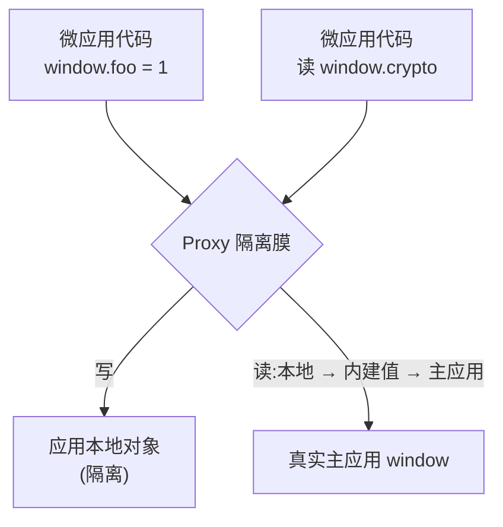

# JS 沙箱

qiankun 会把好几个微应用同时跑在一个页面上。要是没有隔离，某个应用往 `window.axios` 上挂的东西、一个忘了清的 `setInterval`、一句 `window.addEventListener('resize', …)`，都会漏到主应用和其它每一个微应用身上；更糟的是，应用卸载之后这些东西还赖着不走。JS 沙箱就是来堵这个的：它给每个微应用一份自己的虚拟全局作用域，应用一走，它留下的副作用全部还原。

这一页讲的是这套模型本身——它隔离什么、哪些地方故意不隔离、以及你唯一需要动的那个开关。属于背景知识，真要接入一个微应用你并不需要读它，因为沙箱默认就开着。

## 从使用者角度看这套模型

每个微应用都有一份自己的虚拟 `window`(`globalThis` / `self` 也是同一个)。它用起来跟真的一样，但有一处刻意的不对称，而这处不对称正是整个设计的核心：

- **写是本地的。** 应用执行 `window.foo = 1`，或者顶层写了个 `var foo`，值都落在这个应用自己的本地对象上。真正的 `window` 看不到，别的微应用也看不到。
- **读会穿透。** 应用去读一个自己没设过的全局——`window.localStorage`、`window.crypto`、`document`——查找会先看自己的本地对象，再看 qiankun 注入的那一小撮内建值(endowments)，最后落到真实的主应用 `window` 上。所以应用看到的仍然是真实的浏览器环境。

结果就是：每个应用都有一份看上去完整、却污染不了外面任何东西的命名空间。



这处不对称只朝一个方向生效。应用没法通过写污染主应用，但它仍然能**读**到真实主应用 `window` 上任何它没有遮蔽掉的东西。沙箱管的是副作用，不是安全边界。

## 两块配合工作的部件

沙箱由两部分构成，都在 `packages/sandbox` 里。

### 隔离膜(membrane)

隔离膜(`core/membrane`)是一层包住主应用 `window` 的 `Proxy`——内部叫它 *incubator context*(孵化器上下文)。上面那套读写不对称就是靠它的 proxy trap 实现的，应用眼里的 `window` 就是这个对象。qiankun 交给你微应用的正是这份被代理过的视图：生命周期钩子拿到的 `global` 参数就是隔离膜，qiankun 注入的那些运行时标记(`__POWERED_BY_QIANKUN__`、`__INJECTED_PUBLIC_PATH_BY_QIANKUN__`)也设在它上面，所以你的应用是从自己的 `window` 上读到它们的。

### 隔间(compartment)

隔离膜改的是 `window.x` 解析到哪去，但经典 UMD 脚本还会写**裸**的全局——顶层的 `var foo = …`，或者引用一个没声明的 `React`。这些从语法上就没经过 `window`，单靠 Proxy 抓不到。隔间(`core/compartment`)专门为经典脚本补上这个缺口，做法是在执行前把源码包一层，大致是这样：

```js
;(function () {
  with (this) {
    const { Array, /* …destructured intrinsics… */ } = this;
    /* original script source */
  }
}).bind(window.__compartment_globalThis__<N>__)();
```

`with (this)` 把脚本里每一个裸全局引用都绑到应用那份被代理的 `window` 上，而 `this` 就是这份隔离膜视图。qiankun 会把包好的源码通过一个 **blob URL** 跑起来，让浏览器当成普通外链脚本执行，同时又始终圈在沙箱里。`<N>` 后缀是每个实例一个的计数器，这样同一个应用起两个实例，也不会抢占同一个隔间槽位。

只有经典脚本走这条路。`<script type="module">` 交给 [ESM 沙箱](/zh-CN/concepts/esm-sandbox)处理，那是另一套引擎，读的是**同一份**隔离膜视图(通过 `sandbox.getEsmGlobalsView()`)，但它用词法分析器(lexer)去改写模块，而不是拿 `with` 包起来。两条路共享同一个应用的那一份全局命名空间。

## 隔离了哪些东西

### 全局身份

光把 `window.x` 重定向还不够——应用也能通过 `self`、`globalThis`、`top`、`parent` 摸到真正的全局。沙箱把这些重新定义，让它们都解析到沙箱 realm，而不是主应用：

| 身份 | 在沙箱里的行为 |
| --- | --- |
| `window`、`self` | 返回 realm 全局(即隔离膜)。 |
| `globalThis` | 返回 realm 全局。 |
| `top`、`parent` | 返回 realm 全局——**除非**主应用页面本身就嵌在一个 iframe 里(见[边界与逃生口](#边界与逃生口))。 |
| `document` | 起初是真实的 `document`;patcher 会把 DOM 操作重新指向应用的容器。 |
| `hasOwnProperty`、`eval` | 给了沙箱安全的定义。 |

### 副作用，以及它们的 `free()`

身份之外，沙箱还通过 **patcher**(`packages/sandbox/src/patchers`)追踪那些有状态的副作用。每个 patcher 覆写沙箱全局上的一组 API，并返回一个 `free()` 闭包。卸载时，每个 `free()` 都会执行，撤销自己造成的副作用、把原生函数还回去；它同时还返回一个 `rebuild`，供下次挂载时重新应用这层覆写。

| Patcher | 拦截 | 在何时应用 |
| --- | --- | --- |
| `patchInterval` | `setInterval` / `clearInterval`——`free()` 时清掉还活着的定时器 | 挂载时 |
| `patchWindowListener` | `window.addEventListener` / `removeEventListener`——清掉残留的监听 | 挂载时 |
| `patchHistoryListener` | history 驱动的监听 | 挂载时 |
| `patchStandardSandbox`(dynamicAppend) | `<script>` / `<style>` / `<link>` 的 `appendChild` / `insertBefore`——把它们重定向进应用容器，而不是真实的 `document.head` | bootstrap **和**挂载时 |

正因为每一处副作用都通过它的 `free()` 还原，卸载一个应用才是真的把页面还回卸载前的样子——这也正是你**必须**卸载的原因。跳过卸载，就会把那些本该被 `free()` 清掉的定时器、监听、注入的 DOM 全漏出去，重新挂载和多实例都会因此坏掉。

## 哪些是故意放行的

有几个全局是刻意**不**隔离的——隔离膜把它们直接写穿到真实的主应用 `window` 上。这是一张白名单(`core/membrane`):

```ts
const globalVariableWhiteList = ['System', '__cjsWrapper', /* + dev-only */];
```

- `System` 和 `__cjsWrapper` 永远放行。它们的存在是为了绕开 SystemJS 间接 `eval` 逃逸的问题，必须在真实 window 上可见，模块加载才能正确解析。
- 仅在开发环境下——当 `NODE_ENV` 是 `test` / `development`，或设置了 `window.__QIANKUN_DEVELOPMENT__` 时——白名单还会放行 `__REACT_ERROR_OVERLAY_GLOBAL_HOOK__`、`event`、`$RefreshReg$`、`$RefreshSig$`。这些是 React / Vite 的 HMR 和错误浮层钩子；让它们够得着主应用，正是 dev 下 fast-refresh 能工作的原因。

::: warning 别拿白名单当应用间的状态通道
这几个名字是真的会写到真实 `window` 上、被各应用共享的。把这张表当成模块加载和开发工具的实现细节看待，别把它当成应用间传值的正经渠道。要在应用之间传数据，用 props(见[应用间共享状态与通信](/zh-CN/cookbook/communicate-between-apps))。
:::

## 原生绑定与直接透传

有些浏览器 API 必须保留它原本的 `this`。透过 Proxy 去调 `fetch`，会让它脱离 `window` 从而抛 `Illegal invocation`。沙箱的处理办法是：在应用碰到这类原生函数之前，先把它们重新绑回真实 window(即它的 `useNativeWindowForBindingsProps` 集合)，这样沙箱里 `window.fetch(...)` 照常能用。

另外，`requestAnimationFrame` 和 `cancelAnimationFrame` 是直接透传给主应用的(`whitelistBOMAPIs` 集合)——它们是帧调度原语，没有什么按应用维度要清理的东西，隔离它们只会平添开销、没有收益。

## 多实例

在沙箱这一层，微应用之间什么都不共享。每一次进入 `loadApp` 都会新建一个**全新的 `StandardSandbox`**——独立的隔离膜、独立的本地对象——所以同一个应用加载两次、或者两个不同的应用，跑的都是完全独立的全局命名空间。

每次加载都会从一个按应用计的计数器(`genInstanceId(appName)`)拿到一个 `instanceId`:第一个实例是 `1`，第二个是 `2`，依此类推。有两个细节让重复实例得以正常工作：

- 隔间的 `<N>` 计数器保证每个实例拿到自己的 `__compartment_globalThis__<N>__` 槽位，所以它们包装后的经典脚本不会互相覆盖。
- 当 `instanceId > 1` 时，qiankun 会清掉这个应用的 webpack chunk 缓存(`removeWebpackChunkCacheWhenAppHaveMultiInstance`)，这样第二个实例会在自己的沙箱里重新执行一遍 bundle，而不是复用第一个实例已经缓存的模块。

::: danger 每一个实例都要卸载
多实例完全依赖各 patcher 的 `free()` 来释放监听、定时器和注入的 DOM。漏掉一个实例，它的副作用就一直活着，把下一次挂载搞坏。如果你手里握着 `loadMicroApp` 的句柄，记得对它调 `unmount()`。
:::

实操配方见[同时运行多个微应用实例](/zh-CN/cookbook/run-multiple-instances)。

## 生命周期：激活与非激活

沙箱跟着 single-spa 的 mount / unmount 走：

- **挂载**时，`sandbox.active()` 会**解锁**隔离膜。bootstrap 阶段的那些 rebuild 被重放，挂载期的 patcher 装上，动态样式表也重新挂回去。
- **卸载**时，先跑每个 patcher 的 `free()`(顺便收集下次要用的 rebuild)，再由 `sandbox.inactive()` **锁住**隔离膜。锁住期间，应用发来的全局写会被忽略(dev 下会打一条警告)。

::: info 没有快照 diff 这回事
有些沙箱方案是在挂载时把 `window` 上的每个属性记一遍快照，卸载时再 diff 回去。qiankun v3 **不是**这么干的。隔离来自"写从一开始就没碰过真实 `window`"，压根没有东西需要 diff 回去。枚举里确实有个 `SnapshotSandbox` 类型，但它没有实现——`createSandboxContainer` 永远构造 `StandardSandbox`，不管 `Proxy` 存在的分支还是缺失的分支都一样。实际上 v3 沙箱**要求**有 `Proxy`；没有降级的老路可走。
:::

## 边界与逃生口

沙箱对自己在哪儿到头这件事很坦诚。在你打算依赖它做隔离之前，先把这几条搞清楚：

- **读那些没被动过的主应用全局是允许的。** 应用能读到真实 `window` 上任何它没遮蔽的东西。隔离是单向的(挡的是写进来，不是读出去)。
- **主应用嵌套时，`top` / `parent` 会逃出去。** 如果 qiankun 主应用页面本身又被嵌在一个 iframe 里，`top` 和 `parent` 返回的是*真正*的顶层 / 父级 window，而不是沙箱 realm——这是故意的，好让嵌套主应用里的应用仍然够得着外层 frame。
- **间接 `eval` 的注意事项。** 有个已知限制：隔离膜里的间接 `eval` 会让 SystemJS 够到沙箱作用域之外。这正是 `System` 被列进白名单、而不是被隔离的原因。
- **`onGlobalSet` 是单向的。** 引擎只观测经隔离膜中转的写。如果主应用在应用的模块已经求值之后，直接往真实 `window` 上写东西，应用那些已经捕获的全局绑定不会刷新。

## 唯一的公开开关

对外就一个选项，在 [`AppConfiguration`](/zh-CN/api/configuration) 上：

| 选项 | 类型 | 默认值 | 说明 |
| --- | --- | --- | --- |
| `sandbox` | `boolean` | `true` | 开启 JS 沙箱。设为 `false` 则让应用直接跑在主应用真实的全局作用域里。 |

```ts
import { registerMicroApps } from 'qiankun';

registerMicroApps([
  {
    name: 'app1',
    entry: 'https://app1.example.com',
    container: document.getElementById('subapp')!,
    activeRule: '/app1',
    configuration: {
      sandbox: true, // default — usually you can omit it
    },
  },
]);
```

::: warning `sandbox: false` 会连 ESM 隔离一起关掉
ESM 沙箱引擎只有在 `sandbox` 打开时才会构造。把沙箱关掉，ESM 沙箱执行和经典脚本的导出机制也一并失效，应用会和主应用共享真实全局、毫无隔离。除非你有明确的理由，否则就让它开着。
:::

::: info 相较 qiankun 2.x 的变化
v3 里 `sandbox` 就是个普通 `boolean`。2.x 那种对象写法——`sandbox: { strictStyleIsolation }` / `sandbox: { experimentalStyleIsolation }` 以及基于 Shadow DOM 的样式隔离——**不存在**了。CSS 隔离现在是一个独立的布尔选项 [`styleIsolation`](/zh-CN/concepts/style-isolation)，用 CSS `@scope` at-rule 实现。见[从 qiankun 2.x 迁移](/zh-CN/cookbook/migrate-from-2x)。
:::

## 相关阅读

- [ESM 沙箱](/zh-CN/concepts/esm-sandbox)——`<script type="module">` 是怎么通过同一份隔离膜被隔离的。
- [样式隔离](/zh-CN/concepts/style-isolation)——JS 隔离在 CSS 侧的对应物，基于 `@scope`。
- [架构概览](/zh-CN/concepts/architecture)——沙箱在加载流水线里的位置。
- [微应用生命周期与 props](/zh-CN/concepts/lifecycle-and-props)——挂载 / 卸载，以及为什么卸载很重要。
- [AppConfiguration](/zh-CN/api/configuration)——每个应用的完整选项参考。
