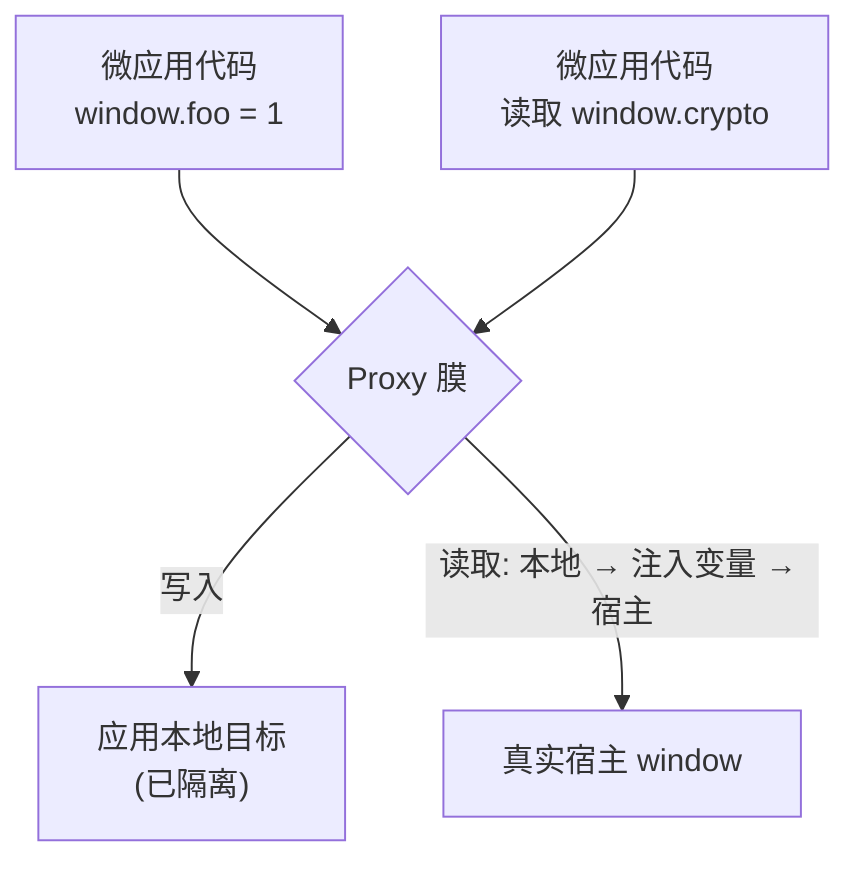

# JS 沙箱

qiankun 会在同一个页面上运行多个微应用。如果没有隔离，某个应用的 `window.axios`、一个游离的 `setInterval`，或是一个 `window.addEventListener('resize', …)` 都会泄漏到主应用以及每一个同级应用中，并且在应用卸载之后依然残留。JS 沙箱的存在正是为了防止这种情况：它为每个微应用提供了独立的虚拟全局作用域，并在应用卸载时还原每一处副作用。

本页解释这套模型、它隔离了什么、在哪些地方刻意不做隔离，以及你用来控制它的唯一开关。这属于背景知识——你并不需要了解其中任何内容就能交付一个微应用，因为沙箱默认是开启的。

## 用户视角的模型

每个微应用都会获得属于自己的虚拟 `window`（等价于 `globalThis` / `self`）。它的行为与真实的 `window` 一致，但存在一处不对称——而这正是整个设计的核心：

- **写操作是局部的。** 当应用执行 `window.foo = 1` 或顶层的 `var foo` 时，值会落在应用自己的本地目标上。真实的 `window` 永远看不到它，其他任何微应用也看不到。
- **读操作会向下穿透。** 当应用读取一个它从未设置过的全局变量时——比如 `window.localStorage`、`window.crypto`、`document`——查找会先在应用自己的本地目标上解析，然后是一小组 qiankun 提供的注入变量（endowments），最后再穿透到真实的宿主 `window`。因此应用依然能看到真实的浏览器环境。

最终得到的是一个逐应用隔离的命名空间，它看起来是完整的，却无法污染自身之外的任何东西。



这种不对称只是单向的。应用无法通过写操作污染宿主，但它仍然可以**读取**真实宿主 `window` 上任何它没有遮蔽（shadow）的内容。沙箱约束的是副作用；它不是一道安全边界。

## 两个协作的部件

沙箱由两个部分构成，二者都位于 `packages/sandbox`。

### 膜（membrane）

膜（`core/membrane`）是一个包裹着宿主 `window` 的 `Proxy`——内部称为 *incubator context*（孵化器上下文）。它通过自己的 proxy trap 实现了上述读/写不对称性，并且它就是应用眼中的 `window`。qiankun 交给你的微应用的正是这个被代理的视图：传递给生命周期钩子的 `global` 参数就是这个膜，qiankun 注入的运行时标志（`__POWERED_BY_QIANKUN__`、`__INJECTED_PUBLIC_PATH_BY_QIANKUN__`）也设置在它上面，因此你的应用能从自己的 `window` 上读到它们。

### 隔间（compartment）

膜改变了 `window.x` 解析到的内容，但一个经典的 UMD 脚本还会写入*裸*全局变量——顶层的 `var foo = …`，或是引用一个未声明的 `React`。这些在语法上并不经过 `window`，因此单靠 Proxy 无法捕获它们。隔间（`core/compartment`）为经典脚本弥补了这个缺口：它在执行前包裹源码，概念上如下：

```js
;(function () {
  with (this) {
    const { Array, /* …destructured intrinsics… */ } = this;
    /* original script source */
  }
}).bind(window.__compartment_globalThis__<N>__)();
```

`with (this)` 语句将脚本内部每一处裸全局引用都绑定到应用被代理的 `window`，而 `this` 就是那个膜视图。qiankun 通过一个 **blob URL** 来运行这段被包裹的源码，从而让浏览器把它当作一个普通的外部脚本执行，同时它仍然被限定在沙箱作用域内。`<N>` 后缀是一个逐实例递增的计数器，因此同一个应用的两个实例永远不会在同一个隔间槽位上发生冲突。

只有经典脚本会走这条路径。`<script type="module">` 由 [ESM 沙箱](/zh-CN/concepts/esm-sandbox)处理，那是一个独立的引擎，它读取*同一个*膜视图（通过 `sandbox.getEsmGlobalsView()`），但用词法分析器（lexer）来改写模块，而不是用 `with` 来包裹。两条路径为每个应用共享同一个全局命名空间。

## 哪些内容被隔离

### 全局身份标识

仅仅重定向 `window.x` 是不够的——应用还能通过 `self`、`globalThis`、`top` 或 `parent` 触及真实的全局对象。沙箱重新定义了这些标识，让它们解析到沙箱 realm 而非宿主：

| 身份标识 | 在沙箱内的行为 |
| --- | --- |
| `window`、`self` | 返回 realm 全局对象（即膜）。 |
| `globalThis` | 返回 realm 全局对象。 |
| `top`、`parent` | 返回 realm 全局对象——**除非**宿主页面本身处于一个 iframe 之中（见[边界与逃逸口](#boundaries-and-escape-hatches)）。 |
| `document` | 初始为真实的 `document`；patcher 会把 DOM 操作重新指向应用的容器。 |
| `hasOwnProperty`、`eval` | 被赋予沙箱安全的定义。 |

### 副作用及其 `free()`

除了身份标识之外，沙箱还通过 **patcher**（`packages/sandbox/src/patchers`）追踪有状态的副作用。每个 patcher 覆写沙箱全局对象上的一组 API，并返回一个 `free()` 闭包。在卸载时，每一个 `free()` 都会运行，撤销其副作用并还原原生函数；它同时会返回一个 `rebuild`，用于在下一次挂载时重新应用该覆写。

| Patcher | 拦截的目标 | 应用于 |
| --- | --- | --- |
| `patchInterval` | `setInterval` / `clearInterval`——在 `free()` 时清除仍在运行的定时器 | 挂载（Mounting） |
| `patchWindowListener` | `window.addEventListener` / `removeEventListener`——移除残留的监听器 | 挂载（Mounting） |
| `patchHistoryListener` | 由 History 驱动的监听器 | 挂载（Mounting） |
| `patchStandardSandbox` (dynamicAppend) | `<script>` / `<style>` / `<link>` 的 `appendChild` / `insertBefore`——将它们重定向进应用容器，而不是真实的 `document.head` | 引导（Bootstrapping）**以及**挂载（Mounting） |

因为每一处副作用都会通过其 `free()` 被还原，卸载一个应用确实会把页面恢复到它之前的状态——而这正是你**必须**卸载的原因。跳过卸载会泄漏那些本应由 `free()` 清理的定时器、监听器和注入的 DOM，这会同时破坏重新挂载和运行多实例的能力。

## 哪些内容被刻意放行

有少数几个全局变量是被有意*不*隔离的——膜会把它们直接写穿到真实的宿主 `window`。这是一份白名单（`core/membrane`）：

```ts
const globalVariableWhiteList = ['System', '__cjsWrapper', /* + dev-only */];
```

- `System` 和 `__cjsWrapper` 始终会泄漏。它们的存在是为了绕过 SystemJS 的一处间接 `eval` 逃逸问题，并且必须在真实的 window 上可见，模块加载才能正确解析。
- 仅在开发环境下——当 `NODE_ENV` 为 `test`/`development`，或设置了 `window.__QIANKUN_DEVELOPMENT__` 时——白名单还会放行 `__REACT_ERROR_OVERLAY_GLOBAL_HOOK__`、`event`、`$RefreshReg$` 和 `$RefreshSig$`。这些是 React / Vite 的 HMR 与错误浮层（error-overlay）钩子；让它们能触及宿主，正是 fast-refresh 在开发环境下得以工作的原因。

::: warning 不要依赖白名单来存放应用状态
这些名字确实会触及真实的 `window`，并且在各应用之间共享。请把这份列表当作模块加载与开发工具的实现细节，而不是一个受支持的、用于在应用之间共享值的通道。要在应用之间传递数据，请使用 props（见[在应用之间共享状态与通信](/zh-CN/cookbook/communicate-between-apps)）。
:::

## 原生绑定与直通

有些浏览器 API 必须保留其原始的 `this`。通过 Proxy 调用 `fetch` 会让它与 `window` 解绑并抛出 `Illegal invocation`。沙箱的处理方式是：在应用看到这些原生函数之前，把它们重新绑定到真实的 window（即其 `useNativeWindowForBindingsProps` 集合），因此 `window.fetch(...)` 在沙箱内可以正常工作。

另外，`requestAnimationFrame` 和 `cancelAnimationFrame` 被直接直通给宿主（即 `whitelistBOMAPIs` 集合）——它们是帧调度原语，没有需要追踪的逐应用清理逻辑，因此隔离它们只会增加开销而没有收益。

## 多实例

在沙箱层面，微应用之间不共享任何东西。每一次进入 `loadApp` 都会构建一个**全新的 `StandardSandbox`**——它有自己的膜和自己的本地目标——因此同一个应用被加载两次、或两个不同的应用，都会运行在完全独立的全局命名空间中。

每一次加载都会从逐应用的计数器（`genInstanceId(appName)`）获得一个 `instanceId`：第一个实例是 `1`，第二个是 `2`，以此类推。有两个细节让重复实例得以正常工作：

- 隔间的 `<N>` 计数器保证每个实例拥有自己的 `__compartment_globalThis__<N>__` 槽位，因此它们被包裹的经典脚本永远不会相互覆盖。
- 对于 `instanceId > 1` 的情况，qiankun 会清除该应用的 webpack chunk 缓存（`removeWebpackChunkCacheWhenAppHaveMultiInstance`），这样第二个实例会在自己的沙箱中重新求值其打包产物，而不是复用第一个实例已经缓存的模块。

::: danger 始终卸载每一个实例
多实例完全依赖 patcher 的 `free()` 来释放监听器、定时器和注入的 DOM。一个泄漏的实例会让它的副作用继续存活，并会破坏下一次挂载。如果你持有 `loadMicroApp` 的句柄，请对它调用 `unmount()`。
:::

实际用法请参见[运行多个微应用实例](/zh-CN/cookbook/run-multiple-instances)。

## 生命周期：激活与非激活

沙箱与 single-spa 的 mount/unmount 保持一致：

- 在**挂载**时，`sandbox.active()` 会**解锁**膜。引导阶段的 rebuild 会被重放，挂载期的 patcher 会被安装，任何动态样式表也会被重新挂载。
- 在**卸载**时，每个 patcher 的 `free()` 都会运行（为下一次收集 rebuild），然后 `sandbox.inactive()` 会**锁定**膜。在锁定状态下，来自应用的全局写操作会被忽略（开发环境下会记录一条警告）。

::: info 没有快照 diff
有些沙箱设计会在挂载时记录 `window` 上的每一个属性，并在卸载时通过 diff 来还原。qiankun v3 **不是**这样工作的。隔离来自于写操作从一开始就从不触及真实的 `window`，因此根本没有需要 diff 回去的东西。枚举中存在 `SnapshotSandbox` 类型，但它未被实现——`createSandboxContainer` 始终构造一个 `StandardSandbox`，无论是在 `Proxy` 存在还是 `Proxy` 缺失的分支中都是如此。实际上，v3 沙箱**要求** `Proxy`；不存在旧式的降级方案。
:::

## 边界与逃逸口

沙箱对自己在哪里止步这件事是诚实的。在你依赖隔离之前，先了解这些边界：

- **允许读取未被触及的宿主全局变量。** 应用可以读取真实 `window` 上任何它没有遮蔽的内容。隔离是单向的（写进来，而不是读出去）。
- **当宿主被嵌套时，`top` / `parent` 会逃逸。** 如果 qiankun 宿主页面本身被嵌入到一个 iframe 中，`top` 和 `parent` 会返回*真实的* top/parent 窗口，而不是沙箱 realm——这是有意为之的，这样一个处于嵌套宿主中的应用仍然能够触及外层框架。
- **间接 `eval` 的注意事项。** 存在一个已知的限制：膜内部的间接 `eval` 可能让 SystemJS 触及沙箱作用域之外。这正是 `System` 被列入白名单而非被隔离的原因。
- **`onGlobalSet` 是单向的。** 引擎只观察经由膜中介的写操作。如果在某个应用的模块已经求值之后，宿主直接在真实的 `window` 上写入，应用已捕获的全局绑定不会被刷新。

## 对外的开关

只有一个选项，位于 [`AppConfiguration`](/zh-CN/api/configuration) 上：

| 选项 | 类型 | 默认值 | 说明 |
| --- | --- | --- | --- |
| `sandbox` | `boolean` | `true` | 启用 JS 沙箱。设为 `false` 会让应用直接运行在宿主真实的全局作用域中。 |

```ts
import { registerMicroApps } from 'qiankun';

registerMicroApps([
  {
    name: 'app1',
    entry: 'https://app1.example.com',
    container: document.getElementById('subapp')!,
    activeRule: '/app1',
    configuration: {
      sandbox: true, // default — usually you can omit it
    },
  },
]);
```

::: warning `sandbox: false` 同时会禁用 ESM 隔离
ESM 沙箱引擎只有在 `sandbox` 开启时才会被构造。关闭沙箱同时也会禁用 ESM 沙箱执行以及经典脚本的导出机制，应用会共享宿主真实的全局变量、没有任何隔离。除非你有特定理由，否则请保持它开启。
:::

::: info 相对 qiankun 2.x 的变化
在 v3 中，`sandbox` 是一个普通的 `boolean`。2.x 中的对象形式——`sandbox: { strictStyleIsolation }` / `sandbox: { experimentalStyleIsolation }` 以及 Shadow-DOM 样式隔离——**不再存在**。CSS 隔离现在是一个独立的布尔值 [`styleIsolation`](/zh-CN/concepts/style-isolation)，用 CSS `@scope` at-rule 实现。见[从 qiankun 2.x 迁移](/zh-CN/cookbook/migrate-from-2x)。
:::

## 相关阅读

- [ESM 沙箱](/zh-CN/concepts/esm-sandbox)——`<script type="module">` 如何通过同一个膜被隔离。
- [样式隔离](/zh-CN/concepts/style-isolation)——与 JS 隔离相对应的 CSS `@scope` 方案。
- [架构总览](/zh-CN/concepts/architecture)——沙箱在加载流水线中所处的位置。
- [微应用生命周期与 props](/zh-CN/concepts/lifecycle-and-props)——mount/unmount，以及为什么卸载至关重要。
- [AppConfiguration](/zh-CN/api/configuration)——完整的逐应用选项参考。
