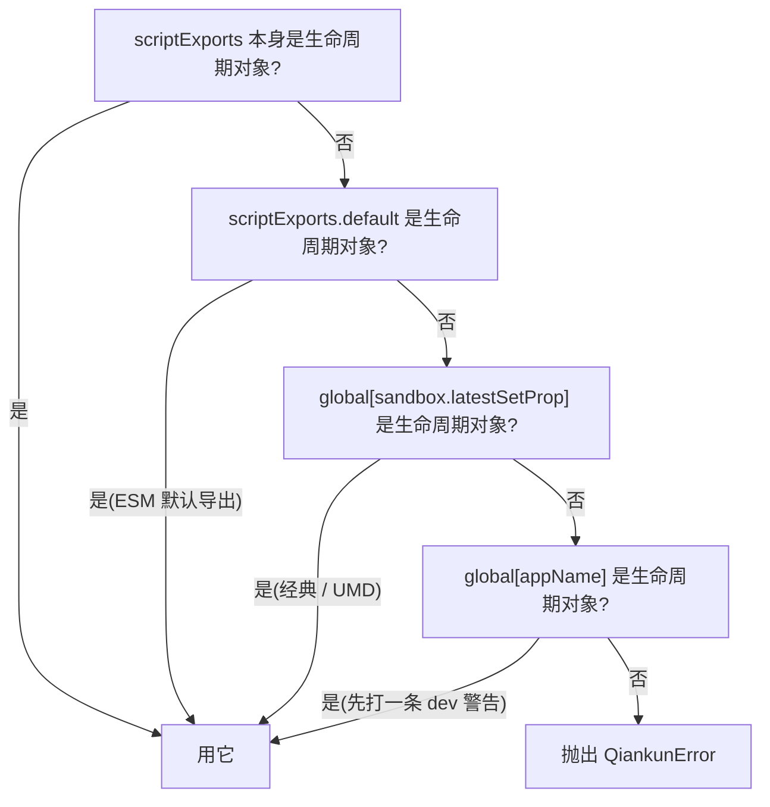
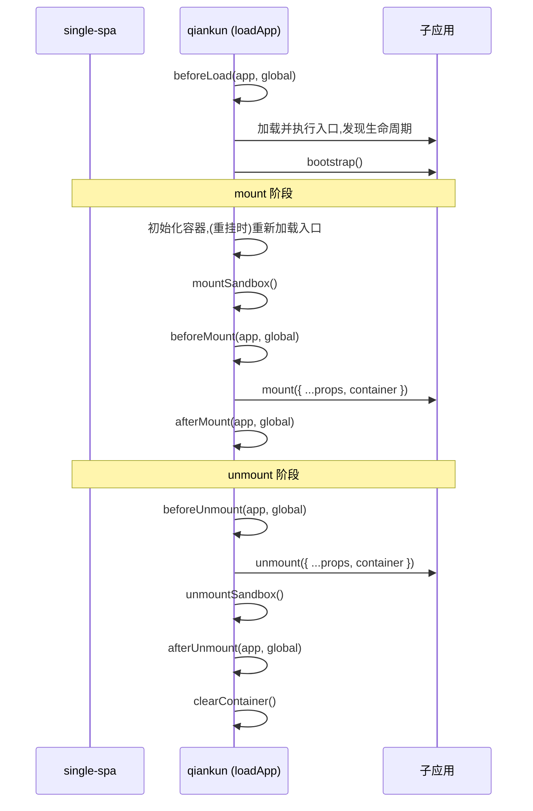

# 微应用的生命周期与 props

qiankun 加载一个微应用，靠的不是 import 某个模块、再调用一个约定好的函数。主应用交给 qiankun 的是一个 HTML 入口，qiankun 在沙箱里把它跑起来，然后得自己去*找出*子应用导出的那几个生命周期函数，再在恰当的时机把它们驱动起来。这一页讲的就是这套约定：子应用必须导出什么、qiankun 怎么找到它、qiankun 自己的钩子和子应用的生命周期差在哪，以及 props 和运行时标记是怎么传到子应用手里的。

如果你只想知道*怎么*在自己的应用里导出这些生命周期，那 [教程](/zh-CN/tutorial/build-the-micro-app) 和 [Vite](/zh-CN/cookbook/prepare-a-vite-app) / [Webpack](/zh-CN/cookbook/prepare-a-webpack-app) 那几篇更直接。这一页讲的是底下的模型。

## 微应用的导出约定

每个 qiankun 微应用都要暴露一个对象，上面挂着三个函数 —— `bootstrap`、`mount`、`unmount` —— 外加一个可选的 `update`:

```ts
export async function bootstrap() {
  // 一次性的初始化,在第一次 mount 之前只跑一次
}

export async function mount(props) {
  // 把你的应用渲染进 props.container
}

export async function unmount(props) {
  // 把你的应用视图拆掉
}

// 可选
export async function update(props) {
  // 只有 loadMicroApp 的场景、props 变化时才会被调用
}
```

qiankun 内部用 `isLifecycleObject` 校验这个对象的形状，要求 `bootstrap`、`mount`、`unmount` 三个都是函数。`update` 是可选的，只有当它确实是个函数时，才会被挂到正在运行的 parcel 上。

每个生命周期的签名都是 `(props) => Promise<void>`。完整类型是 `packages/qiankun/src/types.ts` 里的 `MicroAppLifeCycles`:

```ts
type MicroAppLifeCycles = FlattenArrayValue<ParcelLifeCycles<{ container: HTMLElement }>>;
// => { bootstrap; mount; unmount; update? }
```

根据入口脚本以哪种方式执行，qiankun 会以两种形态接收这个对象：

- **经典 / UMD** —— 入口 `<script entry src=...>` 会给一个全局变量赋值，值是 `{ bootstrap, mount, unmount, update? }`。qiankun 从沙箱里把它读回来。
- **ESM**(`<script type="module">`)—— 入口模块要么具名 `export` 出 `bootstrap` / `mount` / `unmount`，要么 `export default { bootstrap, mount, unmount }`。

这两条执行路径分别在 [JS 沙箱](/zh-CN/concepts/js-sandbox) 和 [ESM 沙箱](/zh-CN/concepts/esm-sandbox) 里有详细展开。在这一页，你只需要知道：两条路最终都会产出一个 qiankun 能找到的生命周期对象。

## qiankun 怎么找到这些生命周期

入口脚本执行完之后，qiankun 并不假定生命周期一定在某个固定的位置。`getLifecyclesFromExports`(`packages/qiankun/src/core/loadApp.ts`)按一套有先后顺序的回退规则来解析这个对象 —— 第一个命中的就用它：



逐步来看：

1. **`scriptExports` 本身** —— 如果入口解析出来的那个值已经满足 `isLifecycleObject`，就直接用。这对应 ESM 具名导出的情况(`export function mount…`)。
2. **`scriptExports.default`** —— 对应 ESM 的 `export default { bootstrap, mount, unmount }`。
3. **`global[sandbox.latestSetProp]`** —— 经典路径。`latestSetProp` 是入口脚本最后一次经由沙箱隔离膜写入的那个全局 key，所以一个执行了 `window.myApp = { bootstrap, mount, unmount }` 的 UMD 包会在这里被找到。`latestSetProp` 究竟是什么，见 [JS 沙箱](/zh-CN/concepts/js-sandbox)。
4. **`global[appName]`** —— 最后兜底的一招，用应用名去全局上查一个同名变量。qiankun 在尝试它之前会先打一条开发环境警告，因为一旦要靠它命中，通常意味着你打包工具的 `output.library` 配错了。
5. **都没命中** —— qiankun 抛出一个 `QiankunError`，告诉你它在 `latestSetProp` 和 `window[appName]` 上都找不到生命周期函数。

::: tip 配好打包工具的 library 输出
经典路径依赖你的构建产物把生命周期以 UMD 全局的形式暴露出来。[`@qiankunjs/bundler-plugin`](/zh-CN/ecosystem/bundler-plugin) 会帮你标记入口脚本、修正 `output.library`。如果你撞上了第 5 步那个错误，十有八九就是缺了这块。ESM 应用不需要这么做 —— 它们的导出是直接从模块命名空间里读的。
:::

## 框架级生命周期钩子 vs. 微应用生命周期

这里有两套都叫"生命周期"的东西，很容易混为一谈。

**子应用自己的生命周期**就是上面那几个 `bootstrap` / `mount` / `unmount` / `update` 函数。它们由子应用作者来写，qiankun 负责发现并调用。

**框架级生命周期钩子**则是那个可选的 `LifeCycles` 对象，由*主应用*传给 [`registerMicroApps`](/zh-CN/api/register-micro-apps) 或 [`loadMicroApp`](/zh-CN/api/load-micro-app)，让外壳能观察每个应用的状态切换：

```ts
type LifeCycleFn<T> = (app: LoadableApp<T>, global: WindowProxy) => Promise<void>;

type LifeCycles<T> = {
  beforeLoad?: LifeCycleFn<T> | Array<LifeCycleFn<T>>;
  beforeMount?: LifeCycleFn<T> | Array<LifeCycleFn<T>>;
  afterMount?: LifeCycleFn<T> | Array<LifeCycleFn<T>>;
  beforeUnmount?: LifeCycleFn<T> | Array<LifeCycleFn<T>>;
  afterUnmount?: LifeCycleFn<T> | Array<LifeCycleFn<T>>;
};
```

| | 子应用生命周期 | 框架钩子(`LifeCycles`) |
| --- | --- | --- |
| 谁来写 | 微应用作者 | 主应用 |
| 名字 | `bootstrap` / `mount` / `unmount` / `update?` | `beforeLoad` / `beforeMount` / `afterMount` / `beforeUnmount` / `afterUnmount` |
| 签名 | `(props) => Promise<void>` | `(app, global) => Promise<void>` |
| 第二个参数 | — | `global` —— 沙箱化的 `WindowProxy`，不是子应用的导出 |
| 在哪声明 | 从入口导出 | 传给 `registerMicroApps` / `loadMicroApp` |

要紧的一点：框架钩子的第二个参数是这个应用对应的沙箱化 `WindowProxy` —— 也就是子应用看到的那个被代理过的 `window` —— 而不是子应用导出的生命周期对象。完整参考见 [生命周期钩子](/zh-CN/api/lifecycles)。

每个钩子既可以是单个函数，也可以是一个数组；qiankun 用 `execHooksChain` 按顺序依次执行它们，而内置 addon 的钩子会被拼接在你的钩子*前面*(见下文的[运行时标记](#挂在代理-window-上的运行时标记))。

## 每个钩子在什么时机跑

`beforeLoad` 和其余几个并不在同一个阶段执行。`beforeLoad` 跑在 `loadApp` 主体的很早期 —— 同步执行，甚至在入口的生命周期被 await 之前就跑了。另外四个则落在 parcel 的 single-spa mount / unmount 数组里，包在子应用自己的 `mount` / `unmount` 前后：



mount 数组的顺序：初始化容器、(重挂时)重新加载入口 HTML → 激活沙箱 → `beforeMount` 钩子 → 子应用的 `mount({ ...props, container })` → `afterMount` 钩子。unmount 数组则是镜像过来的：`beforeUnmount` → 子应用的 `unmount({ ...props, container })` → 停用沙箱 → `afterUnmount` → 清空容器。

有一个后果值得单拎出来说：**重挂**(remount)时，qiankun 会重新加载入口 HTML，但会把里面所有的 `<script>` 节点都剥掉(通过 `getPureHTMLStringWithoutScripts`)。这些脚本在首次 mount 时已经执行过了，再跑一遍会让应用被执行两次。所以 DOM 会被重建，但 JS 不会重新抓取、也不会重新执行 —— 只是对着这个刚重建好的容器，再调用一次子应用的 `mount()`。

## props 和状态怎么传到子应用

qiankun 没有内置的跨应用状态库。状态是通过 single-spa 的 `customProps` 再加上一个 qiankun 注入的字段流进去的。

::: warning v3 里没有 initGlobalState
qiankun 2.x 的全局状态 API —— `initGlobalState`、`onGlobalStateChange`、`setGlobalState`、`MicroAppStateActions` —— **在 v3 里不存在了**。应用间通信请通过 `props` 传回调和共享对象，或者用你自己的 store / 事件总线。见 [应用间共享状态与通信](/zh-CN/cookbook/communicate-between-apps)。
:::

注册或加载一个应用时声明这些 props:

::: code-group

```ts [registerMicroApps]
import { registerMicroApps } from 'qiankun';

registerMicroApps([
  {
    name: 'app1',
    entry: '//localhost:7100',
    container: document.getElementById('subapp-container')!,
    activeRule: '/app1',
    props: {
      user: currentUser,
      onEvent: (payload) => { /* ... */ },
    },
  },
]);
```

```ts [loadMicroApp]
import { loadMicroApp } from 'qiankun';

const micro = loadMicroApp({
  name: 'app1',
  entry: '//localhost:7100',
  container: document.getElementById('subapp-container')!,
  props: { user: currentUser },
});
```

:::

这些 `props` 会变成 single-spa 的 `customProps`，注入到每一次生命周期调用里。在此之上，qiankun 还总会往传给 `mount` 和 `unmount` 的 props 里注入一个 `container: HTMLElement` —— 也就是子应用该往里渲染的那个 DOM 节点。于是每个生命周期收到的，是你的 `customProps`、single-spa 的标准 props(`name`、`singleSpa`、`mountParcel`……)以及 qiankun 的 `container` 三者合并后的结果：

```ts
export async function mount(props) {
  const { container, user } = props;
  // 渲染进 qiankun 给的节点,别用写死的全局选择器
  root = createRoot(container.querySelector('#root'));
  root.render(<App user={user} />);
}
```

::: danger 渲染进 props.container，别渲染进 document
子应用跑在一份虚拟化的 DOM 视图里，所以它必须挂载到 `props.container`，而不是真实页面上写死的 `document.getElementById(...)`。写死一个全局选择器会破坏隔离，也会让多实例渲染出问题。见 [同时运行多个微应用实例](/zh-CN/cookbook/run-multiple-instances)。
:::

对 `loadMicroApp` 来说，它返回的 [`MicroApp`](/zh-CN/api/types) 句柄上还暴露了 `update(props)`，如果子应用导出了 `update` 生命周期，它就会被调到 —— 这是把新的 props 推给一个已挂载应用的唯一一条生命周期通路。

## 挂在代理 window 上的运行时标记

在挂载之前，qiankun 的两个内置 addon 会往子应用的**代理** `window` 上设两个标记。因为子应用是透过沙箱隔离膜读 `window` 的，这两个标记在它看来就是普通的全局变量：

| 标记 | 由谁设置 | 值 | 作用 |
| --- | --- | --- | --- |
| `__POWERED_BY_QIANKUN__` | `engineFlag` addon | `true` | 让子应用能判断出自己正跑在 qiankun 里 |
| `__INJECTED_PUBLIC_PATH_BY_QIANKUN__` | `runtimePublicPath` addon | `entry` 的 origin + 目录 | 子应用动态资源的运行时 public path |

`engineFlag` addon 在 `beforeLoad` / `beforeMount` 里设置 `__POWERED_BY_QIANKUN__ = true`，并在 `beforeUnmount` 里把它 `delete` 掉。`runtimePublicPath` addon 在 `beforeLoad` 里设置 `__INJECTED_PUBLIC_PATH_BY_QIANKUN__`(重挂时在 `beforeMount` 里再设一次)，卸载时再还原回去。

子应用一般在启动时就用第一个标记来分岔：

```ts
if (window.__POWERED_BY_QIANKUN__) {
  // qiankun 会来调 bootstrap/mount/unmount;这里别自己渲染
} else {
  // 独立运行:直接渲染
  render();
}
```

对 Webpack 应用来说，把 `__INJECTED_PUBLIC_PATH_BY_QIANKUN__` 接到 `__webpack_public_path__` 上，才能让懒加载的 chunk 按正确的 origin 去解析。具体那段代码见 [Webpack 接入指南](/zh-CN/cookbook/prepare-a-webpack-app)。

## 重挂 vs. 卸载(unload)的语义

qiankun 区分 single-spa 的 `unmount`(把应用藏起来、但保持"温热")和 `unload`(彻底拆掉)。这个区别之所以重要，是因为经典路径和 ESM 路径在重挂时的行为不一样。

**重挂(unmount 之后再 mount)。** 应用的 DOM 在 unmount 时被清空、在下一次 mount 时重建，沙箱也随之停用、再激活。但两条执行路径对*代码*的处理方式不同：

- **经典** —— 入口脚本在每次重挂时都会**重新执行**，顶层代码每次都会再跑一遍。
- **ESM** —— 模块图**不会**重新执行。重挂复用同一个 blob URL，而 `import(sameBlobUrl)` 返回的是同一份模块命名空间，所以模块顶层代码在应用的整个生命周期里只执行一次。只有 `mount(props)` 会再跑。

::: warning ESM 应用必须在 mount() 里创建状态
因为 ESM 顶层代码只跑一次，一个在模块顶层就实例化框架应用或全局状态的 ESM 子应用，在重挂时不会重新创建它们。请把应用实例的创建放*进* `mount()` 里，并在 `unmount()` 里销毁它。这本来也是现代框架的惯常写法，而且它正好契合 [ESM 沙箱](/zh-CN/concepts/esm-sandbox) 缓存模块的方式。
:::

对于命中缓存的重挂(同一个应用、同一个容器),qiankun 还会把 `bootstrap` 替换成一个空操作，这样一次性的初始化就绝不会跑第二遍。

**卸载(unload，彻底拆掉)。** 只有在 single-spa 的 `unload` 生命周期里，qiankun 才会销毁 ESM realm:`EsmSandboxEngine.dispose()` 会撤销引擎创建过的每一个 blob URL，并注销该实例的 realm。unload 之后，下一次激活会用一个全新的引擎从头重跑 `loadApp`。`dispose()` 挂的是 `unload`,**不是** `unmount` —— 所以一个已 unmount 但未 unload 的 ESM 应用，它的 realm 和命名空间仍然驻留在内存里。

::: info loadMicroApp 没有 unload
`loadMicroApp` 创建的 parcel 没有 `unload` 语义，所以它们的 ESM 引擎会一直挂着，直到你丢掉那个返回的句柄引用为止。用不到的句柄，记得调 `unmount()`。见 [同时运行多个微应用实例](/zh-CN/cookbook/run-multiple-instances)。
:::

## 延伸阅读

- [registerMicroApps](/zh-CN/api/register-micro-apps) 和 [loadMicroApp](/zh-CN/api/load-micro-app) —— 两个入口 API 及它们的 `props`。
- [生命周期钩子(LifeCycles)](/zh-CN/api/lifecycles) —— 框架级钩子的完整参考。
- [AppConfiguration](/zh-CN/api/configuration) —— `sandbox`、`styleIsolation` 以及其余的单应用配置项。
- [JS 沙箱](/zh-CN/concepts/js-sandbox) 和 [ESM 沙箱](/zh-CN/concepts/esm-sandbox) —— 经典与 ESM 两种发现方式背后的执行路径。
- [从 qiankun 2.x 迁移](/zh-CN/cookbook/migrate-from-2x) —— 都变了什么，包括被移除的全局状态 API。
