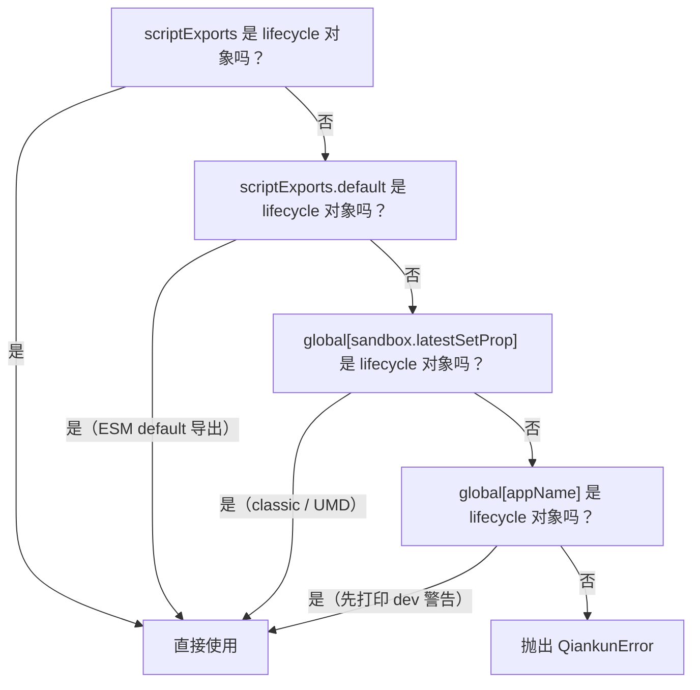
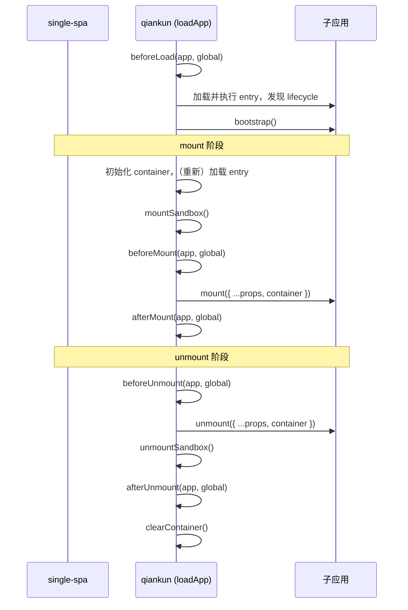

# 微应用的 lifecycle 与 props

qiankun 微应用并不是通过 import 一个模块、再调用某个约定好的函数来加载的。相反，主应用把一个 HTML Entry 交给 qiankun，qiankun 在沙箱中执行它，然后需要 _发现_ 子应用导出的 lifecycle 函数，并在恰当的时机驱动它们。本文讲解这套约定：子应用必须导出什么、qiankun 如何找到它、qiankun 自身的钩子与子应用的 lifecycle 有何区别，以及 props 和运行时标志是如何传递到子应用的。

如果你只想知道 _如何_ 从自己的应用中导出 lifecycle，[教程](/zh-CN/tutorial/build-the-micro-app)以及 [Vite](/zh-CN/cookbook/prepare-a-vite-app) / [Webpack](/zh-CN/cookbook/prepare-a-webpack-app) 指南会更直接。本文讲的是背后的模型。

## 微应用导出约定

每个 qiankun 微应用都必须暴露一个包含三个函数（`bootstrap`、`mount`、`unmount`）的对象，外加一个可选的 `update`：

```ts
export async function bootstrap() {
  // one-time setup, runs once before the first mount
}

export async function mount(props) {
  // render your app into props.container
}

export async function unmount(props) {
  // tear your app's view down
}

// optional
export async function update(props) {
  // only invoked for loadMicroApp parcels, when props change
}
```

在内部，qiankun 通过 `isLifecycleObject` 校验其结构，要求 `bootstrap`、`mount` 和 `unmount` 都必须是函数。`update` 是可选的，只有当它确实是一个函数时，才会被挂到运行中的 parcel 上。

每个 lifecycle 都是一个 `(props) => Promise<void>`。完整类型是 `packages/qiankun/src/types.ts` 中的 `MicroAppLifeCycles`：

```ts
type MicroAppLifeCycles = FlattenArrayValue<ParcelLifeCycles<{ container: HTMLElement }>>;
// => { bootstrap; mount; unmount; update? }
```

根据 entry 脚本的运行方式不同，qiankun 会以两种形态接收这个对象：

- **Classic / UMD** —— entry `<script entry src=...>` 会赋值一个全局变量，其值为 `{ bootstrap, mount, unmount, update? }`。qiankun 从沙箱中把它读回来。
- **ESM**（`<script type="module">`）—— entry 模块要么以具名方式 `export` 出 `bootstrap` / `mount` / `unmount`，要么执行 `export default { bootstrap, mount, unmount }`。

这两条执行路径分别在 [JS 沙箱](/zh-CN/concepts/js-sandbox)和 [ESM 沙箱](/zh-CN/concepts/esm-sandbox)中有深入讲解。这里要关注的是：两者最终都会产出一个 qiankun 能够找到的 lifecycle 对象。

## qiankun 如何发现 lifecycle

在 entry 执行完毕后，qiankun 并不会假定导出位置是固定的。`getLifecyclesFromExports`（`packages/qiankun/src/core/loadApp.ts`）会通过一套有序的回退策略来解析 lifecycle 对象 —— 第一个命中的即为结果：



逐步说明：

1. **`scriptExports` 本身** —— 如果 entry 解析出的值本身就满足 `isLifecycleObject`，则直接使用它。这就是 ESM 具名导出的情形（`export function mount…`）。
2. **`scriptExports.default`** —— 即 ESM `export default { bootstrap, mount, unmount }` 的情形。
3. **`global[sandbox.latestSetProp]`** —— classic 路径。`latestSetProp` 是 entry 脚本通过沙箱 membrane 写入的最后一个全局键，因此一个执行 `window.myApp = { bootstrap, mount, unmount }` 的 UMD 包会在这里被发现。关于 `latestSetProp` 是什么，参见 [JS 沙箱](/zh-CN/concepts/js-sandbox)。
4. **`global[appName]`** —— 最后的兜底手段，会查找一个以应用名命名的全局变量。qiankun 在尝试这一步之前会打印一条开发环境警告，因为依赖它通常意味着你的 bundler 的 `output.library` 配置有误。
5. **否则** —— qiankun 抛出一个 `QiankunError`，告诉你它无法在 `latestSetProp` 或 `window[appName]` 上找到 lifecycle 函数。

::: tip 配置你的 bundler 的 library 输出
classic 路径依赖你的产物以 UMD 全局变量的形式暴露其 lifecycle。[`@qiankunjs/bundler-plugin`](/zh-CN/ecosystem/bundler-plugin) 会为你标记 entry 脚本并修正 `output.library`。如果你遇到了第 5 步的错误，那几乎总是因为缺了这一环。ESM 应用不需要它 —— 它们的导出会直接从模块命名空间中读取。
:::

## 框架 lifecycle 钩子 vs. 微应用 lifecycle

存在两套截然不同的“lifecycle”，很容易被混为一谈。

**子应用自身的 lifecycle** 是上面那些 `bootstrap` / `mount` / `unmount` / `update` 函数。它们由子应用作者编写；qiankun 负责发现并调用它们。

**框架 lifecycle 钩子** 是 _主应用_ 传给 [`registerMicroApps`](/zh-CN/api/register-micro-apps) 或 [`loadMicroApp`](/zh-CN/api/load-micro-app) 的那个可选的 `LifeCycles` 对象。它们让主应用（shell）得以观察每个应用的状态迁移：

```ts
type LifeCycleFn<T> = (app: LoadableApp<T>, global: WindowProxy) => Promise<void>;

type LifeCycles<T> = {
  beforeLoad?: LifeCycleFn<T> | Array<LifeCycleFn<T>>;
  beforeMount?: LifeCycleFn<T> | Array<LifeCycleFn<T>>;
  afterMount?: LifeCycleFn<T> | Array<LifeCycleFn<T>>;
  beforeUnmount?: LifeCycleFn<T> | Array<LifeCycleFn<T>>;
  afterUnmount?: LifeCycleFn<T> | Array<LifeCycleFn<T>>;
};
```

| | 子应用 lifecycle | 框架钩子（`LifeCycles`） |
| --- | --- | --- |
| 谁来编写 | 微应用作者 | 主应用 |
| 名称 | `bootstrap` / `mount` / `unmount` / `update?` | `beforeLoad` / `beforeMount` / `afterMount` / `beforeUnmount` / `afterUnmount` |
| 签名 | `(props) => Promise<void>` | `(app, global) => Promise<void>` |
| 第二个参数 | —— | `global` —— **沙箱化的 `WindowProxy`**，而非子应用的导出 |
| 声明位置 | 从 entry 导出 | 传给 `registerMicroApps` / `loadMicroApp` |

关键细节是：框架钩子的第二个参数是该应用沙箱化的 `WindowProxy` —— 也就是子应用所看到的那个被代理的 `window` —— 而不是子应用导出的 lifecycle 对象。完整参考见 [Lifecycle 钩子](/zh-CN/api/lifecycles)。

每个钩子既可以是单个函数，也可以是一个数组；qiankun 通过 `execHooksChain` 顺序执行它们，且内置 addon 的钩子会被拼接在 _你的_ 钩子 _之前_（见下文[代理 window 上的运行时标志](#runtime-flags-on-the-proxied-window)）。

## 各钩子的执行时机

`beforeLoad` 与其余钩子并不都在同一阶段执行。`beforeLoad` 在 `loadApp` 主体的早期就会运行 —— 是同步执行的，甚至早于对 entry lifecycle 的 await。另外四个则运行在 parcel 的 single-spa mount 与 unmount 数组之中，围绕着子应用自身的 `mount` / `unmount`：



mount 数组的顺序为：初始化 container 并（在 remount 时）重新加载 entry HTML → 激活沙箱 → `beforeMount` 钩子 → 子应用的 `mount({ ...props, container })` → `afterMount` 钩子。unmount 数组则与之对称：`beforeUnmount` → 子应用的 `unmount({ ...props, container })` → 停用沙箱 → `afterUnmount` → 清空 container。

有一个值得单独指出的后果：在 **remount** 时，qiankun 会重新加载 entry HTML，但会剥离掉其中所有的 `<script>` 节点（通过 `getPureHTMLStringWithoutScripts`）。这些脚本在第一次 mount 时已经执行过了；再次执行它们会导致应用被重复执行。因此 DOM 会被重建，但 JS 既不会重新拉取也不会重新执行 —— 子应用的 `mount()` 会针对全新重建的 container 再次被调用。

## props 与状态如何传递到子应用

qiankun 并不内置跨应用状态存储。状态是通过 single-spa 的 `customProps` 再加上一个由 qiankun 注入的字段流入的。

::: warning v3 中没有 initGlobalState
qiankun 2.x 的全局状态 API —— `initGlobalState`、`onGlobalStateChange`、`setGlobalState`、`MicroAppStateActions` —— **在 v3 中不复存在**。要做应用间通信，请通过 `props` 传递回调和共享对象，或使用你自己的 store / 事件总线。参见[在应用间共享状态与通信](/zh-CN/cookbook/communicate-between-apps)。
:::

你在注册或加载应用时声明 props：

::: code-group

```ts [registerMicroApps]
import { registerMicroApps } from 'qiankun';

registerMicroApps([
  {
    name: 'app1',
    entry: '//localhost:7100',
    container: document.getElementById('subapp-container')!,
    activeRule: '/app1',
    props: {
      user: currentUser,
      onEvent: (payload) => { /* ... */ },
    },
  },
]);
```

```ts [loadMicroApp]
import { loadMicroApp } from 'qiankun';

const micro = loadMicroApp({
  name: 'app1',
  entry: '//localhost:7100',
  container: document.getElementById('subapp-container')!,
  props: { user: currentUser },
});
```

:::

这些 `props` 会成为 single-spa 的 `customProps`，注入到每一次 lifecycle 调用中。在此之上，qiankun 总会向传给 `mount` 和 `unmount` 的 props 中注入 `container: HTMLElement` —— 即子应用应当渲染进去的那个 DOM 节点。因此每个 lifecycle 收到的是：你的 `customProps` 与 single-spa 的标准 props（`name`、`singleSpa`、`mountParcel` …）以及 qiankun 的 `container` 三者的合并结果：

```ts
export async function mount(props) {
  const { container, user } = props;
  // render into the qiankun-provided node, never a hard-coded global selector
  root = createRoot(container.querySelector('#root'));
  root.render(<App user={user} />);
}
```

::: danger 渲染到 props.container，而非 document
由于子应用运行在一个虚拟化的 DOM 视图内，它必须挂载到 `props.container`，而不是真实页面上硬编码的 `document.getElementById(...)`。硬编码全局选择器会破坏隔离性以及多实例渲染。参见[运行多个微应用实例](/zh-CN/cookbook/run-multiple-instances)。
:::

对于 `loadMicroApp`，其返回的 [`MicroApp`](/zh-CN/api/types) 句柄还暴露了 `update(props)`，若子应用导出了 `update` lifecycle，它便会调用之 —— 这是把新 props 推送到一个已挂载应用中的唯一 lifecycle 途径。

## 代理 window 上的运行时标志

在 mount 之前，qiankun 的两个内置 addon 会在子应用的 **代理** `window` 上设置一对标志。由于子应用是通过沙箱 membrane 读取 `window` 的，这些标志在它看来就是普通的全局变量：

| 标志 | 由谁设置 | 值 | 用途 |
| --- | --- | --- | --- |
| `__POWERED_BY_QIANKUN__` | `engineFlag` addon | `true` | 让子应用能检测到自己正运行于 qiankun 之下 |
| `__INJECTED_PUBLIC_PATH_BY_QIANKUN__` | `runtimePublicPath` addon | `entry` 的 origin + 目录 | 子应用动态资源的运行时 public path |

`engineFlag` addon 会在 `beforeLoad` / `beforeMount` 中设置 `__POWERED_BY_QIANKUN__ = true`，并在 `beforeUnmount` 中 `delete` 它。`runtimePublicPath` addon 会在 `beforeLoad` 中设置 `__INJECTED_PUBLIC_PATH_BY_QIANKUN__`（并在 remount 时于 `beforeMount` 中再次设置），并在 unmount 时将其恢复。

子应用通常会在启动时根据第一个标志进行分支：

```ts
if (window.__POWERED_BY_QIANKUN__) {
  // qiankun will call bootstrap/mount/unmount; don't self-render here
} else {
  // standalone: render immediately
  render();
}
```

对于 Webpack 应用，把 `__INJECTED_PUBLIC_PATH_BY_QIANKUN__` 接入 `__webpack_public_path__`，正是让懒加载的 chunk 能针对正确的 origin 进行解析的关键。[Webpack 指南](/zh-CN/cookbook/prepare-a-webpack-app)展示了确切的代码片段。

## Remount 与 unload 语义

qiankun 区分了 single-spa 的 `unmount`（隐藏应用，但保持其“温热”）与 `unload`（彻底拆除）。这一区别之所以重要，是因为 classic 与 ESM 两条路径在 remount 时的行为并不相同。

**Remount（unmount 之后再 mount）。** 应用的 DOM 在 unmount 时被清空，并在下一次 mount 时重建，同时沙箱先被停用再被重新激活。但两条执行路径对 _代码_ 的处理方式不同：

- **Classic** —— entry 脚本在每次 remount 时都会**重新执行**。顶层代码每次都会再跑一遍。
- **ESM** —— 模块图**不会**重新运行。remount 复用同一个 blob URL，而 `import(sameBlobUrl)` 会返回同一个模块命名空间，因此顶层模块代码在应用的整个生命周期内只执行一次。只有 `mount(props)` 会再次运行。

::: warning ESM 应用必须在 mount() 内部创建状态
由于 ESM 顶层代码只执行一次，一个在模块顶层实例化其框架应用或全局状态的 ESM 子应用，在 remount 时并不会重新创建它们。请在 `mount()` _内部_ 创建应用实例，并在 `unmount()` 中销毁它。无论如何这本就是现代框架的推荐模式，而且它与 [ESM 沙箱](/zh-CN/concepts/esm-sandbox)缓存模块的方式相契合。
:::

对于一次缓存命中的 remount（同一应用、同一 container），qiankun 还会把 `bootstrap` 替换为一个空操作（no-op），以确保一次性的初始化设置绝不会跑第二遍。

**Unload（彻底拆除）。** 只有在 single-spa 的 `unload` lifecycle 上，qiankun 才会释放 ESM realm：`EsmSandboxEngine.dispose()` 会撤销该引擎创建的每一个 blob URL，并注销该实例的 realm。unload 之后，下一次激活会用一个全新的引擎从头重跑 `loadApp`。`dispose()` 挂接在 `unload` 上，而**非** `unmount` —— 因此一个已 unmount 但尚未 unload 的 ESM 应用，会让其 realm 与命名空间继续驻留内存。

::: info loadMicroApp 没有 unload
由 `loadMicroApp` 创建的 parcel 没有 `unload` 语义，因此它们的 ESM 引擎会一直存续，直到你丢弃对返回句柄的引用为止。对于不再需要的句柄，请务必调用 `unmount()`。参见[运行多个微应用实例](/zh-CN/cookbook/run-multiple-instances)。
:::

## 另见

- [registerMicroApps](/zh-CN/api/register-micro-apps) 与 [loadMicroApp](/zh-CN/api/load-micro-app) —— 两个入口及其 `props`。
- [Lifecycle 钩子（LifeCycles）](/zh-CN/api/lifecycles) —— 框架级钩子的完整参考。
- [AppConfiguration](/zh-CN/api/configuration) —— `sandbox`、`styleIsolation` 以及其余的每应用配置项。
- [JS 沙箱](/zh-CN/concepts/js-sandbox)与 [ESM 沙箱](/zh-CN/concepts/esm-sandbox) —— classic 与 ESM 发现机制背后的执行路径。
- [从 qiankun 2.x 迁移](/zh-CN/cookbook/migrate-from-2x) —— 有哪些变化，包括被移除的全局状态 API。
