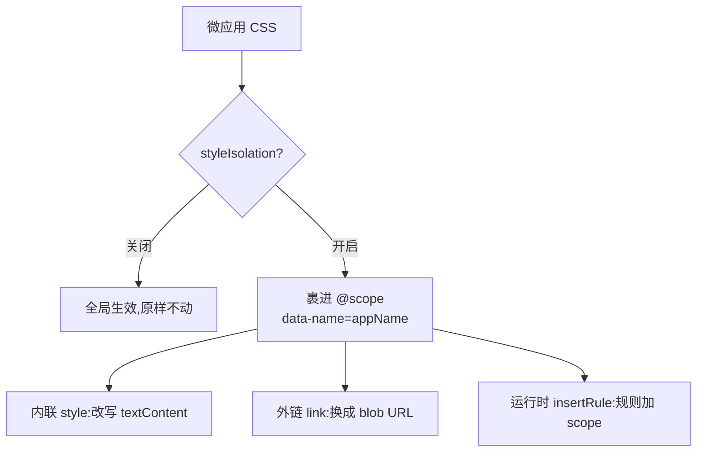

# 样式隔离

样式隔离要解决的是：别让一个微应用的 CSS 漏出去，污染到主应用或者旁边的其他微应用。qiankun v3 里这是一套按需开启的运行时机制，底层用的是浏览器原生的 CSS [`@scope`](https://developer.mozilla.org/en-US/docs/Web/CSS/@scope) 规则，而不是 Shadow DOM。开启之后，微应用带进来的每一张样式表都会被改写，让它的规则只在这个应用自己的容器内部生效。

这一页讲清楚它做了什么、为什么是这个形态、边界在哪。想知道怎么打开，看 [AppConfiguration](/zh-CN/api/configuration)，以及操作向导[开启 CSS 样式隔离](/zh-CN/cookbook/enable-style-isolation)。

## 它是什么

在某个应用的配置里设上 `styleIsolation: true`,qiankun 就会把这个应用的 CSS 裹进一个绑定到应用容器的 `@scope` 块里：

```css
@scope ([data-name="your-app"]) {
  /* the app's rules, rewritten */
}
```

scope 根节点永远是 `[data-name="<appName>"]`。qiankun 会给每个应用容器打上一个 `data-name` 属性，值就是注册时的应用名，选择器由此推导出来。这个不能自定义——没有选项让你传自己的 scope 根。因为包裹发生在 CSS 这一层，而不是把应用挂进一棵 shadow 树里，微应用的 DOM 还留在主文档中：全局库、portal、`document` 层面的查询，都还按 [JS 沙箱](/zh-CN/concepts/js-sandbox)预期的那样工作。

隔离在设计上是单向的：它拦的是微应用自己声明的规则跑到容器外面去，但不负责挡住主应用或者浏览器默认样式表往微应用**里面**推的样式。



样式隔离默认关闭。只要你不设 `styleIsolation`,`<style>` 和 `<link>` 节点就原封不动地穿过 loader。

## 内联 `<style>`

对一个内联 `<style>` 元素，qiankun 读它的 `textContent`，做转换，再把加了 scope 的结果写回同一个节点。除了外面那层 `@scope` 包裹，这次转换还得处理几件光靠包裹会搞错的事：

- **`@font-face` 和 `@namespace` 会被提出来**，移出 `@scope` 块保持全局。给 `@font-face` 加 scope 会让字体加载失败，`@namespace` 又必须是文档级的，所以这两个都被拎回样式表顶部。
- **`@keyframes` 会被重命名**，加上一个按应用区分的前缀——`__qk_<appName>_<name>`——每一处 `animation` / `animation-name` 引用也跟着改。这样两个都定义了 `spin` keyframe 的应用就不会互相顶掉，因为 `@scope` 只给选择器加作用域，管不到全局的 keyframe 命名空间。
- **相对路径的 `url(...)` 会被解析**，以样式表的 base URL 为基准解析，这样 CSS 被搬走之后，背景图之类的资源还是指向微应用自己的源。`data:`、`blob:` 和绝对的 `http(s):` URL 则保持不动。
- **`@import` 会被递归内联进来。** 每一张被导入的样式表都通过应用那份装饰过的 `fetch` 拉回来，以同样的方式转换后拼进去，并基于一个已访问集合去重。有 `@import` 的时候，转换之所以变成异步的，就是因为这个。

因为内联 `@import` 可能要走网络往返，qiankun 会先同步把 `<style>` 的 `textContent` 清空，等一切解析完成再填入加了 scope 的 CSS。这样在拉取的那段时间窗口里，没加 scope 的源码就不会全局生效。

## 外部 `<link rel="stylesheet">`

原生 `@scope` 只能包裹你能控制的 CSS 文本，可浏览器加载外部样式表是不透明的——它到达的时候没有任何钩子能把它包起来。所以在样式隔离下，qiankun 会阻止浏览器原生加载 `<link>`，转而自己接管拉取，采用代码库里称作 blob-link 的方式：

1. 以 base URL 为基准解析 `href`，然后**移除 `href` 属性**，把原始值暂存到 `data-href` 下。没了 `href`，浏览器就永远不会加载那张未加 scope 的样式表。
2. 通过应用那份装饰过的 `fetch` **拉取 CSS**，再让它经过与内联样式相同的 `@scope` 包裹转换。
3. 在**同一个** `<link>` 元素上以 `blob:` URL 的形式**提供它**:包裹后的 CSS 变成一个 `Blob`，它的 object URL 被设回元素的 `href`。

节点标识是被刻意保留的——qiankun 只替换 `href`，从不替换元素本身。这样每个原生 `<link>` 的语义就白捡着保住了：`media`、`disabled`、`title` 以及 `document.styleSheets` 里的条目都还有效；流式 loader 里"一张待加载样式表会阻塞后续脚本"的记账逻辑，看到的仍然是一个正常的待加载 link，它的 `load` 会在 blob href 落地时触发；应用附加在动态注入的 `<link>` 上的 `onload` / `onerror` 处理器也照常有效。

如果拉取或转换失败，就永远不会设置 blob `href`——于是这个元素自己不会发出任何事件。这时 qiankun 会在这个 link 上手动派发一个 `error` 事件，并**丢弃这张样式表**，而不是退回去以未加 scope 的方式加载它。丢弃是刻意为之的选择：一张无法被加作用域的样式表，不允许它全局泄漏。

转换后的样式表先按 URL、再按 app-scope key 缓存，对同一 URL 的并发拉取也会去重。所以一张被多个应用共享的外部样式表，有几个不同的 scope 根，就只会被拉取和转换那么多次。

## 运行时 CSSOM

运行时通过 JS 插进来的样式，永远不会经过 loader，所以 qiankun 在 CSSOM 这一层拦截它们。样式隔离激活时，`CSSStyleSheet.prototype.insertRule` 会被 monkey-patch(带引用计数，只要有任意一个样式隔离应用存活就装上，最后一个卸载时移除)。如果样式表的所属节点带着样式隔离配置，进来的规则文本会先被加作用域——包裹进 `@scope`，做同样的 keyframe 重命名——然后才到达原生的 `insertRule`。

这条同步路径会跳过已经被 `@scope` 包裹的规则，并让 `@font-face` / `@namespace` 保持全局，和静态转换保持一致。正是它让那些在运行时构建样式表的 CSS-in-JS 库和框架，也跟其他一切一起被加作用域。

## Preload 改写

`<link rel="preload" as="style">`(或在 [ESM 沙箱](/zh-CN/concepts/esm-sandbox)下是 `rel="modulepreload">`)是告诉浏览器为一次**原生**加载预热某个资源。但在样式隔离下，这张样式表是被 transpiler 的 `fetch()` 消费的，而不是被原生的 link 加载消费——于是一个原生的 `as=style` preload 会落在错误的缓存分区里，永远匹配不到真正的请求。

为了让预热还有用，qiankun 会把这些 preload 改写成 `as="fetch"`，并加上 `crossorigin="anonymous"`(除非这个 link 已经声明使用 `use-credentials`)。`fetch` 模式的 preload 会落到流水线里 `fetch()` 读取的那同一个缓存分区，预热请求于是还能被匹配和复用。出于同样的原因，modulepreload link 还会额外从 `rel="modulepreload"` 改写成 `rel="preload"`。

## 要求与限制

::: warning 需要原生 CSS `@scope`
这套实现不带任何 polyfill，也没有任何回退方案，完全依赖浏览器对 CSS `@scope` 规则的支持。在不支持 `@scope` 的浏览器里，那条包裹规则是惰性的，样式不会被隔离。`@scope` 是浏览器里较新才加的特性，依赖它之前先对照你的目标浏览器矩阵核实一下支持情况。
:::

::: warning 外部样式表必须可通过 CORS 拉取
因为外部样式表会被通过 `fetch` 重新拉取、再以 `blob:` URL 提供，一张跨域样式表必须返回正确的 CORS 头。如果拉取不到，qiankun 会丢弃它——样式表会静默消失(并附带一条控制台警告)，而不是以未加 scope 的方式加载。请为微应用样式表启用 CORS，否则被隔离的应用会渲染成没样式的裸页面。
:::

::: info 已知的边缘情况
- **`@font-face` 冲突。** font-face 规则被刻意保持全局，好让字体正常加载。于是两个声明了相同 `font-family` 名称的应用可能会撞车。请给每个应用用不同的 font-family 名称。
- **动态拼接的 keyframe 名称。** keyframe 重命名是一次静态文本转换。如果你的 JS 在运行时靠字符串拼接来构造动画名(而不是在 CSS 里字面写出)，这个引用不会被改写，动画可能就找不到了。
:::

::: tip 与 qiankun 2.x 的区别
v3 的样式隔离就是本页描述的 `@scope` + blob-link 机制，由单个布尔值开关控制。2.x 里那套基于 Shadow DOM 的 `sandbox.strictStyleIsolation` 和 `sandbox.experimentalStyleIsolation` 选项在 v3 中不存在了。唯一的旋钮是 `styleIsolation`。参见[从 qiankun 2.x 迁移](/zh-CN/cookbook/migrate-from-2x)。
:::

## 对外的旋钮

| 选项 | 类型 | 默认值 | 说明 |
| --- | --- | --- | --- |
| `styleIsolation` | `boolean` | `false` | 通过 `@scope` 包裹开启运行时 CSS 隔离。开启后，微应用的所有样式都会被限定在它的容器(`[data-name="<appName>"]`)内。 |

`styleIsolation` 是应用配置上一个按应用设置的字段——不管你是通过 [registerMicroApps](/zh-CN/api/register-micro-apps) 还是 [loadMicroApp](/zh-CN/api/load-micro-app) 来描述应用，都在同一个地方设它：

```ts
import { registerMicroApps, start } from 'qiankun';

registerMicroApps([
  {
    name: 'react-app',
    entry: '//localhost:7100',
    container: '#subapp-viewport',
    activeRule: '/react',
    styleIsolation: true,
  },
]);

start();
```

完整的字段列表参见 [AppConfiguration](/zh-CN/api/configuration)；面向具体任务的操作演示参见[开启 CSS 样式隔离](/zh-CN/cookbook/enable-style-isolation)。
