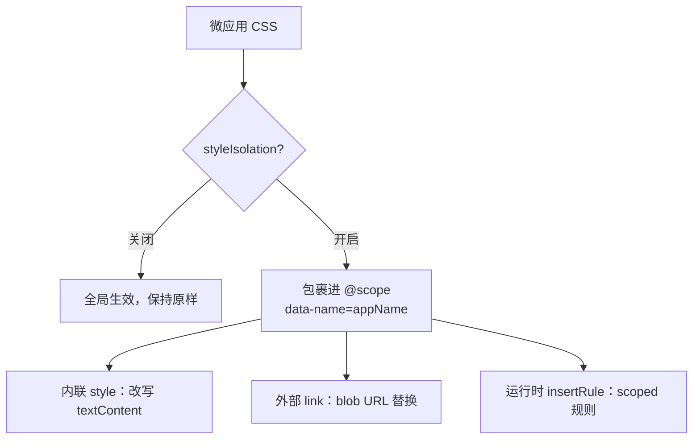

# 样式隔离

样式隔离用于防止微应用的 CSS 泄漏到主应用或其他兄弟应用中。在 qiankun v3 里，这是一个可选启用、运行时生效的机制，构建于原生 CSS [`@scope`](https://developer.mozilla.org/en-US/docs/Web/CSS/@scope) at-rule 之上——而非 Shadow DOM。启用后，微应用附带的每一张样式表都会被改写，使其规则只在该应用的容器内部生效。

本页介绍这套机制做了什么、为什么是这个形态，以及它的边界在哪里。要开启它，请参见 [AppConfiguration](/zh-CN/api/configuration) 以及操作指南 [开启 CSS 样式隔离](/zh-CN/cookbook/enable-style-isolation)。

## 它是什么

在应用配置上设置 `styleIsolation: true`，qiankun 就会把该应用的 CSS 包裹进一个绑定到应用容器的 `@scope` 块中：

```css
@scope ([data-name="your-app"]) {
  /* the app's rules, rewritten */
}
```

scope 根始终是 `[data-name="<appName>"]`。qiankun 会给每个应用容器打上一个值等于所注册应用名的 `data-name` 属性，并据此派生出选择器。这一点不可由用户自定义——没有任何选项能让你传入自己的 scope 根。由于包裹发生在 CSS 层面，而不是把应用挂载进 shadow 树，微应用的 DOM 仍然留在主文档中：全局库、portal 以及 `document` 级别的查询都能继续按照 [JS 沙箱](/zh-CN/concepts/js-sandbox)所预期的方式工作。

隔离在设计意图上是单向的：它阻止微应用声明的规则应用到其容器之外，但并不会把主应用或浏览器默认样式表推*进*微应用的样式加以沙箱化。



样式隔离默认关闭。如果你从不设置 `styleIsolation`，`<style>` 和 `<link>` 节点会原封不动地穿过 loader。

## 内联 `<style>`

对于内联 `<style>` 元素，qiankun 会读取它的 `textContent`，进行转换，再把 scoped 后的结果写回同一个节点。除了外层的 `@scope` 包裹之外，这次转换还做了几件仅靠简单包裹会做错的事情：

- **`@font-face` 和 `@namespace` 被提升到外层**，移出 `@scope` 块并保持全局。给 `@font-face` 加 scope 会破坏字体加载，而 `@namespace` 必须是文档级的，因此两者都会被提回样式表顶部。
- **`@keyframes` 会被重命名**，加上每个应用独有的前缀——`__qk_<appName>_<name>`——并且每一处 `animation` / `animation-name` 引用都会被相应改写。这样可以避免两个都定义了 `spin` keyframe 的应用互相覆盖，因为 `@scope` 只对选择器加作用域，而不作用于全局的 keyframe 命名空间。
- **相对 `url(...)` 值会被解析**，以样式表的 base URL 为基准解析，这样在 CSS 被搬移之后，背景图和其他资源仍然指向微应用的源。`data:`、`blob:` 和绝对的 `http(s):` URL 则保持不动。
- **`@import` 会被递归内联。** 每一张被导入的样式表都会通过应用的装饰过的 `fetch` 拉取，以同样的方式转换后拼接进来，并基于一个已访问集合做去重。这正是在存在 import 时使转换变为异步的原因。

由于内联 `@import` 可能需要网络往返，qiankun 会先同步清空 `<style>` 的 `textContent`，等一切解析完成后再填入 scoped 后的 CSS。这样可以避免在拉取的时间窗口内，未加 scope 的源码全局生效。

## 外部 `<link rel="stylesheet">`

原生 `@scope` 只能包裹你能控制的 CSS 文本，但浏览器加载外部样式表是不透明的——没有任何钩子能在它到达时把它包起来。因此在样式隔离下，qiankun 会阻止浏览器原生加载 `<link>`，转而自己接管拉取，采用代码库中称为 blob-link 的方式：

1. 以 base URL 为基准解析 `href`，然后**移除 `href` 属性**，把原始值暂存到 `data-href` 下。没有了 `href`，浏览器就永远不会加载未加 scope 的样式表。
2. 通过应用的装饰过的 `fetch` **拉取 CSS**，再让它经过与内联样式相同的 `@scope` 包裹转换。
3. 在*同一个* `<link>` 元素上以 `blob:` URL 的形式**提供它**：包裹后的 CSS 变成一个 `Blob`，其 object URL 被设回元素的 `href`。

节点标识是被刻意保留的——qiankun 只替换 `href`，从不替换元素本身。这样能免费地让每个原生 `<link>` 的语义保持完整：`media`、`disabled`、`title` 以及 `document.styleSheets` 中的条目都保持有效；流式 loader 中"一张待加载样式表会阻塞后续脚本"的记账逻辑，仍然看到一个正常的待加载 link，它的 `load` 会在 blob href 落地时触发；应用附加在动态注入的 `<link>` 上的任何 `onload` / `onerror` 处理器也继续有效。

如果拉取或转换失败，就永远不会设置 blob `href`——于是该元素自己不会发出任何事件。qiankun 会在这个 link 上手动派发一个 `error` 事件，并**丢弃这张样式表**，而不是退回去以未加 scope 的方式加载它。丢弃是刻意的选择：一张无法被加作用域的样式表，不允许全局泄漏。

转换后的样式表先按 URL、再按 app-scope key 做缓存，并且对同一 URL 的并发拉取会被去重，因此在多个应用间共享的同一张外部样式表，只会按它拥有的不同 scope 根的数量被拉取和转换那么多次。

## 运行时 CSSOM

在运行时以编程方式插入的样式永远不会经过 loader，因此 qiankun 在 CSSOM 层面拦截它们。当样式隔离处于激活状态时，`CSSStyleSheet.prototype.insertRule` 会被 monkey-patch（带引用计数，在有任意样式隔离应用存活时安装，在最后一个卸载时移除）。如果样式表的所属节点带有样式隔离配置，进来的规则文本会先被加作用域——包裹进 `@scope`，并做同样的 keyframe 重命名——然后才到达原生的 `insertRule`。

这条同步路径会跳过已经被 `@scope` 包裹的规则，并让 `@font-face` / `@namespace` 保持全局，与静态转换保持一致。正是它让在运行时构建样式表的 CSS-in-JS 库和框架，也能随其他一切一起被加作用域。

## Preload 改写

`<link rel="preload" as="style">`（或在 [ESM 沙箱](/zh-CN/concepts/esm-sandbox)下的 `rel="modulepreload">`）告诉浏览器为一次*原生*加载预热某个资源。但在样式隔离下，这张样式表是被 transpiler 的 `fetch()` 消费的，而不是被原生的 link 加载消费——因此一个原生的 `as=style` preload 会落在错误的缓存分区里，永远匹配不到真正的请求。

为了让预热仍然有用，qiankun 会把这些 preload 改写为 `as="fetch"`，并加上 `crossorigin="anonymous"`（除非该 link 已经声明使用 `use-credentials`）。`fetch` 模式的 preload 会落到流水线的 `fetch()` 所读取的同一个缓存分区，因此预热请求仍然会被匹配和复用。出于同样的原因，modulepreload link 还会额外从 `rel="modulepreload"` 改写为 `rel="preload"`。

## 要求与限制

::: warning 需要原生 CSS `@scope`
该实现不包含任何 polyfill，也没有任何回退方案。它完全依赖浏览器对 CSS `@scope` at-rule 的支持。在不支持 `@scope` 的浏览器中，包裹规则是惰性的，样式不会被隔离。`@scope` 是浏览器较新加入的特性；在依赖它之前，请对照你的目标浏览器矩阵核实支持情况。
:::

::: warning 外部样式表必须可通过 CORS 拉取
由于外部样式表会被通过 `fetch` 重新拉取并以 `blob:` URL 提供，跨域样式表必须返回正确的 CORS 头。如果无法被拉取，qiankun 会丢弃它——样式表会静默消失（并附带一条控制台警告），而不是以未加 scope 的方式加载。请为微应用样式表启用 CORS 提供服务，否则被隔离的应用会渲染成无样式状态。
:::

::: info 已知的边缘情况
- **`@font-face` 冲突。** font-face 规则被刻意保持全局，以便字体能正确加载。因此，两个声明了相同 `font-family` 名称的应用可能会发生冲突。请为每个应用使用不同的 font-family 名称。
- **动态拼接的 keyframe 名称。** keyframe 重命名是一次静态文本转换。如果你的 JS 在运行时通过字符串拼接来构造动画名称（而不是在 CSS 里字面写出），该引用不会被改写，动画可能无法解析。
:::

::: tip 与 qiankun 2.x 的区别
v3 的样式隔离就是本页描述的 `@scope` + blob-link 机制，由单个布尔值开关控制。2.x 的选项 `sandbox.strictStyleIsolation` 和 `sandbox.experimentalStyleIsolation`（基于 Shadow DOM）在 v3 中不存在。唯一的旋钮是 `styleIsolation`。参见[从 qiankun 2.x 迁移](/zh-CN/cookbook/migrate-from-2x)。
:::

## 对外的旋钮

| 选项 | 类型 | 默认值 | 说明 |
| --- | --- | --- | --- |
| `styleIsolation` | `boolean` | `false` | 通过 `@scope` 包裹启用运行时 CSS 隔离。启用后，微应用的所有样式都会被限定在其容器（`[data-name="<appName>"]`）内。 |

`styleIsolation` 是应用配置上的一个按应用设置的字段——在你描述应用的任何地方设置它即可，无论是通过 [registerMicroApps](/zh-CN/api/register-micro-apps) 还是 [loadMicroApp](/zh-CN/api/load-micro-app)：

```ts
import { registerMicroApps, start } from 'qiankun';

registerMicroApps([
  {
    name: 'react-app',
    entry: '//localhost:7100',
    container: '#subapp-viewport',
    activeRule: '/react',
    styleIsolation: true,
  },
]);

start();
```

完整的字段列表参见 [AppConfiguration](/zh-CN/api/configuration)；面向任务的操作演示参见[开启 CSS 样式隔离](/zh-CN/cookbook/enable-style-isolation)。
