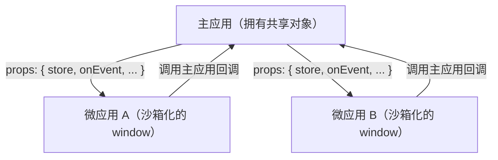

# 应用间共享状态与通信

qiankun v3 没有内置的全局状态存储。你需要自己搭建通信机制：把数据和回调作为 props 往下传，并借助每个应用本就共享的浏览器原语。本页介绍在 JS 沙箱下依然可靠的几种模式。

::: danger v3 移除了 2.x 的全局状态 API
`initGlobalState`、`onGlobalStateChange`、`setGlobalState` 和 `MicroAppStateActions` 在 qiankun v3 中并不存在，任何 package 都不会导出它们。如果你正从 2.x 迁移，请用下面基于 props 的模式替代它们。参见[从 qiankun 2.x 迁移](/zh-CN/cookbook/migrate-from-2x)。
:::

## 为什么没有共享全局

[JS 沙箱](/zh-CN/concepts/js-sandbox)给每个微应用各自独立的 `window`。子应用做的任何写入——`window.store = ...`、一个顶层 `var`、给全局赋值——都落在该应用自己的 membrane 目标上，而非真实的 `window`，因此对主应用和其他所有应用都是不可见的。这种隔离正是沙箱的意义所在，也正是为什么一个魔法般的全局 store 在 v3 中行不通。

由此得出的通信结论很简单：**任何共享值都必须存在于主应用中，并显式地交给每个微应用。**主应用拥有该对象；微应用通过 props 拿到指向它的引用。



## 通过 props 把数据往下传

每一种加载微应用的方式都接受一个 `props` 对象，qiankun 会把它转发给子应用的 `bootstrap`、`mount`、`unmount` 和 `update` lifecycle 函数（连同 single-spa 注入的 props 以及 qiankun 注入的 `container`）。

::: code-group

```ts [registerMicroApps (route-driven)]
import { registerMicroApps, start } from 'qiankun';

registerMicroApps([
  {
    name: 'react-app',
    entry: '//localhost:7100',
    container: document.getElementById('subapp')!,
    activeRule: '/react',
    props: {
      user: { id: 42, name: 'Ada' },
      token: 'jwt-abc',
    },
  },
]);

start();
```

```ts [loadMicroApp (imperative)]
import { loadMicroApp } from 'qiankun';

const microApp = loadMicroApp({
  name: 'react-app',
  entry: '//localhost:7100',
  container: document.getElementById('subapp')!,
  props: {
    user: { id: 42, name: 'Ada' },
    token: 'jwt-abc',
  },
});
```

```tsx [MicroApp (React)]
import { MicroApp } from '@qiankunjs/react';

// Any prop that is not a reserved key (name, entry, settings,
// lifeCycles, wrapperClassName, className) is forwarded to the sub-app.
<MicroApp
  name="react-app"
  entry="//localhost:7100"
  user={{ id: 42, name: 'Ada' }}
  token="jwt-abc"
/>;
```

```vue [MicroApp (Vue)]
<script setup>
import { MicroApp } from '@qiankunjs/vue';
</script>

<template>
  <!-- Vue forwards props only through the dedicated appProps object -->
  <micro-app
    name="react-app"
    entry="//localhost:7100"
    :appProps="{ user: { id: 42, name: 'Ada' }, token: 'jwt-abc' }"
  />
</template>
```

:::

在微应用一侧，从 lifecycle 参数中读取这些 props：

```ts [micro-app entry]
export async function mount(props) {
  // props includes your custom props plus qiankun's container and
  // single-spa's injected props (name, singleSpa, mountParcel, ...)
  const { user, token, container } = props;
  render(container, { user, token });
}
```

::: tip React 与 Vue 的 prop 传递差异
使用 React 的 `<MicroApp>` 时，你传的任何额外 prop 都会转发给子应用。使用 Vue 的 `<MicroApp>` 时不存在任意 prop 透传——你必须用专门的 `appProps` 对象 prop。参见 [React 绑定](/zh-CN/ecosystem/react)和 [Vue 绑定](/zh-CN/ecosystem/vue)。
:::

## 用 microApp.update 推送更新

props 是 mount 时拍下的一张快照。要在 mount 之后推送新数据，请在 `loadMicroApp` 返回的 parcel 句柄上调用 `update`。qiankun 会把新的 props 转发给子应用可选的 `update` lifecycle。

```ts
import { loadMicroApp } from 'qiankun';

const microApp = loadMicroApp({
  name: 'react-app',
  entry: '//localhost:7100',
  container: document.getElementById('subapp')!,
  props: { count: 0 },
});

// later, when host state changes:
await microApp.mountPromise;
await microApp.update?.({ count: 1 });
```

子应用通过导出一个 `update` lifecycle 来选择性地接入：

```ts [micro-app entry]
export async function update(props) {
  // re-render with the new props
  rerender(props);
}
```

在微应用的导出契约里 `update` 是可选的——只有 `bootstrap`、`mount` 和 `unmount` 是必需的。如果子应用没有导出 `update`，在句柄上调用它就是一个空操作（只有当应用提供了该方法时它才存在）。

使用 `<MicroApp>` 组件时你永远不需要自己调用 `update`。改变一个被转发的 prop 会自动触发 `microApp.update`：React 会对额外的 props 做深比较，Vue 会深度 watch `appProps`。

::: warning 路由注册的应用没有 update 句柄
`registerMicroApps` 不返回每个应用的句柄，因此对 route-driven 的应用没有便捷的 `update`。对于 props 在运行时频繁变化的应用，优先使用 `loadMicroApp`（或 `<MicroApp>` 组件），或者传入一个由主应用改写内容的活对象／回调（见下一节），这样子应用无需再次 `update` 就能读到最新的值。
:::

## 把方法和 store 作为 props 往下传

由于 props 可以持有函数和对象引用，最干净的通信方式是**在主应用中**构建你的共享 store 或 event bus，并把它交给每一个微应用。主应用拥有它；微应用从中读取并回调它。这能在沙箱下成立，因为该引用是被显式传入的，而不是从某个全局上去取的。

### 回调：子应用向主应用回话

```ts [host]
import { registerMicroApps, start } from 'qiankun';

function onSubAppEvent(payload: { type: string; data: unknown }) {
  // host reacts to something the sub-app did
  console.log('sub-app said', payload);
}

registerMicroApps([
  {
    name: 'react-app',
    entry: '//localhost:7100',
    container: document.getElementById('subapp')!,
    activeRule: '/react',
    props: { onEvent: onSubAppEvent },
  },
]);

start();
```

```ts [micro-app]
export async function mount(props) {
  props.onEvent?.({ type: 'ready', data: Date.now() });
  render(props.container, props);
}
```

### 由主应用持有的共享可观察 store

在主应用里定义一个极小的 store，把它的句柄往下传，让每个应用去订阅。任何状态库都可以——下面是一个零依赖的示意：

```ts [host/store.ts]
type Listener<T> = (state: T) => void;

export function createStore<T extends object>(initial: T) {
  let state = initial;
  const listeners = new Set<Listener<T>>();
  return {
    get: () => state,
    set(patch: Partial<T>) {
      state = { ...state, ...patch };
      listeners.forEach((l) => l(state));
    },
    subscribe(listener: Listener<T>) {
      listeners.add(listener);
      return () => listeners.delete(listener); // return an unsubscribe
    },
  };
}
```

```ts [host/register.ts]
import { registerMicroApps, start } from 'qiankun';
import { createStore } from './store';

// the store lives in the host — the single source of truth
const store = createStore({ theme: 'light', user: null });

registerMicroApps([
  {
    name: 'react-app',
    entry: '//localhost:7100',
    container: document.getElementById('subapp')!,
    activeRule: '/react',
    props: { store }, // hand the same reference to every app
  },
]);

start();
```

```ts [micro-app]
let unsubscribe: (() => void) | undefined;

export async function mount(props) {
  const { store } = props;
  render(props.container, store.get());

  // react to host-driven changes
  unsubscribe = store.subscribe((state) => rerender(state));

  // push a change back up — every subscriber (host + other apps) sees it
  store.set({ theme: 'dark' });
}

export async function unmount() {
  unsubscribe?.(); // always clean up your subscription
  unsubscribe = undefined;
}
```

每个拿到同一个 `store` 引用的应用现在都共享同一个单一数据源，并由主应用居中协调。event bus（例如一个小型 emitter，或你已经在用的某个库）也是同样的做法：在主应用中构造它，把实例作为 prop 往下传。

::: warning unmount 时务必取消订阅
沙箱会回收微应用制造的定时器、监听器和 DOM 副作用，但它并不知道你在一个主应用拥有的对象上注册过的订阅。如果你在 `mount` 中订阅了一个主应用的 store，请在 `unmount` 中调用返回的取消订阅函数，否则主应用会一直持有对你（已卸载的）应用的引用，并在多次重新挂载间泄漏它。参见[运行多个微应用实例](/zh-CN/cookbook/run-multiple-instances)。
:::

## 通过路由来协调

在 route-driven 的架构里，微应用是由 URL 激活的，因此导航本身就是一条通信通道——而且完全不需要任何共享对象。

`activeRule` 决定对给定路径挂载哪个应用。从任何地方（主应用链接、子应用路由、`history.pushState`）改变 URL，都会重新路由整个页面，并相应地挂载或卸载应用。

```ts
registerMicroApps([
  {
    name: 'orders',
    entry: '//localhost:7100',
    container: document.getElementById('subapp')!,
    activeRule: '/orders', // mounted whenever the path starts with /orders
  },
  {
    name: 'billing',
    entry: '//localhost:7101',
    container: document.getElementById('subapp')!,
    activeRule: '/billing',
  },
]);
```

single-spa（qiankun 构建于其上）会 patch `history.pushState`/`replaceState`，并在每次重新路由后派发一个 `single-spa:routing-event`。主应用——或任何应用——都可以监听它来与导航保持同步，包括那些仅靠 `popstate` 会漏掉的 qiankun 驱动的重新路由：

```ts
function onRouteChange() {
  syncActiveNav(window.location.pathname);
}

// listen to both: popstate for back/forward, the single-spa event for pushState reroutes
window.addEventListener('popstate', onRouteChange);
window.addEventListener('single-spa:routing-event', onRouteChange);
```

要从主应用驱动导航，push 一个新的 URL；路由事件和任何 `activeRule` 切换都会随之发生：

```ts
window.history.pushState(null, '', '/billing');
```

Query string、路径片段和 hash 都可以拿来在应用间传递小型、可序列化的协调数据，而无需任何共享的 JS 引用。

每个应用共享的其他浏览器原语——真实 `window` 上的 `localStorage`、`sessionStorage`、`BroadcastChannel`、`postMessage` 和 `CustomEvent`——同样可用于松耦合的消息传递。它们不是沙箱化的全局，因此主应用和微应用看到的是同一个实例。对于任何结构化或与 lifecycle 绑定的数据，优先用 props；当你明确需要 fire-and-forget、跨标签页或仅限字符串的通道时，再动用它们。

## 需要牢记的边界

- **沙箱隔离写入。**微应用无法通过给 `window` 赋值来发布一个值；那次写入停留在它自己的 membrane 里。通信必须走主应用传入的引用，或走一个真正共享的浏览器原语（storage、`BroadcastChannel`、真实 window 上的事件）。参见 [JS 沙箱](/zh-CN/concepts/js-sandbox)。
- **共享 store 必须存在于主应用中。**在主应用里构造它一次，并通过 props 把同一个引用交给每个应用。不要指望在某个微应用内部创建的 store 能从另一个微应用触及——它们的全局是彼此隔离的 realm。
- **读取仍会穿透到主应用的 window。**微应用可以读取真实 `window` 上任何它没有遮蔽的东西，因此主应用提供的只读全局是可见的。但不要依赖这个来做双向状态——写入不会回流。
- **ESM-sandbox 的全局传播是单向的。**在 [ESM 沙箱](/zh-CN/concepts/esm-sandbox)中，引擎只对经 membrane 中介的写入（`onGlobalSet`）保持已求值模块的全局绑定同步。如果主应用在某个微应用的模块已经求值之后直接写入真实的 `window`，这些模块将看不到该变化。请通过 props 和回调来传递数据，而不要去改写共享全局。
- **务必 unmount，并务必清理订阅。**props 和沙箱会在 unmount 时替你拆除，但你在一个主应用拥有的 store 上注册的订阅不会——请返回并调用一个取消订阅函数。参见[微应用的 lifecycle 与 props](/zh-CN/concepts/lifecycle-and-props)。

## 相关

- [微应用的 lifecycle 与 props](/zh-CN/concepts/lifecycle-and-props) —— props 如何抵达每个 lifecycle
- [registerMicroApps](/zh-CN/api/register-micro-apps) 和 [loadMicroApp](/zh-CN/api/load-micro-app) —— 在哪里设置 `props`
- [React 的 `<MicroApp>`](/zh-CN/ecosystem/react) 和 [Vue 的 `<MicroApp>`](/zh-CN/ecosystem/vue) —— prop 转发与 `appProps`
- [JS 沙箱](/zh-CN/concepts/js-sandbox) —— 为什么全局是隔离的
- [从 qiankun 2.x 迁移](/zh-CN/cookbook/migrate-from-2x) —— 替换旧的全局状态 API
