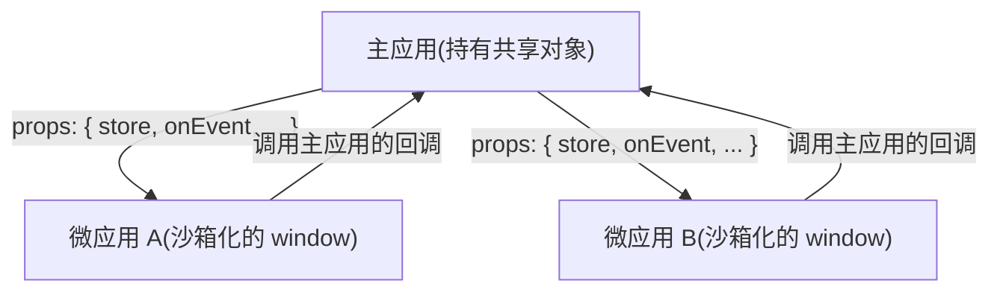

# 应用间共享状态与通信

qiankun v3 没有内置的全局状态库。应用之间怎么通信，得你自己接线：把数据和回调当作 props 一层层传下去，再借助每个应用本来就共享的那些浏览器原语。这一页讲的，是几种在 JS 沙箱下真正立得住的做法。

::: danger v3 移除了 2.x 的全局状态 API
`initGlobalState`、`onGlobalStateChange`、`setGlobalState`、`MicroAppStateActions` 在 qiankun v3 里都不存在了，任何包都不再导出它们。如果你从 2.x 迁移过来，把它们换成下面这些基于 props 的写法。参见[从 qiankun 2.x 迁移](/zh-CN/cookbook/migrate-from-2x)。
:::

## 为什么没有共享的全局对象

[JS 沙箱](/zh-CN/concepts/js-sandbox)给每个微应用发了一份自己的 `window`。子应用写下的东西——`window.store = ...`、一个顶层 `var`、给全局变量赋值——都落在这个应用自己的隔离膜目标上，而不是真正的 `window`，所以主应用看不到，别的应用也看不到。这种隔离正是沙箱存在的意义，也正因为如此，v3 里那种"魔法般的全局 store"根本没法工作。

落到通信上，结论很直白：**任何要共享的值，都得住在主应用里，再显式地交到每个微应用手上。**对象归主应用所有，微应用通过 props 拿到指向它的引用。



## 用 props 把数据传下去

加载微应用的每一种方式都接收一个 `props` 对象，qiankun 会把它转发给子应用的 `bootstrap`、`mount`、`unmount`、`update` 生命周期函数(和 single-spa 注入的 props、qiankun 注入的 `container` 一起)。

::: code-group

```ts [registerMicroApps(路由驱动)]
import { registerMicroApps, start } from 'qiankun';

registerMicroApps([
  {
    name: 'react-app',
    entry: '//localhost:7100',
    container: document.getElementById('subapp')!,
    activeRule: '/react',
    props: {
      user: { id: 42, name: 'Ada' },
      token: 'jwt-abc',
    },
  },
]);

start();
```

```ts [loadMicroApp(手动加载)]
import { loadMicroApp } from 'qiankun';

const microApp = loadMicroApp({
  name: 'react-app',
  entry: '//localhost:7100',
  container: document.getElementById('subapp')!,
  props: {
    user: { id: 42, name: 'Ada' },
    token: 'jwt-abc',
  },
});
```

```tsx [MicroApp(React)]
import { MicroApp } from '@qiankunjs/react';

// 除了保留字段(name、entry、settings、lifeCycles、
// wrapperClassName、className),其余 prop 都会转发给子应用。
<MicroApp
  name="react-app"
  entry="//localhost:7100"
  user={{ id: 42, name: 'Ada' }}
  token="jwt-abc"
/>;
```

```vue [MicroApp(Vue)]
<script setup>
import { MicroApp } from '@qiankunjs/vue';
</script>

<template>
  <!-- Vue 只通过专门的 appProps 对象转发 props -->
  <micro-app
    name="react-app"
    entry="//localhost:7100"
    :appProps="{ user: { id: 42, name: 'Ada' }, token: 'jwt-abc' }"
  />
</template>
```

:::

在微应用这边，从生命周期参数里把 props 读出来：

```ts [微应用入口]
export async function mount(props) {
  // props 里既有你自定义的 props,也有 qiankun 注入的 container
  // 和 single-spa 注入的 props(name、singleSpa、mountParcel……)
  const { user, token, container } = props;
  render(container, { user, token });
}
```

::: tip React 和 Vue 传 prop 的差别
用 React 的 `<MicroApp>` 时，你多传的任何 prop 都会转发给子应用。用 Vue 的 `<MicroApp>` 时没有这种任意 prop 透传——必须走专门的 `appProps` 对象 prop。参见 [React 绑定](/zh-CN/ecosystem/react)和 [Vue 绑定](/zh-CN/ecosystem/vue)。
:::

## 用 microApp.update 推送更新

props 是挂载那一刻拍下的快照。挂载之后想再推新数据，就调用 `loadMicroApp` 返回的 parcel 句柄上的 `update`,qiankun 会把新的 props 转发给子应用可选的 `update` 生命周期。

```ts
import { loadMicroApp } from 'qiankun';

const microApp = loadMicroApp({
  name: 'react-app',
  entry: '//localhost:7100',
  container: document.getElementById('subapp')!,
  props: { count: 0 },
});

// 之后,当主应用状态变化时:
await microApp.mountPromise;
await microApp.update?.({ count: 1 });
```

子应用这边通过导出一个 `update` 生命周期来接住它：

```ts [微应用入口]
export async function update(props) {
  // 用新的 props 重新渲染
  rerender(props);
}
```

微应用的导出契约里 `update` 是可选的——只有 `bootstrap`、`mount`、`unmount` 是必需的。如果子应用没导出 `update`，在句柄上调用它就是个空操作(这个方法只有在应用提供了它时才会出现)。

用 `<MicroApp>` 组件时，你永远不用自己调 `update`。改动一个转发下去的 prop 就会自动触发 `microApp.update`:React 会对多传的那些 props 做深比较，Vue 会深度 watch `appProps`。

::: warning 路由注册的应用没有 update 句柄
`registerMicroApps` 不返回每个应用的句柄，所以路由驱动的应用没有顺手的 `update` 可用。如果某个应用的 props 在运行时变得很频繁，优先用 `loadMicroApp`(或 `<MicroApp>` 组件)；或者传一个"活的"对象 / 回调下去，由主应用去改它的内容，这样子应用不必重新 `update` 也能读到最新的值(见下一节)。
:::

## 把方法和 store 当 props 传下去

props 里可以放函数，也可以放对象引用。所以最干净的通信方式，是**在主应用里**把共享的 store 或事件总线建好，再交给每个微应用。主应用持有它，微应用从里面读、往里面回调。这一套之所以能扛住沙箱，是因为这个引用是显式传进去的，而不是从某个全局变量上去够的。

### 回调：子应用向主应用喊话

```ts [host]
import { registerMicroApps, start } from 'qiankun';

function onSubAppEvent(payload: { type: string; data: unknown }) {
  // 主应用对子应用做的某件事作出反应
  console.log('sub-app said', payload);
}

registerMicroApps([
  {
    name: 'react-app',
    entry: '//localhost:7100',
    container: document.getElementById('subapp')!,
    activeRule: '/react',
    props: { onEvent: onSubAppEvent },
  },
]);

start();
```

```ts [micro-app]
export async function mount(props) {
  props.onEvent?.({ type: 'ready', data: Date.now() });
  render(props.container, props);
}
```

### 由主应用持有的可订阅 store

在主应用里定义一个小小的 store，把它的句柄传下去，让每个应用各自订阅。任何状态库都行——下面是个不依赖任何库的示意：

```ts [host/store.ts]
type Listener<T> = (state: T) => void;

export function createStore<T extends object>(initial: T) {
  let state = initial;
  const listeners = new Set<Listener<T>>();
  return {
    get: () => state,
    set(patch: Partial<T>) {
      state = { ...state, ...patch };
      listeners.forEach((l) => l(state));
    },
    subscribe(listener: Listener<T>) {
      listeners.add(listener);
      return () => listeners.delete(listener); // 返回一个取消订阅的函数
    },
  };
}
```

```ts [host/register.ts]
import { registerMicroApps, start } from 'qiankun';
import { createStore } from './store';

// store 住在主应用里 —— 唯一的数据来源
const store = createStore({ theme: 'light', user: null });

registerMicroApps([
  {
    name: 'react-app',
    entry: '//localhost:7100',
    container: document.getElementById('subapp')!,
    activeRule: '/react',
    props: { store }, // 把同一个引用交给每个应用
  },
]);

start();
```

```ts [micro-app]
let unsubscribe: (() => void) | undefined;

export async function mount(props) {
  const { store } = props;
  render(props.container, store.get());

  // 响应主应用驱动的变化
  unsubscribe = store.subscribe((state) => rerender(state));

  // 把一个变化推回去 —— 每个订阅者(主应用 + 其他应用)都会看到
  store.set({ theme: 'dark' });
}

export async function unmount() {
  unsubscribe?.(); // 一定要清掉你的订阅
  unsubscribe = undefined;
}
```

拿到同一个 `store` 引用的每个应用，现在共享同一份数据来源，由主应用居中协调。事件总线(比如一个小的 emitter，或者你手头已经在用的某个库)也是同样的路子：在主应用里把它构造出来，把实例当 prop 传下去。

::: warning 卸载时一定要取消订阅
沙箱会把微应用装的定时器、监听器、DOM 副作用都还原掉，但它不知道你在某个主应用持有的对象上注册过订阅。如果你在 `mount` 里订阅了主应用的 store，就要在 `unmount` 里调用返回的那个取消订阅函数，否则主应用会一直攥着你这个(已经卸载的)应用的引用，在反复挂载 / 卸载之间造成泄漏。参见[运行多个微应用实例](/zh-CN/cookbook/run-multiple-instances)。
:::

## 借助路由来协调

在路由驱动的接入方式里，微应用是由 URL 激活的，所以导航本身就是一条通信渠道——而且它根本不需要任何共享对象。

`activeRule` 决定某个路径下挂载哪个应用。从任何地方改动 URL(主应用的链接、子应用的路由、`history.pushState`)都会让整个页面重新路由，按规则挂载或卸载相应的应用。

```ts
registerMicroApps([
  {
    name: 'orders',
    entry: '//localhost:7100',
    container: document.getElementById('subapp')!,
    activeRule: '/orders', // 路径以 /orders 开头时挂载
  },
  {
    name: 'billing',
    entry: '//localhost:7101',
    container: document.getElementById('subapp')!,
    activeRule: '/billing',
  },
]);
```

qiankun 底层的 single-spa 会打补丁劫持 `history.pushState` / `replaceState`，并在每次重新路由后派发一个 `single-spa:routing-event` 事件。主应用——或者任何一个应用——都可以监听它，好跟上导航的变化，包括那些只靠 `popstate` 会漏掉的、由 qiankun 驱动的重新路由：

```ts
function onRouteChange() {
  syncActiveNav(window.location.pathname);
}

// 两个都监听:popstate 管前进 / 后退,single-spa 事件管 pushState 触发的重新路由
window.addEventListener('popstate', onRouteChange);
window.addEventListener('single-spa:routing-event', onRouteChange);
```

想从主应用发起导航，就 push 一个新的 URL，路由事件和相应的 `activeRule` 切换会跟着发生：

```ts
window.history.pushState(null, '', '/billing');
```

query string、路径段、hash 都可以用来在应用之间传递少量、可序列化的协调数据，完全不用共享任何 JS 引用。

每个应用共享的其他浏览器原语——`localStorage`、`sessionStorage`、`BroadcastChannel`、`postMessage`，以及真实 `window` 上的 `CustomEvent`——也都能拿来做松耦合的消息传递。它们不是被沙箱隔离的全局变量，所以主应用和微应用看到的是同一个实例。凡是结构化的、跟生命周期挂钩的东西，优先用 props；当你确实要的是那种"发完就不管"、跨标签页，或者只传字符串的通道时，再动用这些。

## 几条要记住的边界

- **沙箱隔离的是写。** 微应用没法靠给 `window` 赋值来对外发布一个值，那次写始终待在它自己的隔离膜里。通信必须走主应用传进来的引用，或者走一个真正共享的浏览器原语(storage、`BroadcastChannel`、真实 window 上的事件)。参见 [JS 沙箱](/zh-CN/concepts/js-sandbox)。
- **共享的 store 必须住在主应用里。** 在主应用里构造一次，把同一个引用通过 props 交给每个应用。别指望在某个微应用内部创建的 store 能被另一个微应用够到——它们的全局环境是彼此隔离的 realm。
- **读操作仍会穿透到主应用的 window。** 微应用可以读到真实 `window` 上它没有遮蔽掉的任何东西，所以主应用提供的只读全局变量是可见的。但别拿这个来做双向状态——写是流不回去的。
- **ESM 沙箱的全局传播是单向的。** 在 [ESM 沙箱](/zh-CN/concepts/esm-sandbox)里，引擎只会为经隔离膜中转的写(`onGlobalSet`)去同步那些已求值模块的全局绑定。如果主应用在某个微应用的模块求值之后，直接往真实 `window` 上写，这些模块看不到这次改动。所以要通过 props 和回调来传数据，别去改共享的全局变量。
- **一定要卸载，也一定要清理订阅。** props 和沙箱会在卸载时帮你拆掉，但你注册在主应用持有对象上的订阅不会——把取消订阅的函数返回出来并调用它。参见[微应用生命周期与 props](/zh-CN/concepts/lifecycle-and-props)。

## 相关阅读

- [微应用生命周期与 props](/zh-CN/concepts/lifecycle-and-props) —— props 是怎么送到每个生命周期的
- [registerMicroApps](/zh-CN/api/register-micro-apps) 和 [loadMicroApp](/zh-CN/api/load-micro-app) —— 在哪里设置 `props`
- [React 的 `<MicroApp>`](/zh-CN/ecosystem/react) 和 [Vue 的 `<MicroApp>`](/zh-CN/ecosystem/vue) —— prop 转发与 `appProps`
- [JS 沙箱](/zh-CN/concepts/js-sandbox) —— 为什么全局变量是隔离的
- [从 qiankun 2.x 迁移](/zh-CN/cookbook/migrate-from-2x) —— 替换掉旧的全局状态 API
