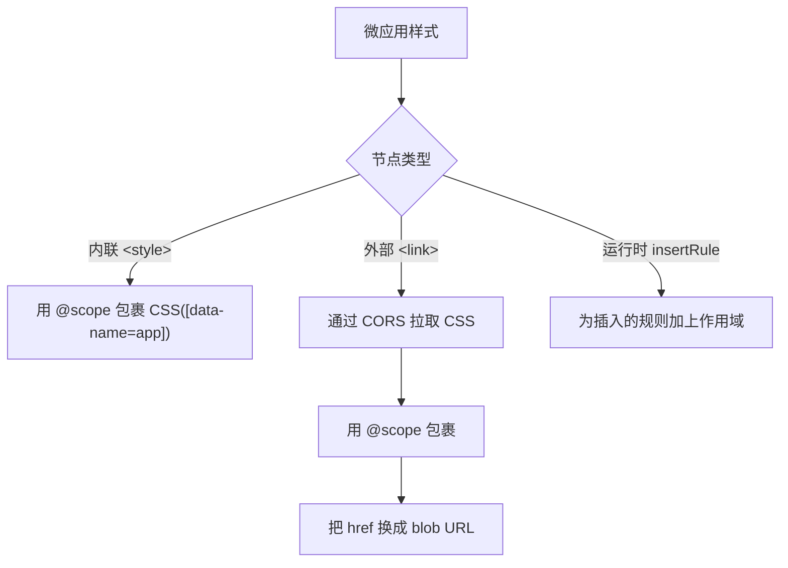

# 开启 CSS 样式隔离

默认情况下，一个微应用的 CSS 会与主应用以及页面上的其他所有微应用共享。本篇教程将开启 qiankun 的运行时样式隔离，让微应用的样式规则无法泄漏到页面的其余部分，同时页面的样式规则也无法泄漏进微应用。

样式隔离需要主动开启，默认是关闭的。你可以通过一个布尔值 `styleIsolation: true` 为每个应用单独开启它。

## 开启方式

`styleIsolation` 是 [`AppConfiguration`](/zh-CN/api/configuration) 的一个字段，因此你可以在传入应用配置的任意位置设置它。

::: code-group

```ts [registerMicroApps]
import { registerMicroApps, start } from 'qiankun';

registerMicroApps([
  {
    name: 'app-vue',
    entry: '//localhost:7101',
    container: document.getElementById('subapp-container')!,
    activeRule: '/app-vue',
    configuration: {
      styleIsolation: true,
    },
  },
]);

start();
```

```ts [loadMicroApp]
import { loadMicroApp } from 'qiankun';

const microApp = loadMicroApp(
  {
    name: 'app-vue',
    entry: '//localhost:7101',
    container: document.getElementById('subapp-container')!,
  },
  {
    styleIsolation: true,
  },
);
```

```jsx [MicroApp (React)]
import { MicroApp } from '@qiankunjs/react';

export default function App() {
  return (
    <MicroApp
      name="app-vue"
      entry="//localhost:7101"
      settings={{ styleIsolation: true }}
    />
  );
}
```

```vue [MicroApp (Vue)]
<template>
  <MicroApp
    name="app-vue"
    entry="//localhost:7101"
    :settings="{ styleIsolation: true }"
  />
</template>

<script setup>
import { MicroApp } from '@qiankunjs/vue';
</script>
```

:::

对于 `<MicroApp>` 组件，`settings` prop 就是一个 `AppConfiguration`，因此在 `settings` 上设置 `styleIsolation: true` 与 `configuration.styleIsolation` 是同一个开关。

## 底层原理

当 `styleIsolation` 开启后，微应用引入的每一份样式都会在加载时被改写，使其只在应用容器内部生效。



- **作用域根(Scope root)。** 应用容器上会带有一个 `data-name="<appName>"` 属性，每一条规则都会被包裹在一个原生 CSS [`@scope`](https://developer.mozilla.org/en-US/docs/Web/CSS/@scope) 块中，其作用域限定为 `[data-name="<appName>"]`。最终生成的 CSS 形如：

  ```css
  @scope ([data-name="app-vue"]) {
    .btn { color: rebeccapurple; }
  }
  ```

  作用域根由应用名派生而来，**无法自定义**。

- **内联 `<style>`** 元素会被就地改写：它们的 `textContent` 会被替换为加上作用域后的版本。

- **外部 `<link rel="stylesheet">`** 样式表会通过 qiankun 的 `fetch` 重新拉取，包裹进 `@scope`，再以 `blob:` URL 的形式回填给同一个 `<link>` 元素。浏览器永远不会加载原始的、未加作用域的样式表。`<link>` 节点的身份得以保留(原始 URL 被保存在 `data-href` 上)，因此 `load`/`error` 处理器和 `document.styleSheets` 仍能正常工作。

- **运行时通过 `CSSStyleSheet.prototype.insertRule` 插入的规则** 会在插入的同时被加上作用域。

## 前置要求

::: warning 需要原生 CSS `@scope`
样式隔离完全构建在原生 CSS `@scope` 之上。没有 polyfill，也没有降级方案。不支持 `@scope` 的浏览器不会为样式加上作用域，因此隔离将直接不生效。在依赖此特性之前，请先确认你的目标浏览器支持 `@scope`。
:::

::: warning 外部样式表必须可通过 CORS 拉取
由于外部 `<link>` 样式表会以文本形式被重新拉取、再以 blob 形式重新提供，微应用引用的每一份外部样式表都必须能通过一个启用了 CORS 的请求访问到。这包括第三方 CSS 以及任何通过 `@import` 引入的样式表。如果拉取或转译失败，qiankun 会**彻底丢弃该样式表**(为保证隔离，它绝不会以未加作用域的形式被加载)，并在 `<link>` 上派发一个合成的 `error` 事件。一份没有正确 CORS 头的跨域样式表会悄无声息地消失。请为字体和第三方 CSS 提供 `Access-Control-Allow-Origin`。
:::

## 需要提前规避的注意事项

::: info @font-face 与 @namespace 保持全局
`@font-face` 和 `@namespace` 规则会被有意地从 `@scope` 块中提升出来并保持全局——为 `@font-face` 加上作用域会破坏字体加载。因此这些规则**不会被隔离**，可能在多个应用间发生冲突。如果两个应用可能定义同名的字体族，请为字体族起应用内唯一的名字。
:::

::: info @keyframes 会被重命名
每个 `@keyframes` 名称都会被加上 `__qk_<appName>_` 前缀，引用它的 `animation` / `animation-name` 声明也会被相应改写以保持匹配。这是静态的名称改写：它只改写在 CSS 中字面出现的名称。如果你的 JavaScript 动态构造了一个 keyframe 名称(例如通过字符串拼接)并把它赋给某个元素的 `animation-name`，该引用将指向原始的、如今已被重命名的 keyframe，动画将无法运行。请避免动态构造 keyframe 名称，或者把这些 keyframes 定义在被隔离的 CSS 之外。
:::

::: info Vite 以 JS 注入 CSS 时可能在重新挂载后丢失
当一个 Vite 构建的应用通过 JavaScript 注入 CSS(CSS-as-JS)时，注入往往只在模块顶层运行一次。重新挂载时 qiankun 会复用已经求值过的模块，因此顶层的副作用不会再次运行，应用第二次挂载时样式就可能缺失。请把样式注入放在每次挂载都会重新运行的位置——例如放在应用的 `mount` 生命周期内——而不是放在模块顶层。参见 [让 Vite 应用适配 qiankun](/zh-CN/cookbook/prepare-a-vite-app)。
:::

## 验证效果

加载微应用，并在浏览器 devtools 中检查它：

1. 找到应用容器元素，确认它带有 `data-name="<appName>"`。
2. 查看微应用的 `<style>` 元素(位于虚拟化后的 `<qiankun-head>` 内):它们的规则应当被包裹在 `@scope ([data-name="<appName>"]) { ... }` 中。
3. 外部样式表应当在 `<link>` 上显示一个 `blob:` 的 `href`，而原始 URL 被保留在 `data-href` 属性上。
4. 切换某条规则，确认它不再作用于容器之外的元素。

## 相关阅读

- [样式隔离](/zh-CN/concepts/style-isolation) —— 深入了解 `@scope` + blob-link 机制的工作原理。
- [HTML Entry 流式加载](/zh-CN/concepts/html-entry-loading) —— entry 流式进入时样式是如何被转译的。
- [AppConfiguration](/zh-CN/api/configuration) —— 完整的按应用配置参考。
- [从 qiankun 2.x 迁移](/zh-CN/cookbook/migrate-from-2x) —— `styleIsolation` 取代了 2.x 的 `strictStyleIsolation` / `experimentalStyleIsolation`。
