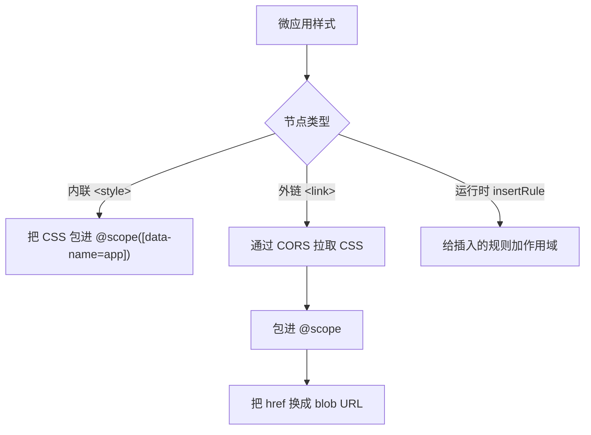

# 开启 CSS 样式隔离

默认情况下，微应用的 CSS 是和主应用、以及页面上其他所有微应用共享的。这一篇讲怎么打开 qiankun 的运行时样式隔离，让微应用的样式规则不会漏到页面别处，页面的样式规则也进不到微应用里。

样式隔离要主动开，默认关着。开法很简单，给某个应用配一个布尔值 `styleIsolation: true` 就行。

## 怎么开

`styleIsolation` 是 [`AppConfiguration`](/zh-CN/api/configuration) 上的一个字段，所以在哪儿传应用配置，就在哪儿配它。

::: code-group

```ts [registerMicroApps]
import { registerMicroApps, start } from 'qiankun';

registerMicroApps([
  {
    name: 'app-vue',
    entry: '//localhost:7101',
    container: document.getElementById('subapp-container')!,
    activeRule: '/app-vue',
    configuration: {
      styleIsolation: true,
    },
  },
]);

start();
```

```ts [loadMicroApp]
import { loadMicroApp } from 'qiankun';

const microApp = loadMicroApp(
  {
    name: 'app-vue',
    entry: '//localhost:7101',
    container: document.getElementById('subapp-container')!,
  },
  {
    styleIsolation: true,
  },
);
```

```jsx [MicroApp (React)]
import { MicroApp } from '@qiankunjs/react';

export default function App() {
  return (
    <MicroApp
      name="app-vue"
      entry="//localhost:7101"
      settings={{ styleIsolation: true }}
    />
  );
}
```

```vue [MicroApp (Vue)]
<template>
  <MicroApp
    name="app-vue"
    entry="//localhost:7101"
    :settings="{ styleIsolation: true }"
  />
</template>

<script setup>
import { MicroApp } from '@qiankunjs/vue';
</script>
```

:::

用 `<MicroApp>` 组件时，`settings` 这个 prop 本身就是一个 `AppConfiguration`，所以在 `settings` 上写 `styleIsolation: true`，跟 `configuration.styleIsolation` 是同一个开关。

## 底层做了什么

开了 `styleIsolation` 之后，微应用带进来的每一份样式，都会在加载时被改写，只在应用自己的容器里生效。



- **作用域根节点。** 应用容器上会带一个 `data-name="<appName>"` 属性，每条规则都被包进一个原生 CSS [`@scope`](https://developer.mozilla.org/en-US/docs/Web/CSS/@scope) 块里，作用域限定为 `[data-name="<appName>"]`。改写后的 CSS 长这样：

  ```css
  @scope ([data-name="app-vue"]) {
    .btn { color: rebeccapurple; }
  }
  ```

  作用域根节点是从应用名推导出来的，**不能自定义**。

- **内联 `<style>`** 元素是就地改写的：把它的 `textContent` 换成加了作用域的版本。

- **外链 `<link rel="stylesheet">`** 样式表会经过 qiankun 的 `fetch` 重新拉一遍，包进 `@scope`，再以 `blob:` URL 的形式塞回同一个 `<link>` 元素。浏览器从头到尾都不会去加载那份没加作用域的原始样式表。`<link>` 节点还是原来那个(原始 URL 保留在 `data-href` 上)，所以 `load`/`error` 处理器和 `document.styleSheets` 都照常能用。

- **运行时通过 `CSSStyleSheet.prototype.insertRule` 插入的规则**，会在插入的那一刻同步加上作用域。

## 前置要求

::: warning 依赖原生 CSS `@scope`
样式隔离完全建立在原生 CSS `@scope` 之上，没有 polyfill，也没有降级方案。浏览器不支持 `@scope`，样式就不会被加作用域，隔离直接不生效。所以在依赖这个能力之前，先确认你的目标浏览器支持 `@scope`。
:::

::: warning 外链样式表必须能通过 CORS 拉取
外链 `<link>` 样式表是被当成文本重新拉下来、再以 blob 形式重新提供的，所以微应用引用的每一份外链样式表，都得能通过一个启用了 CORS 的请求访问到——第三方 CSS 和任何被 `@import` 进来的样式表都算在内。一旦拉取或转译失败，qiankun 会**彻底丢掉这份样式表**(为了保住隔离，它绝不会退回去以无作用域的形式加载)，并在 `<link>` 上派发一个合成的 `error` 事件。一份没带对 CORS 头的跨域样式表，会悄无声息地消失。记得给字体和第三方 CSS 配上 `Access-Control-Allow-Origin`。
:::

## 需要提前绕开的坑

::: info @font-face 和 @namespace 保持全局
`@font-face` 和 `@namespace` 规则是被有意从 `@scope` 块里提出来、保持全局的——给 `@font-face` 加作用域会破坏字体加载。代价就是这些规则**不受隔离**，跨应用可能撞车。如果两个应用可能定义同名的字体族，给字体族起个应用内唯一的名字。
:::

::: info @keyframes 会被重命名
每个 `@keyframes` 名字都会被加上 `__qk_<appName>_` 前缀，引用它的 `animation` / `animation-name` 声明也会一起改写对上。这是静态的名字改写：只改那些在 CSS 里字面出现的名字。如果你的 JavaScript 是动态拼出一个 keyframe 名字(比如字符串拼接)再赋给元素的 `animation-name`，那这个引用会指向原来那个、如今已经被改名的 keyframe，动画就跑不起来了。别用动态拼出来的 keyframe 名字，或者把这些 keyframes 定义在被隔离的 CSS 之外。
:::

::: info Vite 以 JS 注入 CSS 时，重新挂载可能丢样式
Vite 构建的应用如果是通过 JavaScript 注入 CSS(CSS-as-JS)，这段注入往往只在模块顶层跑一次。重新挂载时 qiankun 会复用那个已经求值过的模块，顶层的副作用不会再跑一遍，于是应用第二次挂载时样式就可能没了。把样式注入放到每次挂载都会重跑的地方——比如放进应用的 `mount` 生命周期里——别留在模块顶层。参见[让 Vite 应用接入 qiankun](/zh-CN/cookbook/prepare-a-vite-app)。
:::

## 验证效果

把微应用加载起来，在浏览器 devtools 里检查：

1. 找到应用容器元素，确认它带着 `data-name="<appName>"`。
2. 看微应用的 `<style>` 元素(在虚拟化后的 `<qiankun-head>` 里):它们的规则应该被包在 `@scope ([data-name="<appName>"]) { ... }` 里。
3. 外链样式表在 `<link>` 上应该显示一个 `blob:` 的 `href`，原始 URL 保留在 `data-href` 属性上。
4. 改一条规则试试，确认它对容器外面的元素不再生效。

## 相关阅读

- [样式隔离](/zh-CN/concepts/style-isolation) —— 深入了解 `@scope` + blob-link 这套机制怎么运转。
- [HTML Entry 流式加载](/zh-CN/concepts/html-entry-loading) —— entry 流式进来时，样式是怎么被转译的。
- [AppConfiguration](/zh-CN/api/configuration) —— 完整的按应用配置参考。
- [从 qiankun 2.x 迁移](/zh-CN/cookbook/migrate-from-2x) —— `styleIsolation` 取代了 2.x 的 `strictStyleIsolation` / `experimentalStyleIsolation`。
