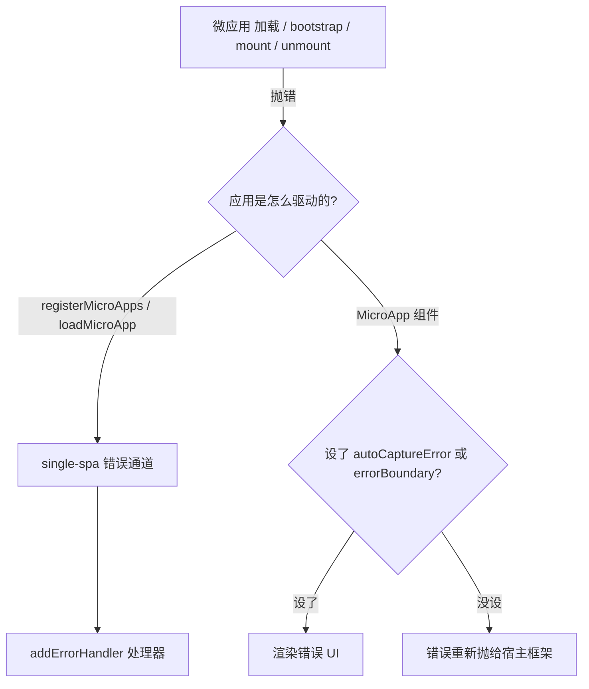

# 处理加载与运行时错误

微应用出错的原因，很多都不在基座掌控之内：一次坏掉的部署、一段网络抖动、CORS 配错、生命周期导出写错。qiankun 给了你两层手段去暴露和恢复这些错误——一层是给路由驱动应用用的全局错误处理器，另一层是 `<MicroApp>` 组件级别的错误 UI。下面把这两层讲清楚，顺带列出你实际会碰到的错误信息，以及它们各自从哪儿抛出来的。

## 两层错误处理



- 路由驱动和命令式加载的应用(`registerMicroApps`、`loadMicroApp`)，错误都走 single-spa。用 [`addErrorHandler`](/zh-CN/api/error-handling) 注册一个处理器就行。
- `<MicroApp>` 组件([React](/zh-CN/ecosystem/react)、[Vue](/zh-CN/ecosystem/vue))在你主动开启时，会把加载 / bootstrap / mount 错误渲染成 UI；否则就把错误原样抛出去。

## 全局处理：addErrorHandler / removeErrorHandler

`addErrorHandler` 和 `removeErrorHandler` 是直接从 single-spa 转出来的。single-spa 在加载、bootstrap、mount、unmount 应用的过程中抛出的每一个错误，它们都能收到——包括 qiankun 流式加载器、JS 沙箱、以及 ESM 模块图里抛的错。

```ts [main/src/index.ts]
import { registerMicroApps, addErrorHandler, start } from 'qiankun';

registerMicroApps([
  {
    name: 'app1',
    entry: 'http://localhost:8000',
    container: document.getElementById('subapp-container')!,
    activeRule: '/app1',
  },
]);

addErrorHandler((err) => {
  // err.appOrParcelName — 是哪个应用挂了
  // err.message         — 底层的错误信息
  // (err as Error).stack — 调用栈
  console.error(`[qiankun] ${err.appOrParcelName} failed:`, err);
  reportToMonitoring(err);
});

start();
```

这个处理器是全局的——任何一个注册过的应用出错它都会触发，所以要针对单个应用做不同处理，就在 `err.appOrParcelName` 上分支判断。移除处理器时，传入注册时用的那个同一引用：

```ts
const handler = (err: Error) => reportToMonitoring(err);
addErrorHandler(handler);
// 之后
removeErrorHandler(handler);
```

::: info ESM 模块图与顶层 await 的错误
以原生 ES 模块方式运行的应用(`<script type="module">`，比如 Vite),qiankun 的 ESM 引擎会把模块图求值时抛的错、以及顶层 `await` 的 reject，接回 single-spa 的错误通道，而不是任由它们变成 `unhandledrejection` 逃逸出去。也就是说，ESM 入口模块里的 throw，和经典脚本失败一样，照样能到达你的 `addErrorHandler` 处理器。参见 [ESM 沙箱](/zh-CN/concepts/esm-sandbox)。
:::

应用一旦出错，single-spa 会把它置为 broken 状态。`loadMicroApp` 返回一个 [`MicroApp`](/zh-CN/api/types) 句柄，对出错的那个实例，它的 `getStatus()` 会返回 `LOAD_ERROR` 或 `SKIP_BECAUSE_BROKEN`——命令式驱动应用、想查状态或做重试时会用得上。

## 组件级：`<MicroApp>` 错误 UI

`<MicroApp>` 这层封装默认不显示错误。你得主动开启，否则错误会被重新抛进宿主框架的渲染树里。

### React

用 `autoCaptureError` 开启内置的占位 UI，或者传一个自定义的 `errorBoundary` render prop 来渲染真正的 UI:

::: code-group

```tsx [Built-in placeholder]
import { MicroApp } from '@qiankunjs/react';

// 默认 UI 渲染 <div>{error.message}</div>
<MicroApp name="app1" entry="http://localhost:8000" autoCaptureError />
```

```tsx [Custom errorBoundary]
import { MicroApp } from '@qiankunjs/react';

<MicroApp
  name="app1"
  entry="http://localhost:8000"
  errorBoundary={(error) => (
    <div role="alert">
      <p>Failed to load app1: {error.message}</p>
      <button onClick={() => location.reload()}>Retry</button>
    </div>
  )}
/>
```

:::

### Vue

用 `autoCaptureError`，或者提供一个 `#error-boundary` 作用域插槽：

::: code-group

```vue [Built-in placeholder]
<script setup>
import { MicroApp } from '@qiankunjs/vue';
</script>

<!-- 默认 UI 渲染 <div>{{ error.message }}</div> -->
<template>
  <micro-app name="app1" entry="http://localhost:8000" auto-capture-error />
</template>
```

```vue [Custom slot]
<script setup>
import { MicroApp } from '@qiankunjs/vue';
</script>

<template>
  <micro-app name="app1" entry="http://localhost:8000">
    <template #error-boundary="{ error }">
      <div role="alert">Failed to load app1: {{ error.message }}</div>
    </template>
  </micro-app>
</template>
```

:::

### 不开启，错误就被重新抛出

如果 `autoCaptureError` 和自定义错误边界都没设，加载 / bootstrap / mount 的错误会从组件里重新抛出，而不是被吞掉。到框架层去接住它：

::: code-group

```tsx [React error boundary]
import { Component } from 'react';
import { MicroApp } from '@qiankunjs/react';

class Boundary extends Component<{ children: React.ReactNode }, { error?: Error }> {
  state: { error?: Error } = {};
  static getDerivedStateFromError(error: Error) {
    return { error };
  }
  render() {
    if (this.state.error) return <div role="alert">{this.state.error.message}</div>;
    return this.props.children;
  }
}

export default function Page() {
  return (
    <Boundary>
      <MicroApp name="app1" entry="http://localhost:8000" />
    </Boundary>
  );
}
```

```vue [Vue errorCaptured]
<script>
import { MicroApp } from '@qiankunjs/vue';

export default {
  components: { MicroApp },
  errorCaptured(err) {
    console.error('micro-app error:', err);
    return false; // 阻止冒泡
  },
};
</script>

<template>
  <micro-app name="app1" entry="http://localhost:8000" />
</template>
```

:::

::: tip 选对层级
`autoCaptureError` / `errorBoundary` 负责把失败在组件粒度上呈现给用户看；`addErrorHandler` 负责集中上报。两者是互补的——线上的基座一般会同时接：全局处理器管监控上报，组件级 UI 管面向用户的恢复。
:::

## 常见错误来源与信息

下面这些失败都直接来自 qiankun 运行时。认得出具体的错误信息，排查起来会快很多。

| 现象 / 信息 | 抛出位置 | 原因与解法 |
| --- | --- | --- |
| `You should not include more than 1 entry scripts in a single HTML entry <url> !` | loader | 有两个外部脚本都带了 `entry` 标记。一个 HTML entry 只能有一个 entry 脚本。检查你的 [bundler 插件](/zh-CN/ecosystem/bundler-plugin)是不是只标记了单个 entry chunk。 |
| `You need to export lifecycle functions in <app> entry as neither globalLatestSetProp ... nor window['<app>'] export correctly` | `getLifecyclesFromExports` | 微应用入口没有暴露 `bootstrap` / `mount` / `unmount`。导出约定见[微应用生命周期与 props](/zh-CN/concepts/lifecycle-and-props)。 |
| `The response body of entry <url> is empty!` | loader | 入口返回了空 body(比如一个 `204`、一个 body 为空的重定向、或者被代理把 body 剥掉了)。确认入口 URL 返回的确实是应用的 HTML。 |
| `<url> [RESPONSE_ERROR_AS_STATUS_INVALID] <status> <statusText>` | `makeFetchThrowable` | 入口(或某个资源)返回了非 2xx 状态。qiankun 增强过的 `fetch` 会把非 2xx 响应变成抛错，这样问题能暴露出来，而不是加载一个坏掉的应用。 |
| CORS / 网络 `TypeError: Failed to fetch` | 浏览器 `fetch` | 入口或它的资源拿不到，或者服务端没返回 `Access-Control-Allow-Origin`。qiankun 一切都走 `fetch` 加载，所以跨域的入口和资源都得配 CORS 头。 |
| `failed to resolve the bare specifier '<spec>' ... no import map entry found in app <app>` | ESM 引擎 | ESM 子应用 import 了一个裸模块标识符(bare specifier)，但没有对应的 import map 条目。给子应用配上它自己的 `<script type="importmap">`，或者改用类 URL 的标识符。参见 [ESM 沙箱](/zh-CN/concepts/esm-sandbox)。 |
| 开了样式隔离之后样式丢了 | style 转译器 | 开启[样式隔离](/zh-CN/cookbook/enable-style-isolation)后，外部样式表会被重新拉取成 blob `<link>`，好让 CSS `@scope` 能把它包起来；某个样式表请求失败或被 CORS 拦掉，应用就会没样式。去网络面板看看有没有失败的 CSS 请求。 |

::: warning 生命周期没导出，是最常见的一种失败
生命周期这个错，是在入口成功加载之后才冒出来的——HTML 和脚本都拉取正常，只是 qiankun 找不到 `bootstrap` / `mount` / `unmount`。多半是因为子应用没有按库(UMD/ESM)方式、带上 qiankun 的生命周期导出来构建，或者入口脚本没被标记成 entry。先把子应用准备好：[Vite](/zh-CN/cookbook/prepare-a-vite-app) / [Webpack](/zh-CN/cookbook/prepare-a-webpack-app)。
:::

## 瞬时故障自带重试

qiankun 把配置好的 `fetch` 包成了 `makeFetchCacheable(makeFetchRetryable(makeFetchThrowable(fetch)))`。瞬时的网络故障会先自动重试，再抛错，所以入口和资源的 fetch 重试你不用自己写。只有重试都用光了，错误才会到达 `addErrorHandler` 或组件的错误边界。想定制这套行为，通过 [`AppConfiguration`](/zh-CN/api/configuration) 传入你自己的 `fetch`。

## ESM 的可观测性坑：blob: 调用栈

ESM 子应用里，qiankun 会把每个模块改写后从一个 `blob:` URL 求值。结果就是，未捕获错误的 `error.stack` 指向的是 `blob:<host-origin>/<uuid>`，而不是原始的源文件。注入的 `//# sourceURL` 只改 DevTools 里显示的名字，并不会改栈里的 URL 和行号。

::: danger 线上错误上报务必规划好 source map
没有 source map，监控服务就没法把 ESM 子应用的栈帧映射回真实文件。凡是走 ESM 沙箱跑的应用，都把完整的 source map 当成生产环境的硬性要求，而不是可有可无的加分项。让子应用构建时输出 source map，并配置好你的上报工具去消费它们。经典(UMD/global)子应用不受这个问题影响——它们的 `//# sourceURL` 给出的栈帧是有意义的。
:::

## 相关

- [addErrorHandler / removeErrorHandler](/zh-CN/api/error-handling) —— API 参考
- [`<MicroApp>`(React)](/zh-CN/ecosystem/react) 与 [`<MicroApp>`(Vue)](/zh-CN/ecosystem/vue)
- [微应用生命周期与 props](/zh-CN/concepts/lifecycle-and-props) —— 导出约定
- [ESM 沙箱](/zh-CN/concepts/esm-sandbox) —— blob URL、import map、source map
- [启用 CSS 样式隔离](/zh-CN/cookbook/enable-style-isolation)
