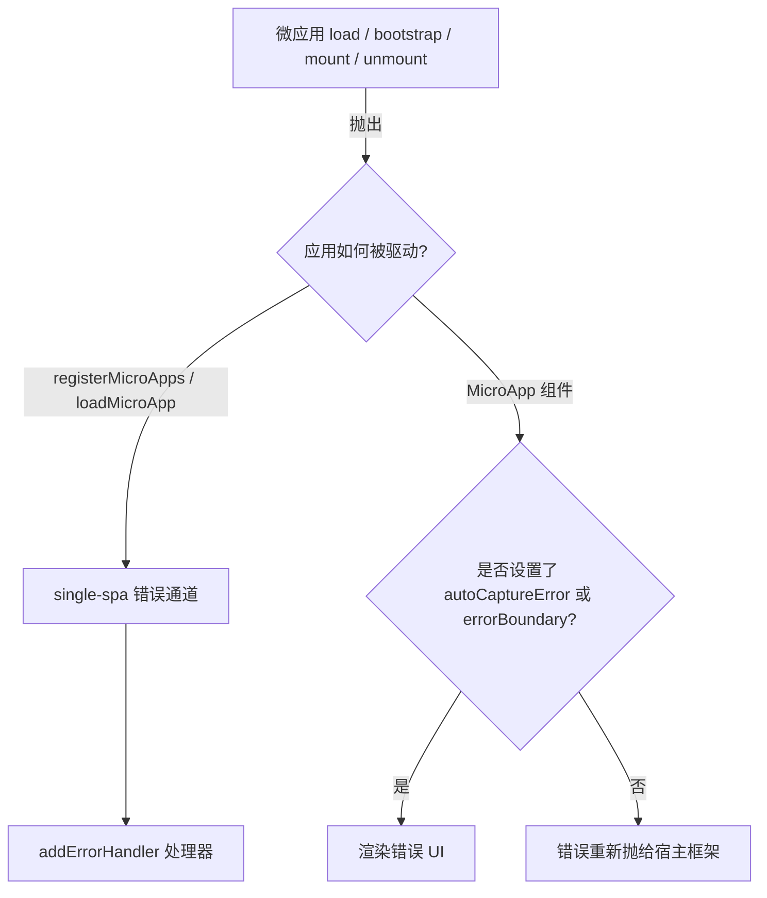

# 处理加载与运行时错误

微应用失败的原因往往超出主应用的完全掌控：一次糟糕的部署、一次网络抖动、一处 CORS 配置错误、一个损坏的 lifecycle 导出。本指南介绍 qiankun 提供的两层机制，用来暴露并从这些故障中恢复——面向路由驱动应用的全局错误处理器，以及 `<MicroApp>` 的组件级错误 UI——同时列出你会遇到的具体错误信息及其来源。

## 两层错误处理



- 路由驱动与命令式应用（`registerMicroApps`、`loadMicroApp`）会将故障通过 single-spa 转发。用 [`addErrorHandler`](/zh-CN/api/error-handling) 注册一个处理器。
- `<MicroApp>` 组件（[React](/zh-CN/ecosystem/react)、[Vue](/zh-CN/ecosystem/vue)）在你选择开启时，会把 load/bootstrap/mount 错误呈现为 UI，否则将其重新抛出。

## 全局处理器：addErrorHandler / removeErrorHandler

`addErrorHandler` 与 `removeErrorHandler` 直接从 single-spa 重新导出。它们会接收 single-spa 在 load、bootstrap、mount 或 unmount 应用过程中抛出的每一个错误——包括来自 qiankun 流式 loader、JS 沙箱以及 ESM 模块图的错误。

```ts [main/src/index.ts]
import { registerMicroApps, addErrorHandler, start } from 'qiankun';

registerMicroApps([
  {
    name: 'app1',
    entry: 'http://localhost:8000',
    container: document.getElementById('subapp-container')!,
    activeRule: '/app1',
  },
]);

addErrorHandler((err) => {
  // err.appOrParcelName — 哪个应用失败了
  // err.message         — 底层错误信息
  // (err as Error).stack — 堆栈信息
  console.error(`[qiankun] ${err.appOrParcelName} failed:`, err);
  reportToMonitoring(err);
});

start();
```

该处理器是全局的——它会为任何已注册的应用触发，因此如果你需要针对单个应用的行为，请基于 `err.appOrParcelName` 进行分支判断。用注册时相同的引用来移除处理器：

```ts
const handler = (err: Error) => reportToMonitoring(err);
addErrorHandler(handler);
// 稍后
removeErrorHandler(handler);
```

::: info ESM 模块图与顶层 await 错误
对于以原生 ES 模块方式运行的应用（`<script type="module">`，例如 Vite），qiankun 的 ESM 引擎会将模块图求值错误与顶层 `await` 的 reject 引导回 single-spa 的错误通道，而不是让它们以 `unhandledrejection` 的形式逃逸。这意味着 ESM 入口模块内部的 throw 会像经典脚本失败一样抵达你的 `addErrorHandler` 处理器。参见 [ESM 沙箱](/zh-CN/concepts/esm-sandbox)。
:::

当应用出错时，single-spa 会将其置于 broken 状态。`loadMicroApp` 返回一个 [`MicroApp`](/zh-CN/api/types) 句柄，其 `getStatus()` 会为失败的实例报告 `LOAD_ERROR` 或 `SKIP_BECAUSE_BROKEN`——当你以命令式方式驱动应用并想检查或重试时会很有用。

## 组件级：`<MicroApp>` 错误 UI

`<MicroApp>` 包装组件默认不显示错误。你必须主动开启，否则错误会被重新抛进宿主框架的渲染树。

### React

用 `autoCaptureError` 开启内置占位 UI，或传入自定义的 `errorBoundary` render prop 来渲染真正的 UI：

::: code-group

```tsx [Built-in placeholder]
import { MicroApp } from '@qiankunjs/react';

// 默认 UI 渲染 <div>{error.message}</div>
<MicroApp name="app1" entry="http://localhost:8000" autoCaptureError />
```

```tsx [Custom errorBoundary]
import { MicroApp } from '@qiankunjs/react';

<MicroApp
  name="app1"
  entry="http://localhost:8000"
  errorBoundary={(error) => (
    <div role="alert">
      <p>Failed to load app1: {error.message}</p>
      <button onClick={() => location.reload()}>Retry</button>
    </div>
  )}
/>
```

:::

### Vue

用 `autoCaptureError` 开启，或提供一个 `#error-boundary` 作用域插槽：

::: code-group

```vue [Built-in placeholder]
<script setup>
import { MicroApp } from '@qiankunjs/vue';
</script>

<!-- 默认 UI 渲染 <div>{{ error.message }}</div> -->
<template>
  <micro-app name="app1" entry="http://localhost:8000" auto-capture-error />
</template>
```

```vue [Custom slot]
<script setup>
import { MicroApp } from '@qiankunjs/vue';
</script>

<template>
  <micro-app name="app1" entry="http://localhost:8000">
    <template #error-boundary="{ error }">
      <div role="alert">Failed to load app1: {{ error.message }}</div>
    </template>
  </micro-app>
</template>
```

:::

### 不开启时，错误会被重新抛出

如果你既不设置 `autoCaptureError` 也不设置自定义错误边界，load/bootstrap/mount 错误会从组件重新抛出，而不是被吞掉。请在框架层面捕获它们：

::: code-group

```tsx [React error boundary]
import { Component } from 'react';
import { MicroApp } from '@qiankunjs/react';

class Boundary extends Component<{ children: React.ReactNode }, { error?: Error }> {
  state: { error?: Error } = {};
  static getDerivedStateFromError(error: Error) {
    return { error };
  }
  render() {
    if (this.state.error) return <div role="alert">{this.state.error.message}</div>;
    return this.props.children;
  }
}

export default function Page() {
  return (
    <Boundary>
      <MicroApp name="app1" entry="http://localhost:8000" />
    </Boundary>
  );
}
```

```vue [Vue errorCaptured]
<script>
import { MicroApp } from '@qiankunjs/vue';

export default {
  components: { MicroApp },
  errorCaptured(err) {
    console.error('micro-app error:', err);
    return false; // 阻止冒泡
  },
};
</script>

<template>
  <micro-app name="app1" entry="http://localhost:8000" />
</template>
```

:::

::: tip 选择合适的层
`autoCaptureError` / `errorBoundary` 以组件为粒度、在视觉上处理故障。`addErrorHandler` 则集中处理，用于上报。两者互补——生产环境的主应用通常会接入一个全局处理器用于监控，同时用组件级 UI 面向用户做恢复。
:::

## 常见错误来源与信息

下列故障直接来自 qiankun 的运行时。了解确切的错误信息可以加快诊断。

| 现象 / 信息 | 抛出位置 | 原因与修复 |
| --- | --- | --- |
| `You should not include more than 1 entry scripts in a single HTML entry <url> !` | loader | 有两个外部脚本携带了 `entry` 标记。一个 HTML entry 只能有且仅有一个 entry 脚本。请确保你的 [bundler plugin](/zh-CN/ecosystem/bundler-plugin) 只标记单个 entry chunk。 |
| `You need to export lifecycle functions in <app> entry as neither globalLatestSetProp ... nor window['<app>'] export correctly` | `getLifecyclesFromExports` | 微应用入口没有暴露 `bootstrap` / `mount` / `unmount`。导出约定参见 [微应用 lifecycle 与 props](/zh-CN/concepts/lifecycle-and-props)。 |
| `The response body of entry <url> is empty!` | loader | 入口返回了空 body（例如一个 `204`、一个带空负载的重定向，或一个剥掉了 body 的代理）。请确认入口 URL 提供了应用的 HTML。 |
| `<url> [RESPONSE_ERROR_AS_STATUS_INVALID] <status> <statusText>` | `makeFetchThrowable` | 入口（或某个资源）返回了非 2xx 状态。qiankun 增强版的 `fetch` 会把非 2xx 响应转为抛出，让其暴露出来，而不是加载一个损坏的应用。 |
| CORS / 网络 `TypeError: Failed to fetch` | 浏览器 `fetch` | 入口或其资源不可达，或服务器未发送 `Access-Control-Allow-Origin`。qiankun 通过 `fetch` 加载所有内容，因此跨域的入口与资源需要 CORS 头。 |
| `failed to resolve the bare specifier '<spec>' ... no import map entry found in app <app>` | ESM engine | 一个 ESM 子应用导入了一个裸模块标识符（bare specifier），但没有匹配的 import map 条目。请提供子应用自己的 `<script type="importmap">`，或使用类 URL 的标识符。参见 [ESM 沙箱](/zh-CN/concepts/esm-sandbox)。 |
| 启用样式隔离后样式丢失 | style transpiler | 在 [样式隔离](/zh-CN/cookbook/enable-style-isolation) 下，外部样式表会作为 blob `<link>` 被重新拉取，以便 CSS `@scope` 能够包裹它们；一个被丢弃或被 CORS 拦截的样式表请求会让应用失去样式。请在网络面板中检查失败的 CSS 请求。 |

::: warning 缺失 lifecycle 导出是最常见的故障
lifecycle 错误在入口成功加载之后才会出现——HTML 与脚本都拉取正常，但 qiankun 找不到 `bootstrap` / `mount` / `unmount`。这通常意味着子应用没有以库（UMD/ESM）形式构建并带上 qiankun 的 lifecycle 导出，或者入口脚本没有被标记为 entry。请先准备好子应用：[Vite](/zh-CN/cookbook/prepare-a-vite-app) / [Webpack](/zh-CN/cookbook/prepare-a-webpack-app)。
:::

## 瞬时故障已内置重试行为

qiankun 将配置好的 `fetch` 包装为 `makeFetchCacheable(makeFetchRetryable(makeFetchThrowable(fetch)))`。瞬时网络故障会在抛出错误前自动重试，因此你无需自己为入口/资源的 fetch 实现重试。只有在重试耗尽之后，错误才会抵达 `addErrorHandler` 或组件错误边界。若要自定义这一行为，可通过 [`AppConfiguration`](/zh-CN/api/configuration) 传入你自己的 `fetch`。

## ESM 可观测性注意事项：blob: 堆栈

对于 ESM 子应用，qiankun 会重写每个模块并从一个 `blob:` URL 求值它。因此未捕获错误的 `error.stack` 指向的是 `blob:<host-origin>/<uuid>`，而非原始源文件。注入的 `//# sourceURL` 只改变 DevTools 中的显示名称——它不会改变堆栈中的 URL 或行号。

::: danger 为生产环境的错误上报规划 source map
没有 source map，监控服务就无法将 ESM 子应用的堆栈帧映射回真实文件。对任何跑在 ESM 沙箱中的应用，请把完整的 source map 当作生产环境的必备项，而非可有可无的加分项。在子应用构建时产出 source map，并配置你的上报工具去消费它们。经典（UMD/global）子应用不会受到同样的影响——它们的 `//# sourceURL` 能给出有意义的堆栈帧。
:::

## 相关

- [addErrorHandler / removeErrorHandler](/zh-CN/api/error-handling) — API 参考
- [`<MicroApp>` for React](/zh-CN/ecosystem/react) 与 [for Vue](/zh-CN/ecosystem/vue)
- [微应用 lifecycle 与 props](/zh-CN/concepts/lifecycle-and-props) — 导出约定
- [ESM 沙箱](/zh-CN/concepts/esm-sandbox) — blob URL、import map、source map
- [启用 CSS 样式隔离](/zh-CN/cookbook/enable-style-isolation)
