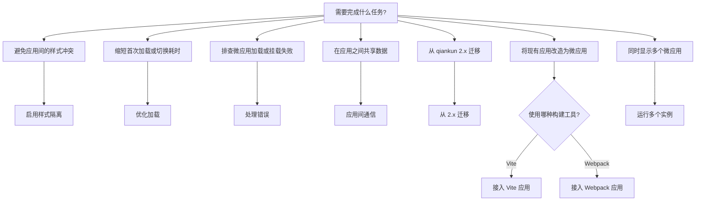

# 实用指南

本节汇总 qiankun v3 常见场景的处理方法。各页面围绕明确目标组织内容，并提供相应的配置和代码示例。若需了解相关机制，请参阅文中链接的核心概念页面。

## 阅读说明

- 每篇指南针对一个具体目标，例如启用某项能力、改造微应用或处理特定故障，不会逐项介绍某个 API 的全部功能。
- 各篇内容可以独立阅读。文中的步骤假定 qiankun 已安装，并且已有可运行的主应用和至少一个微应用。尚未完成基础接入时，请先阅读[快速上手](/zh-CN/guide/getting-started)或[教程](/zh-CN/tutorial/)。
- 本节不重复说明底层机制。相关内容请参阅 [JavaScript 沙箱](/zh-CN/concepts/js-sandbox)、[样式隔离](/zh-CN/concepts/style-isolation)和 [HTML 入口加载](/zh-CN/concepts/html-entry-loading)等核心概念页面。
- 类型、默认值和完整字段说明见 [API 参考](/zh-CN/api/)。本节侧重说明各项配置在具体场景中的使用方式。

## 指南一览

| 指南 | 目标 |
| --- | --- |
| [启用 CSS 样式隔离](/zh-CN/cookbook/enable-style-isolation) | 为指定应用启用 `sandbox.styleIsolation`，避免微应用样式影响主应用或其他微应用。 |
| [优化加载与预加载](/zh-CN/cookbook/optimize-loading) | 配置缓存、控制入口体积，并利用流式加载器的自动预加载能力。 |
| [处理微应用错误](/zh-CN/cookbook/handle-errors) | 通过 `addErrorHandler`、`removeErrorHandler` 和实例级状态处理加载及生命周期错误。 |
| [应用间共享状态与通信](/zh-CN/cookbook/communicate-between-apps) | 通过 `props` 在主应用和微应用之间传递数据与回调。qiankun v3 不再提供内置状态管理。 |
| [从 qiankun 2.x 迁移](/zh-CN/cookbook/migrate-from-2x) | 将 2.x 接入方式迁移到 v3，包括字符串 `entry`、元素 `container`、应用级 `configuration` 和已移除的选项。 |
| [接入 Vite 应用](/zh-CN/cookbook/prepare-a-vite-app) | 配置 `@qiankunjs/bundler-plugin/vite` 并导出生命周期，使 Vite 应用能够作为微应用加载。 |
| [接入 Webpack 应用](/zh-CN/cookbook/prepare-a-webpack-app) | 配置 `QiankunWebpackPlugin` 并导出生命周期，使 Webpack 应用能够作为微应用加载。 |
| [运行多个微应用实例](/zh-CN/cookbook/run-multiple-instances) | 使用 `loadMicroApp` 挂载同一应用或不同应用的多个实例，并分别管理其卸载过程。 |
| [用插件扩展沙箱](/zh-CN/cookbook/sandbox-plugins) | 编写隔离插件，让自定义副作用与内置插件一样被捕获、释放和重建。 |
| [独立使用沙箱](/zh-CN/cookbook/standalone-sandbox) | 单独使用 `@qiankunjs/sandbox` 隔离第三方脚本，无需加载完整的微应用。 |

## 按目标选择指南

可根据具体任务选择对应指南：

::: tip 默认使用 loadMicroApp
本节示例默认将 [`AppConfiguration`](/zh-CN/api/configuration) 作为 [`loadMicroApp`](/zh-CN/api/load-micro-app) 的第二个参数传入。对于由路由驱动的应用，可将同一配置写入 `registerMicroApps` 的应用 `configuration` 字段。完整字段和默认值见配置参考。
:::

::: warning v3 不再内置全局状态管理
qiankun v3 已移除 2.x 中的 `initGlobalState`、`onGlobalStateChange` 和 `setGlobalState`。需要共享状态时，应通过 `props` 传递数据和回调。详见[应用间共享状态与通信](/zh-CN/cookbook/communicate-between-apps)。
:::

## 相关

- [API 参考总览](/zh-CN/api/)——所有公开导出和类型
- [加载微应用实例](/zh-CN/concepts/architecture)——`loadMicroApp` 的运行模型
- [常见问题](/zh-CN/faq/index)——常见问题及简要解答
