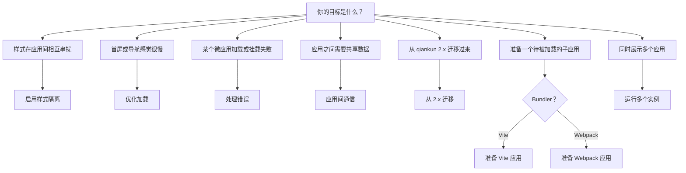

# Cookbook

面向任务的实用配方，覆盖 qiankun v3 的常见工作。每个配方都以目标为先：它先陈述结果，再展示代码，并假设你已经了解相关的周边概念。当你需要的是底层模型而非操作步骤时，请跟随概念链接。

## 如何阅读配方

- 每个配方都从一个具体目标出发（"启用 X"、"让 Y 就绪"、"处理 Z"），而不是从某个 API 面出发。
- 配方是自包含的。它们假设框架已经安装完毕，并且你已经有一个可运行的主应用和至少一个微应用。如果还没有，请先从 [快速上手](/zh-CN/guide/getting-started) 或[教程](/zh-CN/tutorial/index)开始。
- 概念在别处讲解。配方会链接到相关的概念页面（[JS 沙箱](/zh-CN/concepts/js-sandbox)、[样式隔离](/zh-CN/concepts/style-isolation)、[HTML Entry 流式加载](/zh-CN/concepts/html-entry-loading)），而不是重新解释它。
- API 细节位于[参考手册](/zh-CN/api/index)。配方展示的是在具体场景中的选项；参考手册则列出每个字段、类型和默认值。

## 配方

| 配方 | 意图 |
| --- | --- |
| [启用 CSS 样式隔离](/zh-CN/cookbook/enable-style-isolation) | 为单个应用开启 `styleIsolation`，使微应用的 CSS 不会泄漏到主应用或其同级应用。 |
| [优化加载与预加载](/zh-CN/cookbook/optimize-loading) | 充分利用流式加载器、fetch 缓存以及自动预加载，而非手动 prefetch。 |
| [处理加载与运行时错误](/zh-CN/cookbook/handle-errors) | 通过 `addErrorHandler` / `removeErrorHandler` 以及单应用 loader 捕获加载与 lifecycle 失败。 |
| [在应用间共享状态与通信](/zh-CN/cookbook/communicate-between-apps) | 由于 v3 不再内置 store，通过 `props` 在主应用与微应用之间传递数据和回调。 |
| [从 qiankun 2.x 迁移](/zh-CN/cookbook/migrate-from-2x) | 将 2.x 集成迁移到 v3：字符串 `entry`、元素 `container`、单应用 `configuration`，以及被移除的选项。 |
| [让 Vite 应用支持 qiankun](/zh-CN/cookbook/prepare-a-vite-app) | 接入 `@qiankunjs/bundler-plugin/vite` 插件并导出 lifecycles，让 Vite 应用作为微应用运行。 |
| [让 Webpack 应用支持 qiankun](/zh-CN/cookbook/prepare-a-webpack-app) | 添加 `QiankunWebpackPlugin` 并导出 lifecycles，让 Webpack 应用作为微应用运行。 |
| [运行多个微应用实例](/zh-CN/cookbook/run-multiple-instances) | 使用 `loadMicroApp` 同时挂载同一个或多个微应用，并各自干净地卸载。 |

## 快速选择

不确定你需要哪个配方？把你的目标与一个起点对应起来。

::: tip 配置应用的两种方式
大多数配方都会涉及两种配置面之一。注册的应用在 [`registerMicroApps`](/zh-CN/api/register-micro-apps) 上携带一个单应用的 [`configuration`](/zh-CN/api/configuration) 字段；手动加载的应用则把同样的 [`AppConfiguration`](/zh-CN/api/configuration) 作为 [`loadMicroApp`](/zh-CN/api/load-micro-app) 的第二个参数。两者都恰好接受 `fetch`、`streamTransformer`、`nodeTransformer`、`sandbox`（默认 `true`）、`globalContext`（默认 `window`）以及 `styleIsolation`（默认 `false`）。
:::

::: warning v3 中没有全局状态 store
qiankun 2.x 提供了 `initGlobalState` / `onGlobalStateChange` / `setGlobalState`。版本 3 不再提供。要共享状态，请通过 `props` 传递你自己的值和回调 —— 参见[在应用间共享状态与通信](/zh-CN/cookbook/communicate-between-apps)。
:::

## 相关

- [API 参考总览](/zh-CN/api/index) —— 每个导出与类型。
- [架构总览](/zh-CN/concepts/architecture) —— `loadApp` 如何把 fetch、沙箱和 loader 串联起来。
- [FAQ](/zh-CN/faq/index) —— 对常见问题的简短解答。
