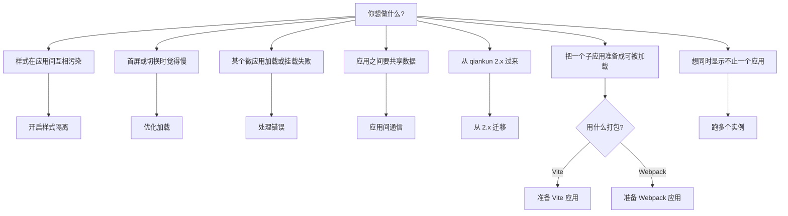

# Cookbook

这里收的是 qiankun v3 常见活儿的实操菜谱。每篇都从目标出发：先说清要达成什么效果，再直接上代码，默认你已经懂周边的概念了。如果你要的是背后的原理而不是操作步骤，顺着文中的概念链接过去看。

## 怎么看一篇菜谱

- 每篇都从一个具体目标切入(开启某项能力、把某个应用准备好、处理某种情况)，而不是从某个 API 的全貌讲起。
- 菜谱是自包含的，默认框架已经装好，你手上有一个能跑的主应用和至少一个微应用。要是还没有，先看[快速上手](/zh-CN/guide/getting-started)或者[教程](/zh-CN/tutorial/index)。
- 概念部分不在这里讲。菜谱只把你引到对应的概念页([JS 沙箱](/zh-CN/concepts/js-sandbox)、[样式隔离](/zh-CN/concepts/style-isolation)、[HTML 流式加载](/zh-CN/concepts/html-entry-loading))，不重复解释。
- API 的细节在[参考手册](/zh-CN/api/index)里。菜谱把选项放进真实场景里给你看，手册则逐字段列出类型和默认值。

## 菜谱一览

| 菜谱 | 目标 |
| --- | --- |
| [开启 CSS 样式隔离](/zh-CN/cookbook/enable-style-isolation) | 给单个应用打开 `styleIsolation`，让微应用的 CSS 不会漏进主应用或其他兄弟应用。 |
| [优化加载与预加载](/zh-CN/cookbook/optimize-loading) | 把流式加载器、fetch 缓存和自动预加载用足，而不是靠手动 prefetch。 |
| [处理加载与运行时错误](/zh-CN/cookbook/handle-errors) | 用 `addErrorHandler` / `removeErrorHandler` 和单应用 loader 捕获加载和生命周期里的失败。 |
| [应用间共享状态与通信](/zh-CN/cookbook/communicate-between-apps) | v3 不再自带 store，数据和回调都通过 `props` 在主应用和微应用之间传。 |
| [从 qiankun 2.x 迁移](/zh-CN/cookbook/migrate-from-2x) | 把 2.x 的接入改到 v3:字符串 `entry`、元素 `container`、单应用 `configuration`，以及被移除的选项。 |
| [让 Vite 应用接入 qiankun](/zh-CN/cookbook/prepare-a-vite-app) | 接上 `@qiankunjs/bundler-plugin/vite` 插件并导出生命周期，让 Vite 应用能当微应用跑。 |
| [让 Webpack 应用接入 qiankun](/zh-CN/cookbook/prepare-a-webpack-app) | 加上 `QiankunWebpackPlugin` 并导出生命周期，让 Webpack 应用能当微应用跑。 |
| [同时跑多个微应用实例](/zh-CN/cookbook/run-multiple-instances) | 用 `loadMicroApp` 一次挂载同一个或多个微应用，并各自干净地卸载。 |

## 快速选路

不确定该翻哪一篇？按你的目标对号入座。

::: tip 配置一个应用的两处入口
大多数菜谱动的都是这两处配置之一。注册进来的应用，配置写在 [`registerMicroApps`](/zh-CN/api/register-micro-apps) 里每个应用各自的 [`configuration`](/zh-CN/api/configuration) 字段上；手动加载的应用，则把同一份 [`AppConfiguration`](/zh-CN/api/configuration) 作为 [`loadMicroApp`](/zh-CN/api/load-micro-app) 的第二个参数传进去。两者接受的字段一模一样：`fetch`、`streamTransformer`、`nodeTransformer`、`sandbox`(默认 `true`)、`globalContext`(默认 `window`)和 `styleIsolation`(默认 `false`)。
:::

::: warning v3 不再自带全局状态 store
qiankun 2.x 提供过 `initGlobalState` / `onGlobalStateChange` / `setGlobalState`,v3 把它们去掉了。要共享状态，自己把值和回调通过 `props` 传下去——见[应用间共享状态与通信](/zh-CN/cookbook/communicate-between-apps)。
:::

## 相关

- [API 参考总览](/zh-CN/api/index)——每一个导出和类型。
- [架构概览](/zh-CN/concepts/architecture)——`loadApp` 是怎么把 fetch、沙箱和加载器串起来的。
- [FAQ](/zh-CN/faq/index)——常见问题的简短回答。
