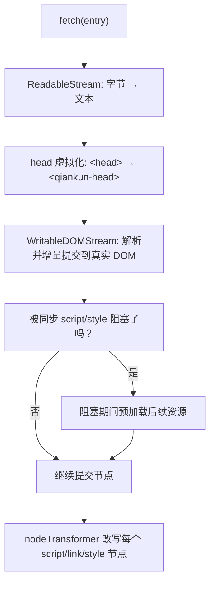

# 优化加载与预加载

我们的目标是让微应用快速首屏渲染、缓存预热，而不必依赖 qiankun 2.x 那套在 qiankun 3 中已不复存在的 prefetch 策略。在 v3 中，这些大多是自动完成的：流式 HTML Entry 加载器会增量提交 DOM，并在被阻塞时预加载资源；而被装饰过的 `fetch` 则让每个资源都可缓存、可重试。本页会讲清楚哪些能力你无需配置就能获得、哪些配置该弃用，以及少数几个仍然重要的调节点。

## 一眼看懂 v3 的加载流程



入口 HTML 从不会被整体缓冲。`loadEntry` 会将响应体直接管道传入 `writable-dom`，后者在字节到达时就解析并提交节点、在遇到同步脚本和样式表时阻塞，并在等待期间预加载其他资源。完整流水线见 [HTML Entry 流式加载](/zh-CN/concepts/html-entry-loading)。

## v3 的加载机制

### 流式、增量提交

由于加载器是流式的，子应用的标记和首屏样式会在整个文档（及其脚本）下载完成之前就渲染到屏幕上。你无需主动开启它——无论是 [`registerMicroApps`](/zh-CN/api/register-micro-apps) 还是 [`loadMicroApp`](/zh-CN/api/load-micro-app)，每一个入口都是这样加载的。

### 被装饰过的 fetch：可缓存、可重试、可抛错

微应用拉取的每个资源都会经过一个 `loadApp` 为你包裹好的 `fetch`：

```ts
const enhancedFetch = makeFetchCacheable(makeFetchRetryable(makeFetchThrowable(fetch)));
```

- **cacheable**（最外层）会对响应去重并缓存，因此同一个 URL 无论是被入口、被预加载，还是在之后重新挂载时请求，都只会被真正拉取一次。
- **retryable** 会透明地重试瞬时网络故障。
- **throwable** 会将非 2xx 响应转化为抛出的错误，这样损坏的资源会通过[错误处理](/zh-CN/cookbook/handle-errors)暴露出来，而不是加载出一个空白外壳。

你可以通过 `configuration.fetch` 为每个应用提供自己的基础 `fetch`（例如用于携带鉴权头）；qiankun 仍会用这三个装饰器把它包裹起来。参见 [AppConfiguration](/zh-CN/api/configuration)。

### `start()` 会预热 ESM lexer

调用 [`start`](/zh-CN/api/start) 所做的不止是启动 single-spa。它还会触发 `prepareEsmLexer()`，预加载 [ESM 沙箱](/zh-CN/concepts/esm-sandbox)用来改写模块脚本的那个 WebAssembly lexer。在启动时就将它预热，能让第一个 ESM 微应用不必在自己的关键路径上为此付出代价。

::: tip 尽早调用 start()
如果你没有调用过 `start()`，`loadMicroApp` 会自动调用它；但在主应用启动时由你自己调用 `start()`，意味着 lexer 的预热会与主应用自身的渲染重叠进行，而不是压在第一个微应用挂载的时候。
:::

## 不要使用的东西

qiankun 2.x 那套繁复的 prefetch 配置已经移除，不要把它迁移过来。

::: danger 已在 v3 移除
- `start({ prefetch: 'all' | [...] | fn })` —— `start` 只接受 single-spa 的 `StartOpts`，也就是 `{ urlRerouteOnly?: boolean }`。任何传给 `start` 的 qiankun 专属选项都会被忽略。
- `PrefetchStrategy` 类型出于向后兼容仍被导出，但没有任何公开 API 会消费它。它不配置任何东西。

带自动预加载的流式加载器取代了整套策略系统。
:::

### `prefetchApps` 已弃用

`prefetchApps` 仍被导出，但仅作为遗留的逃生舱口。它被标记为 `@deprecated`，并会在开发环境中打印警告。

```ts
import { prefetchApps } from 'qiankun';

// 仅供遗留使用 —— 更推荐让流式加载器按需预加载。
prefetchApps([
  { name: 'app1', entry: '//localhost:7100' },
  { name: 'app2', entry: '//localhost:7101' },
]);
```

它实际做的事情，以及它的约束：

| 方面 | 行为 |
| --- | --- |
| 何时运行 | 在 `requestIdleCallback` 内部 —— 只在浏览器空闲时预热缓存。 |
| 拉取什么 | 入口 HTML，然后是它找到的每个 `script[src]` 和 `link[rel="stylesheet"]`，都经过你的 `fetch`。 |
| 离线 | 当 `navigator.onLine` 为 false 时完全跳过。 |
| Save-Data / 慢速网络 | 当 `navigator.connection.saveData` 为真，或连接是报告为 2g/3g 的非 wifi/ethernet 连接时跳过。 |
| 签名 | `prefetchApps(apps: AppMetadata[], fetch?: typeof window.fetch)` —— `AppMetadata` 即 `{ name, entry }`。 |

::: warning 优先选择默认路径
只有在你有明确理由要在导航之前预热某个特定应用的缓存时，才去动用 `prefetchApps`。在大多数应用中，流式加载器加上可缓存的 fetch 已经能在无需它的情况下为你预热好缓存。
:::

## 实用建议

### 让子应用入口保持 CORS 可缓存

加载器用 `fetch` 拉取入口和资源，因此跨域子应用必须发送宽松的 CORS 头，而你的缓存头也应当允许浏览器复用响应。当[样式隔离](/zh-CN/cookbook/enable-style-isolation)开启时，这一点尤为关键：外部样式表会被重新拉取，并以 blob URL 的形式重新提供，因此一个缺少 CORS 头的样式表会被丢弃，而不是不加隔离地加载。

### 依赖 modulepreload → fetch 的改写

在 ESM 路径下，`<link rel="modulepreload">`（以及样式隔离下的 `<link rel="preload" as="style">`）会被改写为带 `crossorigin="anonymous"` 的 `as="fetch"`。原因在于：这些资源是被流水线的 `fetch()` 消费的，而不是被浏览器原生的预加载消费的，因此原生的 `as="modulepreload"`/`as="style"` 预热会落在一个独立的缓存里而无法命中。这个改写让预加载请求能够被可缓存的 fetch 匹配到。你无需配置它 —— 只要把 bundler 生成的预加载提示原样保留即可。

### 恰好保留一个 entry 脚本

一个 HTML Entry 至多只能包含一个 `<script entry>`。出现第二个会让加载器抛出 `QiankunError`。除了正确性之外，只有一个 entry 脚本还能让关键路径保持可预测：加载器能确切知道哪个脚本负责解析出应用的 lifecycle。你的 bundler 的 qiankun 插件会为你标记 entry 脚本 —— 参见 [@qiankunjs/bundler-plugin](/zh-CN/ecosystem/bundler-plugin)。

### 让 `loadMicroApp` 记忆化

`loadMicroApp` 会以 `name` 加上容器的 XPath 作为每次加载的键。将同一个应用再次渲染到同一个 DOM 节点会复用已缓存的加载结果，不会重新执行 lifecycle —— bootstrap 在重新挂载时会变成一个空操作。如果你以命令式方式（或通过 [`<MicroApp>`](/zh-CN/ecosystem/react)）驱动微应用，为某个应用名复用一个稳定的容器元素，就能把重新挂载变成廉价操作，而不是完整的重新加载。

::: tip 多实例
若你刻意要在同一时间多次运行同一个应用，参见[运行多个微应用实例](/zh-CN/cookbook/run-multiple-instances)。记忆化是按 `name`+容器 进行的，因此不同的容器会独立加载。
:::

## 度量

### `runAfterFirstMounted` 计时

`runAfterFirstMounted` 只会触发一次，即在 single-spa 的 `single-spa:first-mount` 事件时。在开发环境中，它还会围绕首次挂载闭合一个 `console.time` 标签，因此你能在控制台里免费得到一个首次挂载耗时。把它当作"主应用已变为可交互"的标记来用。

```ts
import { runAfterFirstMounted } from 'qiankun';

runAfterFirstMounted(() => {
  performance.mark('qiankun:first-mount');
  // 隐藏主应用级别的加载指示器、上报一个指标，等等。
});
```

完整参考见 [setDefaultMountApp / runAfterFirstMounted](/zh-CN/api/effects)。

### 浏览器网络瀑布图

由于加载是流式的，DevTools 的 Network 面板是对真实发生情况最诚实的呈现。留意以下现象：

- 入口 HTML 的响应到达后，DOM 在响应尚未结束时就已提交（流式的实际体现）。
- 在一个阻塞脚本下载的同时，预加载请求正在发出。
- 重新挂载时，重复的 URL 由 fetch 缓存提供，而不是再次打到网络。
- 针对你的 bundler 以 `modulepreload`/`preload` 形式生成的资源，出现 `as: fetch` 请求 —— 这证实了改写已经生效。

对于一个已访问过的应用，若路由切换时没有显示任何新的网络请求，那正是记忆化与 fetch 缓存在发挥作用。

## 相关内容

- [start](/zh-CN/api/start) —— 唯一受支持的选项，以及 lexer 预热。
- [prefetchApps（已弃用）](/zh-CN/api/prefetch-apps) —— 完整的遗留逃生舱口。
- [HTML Entry 流式加载](/zh-CN/concepts/html-entry-loading) —— 自动预加载背后的流水线。
- [AppConfiguration](/zh-CN/api/configuration) —— `fetch`、`streamTransformer`、`nodeTransformer`。
