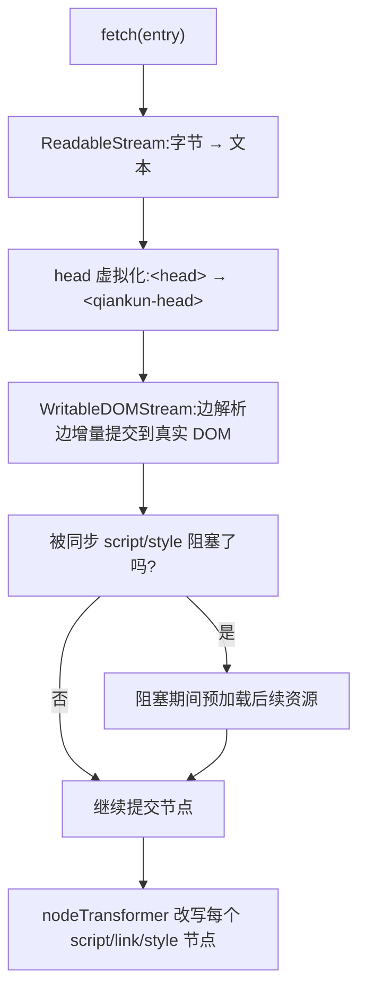

# 优化加载与预加载

目标很朴素：让微应用首屏快一点、缓存热一点，同时别再去碰 qiankun 2.x 那套 prefetch 策略——它在 qiankun 3 里已经不存在了。v3 里这些事大多是自动的：流式 HTML 入口加载器边解析边把 DOM 增量提交上屏，遇到阻塞时顺手预加载后面的资源；装饰过的 `fetch` 又让每个资源都可缓存、可重试。这一页说清楚三件事：哪些是你白得的、哪些配置该停手、还剩下哪几个旋钮值得你去拧。

## 一眼看懂 v3 的加载流程



入口 HTML 从头到尾都不会被整份缓冲。`loadEntry` 把响应体直接管道接进 `writable-dom`，字节一到就解析、就提交节点；碰到同步脚本和样式表时阻塞，并在等待期间预加载其他资源。完整的流水线见 [HTML 入口流式加载](/zh-CN/concepts/html-entry-loading)。

## v3 的加载机制

### 流式、增量提交

加载器是流式的，所以子应用的 DOM 结构和首屏样式会在整份文档(以及它的脚本)下载完之前就先渲染到屏幕上。这不是开关——无论 [`registerMicroApps`](/zh-CN/api/register-micro-apps) 还是 [`loadMicroApp`](/zh-CN/api/load-micro-app)，每一个入口都这么加载。

### 装饰过的 fetch:可缓存、可重试、可抛错

微应用拉取的每一个资源，走的都是 `loadApp` 替你包好的 `fetch`:

```ts
const enhancedFetch = makeFetchCacheable(makeFetchRetryable(makeFetchThrowable(fetch)));
```

- **cacheable**(最外层)对响应去重并缓存，所以同一个 URL，无论是入口请求的、预加载请求的，还是之后重新挂载时请求的，都只真正拉取一次。
- **retryable** 对偶发的网络故障做透明重试。
- **throwable** 把非 2xx 的响应变成抛出的错误，这样一个坏掉的资源会经由[错误处理](/zh-CN/cookbook/handle-errors)暴露出来，而不是加载出一个空壳。

你可以通过 `configuration.fetch` 给每个应用传入自己的基础 `fetch`(比如用来带鉴权头),qiankun 仍然会用这三层装饰把它包起来。参见 [AppConfiguration](/zh-CN/api/configuration)。

### `start()` 会预热 ESM lexer

调 [`start`](/zh-CN/api/start) 做的不止是启动 single-spa。它还会触发 `prepareEsmLexer()`，把 [ESM 沙箱](/zh-CN/concepts/esm-sandbox)用来改写模块脚本的那个 WebAssembly lexer 提前加载好。在启动阶段就预热它，能让第一个 ESM 微应用不必在自己的关键路径上现付这份开销。

::: tip 尽早调 start()
你没调过 `start()` 时，`loadMicroApp` 会自动帮你补一次；但如果你在主应用启动时就自己调 `start()`,lexer 的预热就能和主应用自身的渲染重叠进行，而不是压到第一个微应用挂载时才做。
:::

## 别再用什么

qiankun 2.x 里那套繁复的 prefetch 配置已经移除了，别把它照搬过来。

::: danger 已在 v3 移除
- `start({ prefetch: 'all' | [...] | fn })` —— `start` 只接受 single-spa 的 `StartOpts`，也就是 `{ urlRerouteOnly?: boolean }`。任何传给 `start` 的 qiankun 专属选项都会被忽略。
- `PrefetchStrategy` 类型出于向后兼容仍然导出，但已经没有任何公开 API 会消费它了，它什么都配不了。

带自动预加载的流式加载器，把整套策略系统都取代了。
:::

### `prefetchApps` 已弃用

`prefetchApps` 还在导出，但只作为遗留的逃生口保留。它标了 `@deprecated`，在开发环境下会打一条警告。

```ts
import { prefetchApps } from 'qiankun';

// 仅供遗留使用 —— 更推荐让流式加载器按需预加载。
prefetchApps([
  { name: 'app1', entry: '//localhost:7100' },
  { name: 'app2', entry: '//localhost:7101' },
]);
```

它实际做了什么，又有哪些约束：

| 方面 | 行为 |
| --- | --- |
| 何时运行 | 在 `requestIdleCallback` 里——只在浏览器空闲时预热缓存。 |
| 拉取什么 | 先拉入口 HTML，再顺着它找到的每个 `script[src]` 和 `link[rel="stylesheet"]`，都走你的 `fetch`。 |
| 离线 | `navigator.onLine` 为 false 时完全跳过。 |
| Save-Data / 弱网 | 命中 `navigator.connection.saveData`，或连接是报告为 2g/3g 的非 wifi/ethernet 时跳过。 |
| 签名 | `prefetchApps(apps: AppMetadata[], fetch?: typeof window.fetch)` —— `AppMetadata` 即 `{ name, entry }`。 |

::: warning 优先走默认路径
只有当你确实有明确理由，要在导航之前预热某个特定应用的缓存时，才去动 `prefetchApps`。大多数应用里，流式加载器加上可缓存的 fetch 已经把缓存喂热了，用不着它。
:::

## 实用建议

### 让子应用入口的 CORS 和缓存都放行

加载器用 `fetch` 拉取入口和资源，所以跨域子应用必须发送足够宽松的 CORS 头，你的缓存头也应当允许浏览器复用响应。开了[样式隔离](/zh-CN/cookbook/enable-style-isolation)时这一点尤其要紧：外部样式表会被重新拉取、再以 blob URL 的形式重新提供出去，所以一个缺 CORS 头的样式表会被直接丢弃，而不是不带隔离地照常加载。

### 依赖 modulepreload → fetch 的改写

在 ESM 路径下，`<link rel="modulepreload">`(以及样式隔离下的 `<link rel="preload" as="style">`)会被改写成带 `crossorigin="anonymous"` 的 `as="fetch"`。原因是：这些资源是被流水线里的 `fetch()` 消费的，而不是被浏览器原生的预加载消费的，所以一个原生的 `as="modulepreload"`/`as="style"` 预热会落进一个独立的缓存里、白白错过。改写之后，预加载请求就能被可缓存的 fetch 匹配上。这个不用你配——把 bundler 生成的那些预加载提示原样留着就行。

### 恰好保留一个 entry 脚本

一个 HTML 入口至多只能有一个 `<script entry>`。出现第二个，加载器就会抛 `QiankunError`。抛开正确性不谈，单一 entry 脚本也让关键路径更可预测：加载器很清楚是哪个脚本负责解析出应用的 lifecycle。你的 bundler 的 qiankun 插件会替你标记 entry 脚本——参见 [@qiankunjs/bundler-plugin](/zh-CN/ecosystem/bundler-plugin)。

### 让 `loadMicroApp` 记忆化

`loadMicroApp` 用 `name` 加上容器的 XPath 作为每次加载的键。把同一个应用再次渲染进同一个 DOM 节点，会复用已缓存的加载结果，不会重新执行 lifecycle——重新挂载时 bootstrap 变成一个空操作。如果你是以命令式方式(或通过 [`<MicroApp>`](/zh-CN/ecosystem/react))驱动微应用，那么给某个应用名复用一个稳定的容器元素，就能把重新挂载变成廉价操作，而不是整份重新加载。

::: tip 多实例
如果你是刻意要在同一时间多次运行同一个应用，参见[运行多个微应用实例](/zh-CN/cookbook/run-multiple-instances)。记忆化是按 `name`+容器 来的，所以不同的容器会各自独立加载。
:::

## 度量

### `runAfterFirstMounted` 计时

`runAfterFirstMounted` 只触发一次，时机是 single-spa 的 `single-spa:first-mount` 事件。在开发环境下，它还会围绕首次挂载闭合一个 `console.time` 标签，于是你白得一份首次挂载耗时打在控制台里。把它当作"主应用已变得可交互"的标记点来用。

```ts
import { runAfterFirstMounted } from 'qiankun';

runAfterFirstMounted(() => {
  performance.mark('qiankun:first-mount');
  // 隐藏主应用级别的加载指示器、上报一个指标,等等。
});
```

完整参考见 [setDefaultMountApp / runAfterFirstMounted](/zh-CN/api/effects)。

### 浏览器网络瀑布图

因为加载是流式的，DevTools 的 Network 面板是对真实情况最诚实的一幅呈现。留意这几处：

- 入口 HTML 的响应还没结束，DOM 就已经开始提交了(流式在起作用)。
- 一个阻塞脚本还在下载时，预加载请求已经发出去了。
- 重新挂载时，重复的 URL 从 fetch 缓存里取，而不是再次打到网络。
- 那些被 bundler 生成为 `modulepreload`/`preload` 的资源，出现的是 `as: fetch` 请求——这就是改写生效的证据。

一次路由切换，如果对一个已经访问过的应用没有产生任何新的网络请求，那正是记忆化和 fetch 缓存在替你干活。

## 相关内容

- [start](/zh-CN/api/start) —— 唯一受支持的选项，以及 lexer 预热。
- [prefetchApps(已弃用)](/zh-CN/api/prefetch-apps) —— 完整的遗留逃生口。
- [HTML 入口流式加载](/zh-CN/concepts/html-entry-loading) —— 自动预加载背后的流水线。
- [AppConfiguration](/zh-CN/api/configuration) —— `fetch`、`streamTransformer`、`nodeTransformer`。
