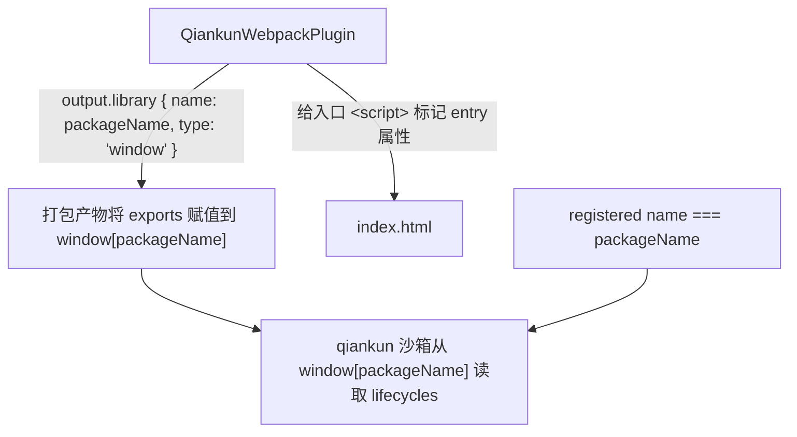

# 让 Webpack 应用接入 qiankun

本指南将一个已有的 Webpack 应用改造为通过 **classic** 路径加载的 qiankun 微应用：构建产物会把你的 lifecycle 函数挂到一个 `window` 全局变量上（即 window-library 打包形式），qiankun 从那里读取它们。它同时适用于 Webpack 4 和 Webpack 5。

如果你使用 Vite 构建，请参阅 [让 Vite 应用接入 qiankun](/zh-CN/cookbook/prepare-a-vite-app) —— Vite 应用通过 [ESM 沙箱](/zh-CN/concepts/esm-sandbox) 加载，无需 window library。

## 你需要改动什么

四处改动，都不会触碰你应用的业务代码：

1. 在 Webpack 配置中加入 `QiankunWebpackPlugin` 和 `html-webpack-plugin`。
2. 从入口模块导出 `bootstrap` / `mount` / `unmount`。
3. 给 dev server 加上宽松的 CORS。
4. 确保注册的 qiankun `name` 与 library 名称（`packageName`）一致。



## 安装插件

Webpack 插件是 `@qiankunjs/bundler-plugin` 的默认导出。你还需要 `html-webpack-plugin`，插件依赖它来找到并标记入口脚本。

```bash
npm install @qiankunjs/bundler-plugin html-webpack-plugin --save-dev
```

## 配置 Webpack

把两个插件都加进配置。`QiankunWebpackPlugin` 做两件事：

- **修正 output library。** 在 Webpack 5 上它设置 `output.library = { name: packageName, type: 'window' }`；在 Webpack 4 上它设置 `output.library = packageName`、`output.libraryTarget = 'window'`、`output.globalObject = 'window'`，以及一个唯一的 `output.jsonpFunction`。无论哪种方式，打包产物都会把你入口模块的 exports 赋值到 `window[packageName]` 上 —— 这正是 qiankun 沙箱读取的全局变量。
- **标记入口脚本。** 它 tap `html-webpack-plugin`，在生成的 `index.html` 中给注入的打包 `<script>` 加上 `entry` 属性。qiankun 的 loader 依据这个属性来确定性地挑选入口。

```js [webpack.config.js]
const HtmlWebpackPlugin = require('html-webpack-plugin');
const { QiankunWebpackPlugin } = require('@qiankunjs/bundler-plugin');

module.exports = {
  entry: './src/index.tsx',
  output: {
    // 让 qiankun 从子应用自己的 origin 提供 chunk。
    publicPath: 'auto',
    clean: true,
  },
  plugins: [
    new HtmlWebpackPlugin({ template: './src/index.html' }),
    new QiankunWebpackPlugin({ packageName: 'my-app' }),
  ],
  devServer: {
    port: 7102,
    // qiankun 会跨域拉取你的入口 HTML 和资源 —— 允许它。
    headers: { 'Access-Control-Allow-Origin': '*' },
    allowedHosts: 'all',
    hot: true,
  },
};
```

### `packageName` 选项

`packageName` 是插件接受的唯一选项，也是你的打包产物发布到的那个 `window` 全局变量的名称。

| 选项 | 类型 | 默认值 | 说明 |
| --- | --- | --- | --- |
| `packageName` | `string` | `./package.json` 的 `name` 字段 | 输出 library 全局变量的名称。构建会把 lifecycle exports 赋值到 `window[packageName]`。 |

如果你省略 `packageName`，插件会从项目 `package.json` 的 `name` 字段读取。若该文件缺失或没有 `name`，library 名称会静默变成空字符串，全局变量变成 `window['']`，这会破坏 lifecycle 解析。请显式设置 `packageName`，或确保 `package.json` 有 `name`。

::: warning 不要与插件的 library 配置对抗
`QiankunWebpackPlugin` 会**覆盖** `output.library`、`output.libraryTarget`、`output.globalObject`，以及（在 Webpack 4 上）`output.jsonpFunction`。你设置的任何冲突的 library 配置都会被替换。把这些字段交给插件处理。
:::

::: info entry 标记依赖 html-webpack-plugin
只有当 `plugins` 数组中存在 `html-webpack-plugin` 时，入口脚本标记才会运行。缺少它，就不会添加 `entry` 属性，qiankun 也无法确定性地找到入口。
:::

## 导出 lifecycle 函数

从入口模块导出异步的 `bootstrap`、`mount` 和 `unmount`。使用 `window` library target 时，Webpack 会自动把这些 exports 发布到 `window[packageName]` 上 —— 对于 Webpack 构建，**不要自己手动赋值 `window[packageName] = { ... }`**；library target 已经做了这件事。

`mount` 会收到 qiankun 为你的应用创建的 DOM 节点，即 `props.container`。渲染到它里面，并在独立运行时回退到 document。在独立模式下（直接在浏览器中打开，而非由 qiankun 托管）自己运行 lifecycles。

```tsx [src/index.tsx]
import React from 'react';
import { createRoot } from 'react-dom/client';
import type { Root } from 'react-dom/client';
import App from './App';
import './index.css';

declare global {
  interface Window {
    __POWERED_BY_QIANKUN__?: boolean;
  }
}

interface LifecycleProps {
  container?: Element;
}

let root: Root | undefined;

function render(props: LifecycleProps = {}) {
  // 在 qiankun 容器内解析 #root；独立运行时回退到 document。
  const container = props.container?.querySelector('#root') ?? document.getElementById('root');
  if (!container) return;

  root = createRoot(container);
  root.render(
    <React.StrictMode>
      <App />
    </React.StrictMode>,
  );
}

// QiankunWebpackPlugin 设置了 output.library { name: 'my-app', type: 'window' }，
// 所以这些 exports 会成为 window['my-app'] —— 无需手动赋值。
export async function bootstrap() {
  console.log('[my-app] bootstrap');
}

export async function mount(props: LifecycleProps) {
  render(props);
}

export async function unmount(_props: LifecycleProps) {
  root?.unmount();
  root = undefined;
}

// 独立模式：自己运行 lifecycles。
if (!window.__POWERED_BY_QIANKUN__) {
  void bootstrap().then(() => mount({}));
}
```

`window.__POWERED_BY_QIANKUN__` 是 qiankun 在挂载前于沙箱内设置的一个标志，让你的入口能区分托管运行还是独立运行。完整的 lifecycle 约定以及每个 hook 收到的 props，请参阅 [微应用 lifecycle 与 props](/zh-CN/concepts/lifecycle-and-props)。

### HTML 模板

你的 `html-webpack-plugin` 模板只需要一个挂载节点。不要自己添加入口 `<script>` —— `html-webpack-plugin` 会注入打包产物，`QiankunWebpackPlugin` 会给它加上 `entry` 属性。

```html [src/index.html]
<!doctype html>
<html lang="en">
  <head>
    <meta charset="UTF-8" />
    <meta name="viewport" content="width=device-width, initial-scale=1.0" />
    <title>My micro app</title>
    <style>
      /* 仅用于独立页面背景；在 qiankun 内页面由主应用掌控。 */
      body { margin: 0; }
    </style>
  </head>
  <body>
    <div id="root"></div>
  </body>
</html>
```

## 在主应用中注册

在主应用里，注册的 `name` **必须等于**你给插件的 `packageName`，因为 qiankun 从 `window[name]` 解析 classic 路径的 lifecycles。`entry` 是微应用 dev server 或部署站点的 URL（一个字符串，而非配置对象）。

```ts [main/src/register.ts]
import { registerMicroApps, start } from 'qiankun';

registerMicroApps([
  {
    // 必须与 packageName 匹配 → 解析 window['my-app']。
    name: 'my-app',
    entry: '//localhost:7102',
    container: document.getElementById('subapp-container')!,
    activeRule: '/my-app',
  },
]);

start();
```

::: danger name 与 packageName 必须匹配
qiankun 从你打包产物发布的全局变量读取 classic 路径的 lifecycles。如果注册的 `name` 是 `'my-app'` 而 `packageName` 是 `'myApp'`，qiankun 会查找 `window['my-app']`，什么也找不到，并在发现 lifecycles 时抛错。保持两者完全一致。
:::

完整的选项参考见 [registerMicroApps](/zh-CN/api/register-micro-apps) 和 [start](/zh-CN/api/start)，逐应用的 `configuration`（例如 [`styleIsolation`](/zh-CN/cookbook/enable-style-isolation)）见 [AppConfiguration](/zh-CN/api/configuration)。

## 为什么 dev server 需要 CORS

与 Vite 插件不同，`QiankunWebpackPlugin` **不会**替你配置 dev server。qiankun 会从主应用的 origin 拉取你的入口 HTML 及其资源，所以微应用的服务器必须允许跨域读取。请自己设置这两个 header：

- `headers: { 'Access-Control-Allow-Origin': '*' }` —— 让主应用能拉取你的入口和 chunk。
- `allowedHosts: 'all'` —— 让 webpack-dev-server 应答经由主应用路由过来的请求。

同时保留 `output.publicPath: 'auto'`，这样运行时的 chunk 请求会相对于微应用自己的 origin 解析，而不是主应用的。

::: warning 第三方脚本也必须带 CORS 提供
你入口 HTML 引用的任何外部脚本（内置的库、以脚本形式加载的字体）也必须带 `Access-Control-Allow-Origin` 提供。省略 CORS header 的公共 CDN 会破坏 qiankun 的 fetch。请把这类资源本地化（vendor），并从你启用了 CORS 的 dev server 提供。
:::

## 陷阱

- **`window[''] 会破坏解析。`** 既没有 `packageName` 又没有 `package.json` 的 `name`，就意味着 library 名称为空。设置 `packageName`，或确保 `package.json` 有 `name`。
- **注册的 `name` 必须等于 `packageName`。** 不匹配会让 qiankun 去查找一个不存在的全局变量。
- **不要覆盖插件的 library 配置。** `QiankunWebpackPlugin` 掌管 `output.library` / `libraryTarget` / `globalObject` / `jsonpFunction`。自己设置它们要么被忽略，要么产生冲突。
- **对 Webpack 不要手动赋值 window 全局变量。** `window` library target 会自动发布你的 exports；手动的 `window[packageName] = { ... }` 是多余的。
- **只能有一个入口脚本。** 如果超过一个 `<script>` 携带 `entry` 属性，qiankun 的 loader 会抛出 `QiankunError`。让插件恰好标记一个，不要在模板里手动添加 `entry` 脚本。
- **务必干净地卸载。** 在 `unmount` 中拆除你的应用（这里是 `root.unmount()` 并把 ref 置空），这样重新挂载和多实例才不会泄漏。参阅 [运行多个微应用实例](/zh-CN/cookbook/run-multiple-instances)。

## 相关

- [@qiankunjs/bundler-plugin（Webpack 与 Vite）](/zh-CN/ecosystem/bundler-plugin) —— 完整的插件参考。
- [让 Vite 应用接入 qiankun](/zh-CN/cookbook/prepare-a-vite-app) —— ESM 沙箱的对应版本。
- [JS 沙箱](/zh-CN/concepts/js-sandbox) —— classic 打包产物如何被隔离，以及 `window[packageName]` 如何被读取。
- [从 qiankun 2.x 迁移](/zh-CN/cookbook/migrate-from-2x) —— 与 2.x 基于配置的用法的差异。
