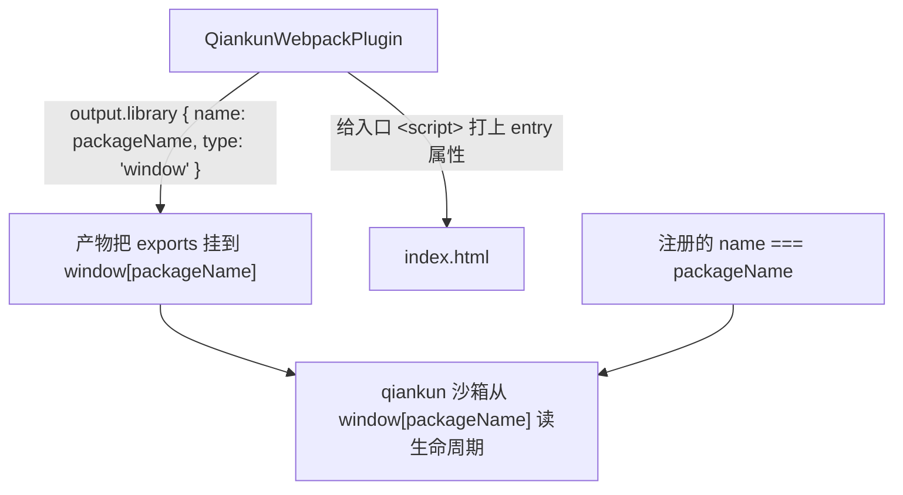

# 让 Webpack 应用接入 qiankun

这篇讲的是怎么把一个现成的 Webpack 应用改造成走**经典路径**加载的 qiankun 微应用：构建时把生命周期函数挂到 `window` 上的某个全局(也就是打成 window-library 的产物),qiankun 再从那里把它们读出来。Webpack 4 和 Webpack 5 都适用。

如果你用的是 Vite，请看[让 Vite 应用接入 qiankun](/zh-CN/cookbook/prepare-a-vite-app)——Vite 应用走的是 [ESM 沙箱](/zh-CN/concepts/esm-sandbox)，不需要 window library 这一套。

## 要改哪些地方

一共四处改动，都不碰你的业务代码：

1. 往 Webpack 配置里加上 `QiankunWebpackPlugin` 和 `html-webpack-plugin`。
2. 从入口模块导出 `bootstrap` / `mount` / `unmount`。
3. 给 dev server 放开 CORS。
4. 保证注册进 qiankun 的 `name` 和 library 名(`packageName`)一致。



## 安装插件

Webpack 插件是 `@qiankunjs/bundler-plugin` 的默认导出。另外还得装 `html-webpack-plugin`，插件要靠它定位并标记入口脚本。

```bash
npm install @qiankunjs/bundler-plugin html-webpack-plugin --save-dev
```

## 配置 Webpack

把两个插件都加进配置。`QiankunWebpackPlugin` 干两件事：

- **修正 output library。** Webpack 5 上它会设成 `output.library = { name: packageName, type: 'window' }`;Webpack 4 上则是 `output.library = packageName`、`output.libraryTarget = 'window'`、`output.globalObject = 'window'`，外加一个唯一的 `output.jsonpFunction`。无论哪种，产物都会把入口模块的 exports 挂到 `window[packageName]` 上——这个全局正是 qiankun 沙箱要读的地方。
- **标记入口脚本。** 它挂到 `html-webpack-plugin` 上，给注入到 `index.html` 里那个 bundle `<script>` 加上 `entry` 属性。qiankun 的 loader 就靠这个属性确定性地挑出入口。

```js [webpack.config.js]
const HtmlWebpackPlugin = require('html-webpack-plugin');
const { QiankunWebpackPlugin } = require('@qiankunjs/bundler-plugin');

module.exports = {
  entry: './src/index.tsx',
  output: {
    // 让 qiankun 从子应用自己的 origin 提供 chunk。
    publicPath: 'auto',
    clean: true,
  },
  plugins: [
    new HtmlWebpackPlugin({ template: './src/index.html' }),
    new QiankunWebpackPlugin({ packageName: 'my-app' }),
  ],
  devServer: {
    port: 7102,
    // qiankun 会跨域拉取你的入口 HTML 和资源 —— 允许它。
    headers: { 'Access-Control-Allow-Origin': '*' },
    allowedHosts: 'all',
    hot: true,
  },
};
```

### `packageName` 选项

`packageName` 是插件唯一接受的选项，也就是产物要挂上去的那个 `window` 全局的名字。

| 选项 | 类型 | 默认值 | 说明 |
| --- | --- | --- | --- |
| `packageName` | `string` | `./package.json` 的 `name` 字段 | 输出 library 全局的名字。构建时把生命周期 exports 挂到 `window[packageName]`。 |

不传 `packageName`，插件会去读项目 `package.json` 的 `name` 字段。要是这个文件不存在、或者没有 `name`,library 名会悄悄变成空字符串，全局也就成了 `window['']`，生命周期一律解析不到。所以要么显式写上 `packageName`，要么确保 `package.json` 里有 `name`。

::: warning 别跟插件的 library 配置对着干
`QiankunWebpackPlugin` 会**覆盖** `output.library`、`output.libraryTarget`、`output.globalObject`，以及(Webpack 4 上的)`output.jsonpFunction`。你自己设的任何冲突的 library 配置都会被替换掉。这几个字段交给插件就行。
:::

::: info 标记入口脚本要靠 html-webpack-plugin
只有当 `plugins` 数组里有 `html-webpack-plugin` 时，标记入口脚本这一步才会执行。没有它，`entry` 属性加不上，qiankun 也就没法确定性地找到入口。
:::

## 导出生命周期函数

从入口模块导出 async 的 `bootstrap`、`mount`、`unmount`。用了 `window` library target 之后，Webpack 会自动把这些 exports 挂到 `window[packageName]` 上——Webpack 构建下**别自己去手动写 `window[packageName] = { ... }`**,library target 已经替你做了。

`mount` 会拿到 qiankun 为你的应用创建的 DOM 节点，就在 `props.container` 上。往里渲染，独立运行时则回退到整个 document。所谓独立模式，是指直接在浏览器里打开、而不是被 qiankun 托管——这种情况下生命周期得你自己调。

```tsx [src/index.tsx]
import React from 'react';
import { createRoot } from 'react-dom/client';
import type { Root } from 'react-dom/client';
import App from './App';
import './index.css';

declare global {
  interface Window {
    __POWERED_BY_QIANKUN__?: boolean;
  }
}

interface LifecycleProps {
  container?: Element;
}

let root: Root | undefined;

function render(props: LifecycleProps = {}) {
  // 在 qiankun 容器内解析 #root；独立运行时回退到 document。
  const container = props.container?.querySelector('#root') ?? document.getElementById('root');
  if (!container) return;

  root = createRoot(container);
  root.render(
    <React.StrictMode>
      <App />
    </React.StrictMode>,
  );
}

// QiankunWebpackPlugin 设置了 output.library { name: 'my-app', type: 'window' }，
// 所以这些 exports 会成为 window['my-app'] —— 无需手动赋值。
export async function bootstrap() {
  console.log('[my-app] bootstrap');
}

export async function mount(props: LifecycleProps) {
  render(props);
}

export async function unmount(_props: LifecycleProps) {
  root?.unmount();
  root = undefined;
}

// 独立模式：自己运行 lifecycles。
if (!window.__POWERED_BY_QIANKUN__) {
  void bootstrap().then(() => mount({}));
}
```

`window.__POWERED_BY_QIANKUN__` 是 qiankun 在挂载前于沙箱里设的一个标志，你的入口靠它区分自己是被托管运行还是独立运行。完整的生命周期约定、每个 hook 收到哪些 props，见[微应用的生命周期与 props](/zh-CN/concepts/lifecycle-and-props)。

### HTML 模板

给 `html-webpack-plugin` 用的模板里，只要一个挂载节点就够了。别自己往里加入口 `<script>`——bundle 由 `html-webpack-plugin` 注入，`entry` 属性由 `QiankunWebpackPlugin` 补上。

```html [src/index.html]
<!doctype html>
<html lang="en">
  <head>
    <meta charset="UTF-8" />
    <meta name="viewport" content="width=device-width, initial-scale=1.0" />
    <title>My micro app</title>
    <style>
      /* 仅用于独立页面背景；在 qiankun 内页面由主应用掌控。 */
      body { margin: 0; }
    </style>
  </head>
  <body>
    <div id="root"></div>
  </body>
</html>
```

## 在主应用里注册

在主应用里，注册的 `name` **必须等于**你给插件的那个 `packageName`，因为 qiankun 走经典路径时是从 `window[name]` 解析生命周期的。`entry` 是微应用 dev server 或线上站点的 URL(一个字符串，不是配置对象)。

```ts [main/src/register.ts]
import { registerMicroApps, start } from 'qiankun';

registerMicroApps([
  {
    // 必须与 packageName 匹配 → 解析 window['my-app']。
    name: 'my-app',
    entry: '//localhost:7102',
    container: document.getElementById('subapp-container')!,
    activeRule: '/my-app',
  },
]);

start();
```

::: danger name 和 packageName 必须一致
qiankun 从你产物挂出去的那个全局读取经典路径的生命周期。要是注册的 `name` 是 `'my-app'`、`packageName` 却是 `'myApp'`,qiankun 会去查 `window['my-app']`，查不到，发现生命周期这一步就抛错。两者保持完全一致。
:::

完整的选项说明见 [registerMicroApps](/zh-CN/api/register-micro-apps) 和 [start](/zh-CN/api/start)；逐应用维度的 `configuration`(比如 [`styleIsolation`](/zh-CN/cookbook/enable-style-isolation))见 [AppConfiguration](/zh-CN/api/configuration)。

## 为什么 dev server 需要 CORS

和 Vite 插件不一样，`QiankunWebpackPlugin` **不会**替你配置 dev server。qiankun 是从主应用所在的 origin 去抓你的入口 HTML 和资源的，所以微应用的服务器必须允许跨域读取。两个 header 都得自己加上：

- `headers: { 'Access-Control-Allow-Origin': '*' }`——让主应用能抓到你的入口和 chunk。
- `allowedHosts: 'all'`——让 webpack-dev-server 应答经由主应用转发过来的请求。

另外把 `output.publicPath: 'auto'` 保持住，这样运行时请求 chunk 时会以微应用自己的 origin 为准，而不是主应用的。

::: warning 第三方脚本也必须带 CORS 提供
你入口 HTML 里引用的任何外部脚本(内置进来的库、以脚本形式加载的字体等)，同样得带 `Access-Control-Allow-Origin` 提供。那些省略 CORS header 的公共 CDN 会让 qiankun 的 fetch 挂掉。把这类资源本地化(vendor)，从你开了 CORS 的 dev server 上提供。
:::

## 陷阱

- **`window['']` 会破坏解析。** 既没写 `packageName`、`package.json` 里又没有 `name`,library 名就是空的。写上 `packageName`，或者给 `package.json` 补上 `name`。
- **注册的 `name` 必须等于 `packageName`。** 两者对不上，qiankun 就会去查一个根本不存在的全局。
- **别覆盖插件的 library 配置。** `output.library` / `libraryTarget` / `globalObject` / `jsonpFunction` 归 `QiankunWebpackPlugin` 管。你自己设要么被忽略，要么起冲突。
- **Webpack 下别手动挂 window 全局。** `window` library target 会自动把 exports 挂出去，再手写一遍 `window[packageName] = { ... }` 是多余的。
- **入口脚本只能有一个。** 一旦有不止一个 `<script>` 带着 `entry` 属性，qiankun 的 loader 会抛 `QiankunError`。让插件恰好标记一个，别自己在模板里再塞一个 `entry` 脚本。
- **卸载一定要干净。** 在 `unmount` 里把应用拆干净(这里是 `root.unmount()` 再把 ref 置空)，重新挂载和多实例才不会泄漏。见[运行多个微应用实例](/zh-CN/cookbook/run-multiple-instances)。

## 相关

- [@qiankunjs/bundler-plugin(Webpack 与 Vite)](/zh-CN/ecosystem/bundler-plugin)——插件完整参考。
- [让 Vite 应用接入 qiankun](/zh-CN/cookbook/prepare-a-vite-app)——ESM 沙箱的对应版本。
- [JS 沙箱](/zh-CN/concepts/js-sandbox)——经典产物是怎么被隔离的，`window[packageName]` 又是怎么被读出来的。
- [从 qiankun 2.x 迁移](/zh-CN/cookbook/migrate-from-2x)——和 2.x 那套基于配置的接入方式有哪些不同。
