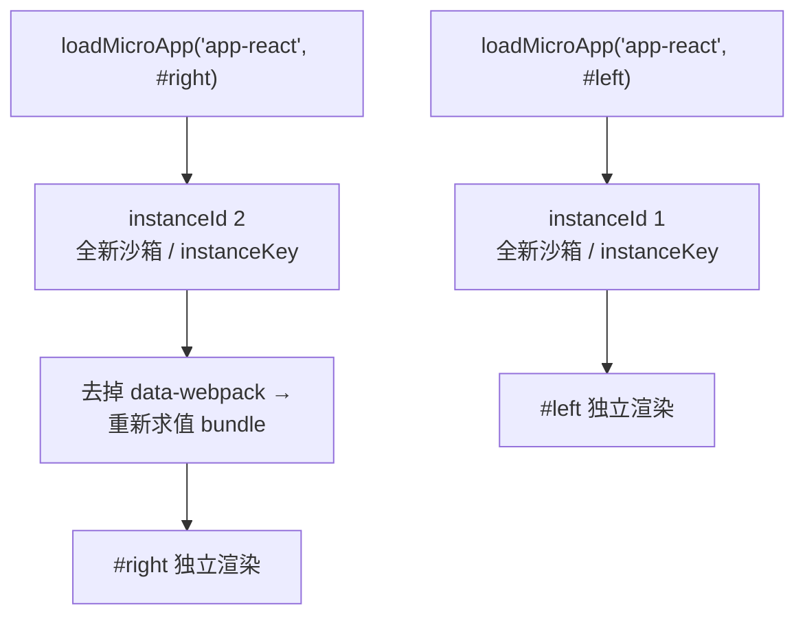

# 同时运行多个微应用实例

`loadMicroApp` 是命令式地挂载微应用，走的不是路由驱动的 `registerMicroApps` 那条流程。每次调用都会建一份自己的沙箱和实例，所以你可以一次挂好几个不同的微应用，甚至把*同一个*微应用在页面上挂多份。这一篇讲怎么把这件事做稳，以及怎么把每个实例都干净地释放掉。

什么时候用这种方式：容器要不要出现，是你自己的 UI 状态(标签页、弹窗、仪表盘、挂件)说了算，而不是 URL 说了算。如果是按路由拼装页面，还是用 [registerMicroApps](/zh-CN/api/register-micro-apps) 配 [start](/zh-CN/api/start) 更合适。

## 命令式挂载一个微应用

`loadMicroApp(app, configuration?, lifeCycles?)` 返回一个 `MicroApp` 句柄(本质是一个 single-spa parcel)。调用后立刻开始挂载，并把 `mount`、`unmount`、`update` 以及各生命周期的 promise 交给你去 await。

```ts [main/src/mount-app.ts]
import { loadMicroApp } from 'qiankun';
import type { MicroApp } from 'qiankun';

const container = document.querySelector('#sub-app') as HTMLElement;

const app: MicroApp = loadMicroApp({
  name: 'app-react',
  entry: 'http://localhost:7101',
  container,
  props: { token: 'abc' },
});

// wait until it is on screen
await app.mountPromise;
```

`container` 是一个 `HTMLElement`,`entry` 是微应用的 HTML 地址，`props` 会在每次 `mount`/`unmount`/`update` 时传给子应用的生命周期。如果框架还没启动过，`loadMicroApp` 会替你自动调一次 `start()`，这样主应用里的 `pushState`/`replaceState` 才能继续正常派发 `popstate`。

句柄上能拿到这些成员：

| 成员 | 类型 | 用途 |
| --- | --- | --- |
| `mount()` | `() => Promise<null>` | 卸载之后再挂一次。 |
| `unmount()` | `() => Promise<null>` | 拆掉实例，释放它的副作用。 |
| `update(props)` | `(props) => Promise<any>` | 推送新的 props(仅当子应用导出了 `update` 时)。 |
| `getStatus()` | `() => string` | single-spa parcel 的状态，例如 `MOUNTED`、`UNMOUNTING`。 |
| `loadPromise` / `bootstrapPromise` / `mountPromise` / `unmountPromise` | `Promise<null>` | 等待某个具体阶段。 |

完整签名见 [loadMicroApp](/zh-CN/api/load-micro-app)，第二个参数能传哪些选项见 [AppConfiguration](/zh-CN/api/configuration)。

## 同时挂载多个不同的微应用

每次 `loadMicroApp` 调用都彼此独立。只要给每个应用各自的容器元素，就能把它们同时挂上去。

```ts [main/src/dashboard.ts]
import { loadMicroApp } from 'qiankun';

const apps = [
  { name: 'app-react', entry: 'http://localhost:7101', container: document.querySelector('#pane-react') as HTMLElement },
  { name: 'app-vue',   entry: 'http://localhost:7102', container: document.querySelector('#pane-vue') as HTMLElement },
].map((app) => loadMicroApp(app));

// later, when the dashboard is dismissed
await Promise.all(apps.map((app) => app.unmount()));
```

每次调用都会建一份全新的 Proxy 隔离膜沙箱和自己的 `instanceId`，所以这些应用不共享全局状态，也不会把对方的定时器、监听器或 DOM 补丁搞乱。

## 把同一个微应用挂多份

你也可以用相同的 `name` 和 `entry` 多次调用 `loadMicroApp`，挂进*不同的*容器。

```ts [main/src/multi-instance.ts]
import { loadMicroApp } from 'qiankun';

const left = loadMicroApp({
  name: 'app-react',
  entry: 'http://localhost:7101',
  container: document.querySelector('#left') as HTMLElement,
});

const right = loadMicroApp({
  name: 'app-react',
  entry: 'http://localhost:7101',
  container: document.querySelector('#right') as HTMLElement,
});

await Promise.all([left.mountPromise, right.mountPromise]);
```

### 多个实例之间靠什么隔离

qiankun 用一个按 name 计数的实例计数器，把同一个应用的并发实例分开：

- 每次挂载都拿到一个单调递增的 `instanceId`(由 `genInstanceId` 生成，存在一个不可枚举的 `window.__agii__` map 上)。容器上会被打上 `data-name`、`data-instance-id`(当 `instanceId > 1` 时)和 `data-mount-times`。
- 经典 JS 沙箱给每个实例一层各自独立的 Proxy 隔离膜；[ESM 沙箱](/zh-CN/concepts/esm-sandbox)给每个实例一个唯一的 `instanceKey`/compartment，让它的模块通过自己那份 import map 条目来解析。
- 对 webpack 构建的应用，第二个及之后的实例，其 `script[src]` 节点上的 `data-webpack` 会被去掉(`removeWebpackChunkCacheWhenAppHaveMultiInstance`)。webpack 运行时会以这个属性为键缓存已加载的 chunk，命中就跳过重新执行；去掉它，才能逼第二个实例重新求值自己的 bundle，而不是复用第一个实例已经跑过的模块。



## 记忆化：复用还是新建实例

`loadMicroApp` 会以 `` `${name}-${containerXPath}` `` 为键，对已加载的应用做记忆化。容器的 XPath 只在第一次调用时算一次，并以此作为这个实例的身份标识。

- **容器不同 ⇒ 新建实例。** XPath 不一样就是新的键，于是应用会被重新加载、生命周期被重新求值。上面那个多实例的例子能成立，靠的就是这一点。
- **复用同一个容器 ⇒ 命中缓存重新挂载。** 把应用渲染进它之前占用过的那个 DOM 节点，会复用缓存下来的 parcel 配置：`bootstrap` 变成空操作，生命周期不再重新求值。挂载这一步会重新加载入口 HTML，但*不带*脚本(脚本已经跑过了)，只是再跑一遍 `mount(props)`。

::: tip 让不同实例的容器位置固定下来
实例键来自容器在文档里的 XPath，只算一次，并在应用的整个生命周期里保持不变。把每个实例的容器放在 DOM 里一个稳定、且彼此不同的位置，两个实例才能解析出不同的键。
:::

## 同一个容器上的串行化

如果你往*同一个*容器里挂多个应用，qiankun 会把它们串起来执行。当一个新实例要挂到一个已经有实例的容器上时，它的挂载步骤会先 await 那个容器上此前每一个未损坏实例的 `unmountPromise`，然后才渲染。这样能避免两个应用同时往同一个节点里写东西。

::: warning 一个容器同一时刻只有一个活着的应用
串行化的意思是，*下一个*应用会等前一个卸载完 —— 它不会让两个应用在同一个节点里并排跑。真要并发渲染，就给每个应用各自的容器元素。
:::

## 每个句柄都记得卸载

`loadMicroApp` 不会自己清理。你拿到的每个句柄，都得由你自己去调 `unmount()`。

```ts [main/src/lifecycle.ts]
const app = loadMicroApp({ name: 'app-react', entry, container });

// … when the app is no longer needed
await app.unmount();
```

沙箱的副作用是靠 `unmount` 释放的。`unmount` 时，每个 patcher 的 `free()` 会依次执行：`patchInterval` 清掉所有被跟踪的 interval 并还原原生定时器，`patchWindowListener` 移除应用加过的监听器，`patchHistoryListener` 摘掉它的 history 钩子，dynamic-append patcher 拆掉被注入的节点。隔离膜随后锁定，并还原应用改动过的全局变量，容器 DOM 被清空。跳过 `unmount`，就会漏掉定时器、监听器和 DOM，还会把重新挂载和多实例的行为搞坏。

::: danger ESM 实例只有在 `unload` 时才被完整释放，而 parcel 没有 `unload`
ESM 沙箱的 `dispose()`(负责撤销该实例的 blob URL、注销它的 realm)挂在 single-spa 的 `unload` 生命周期上，不是 `unmount`。`loadMicroApp` 返回的是一个 parcel，而 parcel 没有 `unload` 语义，所以 ESM 实例的引擎、blob URL 和 import map 条目在 `unmount` 之后会一直留着，直到你丢掉对这个句柄的所有引用、让它被垃圾回收为止。在那种反复创建 ESM 实例、又活得很久的壳应用里，import map 条目会越攒越多。能复用容器(命中缓存重新挂载)的地方就别每次都新建实例，用完的句柄也记得释放。
:::

## ESM 多实例的坑

原生 ESM 子应用在真正并发时还有一个额外的限制。ESM 引擎会通过一把全局单锁，把异步创建出来的元素(比如求值期间的 `document.createElement`)归属给当前处于活动状态的沙箱。合成 specifier 前缀能让每个实例的*模块图*彼此隔离，但当同一个应用的两个 ESM 实例在同一时刻求值时，它并不能完全解决元素的*归属*问题。

::: warning 并发的 ESM 实例要各自隔离容器
让同一个 ESM(Vite 那类)微应用跑多个并发实例，是 v1 已知的限制。尽量把每个实例隔离在自己的容器里，避免它们初始求值的时间段重叠。如果确实需要很多个同时存在的实例，目前走经典/UMD 构建是更可预期的路子。底层机制见 [ESM 沙箱](/zh-CN/concepts/esm-sandbox)。
:::

::: info 没有内置的跨实例状态
qiankun v3 不带全局状态存储 —— 2.x 里的 `initGlobalState`/`onGlobalStateChange` 都没有了。数据通过 `props` 传给每个实例，用 `app.update(props)` 更新。见[在应用间共享状态与通信](/zh-CN/cookbook/communicate-between-apps)。
:::

## 相关内容

- [loadMicroApp](/zh-CN/api/load-micro-app) —— 完整的 API 参考。
- [JS 沙箱](/zh-CN/concepts/js-sandbox) —— 逐实例的隔离是怎么搭起来的。
- [ESM 沙箱](/zh-CN/concepts/esm-sandbox) —— 原生 `<script type="module">` 的执行，以及它在多实例上的限制。
- [微应用的生命周期与 props](/zh-CN/concepts/lifecycle-and-props) —— 挂载、卸载、重新挂载时各自跑了什么。
